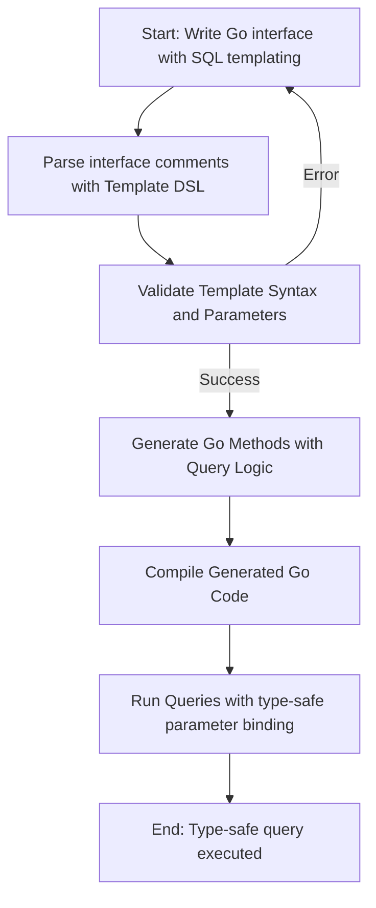

# Mastering the GORM CLI Template DSL

_Comprehensive walkthrough of the built-in SQL templating DSL, from basic parameter binding to conditional statements and iteration. Learn to compose powerful, reusable queries using interface method comments._

---

## 1. Understanding the Template DSL: Unlocking Powerful Query Generation

### What This Guide Helps You Achieve
Learn how to write expressive, type-safe SQL queries using GORM CLI’s built-in templating DSL embedded directly in method comments of your Go interfaces. Master basic parameter bindings, conditional SQL generation, iteration over collections, and advanced templating constructs to compose reusable, dynamic queries without sacrificing type safety or clarity.

### Prerequisites
- Familiarity with Go language basics and generics
- Basic understanding of GORM for Go
- Your project has Go interfaces with SQL templates as method comments
- GORM CLI installed and working (see installation and quick-start guides)

### Expected Outcome
- Confidently write and interpret SQL templates within interface comments
- Use placeholder syntax to bind parameters type-safely
- Implement conditional logic and loops to generate dynamic WHERE, SET, and other clauses
- Understand underlying code structure generated from these templates

### Time Estimate
Approximately 25-40 minutes to read, experiment, and practice examples.

### Difficulty Level
Intermediate — requires some Go experience and understanding of SQL templating concepts.

---

## 2. Core SQL Template Syntax and Constructs

GORM CLI interprets your Go interface method comments as SQL templates enriched with a templating DSL for dynamic and safe query generation.

### 2.1 Parameter Binding
- `@@table`: Automatically replaced with the current model’s table name.
- `@@column`: Dynamically bound column name.
- `@param`: Bind method parameter values safely as query parameters.

<Callout title="Practical Example">
```go
// SELECT * FROM @@table WHERE id=@id AND name = "@name"
GetByID(id int, name string) (T, error)
```
This binds `id` and `name` parameters into the query safely.
</Callout>

### 2.2 Conditional Blocks
- `{{where}}...{{end}}`: Wraps expressions that should be included only if certain conditions generate non-empty content.
- `{{set}}...{{end}}`: For dynamic UPDATE SET clauses.
- `{{if condition}}...{{else if condition}}...{{else}}...{{end}}`: Branching logic.

### 2.3 Iteration
- `{{for _, item := range collection}}...{{end}}`: Iterate over collections to build repeated parts, such as OR conditions or multiple update fields.

### 2.4 Escape Characters
- Use `\@` to escape the `@` character and avoid binding.

---

## 3. Writing Your First Template: Step-by-Step Example

### Step 1: Define Your Interface Method with SQL Template

```go
// GetByID query data by id and return it as struct
//
// SELECT * FROM @@table WHERE id=@id AND name = "@name"
GetByID(id int, name string) (T, error)
```

### Step 2: Understanding the Placeholders
- `@@table` will insert the table name automatically
- `@id` and `@name` bind method parameters safely

### Step 3: Generate Code Using GORM CLI
```bash
gorm gen -i ./examples -o ./generated
```

### Step 4: Use Generated Method
```go
user, err := generated.Query[User](db).GetByID(ctx, 123, "Alice")
if err != nil {
  // handle error
}
```

### Verification
- Query executes safely with parameters bound
- Generated code includes method with context injection

---

## 4. Advanced Template Usage

### 4.1 Conditional WHERE Clauses
Leverage `{{where}}` blocks to include parts only when conditions are met.

```go
// SELECT * FROM @@table
// {{where}}
//   {{if user.Name != ""}} name=@user.Name {{end}}
//   {{if user.Age > 0}} AND age=@user.Age {{end}}
// {{end}}
SearchUsers(user User) ([]T, error)
```

- If `Name` is empty and `Age` not greater than 0, the WHERE clause is omitted.

### 4.2 Dynamic UPDATE Statements with `{{set}}`
For flexible UPDATEs, use `{{set}}` to conditionally include fields.

```go
// UPDATE @@table
// {{set}}
//   {{if user.Name != ""}} name=@user.Name, {{end}}
//   {{if user.Age > 0}} age=@user.Age, {{end}}
//   {{if user.Age >= 18}} is_adult=1 {{else}} is_adult=0 {{end}}
// {{end}}
// WHERE id=@id
UpdateUser(user User, id int) error
```

- Note the use of commas and trimming handled automatically.

### 4.3 Iteration with `{{for}}` Loops
Useful for building complex WHERE clauses or multi-value filters.

```go
// SELECT * FROM @@table
// {{where}}
//   {{for _, user := range users}}
//     {{if user.Name != "" && user.Age > 0}}
//       (name = @user.Name AND age=@user.Age) OR
//     {{end}}
//   {{end}}
// {{end}}
Filter(users []User) ([]T, error)
```

This generates an OR-clause covering all users in the slice.

---

## 5. How GORM CLI Translates Your Template Into Go Code

Behind the scenes, GORM CLI parses these templates and generates Go code that constructs the SQL query safely via `strings.Builder` and parameter slices.

- Static and dynamic parts of the SQL are concatenated.
- Placeholders (`@param`) convert to parameterized query parameters, eliminating SQL injection risks.
- Control flow (`if`, `for`) is converted into Go control structures generating query fragments conditionally.

### Example snippet of generated code for conditional WHERE:

```go
var sb strings.Builder
params := make([]any, 0, 5) // optimized capacity
sb.WriteString("SELECT * FROM ?")
params = append(params, clause.Table{Name: clause.CurrentTable})
{
  var tmp strings.Builder
  if user.Name != "" {
    tmp.WriteString(" name=?")
    params = append(params, user.Name)
  }
  if user.Age > 0 {
    tmp.WriteString(" AND age=?")
    params = append(params, user.Age)
  }
  c := strings.TrimSpace(tmp.String())
  if c != "" {
    reTrim := regexp.MustCompile(`(?i)^\s*(?:and|or)\s+|\s+(?:and|or)\s*$`)
    c = reTrim.ReplaceAllString(c, "")
    sb.WriteString(" WHERE ")
    sb.WriteString(c)
  }
}
```

---

## 6. Practical Tips & Best Practices

- **Always Use Placeholders:** Avoid including literal values in your SQL templates. Use `@param` to leverage safe parameter binding.
- **Use `@@table` and `@@column` to Abstract Table/Columns:** This ensures queries adapt automatically if your underlying models or column names change.
- **Pay Attention to Commas and Connectors:** When building dynamic SET or WHERE clauses with conditional blocks, trailing commas or misplaced AND/ORs are trimmed automatically, but writing clean templates avoids confusion.
- **Leverage `{{where}}` and `{{set}}` Blocks:** These intelligently wrap optional conditions and handle empty sections gracefully.
- **Use Iterations for Complex Filters:** Bulk filters or batch updates are easily achieved via `{{for}}` to loop through slices or arrays.
- **Escape `@` With `\@` When Needed:** For literal `@` in SQL (like in strings), use double backslash to avoid binding.

---

## 7. Common Pitfalls & Troubleshooting

<AccordionGroup title="Common Issues & Solutions">

<Accordion title="SQL Template Fails to Generate Due to Bad Syntax">
Ensure all open blocks like `{{if}}` have corresponding `{{end}}`. Mismatched or missing directives cause errors during code generation.

Example error: "unclosed block(s) at EOF"

Resolve by carefully checking your interface method comments for balanced templating directives.
</Accordion>

<Accordion title="Parameters in Template Don’t Bind Correctly">
Confirm parameter names exactly match your method parameters. Placeholders are case-sensitive.

Use `@paramName` matching the Go method signature.

If you forget to prefix your method param with `ctx context.Context` in code, GORM CLI will add it automatically.
</Accordion>

<Accordion title="Generated Code Has Unexpected Commas or Connectors">
Use `{{where}}` or `{{set}}` constructs to let the generator trim trailing commas or leading/trailing AND/OR clauses.

Avoid manual comma placements inside iteration or conditional blocks.
</Accordion>

</AccordionGroup>

---

## 8. Example Queries for Reference

```go
// Simple SELECT by ID
// SELECT * FROM @@table WHERE id=@id
GetByID(id int) (T, error)

// Conditional SELECT
// SELECT * FROM @@table
// {{where}}
//   {{if user.Name != ""}} name=@user.Name {{end}}
//   {{if user.Age > 0}} AND age=@user.Age {{end}}
// {{end}}
FindUsers(user User) ([]T, error)

// Dynamic UPDATE with conditional fields
// UPDATE @@table
// {{set}}
//   {{if user.Email != ""}} email=@user.Email, {{end}}
//   {{if user.Status != ""}} status=@user.Status {{end}}
// {{end}}
// WHERE id=@id
UpdateUser(user User, id int) error

// Iterate over slice filter
// SELECT * FROM @@table
// {{where}}
//   {{for _, u := range users}}
//     {{if u.Name != ""}} name=@u.Name OR {{end}}
//   {{end}}
// {{end}}
FilterByUsers(users []User) ([]T, error)
```

---

## 9. Next Steps & Related Guides

- **Explore the "Type-Safe Queries with Interfaces" guide** to understand how to define interfaces for advanced querying.
- **Review "Working with Model-Driven Field Helpers"** to use generated structs for fluent query building.
- **Read "Customizing Code Generation with Config"** to tailor the generator for your project needs.
- **Use the "First Code Generation Walkthrough"** to see an end-to-end example from interface to generated code in action.

---

## 10. Additional Resources

- [GORM CLI README Examples](https://github.com/go-gorm/cli/blob/main/README.md) for practical use cases
- [GORM CLI SQL Parser Source](https://github.com/go-gorm/cli/blob/main/internal/gen/sqlparser.go) to understand template parsing
- [Example Interfaces with SQL Templates](https://github.com/go-gorm/cli/blob/main/examples/query.go)

---

By mastering this Template DSL, you unlock the full potential of GORM CLI to produce clean, type-safe, and powerful database access layers tailored exactly to your application logic — all with minimal boilerplate and maximum flexibility.

---

# Appendix: Quick Reference Table

| Template Syntax | Purpose                                  | Notes/Example                                             |
|-----------------|------------------------------------------|-----------------------------------------------------------|
| `@@table`       | Inserts model's database table name      | `SELECT * FROM @@table`                                    |
| `@@column`      | Dynamic column name                       | `WHERE @@column=@value`                                    |
| `@param`        | Bind method parameter as SQL parameter   | `WHERE id=@id`                                             |
| `{{where}}...{{end}}` | Wrap optional WHERE clauses          | Omits WHERE if empty, trims connectors                    |
| `{{set}}...{{end}}`   | Wrap dynamic SET clauses for UPDATE   | Trims trailing commas                                      |
| `{{if condition}}...{{else}}...{{end}}` | Conditional branches          | Complex logic inside SQL                                  |
| `{{for _, item := range collection}}...{{end}}` | Loop over slice for repeated parts | Iterate through slices dynamically                         |


---

# Visual Workflow of Template to Code



---