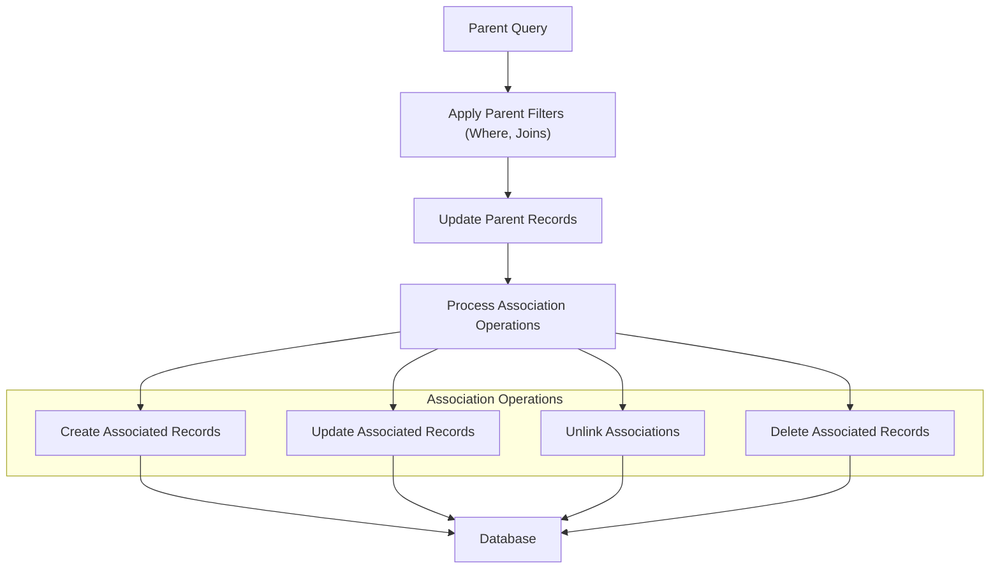

# Managing Associations and Relationships

Master the use of GORM CLI's powerful association helpers to efficiently create, update, unlink, and delete related records within your database models. This guide focuses exclusively on managing relationships using the generated association helpers, empowering you to build complex parent-child workflows with precision and confidence.

---

## 1. Understanding Association Helpers

GORM CLI generates type-safe helpers for models' associations, enabling you to manipulate related entities fluently and correctly. These helpers provide operations tailored to association types that reflect real-world database relationship semantics.

### Key Association Types and Helpers

| Association Type | Helper Type     | Common Example             |
|------------------|-----------------|----------------------------|
| Has One          | `field.Struct`  | `User.Account`             |
| Has Many         | `field.Slice`   | `User.Pets`                |
| Belongs To       | `field.Struct`  | `User.Company`             |
| Many-to-Many     | `field.Slice`   | `User.Languages`, `User.Friends` |
| Polymorphic      | `field.Struct` or `field.Slice` | `Pet.Toy`  |

### Core Operations

The API defines the following operations on associations, combined with fluent `.Set(...).Update(ctx)` or `.Set(...).Create(ctx)` calls:

- **Create:** Create and link new associated records.
- **CreateInBatch:** Batch create/link multiple related records.
- **Update:** Update associated records matching optional conditions.
- **Unlink:** Remove associations without deleting any associated records.
- **Delete:** Delete associated records or join rows (many2many).

### Semantic Behaviors by Association

| Type         | Unlink Behavior                               | Delete Behavior                                    |
|--------------|----------------------------------------------|---------------------------------------------------|
| Belongs To   | Sets parent foreign key (FK) to NULL          | Deletes associated row(s)                          |
| Has One/Many | Sets child FK to NULL                          | Deletes child row(s)                               |
| Many2Many    | Removes join table row(s) only, keeps entities | Removes join table row(s) only, entities remain  |

---

## 2. Step-by-Step Association Management

Each operation is built as a chained fluent statement that combines conditions and assignments. Follow these practical workflows to succeed.

### 2.1 Creating Associations

Create new associated records per matched parent.

<Steps>
<Step title="Create One Associated Record (Has One / Has Many)">
Use the `.Create(...)` method on the association helper inside `.Set(...).Create(ctx)` or `.Set(...).Update(ctx)`.

```go
ctx := context.Background()
db := setupTestDB(t)
user := getUser(db, 1)

// Create one pet associated with user
_, err := gorm.G[User](db).
    Where(generated.User.ID.Eq(user.ID)).
    Set(generated.User.Pets.Create(generated.Pet.Name.Set("Fido"))).
    Update(ctx)
if err != nil {
    panic(err)
}
```

After execution, check related rows have correct foreign keys.
</Step>
<Step title="Create Multiple Associated Records in Batch (Has Many / Many2Many)">
Batch create related rows using `.CreateInBatch(...)` with a slice of records.

```go
pets := []Pet{{Name: "Buddy"}, {Name: "Bella"}}
_, err := gorm.G[User](db).
    Where(generated.User.ID.Eq(user.ID)).
    Set(generated.User.Pets.CreateInBatch(pets)).
    Update(ctx)
if err != nil {
    panic(err)
}
```

This creates and associates both `Pet` records efficiently.
</Step>
</Steps>

---

### 2.2 Updating Associations

Update child records with optional filter conditions applied to the association.

```go
// Update a pet named 'Fido' to 'Rex' for a user
_, err := gorm.G[User](db).
    Where(generated.User.ID.Eq(user.ID)).
    Set(
      generated.User.Pets.Where(generated.Pet.Name.Eq("Fido")).Update(
        generated.Pet.Name.Set("Rex"),
      ),
    ).
    Update(ctx)
if err != nil {
    panic(err)
}
```

This updates only the pets with the specified name related to matched users.

---

### 2.3 Unlinking Associations

Unlinking removes the association without deleting records:

- For **belongs to**: sets the parent's FK field to NULL.
- For **has one/has many**: sets child FK to NULL.
- For **many2many**: deletes join rows but keeps both entities.

```go
// Unlink all pets from a user (pets remain in DB, just disassociated)
_, err := gorm.G[User](db).
    Where(generated.User.ID.Eq(user.ID)).
    Set(generated.User.Pets.Unlink()).
    Update(ctx)
if err != nil {
    panic(err)
}
```

Verification should confirm foreign keys are NULL or join rows are removed,

---

### 2.4 Deleting Associations

Deletes associated records or join rows (in many2many only). This is irreversible removal from database.

```go
// Delete pet named 'Rex' associated with user
_, err := gorm.G[User](db).
    Where(generated.User.ID.Eq(user.ID)).
    Set(generated.User.Pets.Where(generated.Pet.Name.Eq("Rex")).Delete()).
    Update(ctx)
if err != nil {
    panic(err)
}
```

In many2many, `Delete()` removes only join rows and leaves the entity records intact.

---

## 3. Association Operations in Context

Explore practical workflows demonstrating these operations in realistic scenarios.

### Creating a Pet for Multiple Users

Create a new pet for each user matched by conditions.

```go
users := []User{user1, user2}
_, err := gorm.G[User](db).
    Where(generated.User.Name.In(user1.Name, user2.Name)).
    Set(generated.User.Pets.Create(generated.Pet.Name.Set("multi-pet"))).
    Update(ctx)
if err != nil {
    panic(err)
}
```

Expected outcome: each user gets a new pet named 'multi-pet'.

### Managing a Many2Many Languages Relationship

Link languages, update language names, and unlink languages gracefully.

```go
// Create and link a language
_, err := gorm.G[User](db).
    Where(generated.User.ID.Eq(user.ID)).
    Set(generated.User.Languages.Create(generated.Language.Code.Set("EN"), generated.Language.Name.Set("English"))).
    Update(ctx)

// Update language name
_, err = gorm.G[User](db).
    Where(generated.User.ID.Eq(user.ID)).
    Set(generated.User.Languages.Where(generated.Language.Code.Eq("EN")).Update(generated.Language.Name.Set("English-US"))).
    Update(ctx)

// Unlink language (removes join record, keeps language)
_, err = gorm.G[User](db).
    Where(generated.User.ID.Eq(user.ID)).
    Set(generated.User.Languages.Where(generated.Language.Code.Eq("EN")).Unlink()).
    Update(ctx)
```

---

## 4. Best Practices

- **Use Conditions to Target Associations Precisely:** Always use `.Where(...)` on associations when updating, unlinking, or deleting to avoid unintended bulk operations.
- **Understand Association Semantics:** Know how unlinking and deletion behavior varies by association type.
- **Batch Operations for Efficiency:** Leverage `.CreateInBatch(...)` for bulk creates on `HasMany` and `Many2Many` to minimize database calls.
- **Verify Associations After Operations:** Always confirm that foreign keys or join rows have been updated/deleted correctly.
- **Use Context Consistently:** Pass `context.Context` to all DB calls for predictable cancellation and timeout handling.

---

## 5. Troubleshooting Common Issues

<AccordionGroup title="Troubleshooting Association Operations">
<Accordion title="No Associated Records Created After .Create()">
- Check if the parent filter (`Where(...)`) matched any rows.
- Verify assignment fields are correctly specified.
- Make sure you call `.Update(ctx)` or `.Create(ctx)` on the parent query.
</Accordion>
<Accordion title="Unlinking Does Not Clear Foreign Keys">
- Confirm you are using `.Unlink()` operation.
- Verify conditions too tightly bound, preventing updates.
- Check database constraints that prevent nulling foreign keys.
</Accordion>
<Accordion title="Deleting Association Deletes Unexpected Records">
- Use `.Where(...)` on the association for safe filtering.
- Understand that `Delete()` on belongs-to deletes child records.
- Review cascade constraints in your database schema.
</Accordion>
<Accordion title="Batch Create Fails or Creates Duplicates">
- Ensure you provide slices of structs to `.CreateInBatch()`.
- Validate that all records have fields properly initialized.
- Confirm transaction boundaries if involved.
</Accordion>
</AccordionGroup>

---

## 6. Understanding the Underlying Workflow

This diagram shows how association operations fit within a typical update flow:



---

## 7. Next Steps & Further Reading

- Explore [Working with Field Helpers](/guides/essential-workflows/working-with-field-helpers) for more on predicates and setters.
- Deepen your understanding of [Template-Based Queries and SQL DSL](/guides/advanced-use-cases/template-based-queries).
- Review examples in the `examples/output/models_relations_test.go` source file for full end-to-end usage.
- Customize association generation via [Optional Project Configuration](/getting-started/config-troubleshooting/optional-configuration).

---

For detailed code snippets, association scenarios, and advanced patterns, visit the associated examples and test files provided in the GORM CLI repository.

---