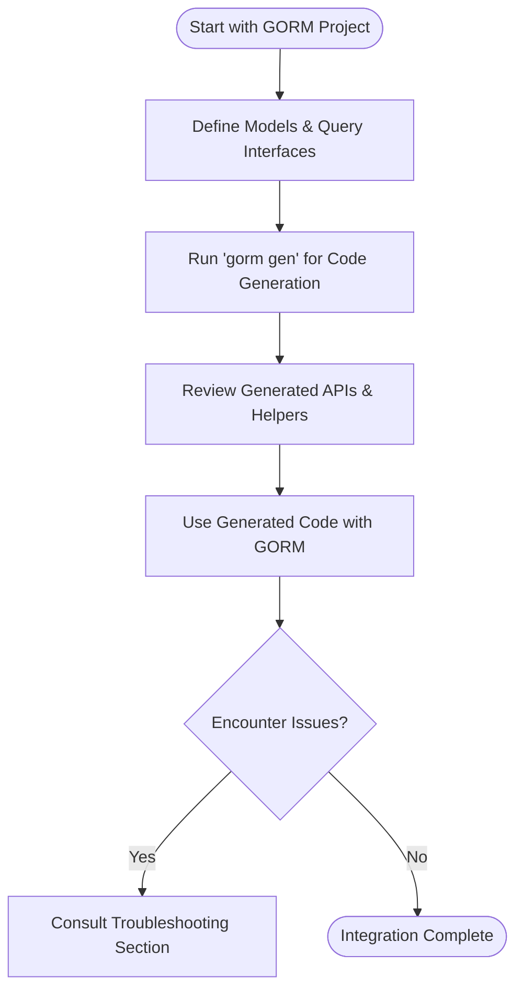

# Integrating with GORM and Troubleshooting

This guide helps you seamlessly integrate GORM CLI into your existing GORM-based Go projects and troubleshoot common issues during code generation and usage. It covers practical integration steps, tips for using the generated type-safe APIs alongside `gorm.io/gorm`, and diagnostic advice to resolve typical errors to ensure a smooth developer experience.

---

## 1. Integration Overview

### What You Will Achieve
By following this guide, you will:
- Incorporate GORM CLI-generated code into your existing GORM project without disrupting workflows.
- Understand how generated query interfaces and field helpers relate to your models and GORM queries.
- Troubleshoot typical problems encountered during code generation and runtime use.

### Prerequisites
- You have a Go project using `gorm.io/gorm` with your data models defined.
- GORM CLI is installed and verified (`go install gorm.io/cli/gorm@latest`).
- Your query interfaces and models are structured following GORM CLI conventions.

### Expected Outcome
- Generated, type-safe query APIs and model-driven field helpers fully integrated.
- Confident use of generated methods alongside GORM’s `DB` methods.
- Ability to quickly diagnose and fix issues stemming from integration or setup.

---

## 2. Step-by-Step Integration with Existing GORM Projects

### Step 1: Define Your Models and Query Interfaces
Write your data models as Go structs with GORM tags.

```go
// models/user.go
package models

import (
  "gorm.io/gorm"
)

type User struct {
  gorm.Model
  Name  string
  Email string
  Age   int
}
```

Create interfaces that define your queries with SQL templates in comments:

```go
// queries/user_query.go
package models

type UserQuery[T any] interface {
  // SELECT * FROM @@table WHERE id=@id
  GetByID(id int) (T, error)

  // SELECT * FROM @@table WHERE name=@name AND age>@age
  FilterByNameAndAge(name string, age int) ([]T, error)

  // UPDATE @@table
  // {{set}}
  //   {{if user.Name != ""}} name=@user.Name, {{end}}
  // {{end}}
  // WHERE id=@id
  UpdateUser(user User, id int) error
}
```

Ensure interfaces are located in the same package or directory as models for best generation consistency.

### Step 2: Run GORM CLI Code Generation
Use the CLI command `gorm gen` to generate code from your interface and model definitions.

```bash
gorm gen -i ./models -o ./generated
```

- `-i` points to the directory containing your interfaces and models.
- `-o` specifies where generated code will be output.

After execution, review generated files under the `./generated` folder.

### Step 3: Import and Use Generated APIs
In your application code, import the generated package and use the fluent type-safe query methods alongside your GORM `DB` instance.

```go
package main

import (
  "context"
  "fmt"
  "gorm.io/gorm"
  "your_project/generated" // Adjust import path
  "your_project/models"
)

func main() {
  var db *gorm.DB = setupDB() // your DB initialization
  ctx := context.Background()

  // Use generated query interface
  user, err := generated.UserQuery[models.User](db).GetByID(ctx, 123)
  if err != nil {
    fmt.Println("Error fetching user:", err)
    return
  }
  fmt.Println("User:", user)

  // Use generated field helpers with GORM methods
  adultUsers := []models.User{}
  err = gorm.G[models.User](db).
    Where(generated.User.Age.Gt(18)).
    Find(ctx, &adultUsers)

  if err != nil {
    fmt.Println("Error fetching adult users:", err)
  }
}
```

### Step 4: Manage Associations Using Generated Helpers
You can perform Create, Update, Unlink, and Delete association operations with generated helpers.

```go
// Create new user with pets
err := gorm.G[models.User](db).
  Set(
    generated.User.Name.Set("alice"),
    generated.User.Pets.Create(generated.Pet.Name.Set("fido")),
  ).
  Create(ctx)
```

### Step 5: (Optional) Customize Generation with `genconfig.Config`
Refine your generation by declaring package-level configuration to control output directory, field helper mappings, and interface inclusion/exclusion.

```go
var _ = genconfig.Config{
  OutPath: "generated",
  FieldTypeMap: map[any]any{
    sql.NullTime{}: field.Time{},
  },
  IncludeInterfaces: []any{"UserQuery*"},
}
```

Place this config in the same package as your interfaces for automatic detection.

---

## 3. Troubleshooting Common Issues

### Installation & Environment
- **`gorm` command not found:** Ensure your `$GOPATH/bin` (or module-aware bin path) is in your system `PATH`.
- **Permission denied errors:** Use correct user permissions or `sudo` to install the CLI.
- **Go version:** Confirm Go 1.18+ is installed.

### Code Generation Errors
- **No interfaces found:** Verify your input path points to files containing interfaces with SQL comments.
- **Syntax or parse errors:** Check for properly formatted SQL in your interface method comments.
- **Empty output or missing methods:** Review your `genconfig.Config` inclusion/exclusion patterns.

### Runtime / Generated Code
- **Method does not exist:** Confirm you imported the right generated package and that your interface method names match generated method names.
- **SQL errors:** Validate the SQL templates; especially parameter bindings and dynamic templating syntax.
- **Imports not resolved:** Run `go mod tidy` to resolve dependencies.

### Diagnostic Steps
- Re-run generation with verbose logs (if supported) or check generated files to confirm method stubs.
- Compare generated code against model and interface definitions.
- Check your model fields for proper GORM tags and visibility.

### Tips
- Keep your models and query interfaces organized in the same package.
- Use the recommended field helper mappings in config for custom types like `sql.NullTime`.
- Regularly update GORM CLI to incorporate fixes and new features.

---

## 4. Best Practices for Integration Success

- **Consistent Package Structure:** Place models and interfaces close together.
- **Explicit Method Return Values:** Methods with SQL returning data must return `(T, error)` or `([]T, error)`.
- **Use Context:** Always pass `context.Context` as the first parameter (injection supported by generator).
- **Leverage Field Helpers:** Use generated helpers for safer queries and updates instead of raw strings.
- **Control Generation with `genconfig`:** Use config to include/exclude interfaces and structs to avoid bloat.

---

## 5. Additional Resources & Next Steps

For further deep dives and related content, explore:

- [Defining Models and Query Interfaces](../getting-started/first-gen-workflow/define-models-interfaces) - to structure your data and queries
- [Generating Code with `gorm gen`](../getting-started/first-gen-workflow/generate-code) - commands and advanced options
- [Using Generated APIs](../getting-started/first-gen-workflow/using-generated-apis) - practical consumption patterns
- [Troubleshooting Common Issues](../getting-started/config-troubleshooting/troubleshooting-common-issues) - detailed problem-solving
- [Advanced Configuration & Customization](../guides/advanced-use-cases/customization-configuration) - tuning generation behavior

Leverage the GORM CLI GitHub repository for examples and source:

- [GORM CLI GitHub](https://github.com/go-gorm/cli)

---

## Summary Diagram: Integration Workflow



---

<Tip>
Integration success comes from consistent model and interface alignment, correct use of SQL template syntax, and leveraging the full power of generated type-safe APIs alongside `gorm.io/gorm`.
</Tip>

<Warning>
Avoid mixing hand-written and generated code inconsistently. Always regenerate after model/interface changes to keep APIs in sync.
</Warning>

<Check>
Confirm your project imports the generated package correctly and uses the GORM DB instance consistently for query execution.
</Check>

---

This completes your guide on integrating GORM CLI into your GORM-based projects and troubleshooting related issues for a hassle-free development experience.
