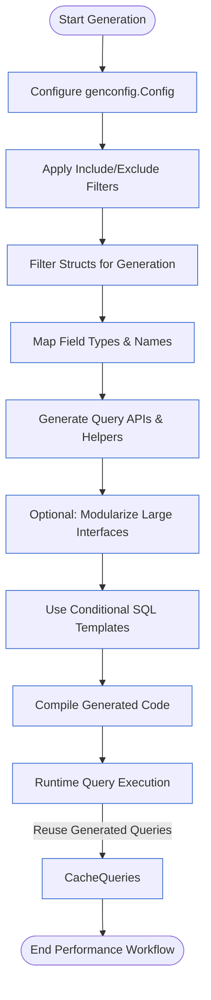

# Performance Optimization: Generation & Runtime

Optimize your experience with GORM CLI by following these best practices focused on efficient code generation and runtime performance. This guide helps you minimize generated code size, leverage configuration filters, and use SQL templates and field helpers optimally — especially important when working with large models or complex query interfaces.

---

## 1. Workflow Overview

### Objective
Help you generate only the necessary code with minimal overhead, improving performance and maintainability.

### Prerequisites
- Basic familiarity with GORM CLI, SQL template-based query interfaces, and model-driven field helpers.
- A configured `genconfig.Config` file (optional but recommended for fine-tuning generation).

### Expected Outcome
- Lean generated code tailored to your needs.
- Faster compile times and runtime query execution.
- Clear understanding of generation filters and mapping strategies.

### Time Estimate
10-15 minutes to implement optimizations and review project structure.

### Difficulty Level
Intermediate

---

## 2. Best Practices for Efficient Code Generation

### 2.1 Use Inclusion & Exclusion Filters Effectively

Control what interfaces and structs get generated to avoid bloating your output.

```go
var _ = genconfig.Config{
    IncludeInterfaces: []any{"Query*"},      // Only generate for interfaces starting with "Query"
    ExcludeInterfaces: []any{"*Deprecated*"}, // Exclude deprecated interfaces
    IncludeStructs: []any{"User", "Account*"}, // Generate only these structs
    ExcludeStructs: []any{"*DTO"},          // Avoid generating DTO-like structs
}
```

**Tip:** Always prefer narrow Include* filtering over broad generation followed by Exclude*. This reduces processing time and output size.

### 2.2 Limit Generated Code by Package or File

Set `FileLevel: true` in `genconfig.Config` to restrict generation to a single file instead of the entire package.

```go
FileLevel: true,
```

This is useful for isolating generation when working with large codebases.

### 2.3 Map Custom Field Types Selectively

Avoid generating complex or large helpers for unnecessary fields by mapping only needed Go types to field helpers.

```go
FieldTypeMap: map[any]any{
    sql.NullTime{}: field.Time{},  // Only map NullTime to Time helper
    // Avoid mapping all types by default
},
```

This reduces the number of generated files and improves readability.

### 2.4 Use Named Field Helper Mapping to Target Specific Columns

Match only the fields that benefit from custom helpers, like JSON, by tagging them in your models and mapping with `FieldNameMap`.

```go
FieldNameMap: map[string]any{
    "json": JSON{},  // Map fields with `gen:"json"` tag to custom JSON helper
},
```

Only generate JSON field helpers for fields that have that tag.

### 2.5 Avoid Generating Unused Helper Types or Interfaces

Keep your interfaces focused; do not include broad sets of interfaces if only a few are needed. For example, generating only `Query*` interfaces:

```go
IncludeInterfaces: []any{"Query*"},
```

Avoid generating unrelated service interfaces that add to the codebase size.

### 2.6 Modularize Your Query Interfaces

Split large interface files into smaller, focused interfaces to improve generator performance and readability.

For example, separate user-related queries into `UserQuery` interface and order-related queries into `OrderQuery`.

---

## 3. Runtime Performance Optimization

### 3.1 Prefer Parameterized Queries with Template Placeholders

Use SQL templates with `@param` and `@@column` placeholders rather than interpolating values manually to ensure efficient query preparation and caching.

Example:
```go
// SELECT * FROM @@table WHERE @@column=@value
FilterWithColumn(column string, value string) (T, error)
```

### 3.2 Use Conditional Clauses (`{{if}}`, `{{where}}`, `{{set}}`) to Generate Minimal SQL

Ensure your query interfaces use conditional DSL to include only relevant WHERE or SET clauses dynamically. This avoids unnecessarily complex queries and reduces query parsing time on the database.

Example:
```go
// UPDATE @@table
// {{set}}
//   {{if user.Name != ""}} name=@user.Name, {{end}}
//   {{if user.Age > 0}} age=@user.Age, {{end}}
// {{end}}
// WHERE id=@id
UpdateInfo(user User, id int) error
```

### 3.3 Cache Database Connections and Query Instances

Create and reuse queries instead of re-creating them repeatedly to reduce overhead.

```go
query := generated.Query[User](db) // Create once
u, err := query.GetByID(ctx, 123)  // Reuse
```

### 3.4 Filter With Time Ranges Carefully

When filtering with time ranges, avoid passing zero-valued times because they generate unnecessary SQL boilerplate.

Check your time values before invoking the query.

### 3.5 Batch Operations for Multiple Entities

Use batch creation or updates when working with multiple records. GORM CLI supports batch association operations.

Example:
```go
gorm.G[User](db).
  Where(generated.User.ID.Eq(1)).
  Set(
    generated.User.Languages.CreateInBatch([]models.Language{{Code: "EN"}, {Code: "FR"}}),
  ).
  Update(ctx)
```

### 3.6 Use Generated Field Helpers for SQL Expressions

Avoid raw SQL strings. Use generated predicates and setters to compose safe, optimized SQL conditions and updates.

```go
// Filtering
generated.User.Name.Eq("alice")
generated.User.Age.Between(18, 65)

// Updates
generated.User.Score.Set(sql.NullInt64{})
generated.User.Age.Incr(1)
```

---

## 4. Common Pitfalls & Troubleshooting

<AccordionGroup title="Troubleshooting Common Performance Issues">
<Accordion title="Generated Code Too Large or Slow Compilation">
- Check that your `genconfig.Config` Does not include overly broad interface or struct filters.
- Use `IncludeInterfaces` and `IncludeStructs` restrictively.
- Enable `FileLevel` option when applicable.
- Modularize large interface files.
</Accordion>
<Accordion title="Unexpectedly Complex Queries at Runtime">
- Confirm conditional clauses (`{{if}}`, `{{where}}`) in SQL templates correctly filter query fragments.
- Avoid passing zero or empty values that trigger unintended query clauses.
- Verify parameter usage aligns with query templates.
</Accordion>
<Accordion title="Excessive Field Helper Generation">
- Map only essential custom field types in `FieldTypeMap` and `FieldNameMap`.
- Remove unused helper type mappings.
- Tag only the fields needing custom helpers.
</Accordion>
</AccordionGroup>

<Tip>
Profile your Go application's compile and run times periodically after generation to catch performance regressions early.
</Tip>

---

## 5. Examples

### 5.1 Configuring GenConfig for Lean Generation

```go
package examples

import (
  "database/sql"
  "gorm.io/cli/gorm/field"
  "gorm.io/cli/gorm/genconfig"
)

var _ = genconfig.Config{
  OutPath: "examples/output",
  IncludeInterfaces: []any{"Query*"}, // Only generate interfaces prefixed with Query
  ExcludeInterfaces: []any{"*Deprecated*"},
  IncludeStructs: []any{"User", "Account"},
  FieldTypeMap: map[any]any{
    sql.NullTime{}: field.Time{}, // Map only NullTime
  },
  FieldNameMap: map[string]any{
    "json": JSON{},                // Map json-tagged columns
  },
  FileLevel: false,                 // Package-wide generation
}
```

### 5.2 Using Conditional SQL Template for Efficient UPDATE

```go
// In query.go interface
// UPDATE @@table
// {{set}}
//   {{if user.Name != ""}} name=@user.Name, {{end}}
//   {{if user.Age > 0}} age=@user.Age, {{end}}
//   {{if user.Age >= 18}} is_adult=1 {{else}} is_adult=0 {{end}}
// {{end}}
// WHERE id=@id
UpdateInfo(user User, id int) error
```

---

## 6. Next Steps & Related Content

- Explore the [Customizing Generation with genconfig.Config](https://docs.example.com/guides/core-workflows/customizing-generation) guide for deeper configuration control.
- Review the [Working with Type-Safe Queries](https://docs.example.com/guides/core-workflows/type-safe-queries) to optimize your interface design.
- Use [Model-Driven Field Helpers in Practice](https://docs.example.com/guides/core-workflows/field-helper-patterns) to leverage strongly-typed predicates and setters efficiently.
- Refer to [Managing Associations](https://docs.example.com/guides/core-workflows/associations-management) for batch and relationship operation patterns.
- For troubleshooting installation or generation performance, see relevant [Setup & Installation](https://docs.example.com/getting-started/setup-basics/prerequisites) and [Troubleshooting Installation Issues](https://docs.example.com/getting-started/setup-basics/troubleshooting-install) guides.

---

<Check>
By applying these optimizations, your GORM CLI-generated code will be faster to generate, easier to maintain, and more efficient at runtime, empowering you to scale your Go applications with confidence.
</Check>

---

## 7. Diagram: Generation & Runtime Performance Optimization Workflow



---