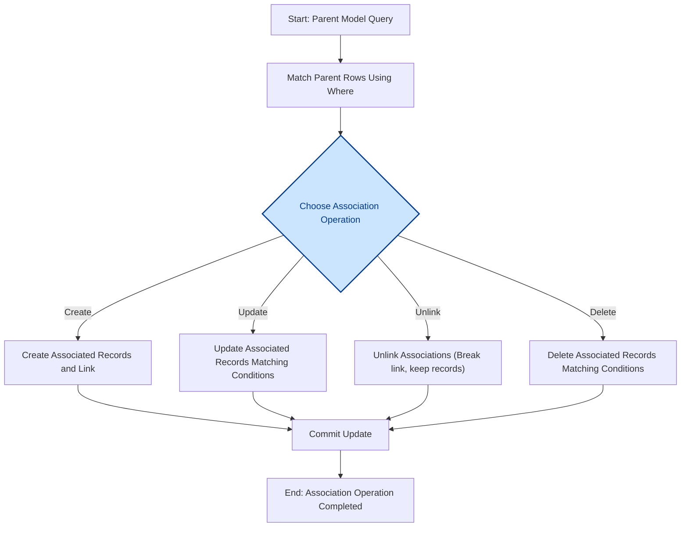

# Managing Associations: Create, Update, Unlink, Delete

Manage the relationships between your models with precision and confidence using GORM CLI's generated association helpers. This guide focuses on practical, example-driven workflows that show you how to create, update, unlink, and delete associated records leveraging the strongly typed APIs generated from your models.

---

## 1. Understanding Association Helpers

GORM CLI generates association helpers based on your model's relationships. These helpers allow you to manipulate related records with type safety and fluent APIs.

- **Association Field Types:**
  - `field.Struct[T]` — for single associations (e.g., `has one`, `belongs to`)
  - `field.Slice[T]` — for multiple associations (e.g., `has many`, `many2many`)

### Semantics by Association Type

| Association Type | Unlink Behavior                                      | Delete Behavior                             |
|------------------|-----------------------------------------------------|---------------------------------------------|
| Belongs To       | Sets parent's foreign key to `NULL`                 | Deletes associated rows                      |
| Has One / Has Many | Sets child's foreign key to `NULL`                 | Deletes child rows                           |
| Many2Many        | Removes join table rows only, both rows remain      | Removes join table rows only, both rows remain |

<Tip>
Unlinking an association *does not* delete records; it merely breaks the relationship while preserving the associated data.
</Tip>

---

## 2. Workflow Overview

### Task Description
This guide helps you manage associations by:
- Creating associated records and linking them to parents
- Updating associated records with optional filtering
- Unlinking associations without deleting related records
- Deleting associated records when appropriate

### Prerequisites
- Generated GORM CLI code with association helpers for your models
- A configured and accessible GORM `*gorm.DB` instance
- Understanding of your model relationships

### Expected Outcome
You will confidently perform CRUD operations on associations in your Go code, ensuring safe, clear, and maintainable data handling for relational data.

### Time Estimate
10-20 minutes to grasp and apply the examples

### Difficulty Level
Intermediate (familiarity with GORM and Go generics helpful)

---

## 3. Step-by-Step Instructions

### Step 1: Creating Associations
Create new related records and link them in a single fluent operation.

```go
// Create a new User with one Pet (has many)
gorm.G[User](db).
  Set(
    generated.User.Name.Set("alice"),
    generated.User.Pets.Create(generated.Pet.Name.Set("fido")),
  ).
  Create(ctx)

// Create a User and link two Languages (many2many)
gorm.G[User](db).
  Set(
    generated.User.Name.Set("polyglot"),
    generated.User.Languages.CreateInBatch([]models.Language{{Code: "EN"}, {Code: "FR"}}),
  ).
  Create(ctx)
```

#### Expected Result
- New parent and associated records created
- Foreign keys or join table entries properly set

### Step 2: Updating Associated Records
Filter and modify associated rows for matched parents.

```go
// Update a User's Pet where name = 'fido'
gorm.G[User](db).
  Where(generated.User.ID.Eq(1)).
  Set(
    generated.User.Pets.Where(generated.Pet.Name.Eq("fido")).
      Update(generated.Pet.Name.Set("rex")),
  ).
  Update(ctx)
```

#### Expected Result
- Only associated Pets matching the filter are updated
- Parent rows remain unchanged

### Step 3: Unlinking Associations
Break associations while keeping the related records intact.

```go
// Unlink all pets from a User (clean foreign keys but keep Pets)
gorm.G[User](db).
  Where(generated.User.ID.Eq(1)).
  Set(generated.User.Pets.Unlink()).
  Update(ctx)
```

#### Expected Result
- Relationship removed
- Child or join table foreign keys set to `NULL` or join entries removed

### Step 4: Deleting Associated Records
Remove associated records matching optional conditions.

```go
// Delete associated pets named 'a' for a given user
gorm.G[User](db).
  Where(generated.User.ID.Eq(1)).
  Set(
    generated.User.Pets.Where(generated.Pet.Name.Eq("a")).Delete(),
  ).
  Update(ctx)
```

#### Expected Result
- Associated Pets matching conditions are deleted from the database
- Parent records remain unchanged

---

## 4. Examples & Usage Patterns

### Example: HasOne Association — Account
```go
// Create an Account and associate it with an existing User
gorm.G[User](db).
  Where(generated.User.ID.Eq(1)).
  Set(generated.User.Account.Create(generated.Account.Number.Set("A-001"))).
  Update(ctx)

// Update Account's Number field
orm.G[User](db).
  Where(generated.User.ID.Eq(1)).
  Set(generated.User.Account.Where(generated.Account.Number.Eq("A-001")).
    Update(generated.Account.Number.Set("A-002")),
  ).
  Update(ctx)

// Unlink Account (set UserID foreign key to NULL)
gorm.G[User](db).
  Where(generated.User.ID.Eq(1)).
  Set(generated.User.Account.Unlink()).
  Update(ctx)

// Delete Account record
gorm.G[User](db).
  Where(generated.User.ID.Eq(1)).
  Set(generated.User.Account.Delete()).
  Update(ctx)
```

### Example: Many2Many Association — Languages
```go
// Create and link a Language
orm.G[User](db).
  Where(generated.User.ID.Eq(1)).
  Set(generated.User.Languages.Create(generated.Language.Code.Set("EN"), generated.Language.Name.Set("English"))).
  Update(ctx)

// Unlink language (remove join row only)
gorm.G[User](db).
  Where(generated.User.ID.Eq(1)).
  Set(generated.User.Languages.Where(generated.Language.Code.Eq("EN")).Unlink()).
  Update(ctx)

// Delete association (remove join row, keep language row)
gorm.G[User](db).
  Where(generated.User.ID.Eq(1)).
  Set(generated.User.Languages.Where(generated.Language.Code.Eq("EN")).Delete()).
  Update(ctx)
```

### Example: Polymorphic Has One — Pet.Toy
```go
// Update Toy name of a Pet
gorm.G[models.Pet](db).
  Where(generated.Pet.ID.Eq(10)).
  Set(generated.Pet.Toy.Where(generated.Toy.Name.Eq("ball")).Update(generated.Toy.Name.Set("cube"))).
  Update(ctx)

// Unlink Toy (clear polymorphic foreign keys)
gorm.G[models.Pet](db).
  Where(generated.Pet.ID.Eq(10)).
  Set(generated.Pet.Toy.Unlink()).
  Update(ctx)

// Delete Toy record
orm.G[models.Pet](db).
  Where(generated.Pet.ID.Eq(10)).
  Set(generated.Pet.Toy.Delete()).
  Update(ctx)
```

---

## 5. Best Practices and Tips

- **Chain association operations within `Set(...)`** for one atomic update or create operation.
- Always **filter associations carefully** when updating, unlinking, or deleting to avoid unexpected data loss.
- Use `CreateInBatch` for efficiently creating multiple related records.
- Remember **Unlink differs from Delete** — unlinking clears relations but does not remove data.
- Utilize generated field helpers to write **clear, type-safe, and maintainable query expressions**.
- When working with polymorphic associations, manage clearing references carefully as both foreign key and type columns must be handled.

---

## 6. Common Pitfalls & Troubleshooting

<AccordionGroup title="Common Issues in Association Management">
<Accordion title="Association Create Fails or Does Not Link">
- Verify that you use `Set(...).Create(ctx)` or `Set(...).Update(ctx)`, not just `Create` or `Update` on GORM alone.
- Check that foreign keys and association tags are correctly defined in your models.
- Confirm generated code is up to date and includes association helpers.
</Accordion>
<Accordion title="Update or Unlink Does Not Affect Records">
- Ensure your `Where` conditions on association helpers correctly target associated records.
- Remember that filtering conditions apply only to associated rows, not parent rows.
- Confirm your context and DB connection are valid and error-free.
</Accordion>
<Accordion title="Unexpected Data Deletion">
- Double-check association filters before calling `Delete()`.
- Run database transactions where appropriate to permit rollbacks.
- Always backup or work in staging environments when testing destructive operations.
</Accordion>
</AccordionGroup>

---

## 7. Advanced: Batch Association Creation

Use `CreateInBatch` on slice association helpers to link multiple existing or new child records in one operation.

```go
// Batch create and link multiple Pets to a User
gorm.G[User](db).
  Where(generated.User.ID.Eq(1)).
  Set(generated.User.Pets.CreateInBatch([]models.Pet{{Name: "bm1"}, {Name: "bm2"}})).
  Update(ctx)

// Batch create and link multiple Languages (many2many)
gorm.G[User](db).
  Where(generated.User.ID.Eq(1)).
  Set(generated.User.Languages.CreateInBatch([]models.Language{{Code: "B1"}, {Code: "B2"}})).
  Update(ctx)
```

---

## 8. Next Steps & Related Content

- Explore [`Associations Management`](https://your-docs-domain/guides/core-workflows/associations-management) for deeper scenarios.
- Read about [`Model-Driven Field Helpers`](https://your-docs-domain/guides/core-workflows/field-helper-patterns) to strengthen query writing.
- Combine with [`Type-Safe Queries`](https://your-docs-domain/guides/core-workflows/type-safe-queries) to maximize data access safety.
- Use [`Customizing Generation`](https://your-docs-domain/guides/core-workflows/customizing-generation) to tailor association generation for custom cases.

For reference and detailed examples, check the test suite at `examples/output/models_relations_test.go` in the repository.

---

## Diagram: Association Operation Workflow



---