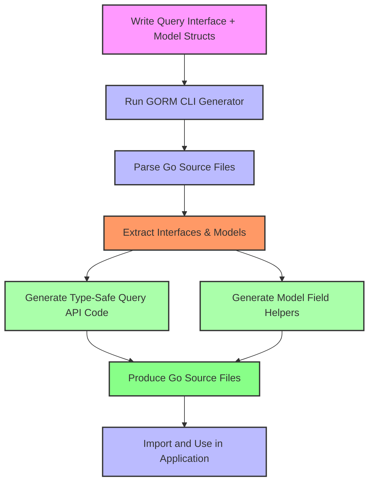

# Generating Query APIs & Field Helpers

## Workflow Overview

This guide provides clear, actionable instructions to generate type-safe query APIs and model-driven field helpers using GORM CLI. By following this workflow, you will transform your Go interfaces annotated with SQL templates and your model structs into strongly typed, fluent APIs that yield compile-time safety and ease of database operations.

### Prerequisites

- Go 1.18 or higher installed
- GORM CLI installed (`go install gorm.io/cli/gorm@latest`)
- Prepared Go interface file with SQL template annotations (e.g., `Query[T any]` interface)
- Corresponding model structs defined in Go (with GORM-compatible conventions)

### Expected Outcome

- Generated Go source files containing type-safe query API implementations
- Generated field helper structs for model fields providing fluent predicates and setters
- Seamless integration points for GORM database operations with complete type-safety and discoverability

### Time Estimate

Approximately 15–30 minutes for initial setup and generation, depending on project size.

### Difficulty Level

Intermediate – requires familiarity with Go interfaces, GORM models, and basic CLI usage.

---

## Step-by-Step Instructions

<Steps>
<Step title="1. Prepare Your Query Interface and Models">
Create Go interfaces with SQL template method comments and define your models in the same package or directory.

Example query interface method with SQL template:
```go
// SELECT * FROM @@table WHERE id=@id
GetByID(id int) (T, error)
```

Example model struct:
```go
type User struct {
  gorm.Model
  Name string
  Age  int
}
```

This sets the foundation for generating the corresponding type-safe query methods and field helpers.

**Expected result:** Ready interface and model files annotated for code generation.
</Step>

<Step title="2. Run the GORM CLI Generator">
Execute the CLI command to generate code from your interface and model files.

```bash
gorm gen -i ./path/to/your/interfaces -o ./path/to/generated
```

- `-i` specifies the input path containing your interfaces and models.
- `-o` specifies the output directory for generated code.

The CLI parses Go files, extracts interfaces and structs, and produces strongly typed query APIs and field helpers.

**Expected result:** Source files with fluent APIs created at the output path.
</Step>

<Step title="3. Incorporate the Generated Code into Your Project">
Import the generated package and use the generated query interfaces and field helpers to perform database operations.

Example usage:
```go
// Fetch user by ID
user, err := generated.Query[User](db).GetByID(ctx, 123)

// Perform filtered query
users, err := gorm.G[User](db).Where(generated.User.Age.Gt(18)).Find(ctx)
```

Using these generated APIs ensures compile-time safety and better discoverability through autocomplete.

**Expected result:** Safe, fluent database queries using generated types.
</Step>

<Step title="4. (Optional) Customize Generation via genconfig.Config">
Configure your generation settings by declaring a package-level `genconfig.Config` variable.

Example custom configuration:
```go
var _ = genconfig.Config{
  OutPath: "generated/output",
  FieldTypeMap: map[any]any{
    sql.NullTime{}: field.Time{},
  },
  FieldNameMap: map[string]any{
    "json": JSON{},
  },
}
```

This allows customizing output directories, mapping specific Go types to field helpers, and filtering interfaces/structs for generation.

**Expected result:** Generated code reflecting your custom mappings and output structure.
</Step>
</Steps>

---

## Key Concepts & Usage Details

### Query APIs from Interfaces

- Write interface methods with SQL annotations in comments.
- Use placeholders for dynamic table names (`@@table`), columns (`@@column`), and parameters (`@param`).
- Support conditional SQL blocks with DSL directives like `{{where}}`, `{{set}}`, `{{if}}`, and `{{for}}`.
- Generated methods include auto injected `context.Context` if not already present.

### Model-Driven Field Helpers

- Generate strongly typed field helpers for your model's basic fields and associations.
- Helpers provide predicate functions (e.g., `.Eq()`, `.Like()`, `.Between()`) and update expressions.
- Association helpers support creating, updating, unlinking, and deleting related rows safely.

### Example: Field Helpers Usage
```go
// Find users older than 18
users, err := gorm.G[User](db).Where(generated.User.Age.Gt(18)).Find(ctx)

// Update name and increment age atomically
err := gorm.G[User](db).
  Where(generated.User.ID.Eq(1)).
  Set(
    generated.User.Name.Set("jinzhu"),
    generated.User.Age.Incr(1),
  ).
  Update(ctx)
```

### Association Operations

- Use association helpers on generated model fields for operations like create, batch create, update, unlink, and delete.
- Operations apply according to association type semantics (belongs to, has one/many, many2many).

Example:
```go
gorm.G[User](db).
  Set(
    generated.User.Name.Set("alice"),
    generated.User.Pets.Create(generated.Pet.Name.Set("fido")),
  ).
  Create(ctx)
```

---

## Advanced SQL Template DSL

- Use directives like `{{where}}`, `{{set}}`, `{{if}}`, `{{for}}` to create dynamic SQL fragments safely.
- Binding parameters via `@param` ensures SQL injection safety and code clarity.
- GORM CLI parses and converts these templates into Go source code building SQL strings and parameter lists.

Example interface method:
```go
// UPDATE @@table
// {{set}}
//   {{if user.Name != ""}} name=@user.Name, {{end}}
//   {{if user.Age > 0}} age=@user.Age, {{end}}
// {{end}}
// WHERE id=@id
UpdateUser(user User, id int) error
```

---

## Troubleshooting & Best Practices

<Tip>
Ensure your interfaces always return `(T, error)` or `(error)` properly as per the method type. Methods with SQL must return error to catch failures.
</Tip>

<Warning>
Do not forget to include the `-i` flag pointing to the input directory or file when running `gorm gen`. Omitting this results in no files processed.
</Warning>

<Note>
If you have multiple `genconfig.Config` declarations, only those in applicable files or directories control generation settings.
</Note>

**Common problems and solutions:**

- _No generated files_: Verify input path and interface naming.
- _SQL syntax errors_: Validate your SQL templates using the DSL syntax and check generated code.
- _Field mappings not applied_: Confirm correct usage of `FieldTypeMap` and `FieldNameMap` in your config.

Best practices:

- Use descriptive method names matching your SQL intent.
- Keep your models and interfaces in the same package or a structure compatible for the generator.
- Regularly run generation during development to catch changes early.

---

## Next Steps & Related Content

- **Using the Generated APIs in Your Project**: Learn to seamlessly integrate generated code into your application.
- **Working with Associations**: Explore detailed scenarios of managing related data with association helpers.
- **Template-Driven Queries: SQL Template DSL**: Deep dive into advanced templating capabilities for complex SQL.
- **Custom Generation: Configuration & JSON Field Mapping**: Customize generation behavior with configurations and field mapping.

For the full CLI usage, configuration options, and examples, visit the following docs:

- [Quickstart & Basic Workflow](https://yourdocs.example.com/getting-started/essential-setup/quickstart-your-first-generation)
- [Configuring the Generator](https://yourdocs.example.com/getting-started/configuration-troubleshooting/configuring-generator)
- [Troubleshooting Common Setup Issues](https://yourdocs.example.com/getting-started/configuration-troubleshooting/troubleshooting-common-issues)


---

## Visualizing the Generation Workflow



This flow highlights your path from source files to ready-to-use query APIs and field helpers.

---