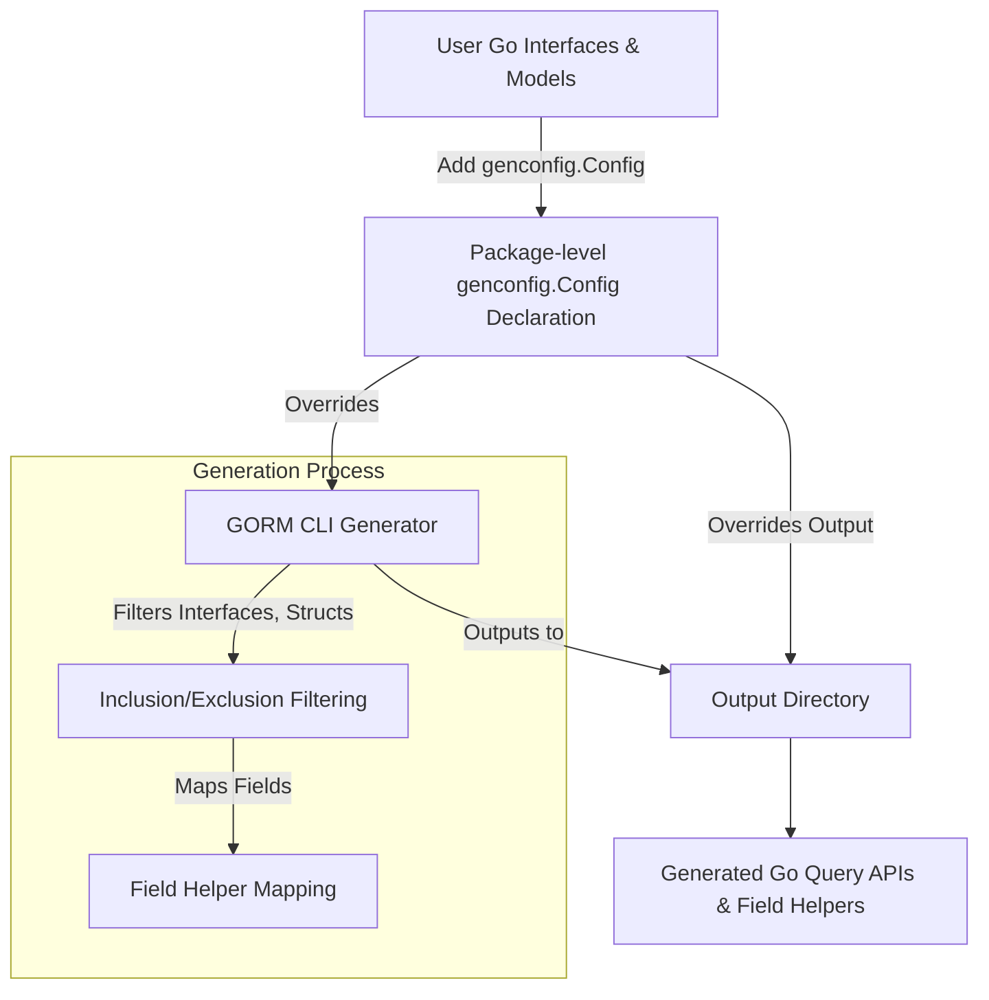

# Advanced Code Generation Configuration

Fine-tune your GORM CLI code generation process by customizing output paths, type mappings, and filtering rules with the `genconfig.Config`. This control unlocks the full potential of GORM CLI in larger or complex projects by enabling precise inclusion/exclusion of interfaces and structs, customized field helper mappings, and package-level output management.

---

## 1. Why Configure Code Generation?

As your Go project evolves, you may want to tailor the generated code to fit your architecture, avoid generating unnecessary boilerplate, or support specialized field types such as JSON or nullable timestamps. GORM CLI supports these scenarios through package-level configuration using `genconfig.Config` declared as a Go variable. This allows you to:

- Override default output directories per package
- Map Go types or struct field tags to custom field helpers
- Include or exclude specific query interfaces or model structs
- Control scope on a file-level or package-level basis


## 2. Declaring `genconfig.Config`

Declare a package-level variable named `_` assigned to `genconfig.Config` in any Go file in the package you want to configure. The generator automatically picks it up when processing your source files. Here is an example layout:

```go
package examples

import (
    "database/sql"
    "gorm.io/cli/gorm/field"
    "gorm.io/cli/gorm/genconfig"
)

var _ = genconfig.Config{
    OutPath: "examples/output", // Override output directory

    // Map Go types to custom field helper wrappers
    FieldTypeMap: map[any]any{
        sql.NullTime{}: field.Time{},
    },

    // Map struct tag names to custom field helpers
    FieldNameMap: map[string]any{
        "date": field.Time{},
        "json": JSON{}, // Assuming JSON is your custom helper
    },

    FileLevel: false, // Apply config at package level (default is false)

    // Inclusion and exclusion patterns for interfaces and structs
    IncludeInterfaces: []any{"Query*", models.Query(nil)},
    ExcludeInterfaces: []any{"*Deprecated*"},

    IncludeStructs: []any{"User", "Account*", models.User{}},
    ExcludeStructs: []any{"*DTO"},
}
```

<Note>
`FieldTypeMap` keys are Go type instances (e.g., `sql.NullTime{}`) and values are the corresponding field helper instances (e.g., `field.Time{}`). For `FieldNameMap`, the key is a string representing the `gen` struct tag.
</Note>

### Key Configuration Fields

| Field               | Description                                                            |
| ------------------- | ---------------------------------------------------------------------- |
| `OutPath`           | Directory where generated files will be placed                        |
| `FieldTypeMap`      | Maps Go types to field helper wrappers                                 |
| `FieldNameMap`      | Maps `gen` struct tag names to field helpers                          |
| `FileLevel`         | If true, applies config only to the single Go file it’s declared in;  |
|                     | if false (default), applies to entire package/directory subtree       |
| `IncludeInterfaces` | Whitelist (shell-style patterns or type literals) for interfaces      |
| `ExcludeInterfaces` | Blacklist for interfaces, applied after inclusion filtering           |
| `IncludeStructs`    | Whitelist for structs by name or type literal                         |
| `ExcludeStructs`    | Blacklist for structs, applied after inclusion filtering              |


## 3. Controlling Output Paths

By default, the CLI’s `-o` flag determines where generated files are saved for all packages. The `OutPath` field overrides this for specific packages.

### How It Works

- If multiple package configs match a file's path, the most specific config with `FileLevel == true` is preferred.
- Package-level configs (`FileLevel == false`) apply recursively to all files in that package/subdirectories.
- The generator merges configs from all matching packages when generating code.

### Example

```go
var _ = genconfig.Config{
    OutPath: "generated/api",
}
```

This directs all generated code for that package to `generated/api` instead of the CLI default.

<Check>
Setting `FileLevel=true` applies the configuration only to the file where it’s declared, useful for per-file granularity.
</Check>


## 4. Customizing Field Helper Mappings

Sometimes your project uses custom types or tags requiring specialized field helpers. `FieldTypeMap` and `FieldNameMap` enable this customization.

### FieldTypeMap

Map concrete Go types to the field helper wrappers the generator should use.

Example:

```go
FieldTypeMap: map[any]any{
    sql.NullTime{}: field.Time{},
    mypkg.CustomJSONType{}: JSON{},
},
```

This tells the generator to wrap `sql.NullTime` fields using `field.Time{}` and your own custom JSON helper for `CustomJSONType`.

### FieldNameMap

Override field helper selection by struct tag lookup (using the `gen` tag).

Example:

```go
FieldNameMap: map[string]any{
    "json": JSON{}, // Use your JSON field helper for fields tagged `gen:"json"`
    "date": field.Time{},
},
```

Add a `gen:"json"` tag to your struct field to trigger this.

```go
type User struct {
    Profile string `gen:"json"`
}
```

<Tip>
For advanced JSON helpers, consider implementing custom SQL builder logic to generate database-specific JSON queries.
</Tip>


## 5. Managing Inclusion and Exclusion Filters

As projects grow, you may want to limit code generation to relevant interfaces and structs for efficiency and clarity.


### Pattern Matching

Use shell-style wildcard patterns or Go type literals for precise control.

| Filter Type         | Description                                                 |
|---------------------|-------------------------------------------------------------|
| `IncludeInterfaces` | Whitelist interfaces to generate; overrides exclusion       |
| `ExcludeInterfaces` | Blacklist interfaces after inclusion filtering              |
| `IncludeStructs`    | Whitelist structs by name or type literal                    |
| `ExcludeStructs`    | Blacklist structs after inclusion filtering                 |

### Examples

```go
// Only generate interfaces starting with "Query"
IncludeInterfaces: []any{"Query*"},

// Exclude deprecated interfaces
ExcludeInterfaces: []any{"*Deprecated*"},

// Include specific struct types
IncludeStructs: []any{"User", models.Account{}},

// Exclude DTO structs
ExcludeStructs: []any{"*DTO"},
```

### Using Type Literals

You can specify the exact Go type directly:

```go
IncludeInterfaces: []any{models.Query(nil)},
IncludeStructs: []any{models.User{}},
```

This avoids relying solely on string matching and provides compile-time safety.


<Warning>
If `IncludeInterfaces` or `IncludeStructs` is non-empty, exclusion filters are ignored for those kinds.
</Warning>


## 6. File-Level vs Package-Level Configuration

By default, a config applies to the entire package/subtree (`FileLevel: false`). Setting `FileLevel: true` limits the config to the individual file declared in.

### When to Use File-Level

- You want different generation settings per file within the same package.
- Temporary overrides or experimental settings.

### Impact

- File-level configs have highest priority for files they apply to.
- Package-level configs cascade to all files but are overridden when file-level configs exist.


## 7. Practical Scenarios

### Scenario: Custom JSON Field Helper

1. Define your JSON helper struct and methods.
2. Configure `genconfig.Config` to map the `json` tag to your helper.
3. Add `gen:"json"` to your struct fields.
4. Run `gorm gen` to generate code using the custom helper.

Example:

```go
// config.go
var _ = genconfig.Config{
    FieldNameMap: map[string]any{
        "json": JSON{},
    },
}

// models.go

type User struct {
    Profile string `gen:"json"`
}
```

### Scenario: Generate Only Selected Interfaces & Structs

```go
var _ = genconfig.Config{
    IncludeInterfaces: []any{"Query*"},
    ExcludeInterfaces: []any{"*Deprecated*"},
    IncludeStructs: []any{"User", "Account"},
    ExcludeStructs: []any{"*DTO"},
}
```

This helps keep generated code clean and focused.


## 8. Troubleshooting Configuration

<AccordionGroup title="Common Issues with genconfig Config">
<Accordion title="Generated code missing some interfaces or structs">
Check your `IncludeInterfaces` and `IncludeStructs` patterns—if these are non-empty, your excludes are ignored. Make sure the patterns match the full names or use type literals correctly.
</Accordion>
<Accordion title="Overrides not applied as expected">
Verify if `FileLevel` is set appropriately. Package-level configs apply broadly unless overwritten by file-level configs.
</Accordion>
<Accordion title="Custom field helpers not activated">
Confirm that your `FieldTypeMap` or `FieldNameMap` entries use the correct Go type instances or tag names, respectively.
</Accordion>
</AccordionGroup>


## 9. Summary Diagram of Configuration Flow




## 10. Next Steps & Additional Resources

- Explore [Writing Query Interfaces & Models](https://gorm.io/cli/docs/getting-started/project-bootstrapping/writing-query-interfaces) to prepare your code for generation.
- Learn how to run the generator and validate output in [Basic Generation Workflow](https://gorm.io/cli/docs/getting-started/project-bootstrapping/basic-generation-workflow).
- Review [Using Generated APIs](https://gorm.io/cli/docs/guides/core-workflows/using-generated-apis) for practical usage and best practices.
- For complex customizations, see [Building Custom Queries with SQL Templates](https://gorm.io/cli/docs/guides/advanced-patterns/template-queries) and [Defining Custom Field Helpers](https://gorm.io/cli/docs/guides/advanced-patterns/custom-field-helpers).

---

## References

- [genconfig.Config GoDoc](https://github.com/go-gorm/cli/blob/main/genconfig/config.go)
- [GORM CLI README](https://github.com/go-gorm/cli#readme)

---

## Summary

This documentation covers everything you need to fine-tune your GORM CLI code generation by leveraging the powerful `genconfig.Config`. Customize output directories, define precise inclusion/exclusion filters for your interfaces and structs, and map Go types or struct tags to custom field helpers. These configurations empower you to maintain clean, efficient, and idiomatic code generation workflows as your project grows in complexity.

---

## Example: Minimal Configuration to Include Certain Interfaces

```go
package filters

import "gorm.io/cli/gorm/genconfig"

// Only generate interfaces starting with "Query" in this package
var _ = genconfig.Config{
    IncludeInterfaces: []any{"Query*"},
}
```

---

## Tips

- Use type literals (e.g., `models.User{}` or `models.Query(nil)`) for more exact filtering than string matching.
- Use `FileLevel: true` judiciously for files needing specific generation settings.
- Always commit your config changes to ensure consistent generation across teams.

---

Enhance your GORM CLI experience today by adopting advanced generation configuration patterns to fit your project’s unique needs.