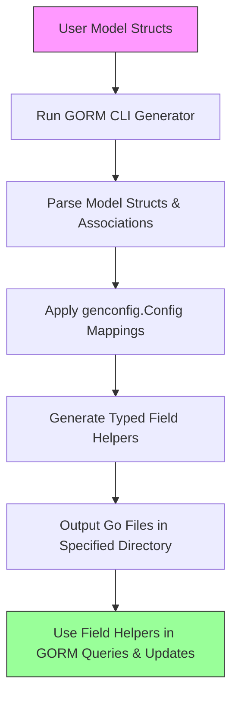

# Generating Model-driven Field Helpers

Unlock the power of GORM CLI by generating model-driven field helpers directly from your Go model structs. This guide walks you through the process of generating strongly typed helpers that simplify filtering, updating, and managing associations in your database operations. By the end, you'll efficiently produce robust, readable, and compile-time safe code tailored to your data models.

---

## 1. What You Will Achieve

- Automatically generate field helpers from your existing Go structs.
- Gain access to typed predicates and setters for filters and updates.
- Utilize association helpers for linked data models like HasOne, HasMany, BelongsTo, and Many2Many.
- Improve code clarity and minimize boilerplate in GORM queries and updates.

## 2. Prerequisites

- A Go project using GORM (version 1.18+).
- Model structs representing your database tables.
- GORM CLI installed (`go install gorm.io/cli/gorm@latest`).
- Basic familiarity with Go generics, GORM, and the CLI tool.

## 3. Expected Outcome

Following this guide, you will: 

- Generate Go files containing field helpers based on your model structs.
- Use these helpers in queries and update statements to express database operations precisely.
- Seamlessly manage related records with generated association helpers.

## 4. Time Estimate

Typically 15–30 minutes, depending on your project's size and familiarity with GORM CLI.

## 5. Difficulty Level

Intermediate. Assumes understanding of Go models and GORM basics.

---

## Step-by-Step Instructions

### Step 1: Define Your Model Structs

You need well-structured Go structs representing your database tables. For example:

```go
package models

import (
  "time"
  "gorm.io/gorm"
)

type User struct {
  gorm.Model
  Name      string
  Age       int
  Profile   string `gen:"json"` // Custom field helper tag
  Pets      []Pet
  ManagerID *uint
  Manager   *User
}

type Pet struct {
  ID     uint
  Name   string
  UserID uint
}
```

#### Tips:
- Use struct tags to declare custom field helpers (e.g., `gen:"json"`).
- Embed `gorm.Model` for common fields like ID, CreatedAt.
- Include associations as fields (`[]Pet`, `*User`) to enable generation of association helpers.

### Step 2: (Optional) Declare Generation Configuration

Create a Go file with a package-level `genconfig.Config` value to
customize generation:

```go
package examples

import "gorm.io/cli/gorm/genconfig"

var _ = genconfig.Config{
  OutPath: "examples/output",
  FieldNameMap: map[string]any{
    "json": JSON{}, // map fields tagged 'json' to a JSON helper
  },
}
```

This configures output paths, custom field type mappings, and filtering criteria.

### Step 3: Run the GORM CLI Generator

Execute the CLI command to process your source package or files:

```bash
gorm gen -i ./models -o ./generated
```

- `-i` points to the directory or file containing your model structs.
- `-o` specifies where the generated helpers will be placed.

**After running, you will see generated Go files with model-driven field helpers.**

### Step 4: Understand Generated Field Helpers

For each model, the generator creates a strongly typed helper with:

- **Predicates**: e.g., `generated.User.Name.Eq("alice")` for queries.
- **Setters**: e.g., `generated.User.Age.Set(30)` for insert/update operations.
- **Associations**: e.g., `generated.User.Pets.Create(...)`, `generated.User.Manager.Unlink()`.

These helpers use generic types for maximum type safety.

### Step 5: Use Field Helpers in Queries and Updates

Example: Filtering users by name and age

```go
import (
  "context"
  "gorm.io/gorm"
  "generated"
  "models"
)

func FindAdultNamedAlice(db *gorm.DB) ([]models.User, error) {
  ctx := context.Background()
  return gorm.G[models.User](db).
    Where(
      generated.User.Name.Eq("alice"),
      generated.User.Age.Gt(18),
    ).
    Find(ctx)
}
```

Example: Creating a user and associating pets

```go
func CreateUserWithPets(db *gorm.DB) error {
  ctx := context.Background()
  return gorm.G[models.User](db).
    Set(
      generated.User.Name.Set("bob"),
      generated.User.Pets.Create(generated.Pet.Name.Set("fido")),
    ).
    Create(ctx)
}
```

### Step 6: Explore Association Operations

The generated helpers support:
- `Create` / `CreateInBatch` to insert related rows.
- `Update` to modify associated records.
- `Unlink` to clear foreign keys (disassociate).
- `Delete` to remove associated records.

Example: Unlink a user's pets where pet name is "old"

```go
db := /* *gorm.DB */
ctx := context.Background()
err := gorm.G[models.User](db).
  Where(generated.User.ID.Eq(1)).
  Set(
    generated.User.Pets.Where(generated.Pet.Name.Eq("old")).Unlink(),
  ).
  Update(ctx)
```

### Step 7: Validate and Iterate

After generation, validate your helper usage by running tests or sample queries. Adjust your models or configuration if some fields or associations are not mapped as expected.

---

## Examples & Usage

### Model Struct Example

```go
package models

type User struct {
  ID      uint
  Name    string
  Email   string
  Age     int
  Status  string
  CreatedAt time.Time
}
```

### Generated Field Helper Usage

```go
// Query users named "jinzhu" over 25 years old
users, err := gorm.G[models.User](db).
  Where(
    generated.User.Name.Eq("jinzhu"),
    generated.User.Age.Gt(25),
  ).
  Find(ctx)

// Update user's status
err = gorm.G[models.User](db).
  Where(generated.User.ID.Eq(1)).
  Set(generated.User.Status.Set("active")).
  Update(ctx)
```

### Association Example

```go
// Create a user with multiple languages
err := gorm.G[models.User](db).
  Set(
    generated.User.Name.Set("polyglot"),
    generated.User.Languages.CreateInBatch([]models.Language{{Code: "EN"}, {Code: "FR"}}),
  ).
  Create(ctx)
```

---

## Troubleshooting & Best Practices

<AccordionGroup title="Troubleshooting Common Issues">
<Accordion title="Field Helpers Not Generated for Certain Fields">
Check if those fields or structs are excluded by any config filters (`IncludeStructs`, `ExcludeStructs`).
Also, verify your struct tags (e.g. `gen:"json"`) for correct mapping.
</Accordion>
<Accordion title="Associations Missing or Incorrect">
Ensure associations are properly declared on your model structs with correct Go types reflecting relationships.
Verify that related structs are included for generation.
</Accordion>
<Accordion title="Output Directory Is Not As Expected">
Confirm your `genconfig.Config` OutPath or CLI `-o` flag points to the desired output folder.
See configs are picked up by placing them at the package level.
</Accordion>
<Accordion title="Generated Code Fails to Compile">
Run `go fmt` and `go vet` on your generated files. If errors appear related to types, recheck model definitions and ensure structs conform to expected patterns.
</Accordion>
</AccordionGroup>

<Tip>
Always keep models and configs in sync. Regenerate helpers whenever you update your structs to avoid mismatch issues.
</Tip>

<Warning>
Do not manually edit generated files; changes will be overwritten on regen. Instead, modify your source models or configs.
</Warning>

---

## Next Steps

- Explore the [Generating Type-Safe Query APIs](/guides/core-workflows/generate-type-safe-queries) guide to complement field helpers with query interfaces.
- Learn about [Working with Associations](/guides/advanced-usage-patterns/advanced-association-operations) to deepen your understanding of relation management.
- Customize generation behaviors via [Configuration Options](/guides/advanced-usage-patterns/customizing-generation).
- Validate your generated code by following the [Validating Generated APIs](/getting-started/first-use-validation/validate-generated-code) workflow.

---

> For a comprehensive understanding, visit the [Core Concepts & Terminology](/overview/concepts-architecture/core-concepts-glossary) and ensure your environment is setup as per [Prerequisites & System Requirements](/getting-started/setup-installation/prerequisites-requirements).

---

## Related Resources

- [GORM CLI README](https://github.com/go-gorm/cli)
- [Template SQL DSL Guide](/guides/advanced-usage-patterns/template-sql-dsl)
- [Quickstart Workflow](/overview/features-workflows/quickstart-workflow)


---

## Diagram: Model-Driven Field Helper Generation Workflow


