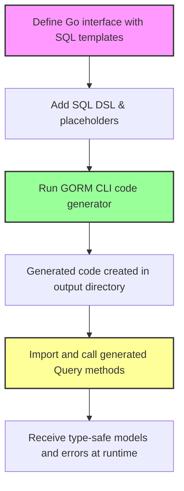

# Generating Type-Safe Query APIs

## Introduction

This guide helps you create type-safe query APIs in your Go projects by defining query interfaces with embedded SQL templates. Using GORM CLI, you translate your raw SQL annotated Go interfaces into generated code that provides compile-time safety, fluent and expressive database querying, and seamless integration with GORM.

You'll learn how to structure your query interfaces, write effective SQL templates using GORM CLI's SQL templating DSL, run the code generator, and consume the resulting type-safe query methods.


---

## 1. Overview: What This Guide Accomplishes

- **Task Description**: Define Go interfaces annotated with SQL templates that GORM CLI will convert into type-safe query APIs.
- **Prerequisites**:
  - Familiarity with Go interfaces and struct types.
  - GORM CLI installed ([see Installation guide](/getting-started/setup-installation/cli-installation)).
  - Go models defined (structs representing your database tables).
  - Basic understanding of SQL and template syntax.
- **Expected Outcome**: You will generate ready-to-use, type-safe query implementations that accept `context.Context` and return strongly typed data with error handling.
- **Time Estimate**: 15–30 minutes for initial definitions and first code generation.
- **Difficulty Level**: Intermediate — familiarity with Go interfaces and GORM ORM recommended.

---

## 2. Step-by-Step Instructions

### Step 1: Define Your Query Interface with SQL Templates

In your Go source file, create interfaces to represent query operations. Use method comments to embed raw SQL or template-based SQL queries.

**Key points:**
- Use the method's comment to write SQL with placeholders.
- Support dynamic clauses with the built-in SQL template DSL (`@@table`, `@param`, `{{where}}`, `{{set}}`, etc).
- The resulting methods should return data and error or an interface chain for further chaining.

Example:

```go
package examples

type Query[T any] interface {
  // SELECT * FROM @@table WHERE id=@id
  GetByID(id int) (T, error)

  // SELECT * FROM @@table WHERE @@column=@value
  FilterWithColumn(column string, value string) (T, error)

  // SELECT * FROM users
  //   {{if user.ID > 0}}
  //       WHERE id=@user.ID
  //   {{else if user.Name != ""}}
  //       WHERE name=@user.Name
  //   {{end}}
  QueryWith(user User) (T, error)

  // UPDATE @@table
  //  {{set}}
  //    {{if user.Name != ""}} name=@user.Name, {{end}}
  //    {{if user.Age > 0}} age=@user.Age, {{end}}
  //    {{if user.Age >= 18}} is_adult=1 {{else}} is_adult=0 {{end}}
  //  {{end}}
  // WHERE id=@id
  UpdateInfo(user User, id int) error

  // SELECT * FROM @@table
  // {{where}}
  //   {{for _, user := range users}}
  //     {{if user.Name != "" && user.Age > 0}}
  //       (name = @user.Name AND age=@user.Age AND role LIKE concat("%",@user.Role,"%")) OR
  //     {{end}}
  //   {{end}}
  // {{end}}
  Filter(users []User) ([]T, error)

  // where("name=@name AND age=@age")
  FilterByNameAndAge(name string, age int)

  // SELECT * FROM @@table
  //  {{where}}
  //    {{if !start.IsZero()}}
  //      created_at > @start
  //    {{end}}
  //    {{if !end.IsZero()}}
  //      AND created_at < @end
  //    {{end}}
  //  {{end}}
  FilterWithTime(start, end time.Time) ([]T, error)
}
```

> Notice the flexible use of SQL and templated conditional logic inside method comments.


### Step 2: Understand and Apply the SQL Template DSL

GORM CLI supports advanced templating in your SQL comments. Key directives include:

| Directive   | Purpose                                            | Example
|-------------|----------------------------------------------------|--------------------------------------------
| `@@table`   | Inserts the database table name for the model     | `SELECT * FROM @@table WHERE id=@id`
| `@@column`  | Inserts a column name dynamically                  | `WHERE @@column=@value`
| `@param`    | Maps Go method parameters to SQL parameters        | `WHERE name=@user.Name`
| `{{where}}` | Wraps conditional WHERE clauses, only including clauses if they apply | `{{where}} age > 18 {{end}}`
| `{{set}}`   | Wraps conditional SET clauses for UPDATE queries   | `{{set}} name=@name {{end}}`
| `{{if}}`    | Conditional SQL block (supports Go-like expressions) | `{{if user.Age > 0}} AND age=@user.Age {{end}}`
| `{{for}}`   | Iterates over slices or arrays for dynamic conditions | `{{for _, tag := range tags}} ... {{end}}`

Use these directives to craft readable, maintainable, and type-safe SQL queries that adapt to input data.


### Step 3: Run the GORM CLI Code Generator

Use the `gorm gen` command to process your interface file and generate the concrete query API implementation.

```bash
gorm gen -i path/to/your/file.go -o path/to/generated
```

- `-i` points to the Go file or directory containing your interfaces and models.
- `-o` is the output directory for the generated Go source files.

Upon successful generation, your specified output directory will contain generated packages with:
- Concrete query implementations matching your interfaces
- Fluent methods returning type-safe models
- Auto-injected `context.Context` parameters (if missing in your interface methods)


### Step 4: Use the Generated APIs in Your Code

After code generation, import and use the generated query interfaces. The generator creates methods that return fully typed results with embedded context.

Example usage:

```go
import (
  "context"
  "gorm.io/gorm"
  "your_module/generated"
  "your_module/models"
)

func exampleUsage(db *gorm.DB, ctx context.Context) error {
  // Query a user by ID
  user, err := generated.Query[models.User](db).GetByID(ctx, 123)
  if err != nil {
    return err
  }

  // Filter users by name and age
  users, err := generated.Query[models.User](db).FilterByNameAndAge("jinzhu", 25).Find(ctx)
  if err != nil {
    return err
  }

  // Update user info
  err = generated.Query[models.User](db).UpdateInfo(ctx, models.User{Name: "jinzhu", Age: 20}, 1)
  if err != nil {
    return err
  }

  return nil
}
```


### Step 5: Best Practices for Writing SQL Templates

- Use `@@table` to avoid hardcoding table names.
- For dynamic columns, prefer `@@column` to safely bind field names.
- Wrap optional filters inside `{{where}}` to generate clean WHERE clauses only when needed.
- Use `{{set}}` blocks for conditional UPDATE SET statements.
- Use Go-like expressions inside `{{if}}` and `{{else}}` for clear logic.
- When iterating lists, use `{{for}}` with conditions to avoid including empty filters.
- Always include `error` as the last return value in your interface methods.


### Step 6: Auto-Injected Context

If your interface method does not explicitly take `context.Context` as a parameter, GORM CLI automatically injects it into the generated method. This promotes consistent use of context and cancellation.


---

## 3. Examples & Templates

### Example 1: Simple Query Interface

```go
// SELECT * FROM @@table WHERE id=@id
GetByID(id int) (T, error)
```

### Example 2: Conditional WHERE Clause

```go
// SELECT * FROM @@table
// {{where}}
//   {{if name != ""}} name=@name {{end}}
//   {{if age > 0}} AND age=@age {{end}}
// {{end}}
FilterByNameAndAge(name string, age int) ([]T, error)
```

### Example 3: Dynamic UPDATE Statement

```go
// UPDATE @@table
// {{set}}
//   {{if user.Name != ""}} name=@user.Name, {{end}}
//   {{if user.Email != ""}} email=@user.Email {{end}}
// {{end}}
// WHERE id=@id
UpdateUser(user User, id int) error
```


### SQL Template DSL Snippet

```sql
SELECT * FROM @@table
{{where}}
  {{for _, user := range users}}
    {{if user.Name != "" && user.Age > 0}}
      (name = @user.Name AND age=@user.Age) OR
    {{end}}
  {{end}}
{{end}}
```


---

## 4. Troubleshooting & Tips

<AccordionGroup title="Common Issues & Resolutions">
<Accordion title="My generated methods don't compile due to signature mismatches">
Make sure each interface method returns either one or two values (data, error). The last return must be `error`.
</Accordion>

<Accordion title="My SQL template uses dynamic columns, but the generated SQL is incorrect">
Verify you use `@@column` and not `@column` for binding column names. Use `@param` only for values.
</Accordion>

<Accordion title="Context is missing from generated method signatures">
If you omit `context.Context` in your interface method parameters, the generator injects it automatically. To avoid confusion, consider adding `ctx context.Context` explicitly.
</Accordion>

<Accordion title="Generation output directory is incorrect or files are overwritten unexpectedly">
Use the `-o` flag explicitly or configure `genconfig.Config.OutPath` in your package to direct generated code appropriately.
</Accordion>

<Accordion title="SQL conditionals appear malformed or include extra AND/OR keywords">
Ensure you correctly apply `{{where}}` with conditional logic inside. The generator trims extraneous conjunctions automatically.
</Accordion>
</AccordionGroup>


<Tip>
Always validate generated code with sample queries and tests to ensure your SQL templates behave as expected.
</Tip>

<Note>
Leverage the preview generated code to learn how interface methods translate into concrete implementations.
</Note>

---

## 5. Next Steps & Related Documentation

- **Validating Generated APIs**: Verify your generated query methods by running sample queries and updates ([Validate Generated Code](/getting-started/first-use-validation/validate-generated-code)).
- **Writing Effective SQL Templates**: Deep dive into DSL patterns and advanced templating ([Mastering the SQL Template DSL](/guides/advanced-usage-patterns/template-sql-dsl)).
- **Configuring Generation**: Customize output and field mapping with `genconfig.Config` ([Customizing Code Generation with Configurations](/guides/advanced-usage-patterns/customizing-generation)).
- **Model-Driven Field Helpers**: Explore generated helpers for fields and associations ([Generating Model-driven Field Helpers](/guides/core-workflows/generate-field-helpers)).
- **Quickstart Workflow**: Follow the end-to-end quickstart guide for initial setup and usage ([Quickstart Workflow](/overview/features-workflows/quickstart-workflow)).


---

### Visual Workflow: Generating and Using Type-Safe Query APIs




---