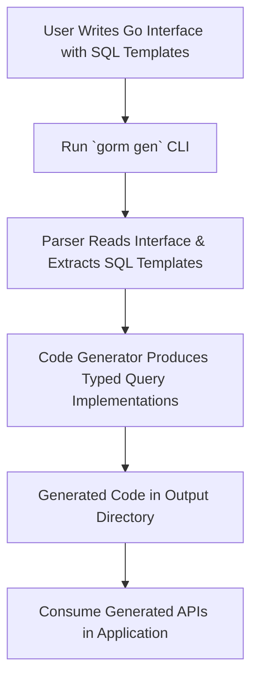

# Generating & Using Type-Safe Query APIs

---

## Workflow Overview

### What This Guide Helps You Accomplish
This guide walks you through crafting interface-driven, type-safe query APIs using SQL templates embedded in Go interfaces. You'll learn how to write expressive query methods, trigger code generation via the CLI, and use the resulting APIs to perform strong-typed `SELECT`, `UPDATE`, and other database operations seamlessly with GORM.

### Prerequisites
- Go 1.18+ installed
- Familiarity with Go interfaces and basic GORM usage
- A Go project with your models and query interfaces defined
- GORM CLI installed (`go install gorm.io/cli/gorm@latest`)

### Expected Outcome
By following this guide, you will:
- Create Go interfaces with embedded SQL templates for queries
- Use the `gorm gen` CLI command to generate type-safe query code
- Successfully integrate and call generated query methods in your application

### Estimated Time
15–30 minutes, depending on familiarity with Go and GORM

### Difficulty Level
Intermediate — assumes understanding of Go interfaces and basic GORM queries

---

## Step-by-Step Instructions

### 1. Define Your Query Interface with SQL Templates
Start by writing Go interfaces representing your queries. Annotate each method with raw SQL in method comments, using the SQL Template DSL provided by GORM CLI to bind parameters and conditionally build queries.

Example:
```go
// examples/query.go
package examples

type Query[T any] interface {
	// SELECT * FROM @@table WHERE id=@id
	GetByID(id int) (T, error)

	// SELECT * FROM @@table WHERE @@column=@value
	FilterWithColumn(column string, value string) (T, error)

	// Conditional WHERE clause example
	// SELECT * FROM @@table
	// {{where}}
	//   {{if @user.Name }} name=@user.Name {{end}}
	//   {{if @user.Age > 0}} AND age=@user.Age {{end}}
	// {{end}}
	SearchUsers(user User) ([]T, error)

	// Dynamic UPDATE example
	// UPDATE @@table
	// {{set}}
	//   {{if user.Name != ""}} name=@user.Name, {{end}}
	//   {{if user.Age > 0}} age=@user.Age, {{end}}
	//   {{if user.Age >= 18}} is_adult=1 {{else}} is_adult=0 {{end}}
	// {{end}}
	// WHERE id=@id
	UpdateUser(user User, id int) error
}
```

**Key Points:**
- Use `@@table` to reference the model's table automatically.
- Use `@param` pattern to bind Go method parameters safely.
- Apply `{{where}}`, `{{set}}`, and control structures (`{{if}}`, `{{for}}`) for dynamic SQL generation.

### 2. Organize Your Models and Interface Files
Place your model definitions and query interfaces in the same package or directory to allow the generator to pick them up correctly.

Example folder structure:
```
myapp/
  models/
    user.go
  queries/
    query.go
```

### 3. Run the GORM CLI Generator
Use the command line to generate the type-safe query implementations.

Command:
```bash
gorm gen -i ./queries -o ./generated
```

- `-i` specifies the input path for your interfaces
- `-o` specifies the output directory for generated code

**Tip:** If your package requires configuration (e.g., field mapping), include a package-level `genconfig.Config` file.

### 4. Inspect the Generated Code
After generation, the output directory will contain Go files with concrete implementations matching your interfaces.

Example generated method snippet:
```go
func Query[T any](db *gorm.DB, opts ...clause.Expression) _QueryInterface[T] {
	return _QueryImpl[T]{
		Interface: gorm.G[T](db, opts...),
	}
}

func (e _QueryImpl[T]) GetByID(ctx context.Context, id int) (T, error) {
	var sb strings.Builder
	params := make([]any, 0, 2)

	sb.WriteString("SELECT * FROM ? WHERE id=?")
	params = append(params, clause.Table{Name: clause.CurrentTable}, id)

	var result T
	err := e.Raw(sb.String(), params...).Scan(ctx, &result)
	return result, err
}
```

### 5. Use Generated Query APIs in Your Application
Import the generated package and perform queries in a type-safe manner.

Example:
```go
import (
	"context"
	"gorm.io/gorm"
	"myapp/generated"
	"myapp/models"
)

func fetchUser(db *gorm.DB, ctx context.Context, userID int) (models.User, error) {
	query := generated.Query[models.User](db)
	return query.GetByID(ctx, userID)
}

func updateUserName(db *gorm.DB, ctx context.Context, user models.User, id int) error {
	query := generated.Query[models.User](db)
	return query.UpdateUser(ctx, user, id)
}
```

**The generated methods incorporate compile-time type checking, preventing SQL injection and common mistakes while providing fluent query building.**

### Decision Points
- Choose appropriate SQL template directives for your use cases:
  - Use `{{where}}` for optional filters
  - Use `{{set}}` for dynamic update statements
- Decide if you want to include configuration overrides using `genconfig.Config` for custom field mappings or output paths.

### Verification of Success
- Generated files appear in your output directory without errors
- Methods compile and provide type signatures that match your interface definitions
- Calling generated methods executes expected SQL with proper binding

---

## Examples & Template Syntax

### Example Query Interface Method
```go
// SELECT * FROM @@table WHERE id=@id AND name = "\@name"
GetByID(id int) (T, error)
```

### Usage of Directive Keywords
| Directive   | Description                              | Example Usage                                     |
|-------------|------------------------------------------|-------------------------------------------------|
| @@table     | Resolves to the model's table name       | `SELECT * FROM @@table WHERE id=@id`             |
| @@column    | Dynamic column binding                    | `WHERE @@column=@value`                           |
| @param      | Bind Go method param to SQL safely       | `WHERE name=@user.Name`                           |
| {{where}}   | Conditional WHERE clause wrapper          | `{{where}} age > 18 {{end}}`                      |
| {{set}}     | Conditional SET clause for UPDATE         | `{{set}} name=@name {{end}}`                      |
| {{if}}      | Conditional fragment inclusion            | `{{if age > 0}} AND age=@age {{end}}`            |
| {{for}}     | Loop over slices or collections          | `{{for _, tag := range tags}} ... {{end}}`       |

### Realistic Template Example
```sql
SELECT * FROM @@table
{{where}}
    {{if @user.Name }} name=@user.Name {{end}}
    {{if @user.Age > 0}} AND age=@user.Age {{end}}
{{end}}
```

This generates a query filtering by name or age only if their values are present.

---

## Troubleshooting & Best Practices

### Common Issues
- **No generated files appear:** Confirm the input path points to the correct interface files.
- **Compile errors after generation:** Check SQL templates for syntax errors or mismatched parameters.
- **Context parameter missing:** Generator auto-injects `ctx context.Context` if absent; explicitly declare it for clarity.

### Best Practices
- Use clear, consistent naming for interfaces and methods to indicate query purpose.
- Prefer strong typing over generic `any` where possible for parameters.
- Use package-level `genconfig.Config` to customize output paths or field mappings for cleaner project structure.
- Keep templates readable; avoid complex SQL logic—move complex logic to the application if possible.

### Performance Considerations
- Generated queries prepare parameterized SQL, protecting against injection and optimizing query caching.
- Avoid overly complex template logic which might generate suboptimal SQL.

### Alternative Approaches
- If you prefer, use the model-driven field helpers for building queries dynamically instead of templates.
- Combine interface-driven APIs with GORM chaining APIs for complex filtering.

---

## Next Steps & Related Content

### What's Next
- Explore [Model-Driven Field Helper Generation](guides/core-workflows/model-driven-field-helpers) to enhance filtering and updates.
- Learn to [Use Template SQL & DSL in Custom Queries](guides/advanced-patterns/template-sql-dsl) for advanced scenarios.
- Customize code generation with [Customizing Code Generation & Field Mapping](guides/advanced-patterns/customizing-code-generation).

### Related Guides
- [Getting Started with GORM CLI](guides/core-workflows/getting-started)
- [Using the Generated APIs](getting-started/first-run-and-validation/using-generated-apis)
- [Defining Query Interfaces & Models](getting-started/first-run-and-validation/defining-interfaces-models)

### Resources
- Official [GORM CLI README](README.md) with detailed feature explanations
- [GORM Documentation](https://gorm.io) for core ORM usage

---

## Summary Diagram: Interface-Driven Query API Generation Flow



<Check>
Ensure your interfaces properly annotate SQL templates in comments and parameters match placeholders exactly.
</Check>

---