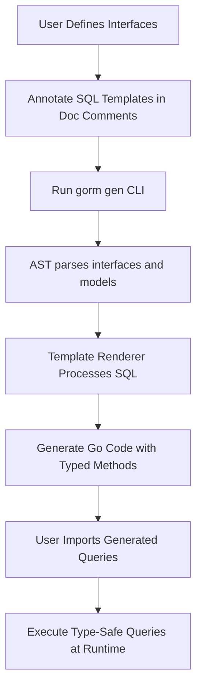

# Generating Type-Safe Query APIs

## Overview

This guide teaches you how to define Go interfaces with embedded SQL template annotations and generate type-safe, discoverable query builders using GORM CLI. By following this guide, you'll learn how to write expressive, compile-time safe query methods, handle parameter binding automatically, and leverage Go idioms such as context for safe and idiomatic APIs.

Whether you are creating simple retrieval methods or complex filtered queries, this guide breaks down the process of writing query interfaces to generate elegant and powerful APIs for your GORM-based projects.

---

## What You Will Achieve

- Define Go interface methods with SQL annotations that describe your database queries
- Generate fully-typed query builders with automatic parameter binding
- Use context-aware methods that fit idiomatic Go patterns
- Write conditional, dynamic SQL queries using the GORM CLI template DSL
- Understand how the generator transforms your interfaces into executable query method implementations

## Prerequisites

Before you begin, ensure the following:

- You have a working Go environment with Go 1.18+ installed
- GORM CLI is installed and accessible in your environment (see [Installing GORM CLI](~/getting-started/setup-installation/installing-gorm-cli))
- Your Go project is structured with defined model types and query interfaces (see [Project Setup & Structure](~/getting-started/first-steps-with-gorm-cli/project-setup))
- Basic familiarity with GORM ORM and Go generics

---

## Time Estimate

About 15-30 minutes to define interfaces, run code generation, and start using generated APIs.

## Difficulty Level

Intermediate — requires familiarity with Go interfaces, SQL, and basic template syntax.

---

# Step-by-Step Guide

<Steps>
<Step title="1. Define a Query Interface with SQL Template Annotations">
Write an interface in Go that specifies your database query operations. Annotate methods with SQL templates inside the Go doc comment immediately above each method.

- Use placeholders like `@@table` for the current model's table name.
- Use `@param` syntax to bind Go method parameters to SQL variables.
- Use template directives like `{{where}}`, `{{set}}`, `{{if}}`, and `{{for}}` for dynamic SQL building.

Example:

```go
// Query[T any] interface with annotated SQL in comments
// File: examples/query.go

type Query[T any] interface {
  // SELECT * FROM @@table WHERE id=@id AND name = "@name"
  GetByID(id int) (T, error)

  // SELECT * FROM @@table WHERE @@column=@value
  FilterWithColumn(column string, value string) (T, error)

  // SELECT * FROM users
  //   {{if user.ID > 0}}
  //       WHERE id=@user.ID
  //   {{else if user.Name != ""}}
  //       WHERE name=@user.Name
  //   {{end}}
  QueryWith(user models.User) (T, error)

  // UPDATE @@table
  //  {{set}}
  //    {{if user.Name != ""}} name=@user.Name, {{end}}
  //    {{if user.Age > 0}} age=@user.Age, {{end}}
  //    {{if user.Age >= 18}} is_adult=1 {{else}} is_adult=0 {{end}}
  //  {{end}}
  // WHERE id=@id
  UpdateInfo(user models.User, id int) error

  // SELECT * FROM @@table
  // {{where}}
  //   {{for _, user := range users}}
  //     {{if user.Name != "" && user.Age > 0}}
  //       (name = @user.Name AND age=@user.Age AND role LIKE concat("%",@user.Role,"%")) OR
  //     {{end}}
  //   {{end}}
  // {{end}}
  Filter(users []models.User) ([]T, error)

  // where("name=@name AND age=@age")
  FilterByNameAndAge(name string, age int)

  // SELECT * FROM @@table
  //  {{where}}
  //    {{if !start.IsZero()}}
  //      created_at > @start
  //    {{end}}
  //    {{if !end.IsZero()}}
  //      AND created_at < @end
  //    {{end}}
  //  {{end}}
  FilterWithTime(start, end time.Time) ([]T, error)
}
```

This interface defines various query methods with embedded parameter binding and conditional SQL.

</Step>

<Step title="2. Run the Generator to Produce Type-Safe APIs">

Invoke the GORM CLI generation command to process your interfaces and generate the corresponding query builder implementations.

Typical usage:

```bash
gorm gen -i ./examples -o ./generated
```

- `-i` specifies the input directory where your interfaces and models are defined.
- `-o` specifies the output directory for generated code.

The generator parses your Go interfaces, analyzes SQL templates, and creates type-safe, discoverable query methods.

Ensure your input directory is properly structured and includes the interfaces with SQL templates.

</Step>

<Step title="3. Use the Generated Query API in Your Application">

Import the generated package and start calling your query methods with the appropriate context and parameters.

Example usage in Go:

```go
import (
  "context"
  "gorm.io/gorm"
  "your_project/generated" // replace with your actual generated package path
  "your_project/models"
)

func FetchUserByID(db *gorm.DB, ctx context.Context, id int) (models.User, error) {
  query := generated.Query[models.User](db)
  return query.GetByID(ctx, id)
}
```

The generated methods automatically inject context if your interface method signature omits it.

</Step>
</Steps>

---

# How It Works - Template DSL Highlights

The SQL template DSL uses directives to build queries dynamically and safely:

| Directive   | Purpose                            | Description / Example                  |
|-------------|----------------------------------|-------------------------------------|
| `@@table`   | Model's table name placeholder    | Resolves to the current model's table | 
| `@@column`  | Dynamic column name binding       | Used with parameters like `@@column=@value` |
| `@param`    | Parameter binding                 | Maps method param to SQL value (e.g. `@id`) |
| `{{where}}` | Conditional WHERE block           | Only adds WHERE clause if conditions apply |
| `{{set}}`   | Conditional SET block for UPDATE | Updates fields conditionally based on values |
| `{{if}}`    | If conditional SQL fragment      | Controls SQL inclusion with boolean expressions |
| `{{for}}`   | Iteration over collection         | Builds repeated SQL fragments with loops |


### Example of Conditional WHERE Clause

```sql
SELECT * FROM @@table
{{where}}
  {{if name != ""}} name=@name {{end}}
  {{if age > 0}} AND age=@age {{end}}
{{end}}
```

When generating, this constructs a WHERE clause only if name and/or age parameters are valid.


---

# Practical Usage Examples

Here are common example query interface methods and their usage with expected generated output:

### GetByID: Simple Query with Parameter Binding

**Interface method:**

```go
// SELECT * FROM @@table WHERE id=@id AND name = "@name"
GetByID(id int) (T, error)
```

**Usage:**

```go
u, err := generated.Query[models.User](db).GetByID(ctx, 123)
```

**Expected SQL executed:**

```sql
SELECT * FROM users WHERE id=? AND name = "@name"
```

Parameters automatically bind `id = 123`.


### FilterWithColumn: Dynamic Column Query

**Interface method:**

```go
// SELECT * FROM @@table WHERE @@column=@value
FilterWithColumn(column string, value string) (T, error)
```

**Usage:**

```go
u, err := generated.Query[models.User](db).FilterWithColumn(ctx, "role", "admin")
```

Generates SQL with the column parameter dynamically set.


### QueryWith: Conditional Query Based on Struct Values

**Interface method:**

```go
// SELECT * FROM users
//   {{if user.ID > 0}}
//       WHERE id=@user.ID
//   {{else if user.Name != ""}}
//       WHERE name=@user.Name
//   {{end}}
QueryWith(user models.User) (T, error)
```

**Usage:**

```go
result, err := generated.Query[models.User](db).QueryWith(ctx, models.User{ID: 10})
```

This dynamically creates WHERE clauses depending on which fields are present.


### UpdateInfo: Dynamic Update with SET Block

**Interface method:**

```go
// UPDATE @@table
//  {{set}}
//    {{if user.Name != ""}} name=@user.Name, {{end}}
//    {{if user.Age > 0}} age=@user.Age, {{end}}
//    {{if user.Age >= 18}} is_adult=1 {{else}} is_adult=0 {{end}}
//  {{end}}
// WHERE id=@id
UpdateInfo(user models.User, id int) error
```

**Usage:**

```go
err := generated.Query[models.User](db).UpdateInfo(ctx, models.User{Name: "Alice", Age: 20}, 1)
```

The generated SQL update will include only non-empty fields with values.


### Filter: Iterative Filtering with OR Conditions

**Interface method:**

```go
// SELECT * FROM @@table
// {{where}}
//   {{for _, user := range users}}
//     {{if user.Name != "" && user.Age > 0}}
//       (name = @user.Name AND age=@user.Age AND role LIKE concat("%",@user.Role,"%")) OR
//     {{end}}
//   {{end}}
// {{end}}
Filter(users []models.User) ([]T, error)
```

This builds complex filters with multiple OR'ed conditions dynamically.


---

# Tips and Best Practices

- Always use **Go context.Context** as the first argument in your interface methods, or the generator inserts it automatically.
- Use the `@@table` and `@@column` placeholders for flexible table and column naming.
- Write SQL templates clearly and test them using your database or generated code.
- Use `{{where}}` and `{{set}}` to add conditional clauses safely and avoid SQL injection.
- For complex conditions, utilize `{{if}}` and `{{for}}` directives to construct dynamic SQL blocks.

---

# Troubleshooting

<AccordionGroup title="Common Issues in Generating Query APIs">
<Accordion title="My generated method does not compile or throws errors">
- Ensure your interface methods have return values consistent with the expected patterns:
  - At least one return value (data) and an error for queries
  - Methods generating chainable query interfaces must return the interface type
- Check that your SQL template syntax is well-formed and matches directives.
- Run `gorm gen` again with verbose output if available.
- Confirm you have proper imports and build environment.
</Accordion>
<Accordion title="Parameters not bound correctly in generated SQL">
- Verify the placeholders `@param` exactly match method parameter names.
- Ensure that complex objects used in templates provide accessible fields.
- Avoid naming conflicts in templates and use fully qualified parameter references.
</Accordion>
<Accordion title="Generated code is missing or empty">
- Confirm your input interface file is included in `gorm gen` input path.
- Verify package-level config is not excluding your interface.
- Check for parsing errors by running `go vet` or `go build`.
</Accordion>
</AccordionGroup>

---

# Next Steps

- Explore [Using Your First Generated APIs](~/getting-started/first-steps-with-gorm-cli/basic-usage-validation) to see how to integrate generated code in your app.
- Learn about advanced [Field Helpers and Filters](~/guides/core-workflows/field-helpers-and-filters) for building queries with model-driven helpers.
- Delve into [Customizing Code Generation](~/guides/advanced-patterns/customizing-generation-output) to tailor generation behavior.

---

# References

- [Project Setup & Structure](~/getting-started/first-steps-with-gorm-cli/project-setup)
- [Generating Type-Safe Query APIs CLI Guide](~/getting-started/first-steps-with-gorm-cli/generating-code)
- [Core Concepts & Terminology](~/overview/architecture-and-concepts/core-concepts-and-terminology)
- [GORM CLI Installation](~/getting-started/setup-installation/installing-gorm-cli)

---

## Diagram: Simplified Generation Workflow




---