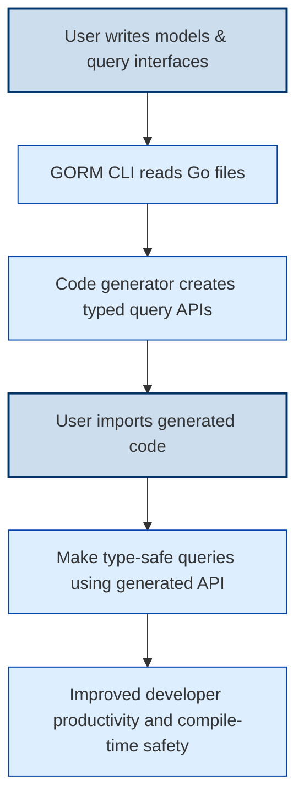

# Getting Started with GORM CLI

Welcome to the essential guide for setting up and using GORM CLI. This page walks you through installing the tool, initializing your first models and query interfaces, and successfully generating your first type-safe code. Whether you're new to GORM CLI or integrating it into an existing project, this concise tutorial gets you productive with minimal delay.

---

## 1. What You Will Achieve

By completing this guide, you will:

- Have GORM CLI installed and verified on your system.
- Understand how to organize your project for seamless generation.
- Write your first Go model struct and a corresponding query interface with SQL templates.
- Run the `gorm gen` command to generate type-safe query APIs and field helpers.
- Integrate the generated APIs into your application and perform basic queries.


## 2. Prerequisites

Before starting, ensure you have:

- Go 1.18 or newer installed on your system.
- A Go project initialized with GORM as your ORM framework.
- Basic familiarity with Go interfaces and struct types.


## 3. Installation

Install GORM CLI using Go’s install command:

```bash
go install gorm.io/cli/gorm@latest
```

Make sure your `$GOPATH/bin` or Go bin directory is in your system PATH so you can run `gorm` from any terminal.


## 4. Project Structure and Setup

Organizing your project properly ensures smooth operation of GORM CLI.

### Define Your Models
Create Go structs representing your database tables.

```go
package models

import "gorm.io/gorm"

type User struct {
  gorm.Model
  Name string
  Age  int
}
```

### Define Your Query Interfaces
In the same or nearby package, define interfaces with methods annotated by SQL templates in comments.

```go
package queries

// Query defines the query methods for T
// Use SQL templates in the method comments

type Query[T any] interface {
  // SELECT * FROM @@table WHERE id=@id
  GetByID(id int) (T, error)

  // WHERE clause with named parameters
  FilterByNameAndAge(name string, age int)
}
```

This approach tells GORM CLI how to generate type-safe query APIs that you can call directly.


## 5. Running Your First Code Generation

In your project root or module directory, run:

```bash
gorm gen -i ./path/to/your/interfaces -o ./generated
```

- `-i` specifies the path to your Go files containing model structs and query interfaces.
- `-o` is the output directory where generated code will be saved (default is `./g`).

### What to Expect
- The generator reads your interfaces and models.
- It produces Go files with type-safe query methods matching your interface specs.
- It generates model-driven field helpers for filters, updates, and associations.


## 6. Using Your First Generated APIs

Import your generated package and use the generated query APIs with your GORM database instance:

```go
import (
  "context"
  "your_project/generated"
  "gorm.io/gorm"
)

func example(db *gorm.DB, ctx context.Context) error {
  userQuery := generated.Query[models.User](db)
  user, err := userQuery.GetByID(ctx, 1)
  if err != nil {
    return err
  }
  // Use user
  return nil
}
```

You can also use model field helpers to build expressive and type-safe queries:

```go
users, err := db.Where(
  generated.User.Age.Gt(18),
  generated.User.Name.Like("%Smith%"),
).Find(ctx)
```


## 7. Best Practices for Early Success

- Keep your models and query interfaces in the same Go package or directory to ensure discovery.
- Use SQL template directives as documented (e.g., `@@table`, `@param`, `{{where}}`, `{{set}}`).
- Use the default output path `./g` or explicitly define one to keep generated files organized.
- Include `context.Context` as the first parameter in interface methods for better control.


## 8. Common Pitfalls & Troubleshooting

<AccordionGroup title="Troubleshooting Common Issues">
<Accordion title="The `gorm` command is not found after installation">
Verify your Go binary path is in your system PATH. Run `go env GOPATH` to find your bin directory (usually `$GOPATH/bin`). Add it to your PATH and restart your terminal.
</Accordion>
<Accordion title="Code generation fails with no input files found">
Make sure your `-i` path points exactly to the directory or Go files containing your query interfaces and models.
</Accordion>
<Accordion title="Generated code cannot access model types">
Ensure your models are defined in packages that the generator can import or are included in the input path. Models and interfaces should be accessible.
</Accordion>
<Accordion title="Build errors after generation">
Confirm you are using Go 1.18+ and all dependencies like GORM are installed. Also, check interface method signatures for correctness and matching SQL templates.
</Accordion>
</AccordionGroup>


## 9. Next Steps

- Explore [Project Setup & Structure](/getting-started/first-steps-with-gorm-cli/project-setup) to organize your models and interfaces efficiently.
- Move on to [Generating Type-Safe Query APIs](/guides/core-workflows/generating-type-safe-queries) to master the generation workflow.
- Learn to use [Field Helpers and Build Filters](/guides/core-workflows/field-helpers-and-filters) to leverage generated helpers.
- For integration into CI pipelines, consult [Automating Code Generation with CI](/guides/integration-and-best-practices/automation-with-ci).


---

## Appendix: Sample Minimal Workflow

```bash
# 1. Install GORM CLI
go install gorm.io/cli/gorm@latest

# 2. Create model and interface files:
mkdir example
cat > example/models.go <<EOF
package example

import "gorm.io/gorm"

type User struct {
  gorm.Model
  Name string
}
EOF

cat > example/query.go <<EOF
package example

type Query[T any] interface {
  // SELECT * FROM @@table WHERE id=@id
  GetByID(id uint) (T, error)
}
EOF

# 3. Generate code
gorm gen -i ./example -o ./generated

# 4. Use generated Query[User] in your app
```

This simple flow gets you started in under 5 minutes.


---

## Summary Diagram — User Journey




---

<Tip>
Start simple by defining a minimal model and query interface. Gradually build up your SQL templates and extend with association helpers after initial success.
</Tip>

<Note>
Use the `-i` and `-o` flags to customize input/output directories. Default output path is `./g` if not specified.
</Note>