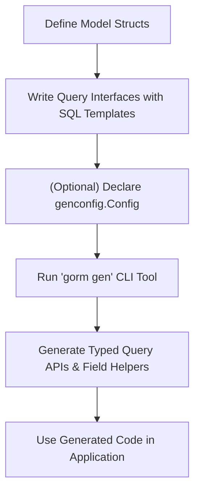

# Getting Started: Code Generation

Generate **type-safe query APIs** and **model-driven field helpers** for your GORM projects with a straightforward, practical workflow. This guide leads you step-by-step from defining your Go interfaces and models to running the GORM CLI generator and verifying your generated outputs.

---

## Workflow Overview

### What This Guide Helps You Do
Generate Go code that provides`: 
- Typed query methods based on your raw SQL-annotated interfaces
- Strongly-typed field helpers from your model structs to simplify filters, updates, and relationships

This output seamlessly integrates with GORM, enabling compile-time safety and easier maintenance.

### Prerequisites
- Go 1.18 or above installed and set up
- Basic familiarity with Go interfaces and structs
- Installed GORM CLI (`gorm.io/cli/gorm`)
- A GORM model struct defined
- SQL-annotated interface methods (optional for queries)

### Expected Outcome
- Generated Go packages containing typed query interfaces and field helpers
- Code output placed in your configured output directory
- Ready-to-use, type-safe query APIs and model-driven helpers

### Time Commitment
Approximate: 10-20 minutes from zero to first generated code, depending on your setup

### Difficulty Level
Beginner to intermediate Go developers familiar with GORM

---

## Step-by-Step Instructions

<Steps>
<Step title="Step 1: Define Your Model Struct">
Begin with defining your model struct(s), representing your database tables.

**Example:**
```go
package models

type User struct {
  ID   uint
  Name string
  Age  int
}
```

Ensure your struct fields reflect your actual database schema.

**Expected Result:** Your model struct is ready for field helper generation.
</Step>

<Step title="Step 2: Write Query Interfaces with SQL Annotations">
Create an interface defining your type-safe queries or CRUD operations, placing SQL templates in method comments.

**Example:**
```go
package examples

type Query[T any] interface {
  // SELECT * FROM @@table WHERE id=@id
  GetByID(id int) (T, error)

  // where("name=@name AND age=@age")
  FilterByNameAndAge(name string, age int)
}
```

Use the special placeholders like `@@table`, `@param` and templating directives (e.g., `{{if}}`) to write dynamic SQL templates.

**Expected Result:** Interface methods annotated with SQL templates are ready.
</Step>

<Step title="Step 3: (Optional) Add Configuration with genconfig.Config">
Customize the generation by declaring a package-level `genconfig.Config` variable with options like output paths and filters.

**Example:**
```go
package examples

import (
  "database/sql"
  "gorm.io/cli/gorm/field"
  "gorm.io/cli/gorm/genconfig"
)

var _ = genconfig.Config{
  OutPath: "examples/output", // output directory
  FieldTypeMap: map[any]any{
    sql.NullTime{}: field.Time{},
  },
  IncludeInterfaces: []any{"Query*"},
}
```

This controls what code is generated and where.

**Expected Result:** Customized code generation configured.
</Step>

<Step title="Step 4: Run the GORM CLI Generator">
Use the CLI tool to generate the code.

**Command:**
```
gorm gen -i ./path/to/your/interfaces -o ./output/path
```

Replace `-i` with the path to your interface source file or directory and `-o` with desired output directory.

The generator scans your interfaces and structs, applies any config rules, and writes generated files.

**Expected Result:** Generated source code files appear in the specified output directory.
</Step>

<Step title="Step 5: Verify Generated Code and Usage">
Check the generated files, typically named after your packages with query interfaces and field helpers.

**Example usage:**
```go
user, err := generated.Query[models.User](db).GetByID(ctx, 123)
users, err := gorm.G[models.User](db).Where(generated.User.Age.Gt(18)).Find(ctx)
```

Use the typed APIs in your application code with confidence.

**Expected Result:** Your typed query and field helper code compiles and integrates with your app.
</Step>
</Steps>

---

## Examples & Code Samples

### Basic Query Interface
```go
type Query[T any] interface {
  // SELECT * FROM @@table WHERE id=@id
  GetByID(id int) (T, error)

  // where("name=@name AND age=@age")
  FilterByNameAndAge(name string, age int)
}
```

### Model Struct
```go
package models

type User struct {
  ID   uint
  Name string
  Age  int
}
```

### Configuring Generation
```go
var _ = genconfig.Config{
  OutPath: "./generated",
  IncludeInterfaces: []any{"Query*"},
}
```

### Sample Generated Usage
```go
u, err := generated.Query[User](db).GetByID(ctx, 1)
users, err := gorm.G[User](db).Where(generated.User.Age.Gt(18)).Find(ctx)
if err != nil {
  log.Fatal(err)
}
```

---

## Troubleshooting & Tips

### Common Issues
- **No generated files appear:**
  - Confirm `-i` input path and `-o` output path are correct.
  - Check for syntax errors in your interface or config files.
  - Ensure interfaces include SQL annotations.

- **Methods missing from generated interfaces:**
  - Validate your SQL annotations are in correct comment format.
  - Check your `IncludeInterfaces` and `ExcludeInterfaces` filters.

- **Compilation errors after generation:**
  - Verify your model structs and interface match in type usage.
  - Run `go mod tidy` to update dependencies.

### Best Practices
- Use `genconfig.Config` to control generation scope and output directories.
- Prefix query interfaces consistently, e.g., `Query*` to enable filtering.
- Keep SQL templates concise and leverage templating features (`{{if}}`, `{{for}}`).
- Write your SQL as close to actual DB syntax as possible for clarity.

### Performance Considerations
- Limit generation to only needed interfaces via Include/Exclude filters to speed up runs.
- Use the `FileLevel` flag in config to confine generation per file if working with large codebases.

### Alternative Approaches
- Use package-level `genconfig.Config` for centralized control.
- Split queries and models into separate packages for cleaner organization.

---

## Next Steps & Related Content

- **Using Generated APIs in Your Application:** Learn how to leverage generated query interfaces and field helpers for CRUD operations.
- **Customizing Code Generation:** Explore advanced options for customizing generation behavior with `genconfig.Config`.
- **Writing Template-Based Queries:** Deep dive into writing expressive, maintainable SQL templates for your interfaces.
- **Working with Associations:** Understand how GORM CLI generates helpers for model relations.
- **Installation & Setup:** Revisit installation steps and prerequisites.

For navigation, see: [Getting Started Guides](../../getting-started/README.md) and [Core Workflows](../../guides/core-workflows/README.md).

---

## Visualizing the Generation Workflow



This workflow illustrates the smooth progression from your source code to generated, usable code.

---