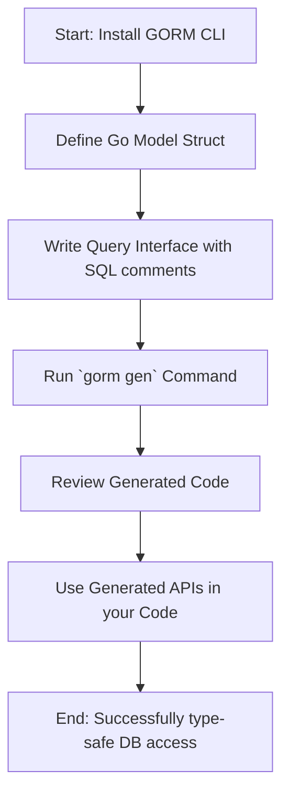

# Getting Started: Your First Generation with GORM CLI

Welcome to your hands-on introduction to GORM CLI. This guide walks you through the essential steps to install GORM CLI, define your first model and query interface, and generate your initial type-safe query APIs and field helpers. By following this workflow, you will gain direct experience in harnessing GORM CLI to produce idiomatic, compile-safe database access code.

---

## 1. Workflow Overview

### Task Description
Learn how to install GORM CLI, create a simple data model and an interface with raw SQL templates, run the code generator command, and use the outputs to perform type-safe database operations.

### Prerequisites
- Go 1.18 or later installed and configured
- Basic familiarity with Go syntax and struct definitions
- Existing Go module or project directory ready
- Your database and GORM setup prepared (optional for this initial step)

### Expected Outcome
- GORM CLI installed and runnable on your system
- A Go model and query interface declared with SQL annotations
- Generated code output in a specified directory
- Ready-to-use type-safe query APIs and field helpers

### Time Estimate
15 - 30 minutes

### Difficulty Level
Beginner

---

## 2. Step-by-Step Instructions

### Step 1: Install GORM CLI
Install GORM CLI using Go's install command.

```bash
# Install the CLI tool
 go install gorm.io/cli/gorm@latest
```

> This command installs the `gorm` binary into your Go bin directory, which must be in your PATH.

### Step 2: Define Your First Model
Create a Go struct representing your data model. Here is a simple example defining a `User` model.

```go
package models

import "gorm.io/gorm"

type User struct {
    gorm.Model
    Name string
    Age  int
}
```

> Save this in a file such as `models/user.go` inside your project.

### Step 3: Write a Query Interface with SQL Templates
Define an interface with methods documented by SQL query annotations to describe your queries.

```go
package examples

type Query[T any] interface {
    // SELECT * FROM @@table WHERE id=@id
    GetByID(id int) (T, error)
    
    // where("name=@name AND age=@age")
    FilterByNameAndAge(name string, age int)
}
```

> Place this interface in a file like `examples/query.go` alongside your models or in another package folder.

### Step 4: Run the Generator Command
Use the `gorm gen` command to generate the code for your interfaces and models.

```bash
gorm gen -i ./examples -o ./generated
```

- `-i` specifies the input directory containing your interface and model Go files.
- `-o` specifies the output directory where generated code will be written.

> This command analyzes your interfaces with SQL annotations and model structs to generate strongly typed query APIs and field helpers.

### Step 5: Verify Generated Files
Check the output directory for generated `.go` files. They will include:
- Query API implementations matching your interface methods
- Model field helpers providing fluent predicates and setters

### Step 6: Use the Generated APIs in Your Code
Here is an example showing how to use the generated code to query and manipulate `User` data safely.

```go
// Assuming generated package is imported as "generated"

// Query for user with id 123
u, err := generated.Query[models.User](db).GetByID(ctx, 123)
if err != nil {
    // handle error
}

// Query users with age > 18
users, err := gorm.G[models.User](db).
    Where(generated.User.Age.Gt(18)).
    Find(ctx)
if err != nil {
    // handle error
}
```

> This code demonstrates how generated field helpers create clear, type-safe query predicates.

---

## 3. Best Practices and Tips

- **Keep your interface methods focused:** Write one clear query or operation per method with an explicit SQL comment.
- **Use the template DSL fully:** Leverage `@@table`, `@@column`, `@param`, and conditional blocks for dynamic query building.
- **Organize code logically:** Place your interfaces and models in the same package or directory for straightforward generation.
- **Run generation often:** Regenerate your code after model or interface changes to keep APIs in sync.

---

## 4. Common Pitfalls and Troubleshooting

### Problem: `gorm gen` command not found
- Ensure your Go bin directory is in your PATH
- Confirm installation completed without errors

### Problem: No generated output or empty files
- Check your `-i` input path points to the directory containing your interfaces and models
- Confirm your interface methods contain properly formatted SQL annotations

### Problem: Build errors in generated code
- Verify your Go models use exported fields
- Confirm interfaces have correct method signatures (return error as last value)
- Ensure your Go version is 1.18 or newer

<Tip>
Use the `gorm gen -h` command to see all available flags and options.
</Tip>

---

## 5. Next Steps & Additional Resources

- **Write more complex interfaces:** Explore conditional SQL templates and use associations in your models.
- **Configure generation:** Learn about `genconfig.Config` to customize output paths, mapping, and inclusion/exclusion.
- **Use generated APIs:** Follow the guide on using generated APIs to integrate fluent queries into your application.
- **Explore association patterns:** Once comfortable, advance to managing model associations with generated helpers.

### Related Documentation
- [Writing Your First Models and Query Interfaces](../getting-started/first-steps-usage/writing-models-interfaces)
- [Generating Code with GORM CLI](../getting-started/first-steps-usage/generating-code)
- [Using the Generated APIs in Your Project](../getting-started/first-steps-usage/using-generated-apis)
- [Validating Your Installation](../getting-started/setup-installation/validating-installation)


---

## Summary Flow Diagram



---

Congratulations! You have completed your first generation workflow with GORM CLI. This foundation sets you on the path to safer, clearer database interactions with Go and GORM.


