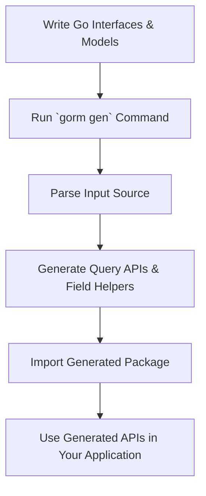

# Getting Started with GORM CLI

## Overview
This guide provides a practical, step-by-step introduction to getting started with the GORM CLI tool. You will learn how to install the CLI, write your first query interfaces with embedded SQL templates alongside Go model structs, run the code generator to produce type-safe query APIs and model helpers, and finally consume the generated APIs in your application.

Whether you are new to GORM CLI or want a quick project setup, this workflow will get you up and running with confidence.

---

## 1. Preparation: Installation & Setup

### Prerequisites
- Go 1.18 or later installed on your system.
- A Go module initialized for your project.
- Familiarity with Go basics and GORM ORM usage.

### Install GORM CLI
Run the following command to install the latest GORM CLI binary:

```bash
  go install gorm.io/cli/gorm@latest
```

This command fetches and compiles the CLI tool, installing it to your Go binary path.

<Tip>
Ensure your `$GOPATH/bin` or Go bin directory is in your system's `PATH` environment variable to run `gorm` from the terminal.
</Tip>

---

## 2. Define Your Query Interfaces and Models

The core concept behind the GORM CLI is generating type-safe query APIs from user-defined Go interfaces that contain SQL templates in method comments, alongside model structs representing your database schema.

### Step 2.1: Create your query interface
Write Go interface(s) with methods documenting raw SQL queries or SQL templates in comments. Use the specialized DSL keywords provided by GORM CLI to inject parameters and conditionally build dynamic SQL.

Example:

```go
// examples/query.go
package examples

type Query[T any] interface {
  // SELECT * FROM @@table WHERE id=@id
  GetByID(id int) (T, error)

  // where("name=@name AND age=@age")
  FilterByNameAndAge(name string, age int)
}
```

<Tip>
Use `@@table` to dynamically resolve to the model’s table name, and `@param` to bind Go method parameters safely.
</Tip>

### Step 2.2: Define your model structs
Create Go structs representing your database tables. These structs will be scanned by the generator to create strongly typed field helper variables.

Example:

```go
// examples/models/user.go
package models

type User struct {
  gorm.Model
  Name string
  Age int
}
```

<Tip>
Place your query interfaces and models either in the same package or directory for simpler generation.
</Tip>

---

## 3. Run the GORM CLI Code Generator

The `gorm` CLI offers the main `gen` command to generate the query APIs and model field helpers.

### Step 3.1: Prepare your workspace
Assuming your Go interfaces and models reside in `./examples`, and you want outputs under `./generated`:

- Ensure the interface file path (or directory) is accessible.
- Decide on your output directory (default is `./g`).

### Step 3.2: Executing the generator
Run the following command in your project root:

```bash
gorm gen -i ./examples -o ./generated
```

- `-i` or `--input`: Path to the Go file or directory containing your interfaces and models.
- `-o` or `--output`: Destination directory for generated code files.

<Tip>
The generator recursively scans the input directory tree for Go source files, parsing interfaces and structs.
</Tip>

### Step 3.3: What happens during generation
The CLI parses your Go AST, extracts interfaces and structs, applies any configuration settings found in your packages, and generates:

- Interface implementations with concrete, type-safe query methods.
- Struct variable sets providing field helpers used for fluent filtering and updating.

It creates output files mirroring your input directory structure under the specified output path.

<Tip>
By default, the output directory is `./g` if you omit the `-o` flag.
</Tip>

---

## 4. Using the Generated APIs

With code generated, you can import and call the generated query and field helper APIs in your Go application.

### Step 4.1: Import the generated package
Make sure your `go.mod` references allow importing the generated package, for example:
```go
import "yourmodule/generated"
```

### Step 4.2: Use query interfaces
Example usage of the generated query API:

```go
// Fetch user by ID
user, err := generated.Query[models.User](db).GetByID(ctx, 123)
if err != nil {
  log.Fatal(err)
}
fmt.Println(user)
```

### Step 4.3: Use model-driven field helpers for filtering and updating
Typical use of field helpers in GORM fluent queries:

```go
// Find users older than 18
users, err := gorm.G[models.User](db).
  Where(generated.User.Age.Gt(18)).Find(ctx)

// Update user name
err = gorm.G[models.User](db).
  Where(generated.User.ID.Eq(1)).
  Set(generated.User.Name.Set("alice")).
  Update(ctx)
```

<Tip>
The generated field helpers support a rich set of predicates and update operations for your model fields.
</Tip>

---

## 5. Best Practices & Tips

- Prefer placing your interface and model definitions in the same Go package or directory to simplify imports and code generation.
- Use package-level `genconfig.Config` to customize generation outputs, field mappings, and filters.
- Always run the generator after modifying your interfaces or models to keep generated code up to date.
- Use explicit context `ctx context.Context` parameters in interface methods, or let the generator add them automatically.
- Review generated code when debugging, it is human-readable and follows idiomatic Go.

---

## 6. Troubleshooting Common Issues

<AccordionGroup title="Troubleshooting Common Setup Issues">
<Accordion title="Generator fails with 'input path is required'">
Make sure you provide the `-i` flag with the correct path to your interface or directory. This flag is required.
</Accordion>
<Accordion title="Generated code does not reflect interface changes">
Ensure you saved all source files before re-running `gorm gen`. Clean your output directory if stale files persist.
</Accordion>
<Accordion title="Compilation errors after generation">
Check your interface method signatures for compliance: methods returning two values must have error as the second return type.
</Accordion>
<Accordion title="Missing or incorrect imports in generated code">
Verify your models and interfaces import paths are correct and consistent. Use `go mod tidy` to fix module dependencies.
</Accordion>
</AccordionGroup>

---

## 7. Next Steps

- Explore [Generating & Using Type-Safe Query APIs](/guides/core-workflows/generating-and-using-query-apis) to deepen query interface usage.
- Learn about [Model-Driven Field Helper Generation](/guides/core-workflows/model-driven-field-helpers) for advanced filtering and update patterns.
- Customize generation using package-level configuration via [Configuring the CLI](/getting-started/setup-essentials/configuring-cli).
- Understand association handling and relational queries in [Working with Associations & Relationships](/guides/advanced-patterns/working-with-associations).

---

## References

- Official GORM CLI GitHub repository: [gorm.io/cli/gorm](https://github.com/go-gorm/cli)
- GORM CLI README with detailed examples: https://github.com/go-gorm/cli/blob/main/README.md
- Navigation to related documentation sections available in the sidebar for next steps.

---

## Summary Diagram: Basic Workflow



---

With this guide, you are ready to begin leveraging GORM CLI to create safe, maintainable, and efficient data access layers in your Go projects.