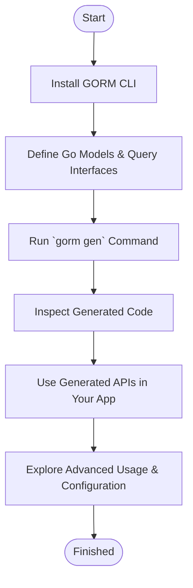

# Getting Started with GORM CLI

Welcome to your hands-on walkthrough for getting started with GORM CLI. This guide takes you from installing the tool, setting up your first project with models and query interfaces, all the way to generating and using type-safe query APIs and model helper code. You'll see tangible results early, understanding the complete workflow that transforms your Go structs and interfaces into powerful, fluent database queries.

---

## 1. Overview of the Workflow

### What This Guide Helps You Accomplish
This guide provides step-by-step instructions to:
- Install GORM CLI using Go tooling
- Write your initial Go models and query interfaces with SQL template annotations
- Run the GORM CLI generator to produce type-safe, interface-driven query code and model-driven field helpers
- Use the generated code to perform database queries and updates with compile-time safety

### Prerequisites
- Go version 1.18 or higher installed and properly configured ($GOPATH and $PATH set)
- Basic Go programming knowledge
- Familiarity with GORM ORM usage in your project
- Your project directory with models and interfaces defined (or a starter in place)

### Expected Outcome
By completing this guide, you will:
- Have GORM CLI installed locally
- Created your first query interface with raw SQL templates
- Generated Go code providing typed query helpers and field helpers
- Run example queries using the generated code safely and idiomatically

### Time Estimate
Approximately 15–30 minutes depending on familiarity with Go and project setup.

### Difficulty Level
Beginner to Intermediate – no prior experience with GORM CLI assumed.

---

## 2. Step-by-Step Instructions

### Step 1: Install GORM CLI

1. Open your terminal.
2. Ensure Go 1.18+ is installed and available in your PATH.
3. Run the command:

```bash
go install gorm.io/cli/gorm@latest
```

4. Verify installation by running:

```bash
gorm version
```

You should see the installed GORM CLI version printed.

<Check>
If you encounter errors, verify your Go installation and PATH configuration as described in the [System Requirements guide](/getting-started/prerequisites-installation/system-requirements).
</Check>

### Step 2: Define Your Models and Query Interfaces

1. **Write your model structs** in Go. For example:

```go
package models

import "gorm.io/gorm"

type User struct {
  gorm.Model
  Name string
  Age  int
}
```

2. **Define query interfaces** with SQL templates for methods. Place these interfaces in the same or a sibling package:

```go
package examples

type Query[T any] interface {
  // SELECT * FROM @@table WHERE id=@id
  GetByID(id int) (T, error)

  // WHERE name=@name AND age=@age
  FilterByNameAndAge(name string, age int) ([]T, error)
}
```

Notes:
- Use `@@table` to refer to the table linked to the model.
- Use `@param` to reference method parameters.
- You can write raw SQL or use template directives (e.g., `{{where}}`) for flexible filtering.

See [Preparing Your Models and Interfaces guide](/getting-started/first-run-basic-usage/prepare-code) for details.

### Step 3: Run the Code Generator

1. From your project root, run the generator specifying the input path (where your interfaces reside) and the output directory for generated code:

```bash
gorm gen -i ./examples -o ./generated
```

- `-i` (input) points to the directory or Go file with your query interfaces
- `-o` (output) is where the generated `.go` files will be placed

2. Upon success, you will see output messages indicating files generated.

3. Inspect the generated files inside the output directory; you should find code defining type-safe methods matching your interfaces and field helpers for your models.

<Note>
The `gen` command requires at least the input flag `-i`. The output path defaults to `./g` if not set.
</Note>

### Step 4: Use the Generated APIs in Your Code

1. Import the generated package into your application.

```go
import "your/module/generated"
```

2. Use query APIs with your GORM *gorm.DB* instance:

```go
import (
  "context"
  "gorm.io/gorm"
  "your/module/generated"
  "your/module/models"
)

func getUserByID(db *gorm.DB, ctx context.Context, id int) (*models.User, error) {
  return generated.Query[models.User](db).GetByID(ctx, id)
}
```

3. The generated code also offers field helpers:

```go
users, err := gorm.G[models.User](db).
  Where(generated.User.Age.Gt(18)).
  Find(ctx)
```

This uses a fluent, strongly typed API for querying.

<Info>
Methods in query interfaces automatically receive a `context.Context` parameter if not explicitly declared, ensuring idiomatic usage.
</Info>

### Step 5: Next Steps

- Explore customizing generation via `genconfig.Config` in your packages.
- Write more complex query interfaces using SQL templating for dynamic queries.
- Learn how to leverage generated association helpers for related data operations.

---

## 3. Practical Examples

### Example Query Interface

```go
package examples

type Query[T any] interface {
  // Get a user by ID
  // SELECT * FROM @@table WHERE id=@id
  GetByID(id int) (T, error)

  // Filter users by name and age
  // SELECT * FROM @@table WHERE name=@name AND age=@age
  FilterByNameAndAge(name string, age int) ([]T, error)
}
```

### Example Model

```go
package models

import "gorm.io/gorm"

type User struct {
  gorm.Model
  Name string
  Age  int
}
```

### Generate with CLI

```bash
gorm gen -i ./examples -o ./generated
```

### Use Generated Code

```go
u, err := generated.Query[models.User](db).GetByID(ctx, 123)
users, err := gorm.G[models.User](db).
  Where(generated.User.Name.Eq("jinzhu"), generated.User.Age.Gt(18)).
  Find(ctx)
```

---

## 4. Troubleshooting & Tips

### Common Issues

- **Generator fails to run or find interfaces**
  - Confirm the `-i` input path points to correct directory or Go source files
  - Ensure interfaces have correct SQL annotations in method comments

- **Generated code does not compile**
  - Check Go version is >=1.18
  - Make sure your models and query packages are valid Go code
  - Verify imports are resolved

- **Context parameter missing or mismatched**
  - GORM CLI auto-injects `context.Context` if missing in your interface methods; do not manually add it unless for special needs

### Best Practices

- Keep your models and query interfaces colocated when possible to aid generation
- Write descriptive SQL template comments for clarity
- Use `genconfig.Config` for tailored output locations and filtering
- Frequently regenerate code after updating models or interfaces

<Warning>
Avoid manually modifying generated files. Always update the source interface or models and regenerate code.
</Warning>

### Performance Considerations

- Large projects may benefit from package-level filtering using include/exclude rules
- Use incremental generation (via file-level config) to reduce unnecessary file rebuilds

---

## 5. Next Steps & Related Content

- Learn advanced query interface templating with [Working with Type-Safe Query APIs](/guides/core-workflows/working-with-type-safe-queries)
- Explore model field helpers and associations in [Using Model-Driven Field Helpers](/guides/core-workflows/using-model-field-helpers)
- Customize generator with the [Configuring GORM CLI guide](/getting-started/configuration-and-troubleshooting/configuring-generator)
- Troubleshoot setup or generation issues with [Troubleshooting Common Setup Issues](/getting-started/configuration-and-troubleshooting/troubleshooting-common-issues)

---

## Summary Diagram of the Getting Started Workflow



---

Congratulations on starting your journey with GORM CLI! This practical workflow sets you on the path to safer, more productive Go ORM development using automated code generation tuned to your project’s data layer.