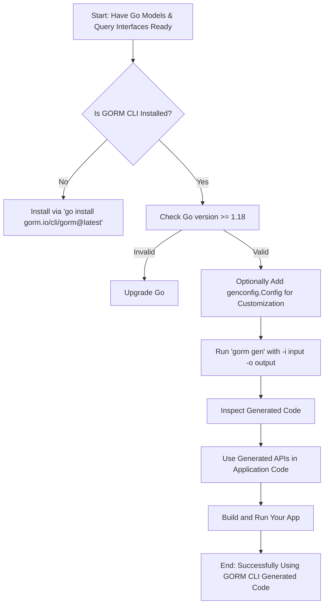

# Getting Started with GORM CLI

Welcome to your first step in mastering GORM CLI! This guide takes you on a practical journey from installation through to generating your first type-safe query APIs and model-driven field helpers. Whether you’re new to GORM CLI or looking to quickly scaffold a Go project with fluent database access, this guide will ensure you have the confidence and know-how to integrate generated code seamlessly into your applications.

---

## 1. Workflow Overview

### What This Guide Covers
- Installing GORM CLI and verifying your environment
- Structuring Go models and query interfaces for generation
- Configuring basic generation settings
- Running the `gorm gen` command to produce code
- Understanding the generated files and how to use them in your project

### Prerequisites
- Go 1.18 or later installed and configured
- Familiarity with basic Go and GORM concepts
- Your Go project initialized with models and optional query interfaces

### Expected Outcome
After this guide, you will:
- Have GORM CLI installed and ready
- Understand how to write Go interfaces with SQL annotations
- Successfully generate code that provides type-safe query methods and model field helpers
- Know how to integrate generated code and begin making fluent database queries

### Estimated Time
Around 15-30 minutes depending on familiarity with Go tooling and GORM

### Difficulty Level
Beginner to Intermediate

---

## 2. Step-by-Step Instructions

### Step 1: Install GORM CLI

1. Ensure your Go version is 1.18 or higher.
2. Install GORM CLI globally:

```bash
 go install gorm.io/cli/gorm@latest
```

3. Verify installation:

```bash
gorm --help
```

You should see usage information confirming the CLI is available.

### Step 2: Prepare Your Go Models

Organize your Go structs representing database models under appropriate packages.

Example `models/user.go`:

```go
package models

type User struct {
	ID   uint
	Name string
	Age  int
}
```

Ensure struct fields are exported and reflect your database schema.

### Step 3: Define Query Interfaces with SQL Templates

Create Go interfaces that define query methods using SQL templates in comments.

Example `examples/query.go`:

```go
package examples

type Query[T any] interface {
	// SELECT * FROM @@table WHERE id=@id
	GetByID(id int) (T, error)

	// SELECT * FROM @@table WHERE name=@name AND age=@age
	FilterByNameAndAge(name string, age int)
}
```

You can use directives like `@@table` (table name), `@param` (method parameter bindings), and templating syntax such as `{{where}}` for conditional SQL.

### Step 4: Optionally Configure Generation via `genconfig.Config`

If you want to customize, declare a configuration variable in your package.

Example configuration mapping SQL null types or custom fields:

```go
package examples

import (
	"database/sql"
	"gorm.io/cli/gorm/field"
	"gorm.io/cli/gorm/genconfig"
)

var _ = genconfig.Config{
	OutPath: "examples/output",
	FieldTypeMap: map[any]any{
		sql.NullTime{}: field.Time{},
	},
	FieldNameMap: map[string]any{
		"json": JSON{}, // For fields tagged with `gen:"json"`
	},
}
```

This step is optional but recommended for refined control.

### Step 5: Run the Code Generator

From your project root, run:

```bash
gorm gen -i ./examples -o ./generated
```

- Use `-i` to specify the input directory containing your query interfaces and model structs.
- Use `-o` to specify where to output generated Go files.

The CLI will parse your interfaces, extract SQL templates, process model structs, and write generated code.

You should see console messages confirming generated files, e.g.:

```
Generating file ./generated/examples/query_gen.go from examples/query.go...
```

### Step 6: Inspect and Integrate Generated Code

Look inside the output directory:
- Query interfaces have concrete implementations with type-safe methods matching your SQL templates.
- Model field helpers provide strongly typed predicates and setters for query building.

Example usage:

```go
u, err := generated.Query[models.User](db).GetByID(ctx, 123)
```

And for fluent queries:

```go
users, err := gorm.G[models.User](db).
	Where(generated.User.Age.Gt(18)).
	Find(ctx)
```

Integrate these generated files into your project, import appropriately, and begin coding with compile-time safety.

---

## 3. Examples & Usage Scenarios

### Example Query Interface

```go
package examples

type UserQuery[T any] interface {
	// SELECT * FROM @@table WHERE id=@id
	GetByID(id int) (T, error)

	// UPDATE @@table
	// {{set}}
	//   {{if user.Name != ""}} name=@user.Name, {{end}}
	//   {{if user.Age > 0}} age=@user.Age {{end}}
	// {{end}}
	// WHERE id=@id
	UpdateUser(user User, id int) error
}
```

### Example Model with Tag-Based Field Helper

```go
package models

// User model with a field tagged for JSON helper

type User struct {
	ID      uint
	Profile string `gen:"json"`
}
```

### Using the Generated Code

```go
// Fetch user by ID
user, err := generated.UserQuery[models.User](db).GetByID(ctx, 1)

// Update user name
err = generated.UserQuery[models.User](db).UpdateUser(ctx, models.User{Name: "Alice"}, 1)

// Query using field helpers
youngUsers, err := gorm.G[models.User](db).
	Where(generated.User.Age.Lt(30)).
	Find(ctx)
```

---

## 4. Troubleshooting & Tips

### Common Issues

- **Go Version Too Low**: Ensure Go 1.18+, or generics-based generation fails.
- **Missing SQL Template Comment**: Each interface method must have SQL template comments; missing templates cause errors.
- **File Paths Incorrect**: Use correct paths to input directories/files and valid output directories.
- **Conflicting Configurations**: Multiple package configs with overlapping rules can interfere; review `genconfig.Config` usage.

### Best Practices

- Keep your query interfaces expressive but clear; use templating directives for dynamic SQL.
- Annotate your models consistently with struct tags when using custom helpers.
- Use include/exclude filters via `genconfig.Config` to focus generation on relevant interfaces and structs.
- Regularly run the generator after interface or model changes to keep generated code in sync.

### Performance Considerations

- Large code generation runs may take longer; keep input directories scoped to what needs generation.
- Use incremental generation with narrow interface filters where possible.

---

## 5. Next Steps & Related Guides

- **Defining Models and Query Interfaces**: Learn how to write interfaces with SQL templates to maximize the power of GORM CLI.
- **Running the Code Generator**: Detailed command usage with flags and examples.
- **Using Model-Driven Field Helpers**: Understand how to leverage generated fluent methods.
- **Working with Associations**: Handle relationships with generated association helpers.
- **Customizing Code Generation with `genconfig`**: Deep dive into configuring generation behavior.

Explore these guides for progressively mastering GORM CLI workflows.

---

# Summary Diagram of the First-Time Workflow



---

# Additional References

- [Defining Models and Query Interfaces](/getting-started/first-code-generation/defining-models-and-interfaces): Writing SQL-annotated interfaces and struct models.
- [Running the Code Generator](/getting-started/first-code-generation/running-gorm-cli-gen): Command line usage and options.
- [Validation and Quick Usage](/getting-started/first-code-generation/validation-and-quick-usage): Verify and quickly start using the generated code.
- [Troubleshooting Common Setup Issues](/getting-started/first-code-generation/troubleshooting-common-issues): Solve setup or generation problems.

---

With these steps and resources, you are equipped to get up and running with GORM CLI and elevate your Go ORM code with type safety and SQL template power.


<Check>
Remember: Generation depends on clear interface SQL templates and proper Go model definitions. Always verify your environment and file paths before running `gorm gen`.
</Check>

<Tip>
To accelerate your learning, start with simple single-method interfaces and simple structs, then progressively add advanced SQL templating and relationship helpers as you grow more comfortable.
</Tip>
