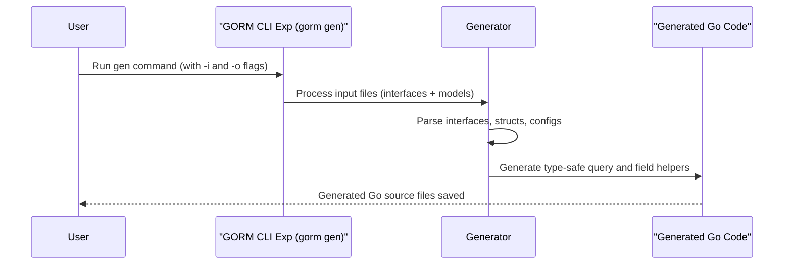

# Getting Started: Generating Queries & Field Helpers

## Workflow Overview

This guide walks you through setting up the GORM CLI code generator to produce type-safe query APIs and model-driven field helpers. You will learn how to define your Go query interfaces and model structs, run the GORM CLI generator command, and immediately leverage the generated code for safer and more productive database operations using GORM.

### Prerequisites

- Have Go version 1.18 or higher installed.
- A Go project with your model structs already defined or ready to be defined.
- Basic familiarity with Go interfaces and struct definitions.
- GORM installed and initialized in your project.

### Expected Outcome

- Generated Go code containing:
  - Type-safe query interfaces implemented for your models.
  - Fluent, strongly typed field helpers for common filter, update, and association operations.
- A working workflow where your code calls these generated APIs for safer and more expressive data queries and mutations.

### Time Estimate

Approximate completion time is 15-30 minutes for a first setup and initial generation.

### Difficulty Level

Beginner to Intermediate

---

## Step-by-Step Instructions

### Step 1: Define Your Query Interfaces and Models

Start by writing Go interfaces that represent your query operations. Annotate the methods with SQL templates in the comments to instruct the generator how to implement them.

Example:

```go
// Query interface with SQL templates
// The generic T allows reusing the interface for different models.
type Query[T any] interface {
  // SELECT * FROM @@table WHERE id=@id
  GetByID(id int) (T, error)

  // Filtering example: WHERE column equals a value
  FilterWithColumn(column string, value string) (T, error)

  // Update example with conditional set clause
  UpdateInfo(user User, id int) error
}

// Define your model struct (can be in a separate file)
type User struct {
  ID   uint
  Name string
  Age  int
}
```

### Step 2: (Optional) Configure Generation With genconfig.Config

You may define a package-level `genconfig.Config` variable to customize your generation settings such as output directory, field type mappings, and inclusion/exclusion filters.

Example:

```go
var _ = genconfig.Config{
  OutPath: "./generated",           // Override default output directory
  IncludeInterfaces: []any{"Query*"}, // Only generate interfaces starting with "Query"
  FieldNameMap: map[string]any{
    "json": JSON{},                 // Apply JSON custom helper for `gen:"json"` tagged fields
  },
}
```

Place this declaration in the package where your query interfaces reside.

### Step 3: Install the GORM CLI Tool

If you haven’t already, install the GORM CLI tool using:

```bash
go install gorm.io/cli/gorm@latest
```

This command adds the `gorm` executable to your Go bin path.

### Step 4: Run the Generator Command

Use the CLI to generate your query and field helper code. You must specify the input directory containing query interfaces and models, and optionally override the output directory.

```bash
gorm gen -i ./path/to/your/interfaces -o ./generated
```

- `-i` or `--input` (required): Path to your Go source files with interfaces and models.
- `-o` or `--output` (optional): Directory where generated code will be saved. Defaults to `./g`.

Upon running this command, you should see console logs confirming the creation of generated files.

### Step 5: Use the Generated Code in Your Project

Import your generated package, and use the generated query implementations and field helpers for compile-time safe querying and updates.

Example usage:

```go
import "your/project/generated"

// Use type-safe generated query interface
user, err := generated.Query[User](db).GetByID(ctx, 123)

// Use field helpers for filtering
users, err := gorm.G[User](db).
  Where(generated.User.Age.Gt(18)).
  Find(ctx)
```

### Step 6: Verify and Expand

Try out other generated methods and field helpers. Expand your query interfaces with additional methods using SQL templates in comments to leverage the full power of dynamic type-safe queries.

---

## Practical Examples

### Defining a Query Interface with SQL Template

```go
// Query interface with templated methods
type Query[T any] interface {
  // SELECT * FROM @@table WHERE id=@id
  GetByID(id int) (T, error)

  // Conditional WHERE clause
  //
  // SELECT * FROM @@table
  // {{where}}
  //   {{if !start.IsZero()}} created_at > @start {{end}}
  //   {{if !end.IsZero()}} AND created_at < @end {{end}}
  // {{end}}
  FilterWithTime(start, end time.Time) ([]T, error)
}
```

### Running the Generator

```bash
gorm gen -i ./examples -o ./generated
```

Expected console output:

```
Generating file ./generated/query_gen.go from ./examples/query.go...
```

### Using Generated Field Helpers

```go
users, err := gorm.G[User](db).
  Where(generated.User.Name.Like("%jinzhu%"), generated.User.Age.Between(18, 65)).
  Find(ctx)
```

This code builds a type-safe filter based on your model fields with strong compile-time guarantees.

---

## Troubleshooting & Tips

### Common Issues

- **Error:** `flag required but not set: input`

  Ensure you specify the `-i` or `--input` flag pointing to your interface directory/file.

- **Skipped files:**

  The generator skips files with `// Code generated` comments to avoid reprocessing generated outputs. Run on your source only.

- **Methods with wrong return types:**

  Generator enforces that methods returning data must have error as the last return value. Re-check your method signatures.

- **No generated files appear:**

  Check your `IncludeInterfaces` and `ExcludeInterfaces` configs; filters may exclude your interfaces unintentionally.

### Best Practices

- Place query interfaces and models in the same package or directory for simpler referencing.
- Use SQL template DSL carefully in method comments for clean and readable SQL generation.
- Use `genconfig.Config` to control output paths and fine-tune generation scope.
- Regularly review generated files to understand their structure for effective integration.

### Performance & Build Considerations

- Generated code is simple, formatted, and Go-import friendly.
- Integrate generation into your build or CI pipeline for automatic updates.
- Avoid manual edits to generated files; make changes in your source interfaces or config instead.

---

## Next Steps & Related Content

- [Working with Generated APIs in Your Project](../using-generated-apis) — Learn how to call and extend the generated query and field helper APIs effectively.
- [Advanced Code Generation Configuration](../configuring-generation) — Customize generation with detailed `genconfig.Config` settings for complex projects.
- [Defining Query Interfaces & Models](../../getting-started/project-bootstrapping/writing-query-interfaces) — In-depth guide on writing effective interfaces and models.
- [Running the Generator](../../getting-started/project-bootstrapping/basic-generation-workflow) — Step-by-step for generator usage and troubleshooting.

---

## Summary Diagram




---

## References

See also:
- [GORM CLI Installation Guide](../../getting-started/setup-installation/installing-gorm-cli)
- [Writing Query Interfaces & Models](../../getting-started/project-bootstrapping/writing-query-interfaces)
- [Using Generated APIs](../using-generated-apis)


---

# Explore more in your documentation navigation:
- [Overview: Generating Type-Safe Query APIs](../../overview/features-quicktour/query-api-generation)
- [Overview: Model-Driven Field & Association Helpers](../../overview/features-quicktour/model-field-helpers)

---

# Tips

<Tip>
Use clear and descriptive SQL templates in your interface method comments to maximize clarity and maintainability. Remember, the generator directly uses them to produce your type-safe code.
</Tip>

<Warning>
Do not edit generated files manually. All changes should be made in your source interfaces, models, or configuration files.
</Warning>

<Note>
You can define custom field helpers (e.g., JSON helpers) by mapping fields in `genconfig.Config`. This helps tailor generated helpers to your domain types.
</Note>

<Check>
Always run `gorm gen` after changing your models or query interfaces to keep generated code up-to-date.
</Check>
