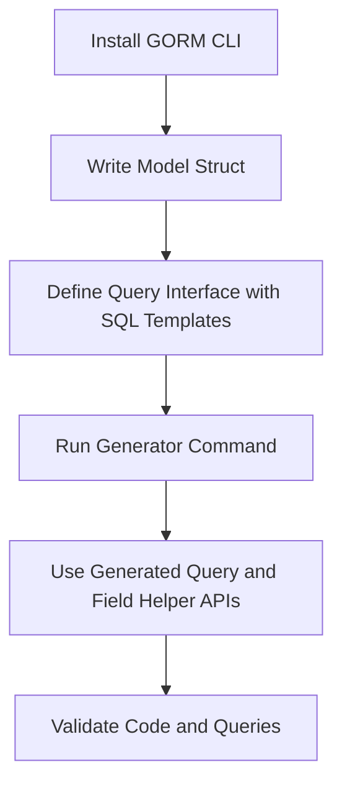

# Getting Started with GORM CLI

Welcome to your first hands-on walkthrough of GORM CLI! This guide takes you from installing the GORM CLI tool to writing your initial models and query interfaces, and finally running your first code generation command. By the end, you'll have a working project with generated, type-safe database query APIs and model-driven field helpers.

---

## Why This Guide Matters
GORM CLI transforms the way you interact with databases in Go by generating type-safe query interfaces and field helper code from your Go interfaces and model structs. This dramatically reduces boilerplate, increases compile-time safety, and creates expressive, discoverable APIs.

Here, we focus exclusively on the _Getting Started_ page workflow: installing the CLI, writing your first inputs, and generating working code.

---

## Prerequisites
Before you start, ensure you have the following:

- **Go 1.18 or later** installed and properly configured
- Familiarity with Go interfaces and structs
- Basic understanding of SQL and GORM (recommended but not required)

If you need installation help, refer to [Installing GORM CLI](/getting-started/setup-installation/cli-installation).

---

## What You'll Accomplish

By following this guide, you will:

- Install the GORM CLI executable
- Write your first Go model struct
- Define a query interface with SQL templates
- Run the generator to produce type-safe query APIs and field helpers
- Understand how to use the generated code in your project

---

## Time Commitment

Expect to spend about 15-20 minutes to complete this end-to-end setup and generation.

---

# Step-by-Step Instructions

<Steps>
<Step title="Step 1: Install the GORM CLI Tool">
Install the GORM CLI globally using the standard Go toolchain:

```bash
go install gorm.io/cli/gorm@latest
```

After installation, verify by running:

```bash
gorm --help
```

You should see the command usage and available subcommands.

<Check>Confirm Go's bin directory is in your PATH to run the CLI globally.</Check>

</Step>

<Step title="Step 2: Define Your Model Struct">
Create a Go file to hold your data model. For example, define a `User` struct:

```go
package models

import "gorm.io/gorm"

type User struct {
    gorm.Model
    Name string
    Age  int
}
```

This struct serves as the source for generating strong typed field helpers.

</Step>

<Step title="Step 3: Write a Query Interface with SQL Templates">
In the same or a related package, define an interface describing your database queries. Use Go interface methods with comments containing raw SQL and template directives.

Example:

```go
package examples

type Query[T any] interface {
    // SELECT * FROM @@table WHERE id=@id
    GetByID(id int) (T, error)

    // SELECT * FROM @@table WHERE name=@name AND age=@age
    FilterByNameAndAge(name string, age int) ([]T, error)
}
```

- The special placeholder `@@table` resolves to the model's table name.
- Parameters prefixed with `@` bind method inputs to SQL.

This interface drives the type-safe query API generation.

</Step>

<Step title="Step 4: Run the GORM CLI Code Generator">
Run the generator command to process your interface and model files:

```bash
gorm gen -i ./examples -o ./generated
```

Important flags:
- `-i` specifies your input directory or file containing interfaces and models.
- `-o` specifies where generated code should be saved.

Upon success, you'll see messages of generated Go files in `./generated`.

<Tip>
Use relative or absolute paths to clearly specify input and output locations.
</Tip>

</Step>

<Step title="Step 5: Explore and Use the Generated Code">
After generation, you will find:

- **Query API implementations**, e.g. `Query[User]` with methods `GetByID`, `FilterByNameAndAge`.
- **Model-driven field helpers**, accessible as variables, e.g. `User.Name`, `User.Age`.

Example usage:

```go
// Running queries with generated APIs
user, err := generated.Query[models.User](db).GetByID(ctx, 123)

users, err := generated.Query[models.User](db).FilterByNameAndAge(ctx, "jinzhu", 25)
```

For updates and filters, use the generated field helpers for predicate building:

```go
users, err := gorm.G[models.User](db).
    Where(generated.User.Age.Gt(18)).
    Find(ctx)
```

</Step>

<Step title="Step 6: Validate Your Setup">
Test your generated code by building and running your application or tests.

Ensure:
- Methods compile without type errors
- Queries return expected results when run against your database

If you encounter errors, revisit your SQL template syntax and model definitions.

See [Validating Generated Code](/getting-started/first-use-validation/validate-generated-code) for detailed guidance.

</Step>
</Steps>

---

# Practical Examples

### Basic Query Interface Example

```go
type Query[T any] interface {
    // SELECT * FROM @@table WHERE id=@id
    GetByID(id int) (T, error)

    // where("name=@name AND age=@age")
    FilterByNameAndAge(name string, age int)
}
```

### Sample Model Struct

```go
type User struct {
    gorm.Model
    Name string
    Age  int
}
```

### Sample Generation Command

```bash
gorm gen -i ./examples -o ./generated
```

### Using Generated Query API

```go
user, err := generated.Query[User](db).GetByID(ctx, 123)
users, err := generated.Query[User](db).FilterByNameAndAge(ctx, "jinzhu", 25)
```

---

# Troubleshooting & Tips

- **Common Issue:** CLI is not found after installation
  - Ensure your `$GOPATH/bin` or `$HOME/go/bin` directory is in your system PATH.
  - Re-run `go install` if necessary.

- **Common Issue:** Generated code fails to build
  - Check for mismatches between model fields and interface method parameters.
  - Verify SQL template comments have correct syntax with valid placeholders.
  - Ensure Go modules are enabled and dependencies are up to date.

- **Best Practices:**
  - Keep your model and query interface in the same or closely related packages for easier generation.
  - Use clear method and parameter names for easier binding.
  - Review generated code to understand its structure and extend it safely.

- **Performance Tip:**
  - Filter generated interfaces and structs using config to limit generation scope and optimize build time.

---

# Next Steps

After completing this guide, consider:

- Learning how to generate model-driven field helpers for advanced filter and update operations ([Generating Model-driven Field Helpers](/guides/core-workflows/generate-field-helpers)).
- Exploring SQL template DSL to write more complex and dynamic queries ([Mastering the SQL Template DSL](/guides/advanced-usage-patterns/template-sql-dsl)).
- Customizing generation through config files to fine-tune output and performance ([Customizing Code Generation with Configurations](/guides/advanced-usage-patterns/customizing-generation)).

Congratulations! You’re now ready to harness the power of GORM CLI for type-safe database code generation.

---

# Visual Overview of Your First Workflow



---

# References

- [Installing GORM CLI](/getting-started/setup-installation/cli-installation)
- [Validating Generated Code](/getting-started/first-use-validation/validate-generated-code)
- [Troubleshooting Setup Issues](/getting-started/first-use-validation/troubleshooting-common-issues)
- [Generating Type-Safe Query APIs](/guides/core-workflows/generate-type-safe-queries)
- [Generating Model-driven Field Helpers](/guides/core-workflows/generate-field-helpers)

---

For further help and detailed examples, visit the official GitHub repository: https://github.com/go-gorm/cli

---

Happy coding with GORM CLI!
