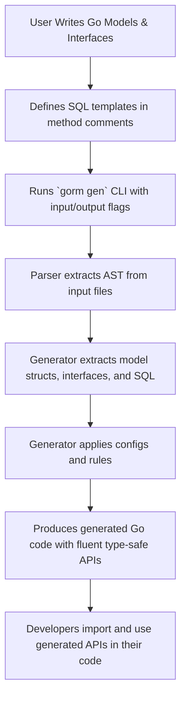

# Getting Started: Generate Your First API

Welcome to the hands-on walkthrough for creating your first fully generated, type-safe GORM API using the GORM CLI tool. This guide equips you with a practical, step-by-step workflow to define your data models and query interfaces, run the code generator, and seamlessly use the generated APIs in your Go project. By following along, you'll quickly transform your interface designs into fluent query code that integrates naturally with GORM.

---

## 1. Workflow Overview

### What You Will Accomplish
This guide helps you to:
- Define Go model structs representing your database tables.
- Write query interfaces with embedded SQL templates for desired queries.
- Run the GORM CLI generator to create type-safe, fluent query APIs based on your interfaces and models.
- Use these generated APIs directly in your Go code with full compile-time safety.

### Prerequisites
Before starting, ensure you have:
- Go 1.18 or higher installed.
- GORM CLI installed (`go install gorm.io/cli/gorm@latest`).
- A Go project set up with your models and interfaces written.
- Basic familiarity with Go generics and GORM.

### What You Will Get
By completing this workflow, you will have:
- Generated source code files in your chosen output directory, containing:
  - Fluent, type-safe query interfaces.
  - Model-driven field helpers for filters, updates, and associations.
- An improved developer experience with easily discoverable, strongly typed query methods.

### Time Estimate
Plan for about **15-30 minutes**, depending on your project's complexity and Go familiarity.

### Difficulty
Beginner to Intermediate.

---

## 2. Step-by-Step Instructions

<Steps>
<Step title="Step 1: Define Your Go Model Structs">
Start by declaring your Go structs representing database tables. For example, a simple `User` struct:

```go
package models

import "gorm.io/gorm"

type User struct {
  gorm.Model
  Name string
  Age  int
}
```

**Outcome:** Your database schema is represented as Go structs, ready for field helper generation.

**Tips:**
- Use struct tags and `gen:"..."` if you want to map special fields.
- Keep your models clean and consistent.
</Step>

<Step title="Step 2: Write Query Interfaces with SQL Templates">
Define interfaces with method signatures representing your SQL queries. Embed SQL templates as method comments using the prescribed template DSL.

```go
package examples

type Query[T any] interface {
  // SELECT * FROM @@table WHERE id=@id
  GetByID(id int) (T, error)

  // where("name=@name AND age=@age")
  FilterByNameAndAge(name string, age int)
}
```

**Outcome:** You specify exactly the queries you want, with placeholders linked to method parameters.

**Tips:**
- Use `@@table` to bind to the model's table name dynamically.
- Use `@param` to bind to Go method parameters.
- Use template directives like `{{where}}` and `{{set}}` to build dynamic SQL.
- The generator will add missing `context.Context` parameters automatically if omitted.
</Step>

<Step title="Step 3: Run the GORM CLI Generator">
Run the CLI tool to generate code based on your models and interfaces.

```bash
gorm gen -i ./examples -o ./generated
```

- `-i` points to the input directory containing your Go files with models and interfaces.
- `-o` specifies the output directory for generated code (defaults to `./g`).

If you have a `genconfig.Config` in your package, the generator considers it.

**Outcome:** You will see generated Go files with fluent query APIs and model field helpers.

**Tips:**
- Ensure your interfaces have valid SQL templates; the generator validates and fails early on syntax errors.
- Use `-o` to define output location suitable for your project structure.
- The generator merges imports and respects your config filters.
</Step>

<Step title="Step 4: Use the Generated APIs in Your Go Code">
With the generated code in place, call the generated APIs from your application code.

Example usage:

```go
// Import generated package as needed

// SELECT * FROM users WHERE id=123
u, err := generated.Query[models.User](db).GetByID(ctx, 123)
if err != nil {
  // handle error
}

// SELECT * FROM users WHERE name='jinzhu' AND age=25
users, err := generated.Query[models.User](db).FilterByNameAndAge(ctx, "jinzhu", 25).Find(ctx)
```

**Outcome:** Your queries are executed using clean, type-safe methods backed by your SQL templates.

**Tips:**
- The generated APIs are fluent; you can compose them with GORM query chains.
- Use model-driven field helpers to build filters and updates.
- The API ensures correct parameter binding and protects against SQL injection.
</Step>
</Steps>

---

## 3. Practical Examples

### Example Interface and Model from the `examples` package

#### Query Interface
```go
// Query interface with SQL comment templates
package examples

type Query[T any] interface {
  // SELECT * FROM @@table WHERE id=@id
  GetByID(id int) (T, error)

  // SELECT * FROM @@table WHERE @@column=@value
  FilterWithColumn(column string, value string) (T, error)

  // UPDATE @@table
  // {{set}}
  //   {{if user.Name != ""}} name=@user.Name, {{end}}
  //   {{if user.Age > 0}} age=@user.Age, {{end}}
  // {{end}}
  // WHERE id=@id
  UpdateInfo(user models.User, id int) error
}
```

#### User Model
```go
package models

type User struct {
  ID   int
  Name string
  Age  int
}
```

### Generated Usage Sample
```go
u, err := generated.Query[models.User](db).GetByID(ctx, 101)
if err != nil {
  log.Fatal(err)
}

// Update user info
err = generated.Query[models.User](db).UpdateInfo(ctx, models.User{Name: "janedoe"}, 101)
if err != nil {
  log.Fatal(err)
}
```

---

## 4. Troubleshooting & Best Practices

<AccordionGroup title="Common Issues and Solutions">
<Accordion title="Generator Doesn't Run, Missing Input Path">
Make sure you use the `-i` flag with correct path to the Go source files containing your interfaces and models. For example:

```
gorm gen -i ./examples
```

Without an input path, the generator will refuse to run.
</Accordion>

<Accordion title="Generated Code Not Found or Import Fails">
Verify the output path with `-o`. The generated code will be saved there, maintaining your source directory structure.

Ensure you import the generated package correctly in your Go files.
</Accordion>

<Accordion title="SQL Template Parsing Errors">
Check method comments for valid SQL template syntax:
- Use `@@table` and `@param` placeholders correctly.
- Confirm all referenced parameters exist in method signatures.
- Ensure conditional blocks like `{{if}}` `{{end}}` are properly closed.

Fix any typos or invalid constructs.
</Accordion>

<Accordion title="Missing Context Parameter">
The generator automatically adds `ctx context.Context` as the first parameter if your interface methods omit it.
If you explicitly add `ctx`, GORM CLI respects your signature intact.
</Accordion>

<Accordion title="Fields Not Generating Helpers as Expected">
Define any custom field mappings using `genconfig.Config` in your package.
Example:

```go
var _ = genconfig.Config{
  FieldNameMap: map[string]any{
    "json": JSON{},
  },
}
```

This ensures proper typing for custom or special fields.
</Accordion>
</AccordionGroup>

<Tip>
Maintain small, focused interfaces with clearly documented SQL templates to avoid complex method parsing errors.
</Tip>

---

## 5. Next Steps & Related Documentation

- [Writing Models and Query Interfaces](https://your-docs-domain/getting-started/first-steps/write-models-interfaces) — Deep dive into creating robust Go models and interface templates.
- [Generating Code for the First Time](https://your-docs-domain/getting-started/first-steps/run-generator) — Learn about CLI usage, flags, and output details.
- [Testing and Using Generated Code](https://your-docs-domain/getting-started/first-steps/validate-usage) — Validate your generated API with real tests.
- [Troubleshooting & Common Issues](https://your-docs-domain/getting-started/first-steps/troubleshooting) — Resolve issues quickly with practical advice.

For advanced capabilities, explore:
- [Building Query APIs from Interfaces](https://your-docs-domain/guides/core-workflows/query-api-guide)
- [Model-Driven Field Helpers in Action](https://your-docs-domain/guides/core-workflows/field-helper-workflows)
- [Mastering the SQL Template DSL](https://your-docs-domain/guides/real-world-patterns/template-dsl)

---

## Appendix: Understanding the Generator Workflow



This shows the linear flow from user input to generated API ready for use.

---

You are now equipped to create your first generated GORM API with confidence. Enjoy smooth, type-safe, and efficient database interactions!

---