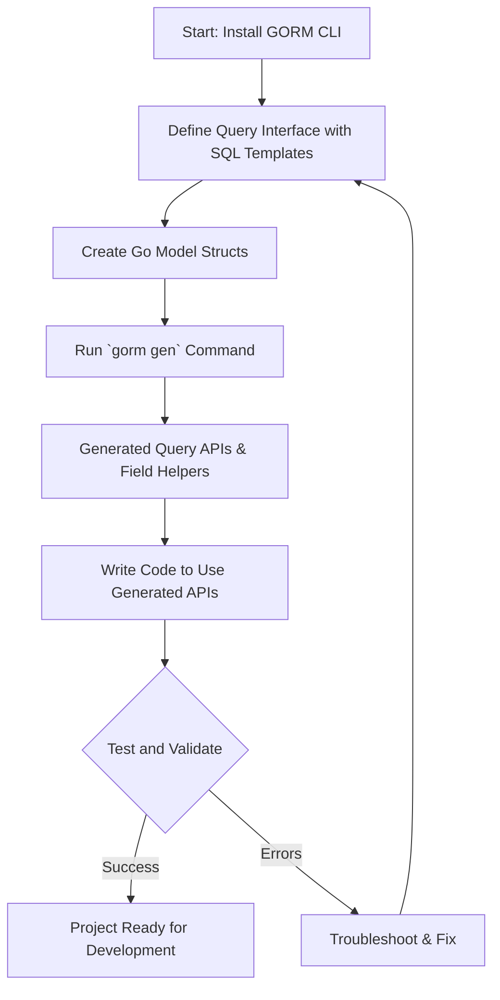

# Getting Started: Your First Code Generation

Welcome to your first hands-on journey with **GORM CLI**. This guide walks you step-by-step through installing the CLI tool, defining your query interfaces and models, running your initial code generation, and validating the results. By the end, you'll have working type-safe APIs and model-driven helpers ready to empower your Go applications with safer, more expressive database interactions.

---

## 1. Workflow Overview

### What This Guide Helps You Accomplish
You will learn how to:
- Install GORM CLI on your development machine.
- Define a Go interface with SQL templates that describe your database queries.
- Define Go model structs representing your database tables.
- Run the CLI generator command to produce type-safe code.
- Validate the generated code to ensure it integrates with your project.

### Prerequisites
- Installed Go 1.18 or higher.
- A Go project using GORM or prepared to use GORM.
- Basic understanding of Go interfaces and struct types.
- Familiarity with SQL concepts.

### Expected Outcome
By completing this guide, you will have:
- A working GORM CLI installed.
- Generated code files containing query APIs and field helpers.
- Verified functionality with test queries using the generated APIs.

### Time Estimate
Approximately 20-30 minutes from start to finish.

### Difficulty Level
Beginner to Intermediate — suitable for first-time users of GORM CLI.

---

## 2. Step-by-Step Instructions

### Step 1: Installing GORM CLI

Run the following command to install the latest GORM CLI binary:

```bash
  go install gorm.io/cli/gorm@latest
```

This command downloads and installs the executable in your Go bin directory.

<Tip>
Verify your Go environment’s `GOBIN` or `PATH` includes the directory where the binary is installed.
</Tip>

---

### Step 2: Define Your Query Interface

Create a Go interface in your project where you describe the queries you want to generate.
Use SQL templates in method comments to declaratively specify your SQL.

Example:

```go
// examples/query.go
package examples

type Query[T any] interface {
  // SELECT * FROM @@table WHERE id=@id
  GetByID(id int) (T, error)

  // WHERE name=@name AND age=@age
  FilterByNameAndAge(name string, age int) ([]T, error)
}
```

Key points:
- Use `@@table` as a placeholder for the model’s table name.
- Use `@param` to bind method parameters into the SQL.
- Wrap complex logic with `{{where}}` and `{{if}}` blocks as needed.

---

### Step 3: Define Your Model Struct

In the same package or directory, declare your Go struct models to match your database schema.

Example:

```go
// examples/models/user.go
package models

type User struct {
  ID   uint
  Name string
  Age  int
}
```

This model will serve as the data representation for your queries.

<Tip>
Keep your models simple and export fields you want accessible.
</Tip>

---

### Step 4: Run the Code Generation Command

Invoke the CLI generator on your query interface file or directory.
Specify input with `-i` and output directory with `-o`.

Example command:

```bash
gorm gen -i ./examples -o ./generated
```

This will:
- Parse query interfaces and models from `./examples`.
- Generate Go source files in `./generated` with:
  - Concrete implementations of your query interface.
  - Type-safe, fluent API methods matching your SQL templates.
  - Model-driven helpers for fields to build filters and updates.

<Tip>
If you see errors, check your Go files for correct syntax and ensure you meet prerequisites.
</Tip>

---

### Step 5: Verify the Generated Code

After generation, use the generated APIs in your Go application or tests.

Example usage:

```go
package main

import (
  "context"
  "fmt"
  "log"

  "gorm.io/driver/sqlite"
  "gorm.io/gorm"
  "generated"
  "examples/models"
)

func main() {
  ctx := context.Background()
  db, err := gorm.Open(sqlite.Open("test.db"), &gorm.Config{})
  if err != nil {
    log.Fatalf("failed to connect database: %v", err)
  }

  // Use generated query API
  q := generated.Query[models.User](db)
  user, err := q.GetByID(ctx, 1)
  if err != nil {
    log.Fatalf("query failed: %v", err)
  }

  fmt.Printf("User: %+v\n", user)
}
```

This example:
- Initializes a GORM DB connection.
- Uses your generated `Query[User]` implementation.
- Queries for user ID=1.

<Tip>
Refer to the `examples/output/query_test.go` in the source repository for full testing examples.
</Tip>

---

## 3. Real-World Examples

### Basic Query

Your interface method:

```go
// SELECT * FROM @@table WHERE id=@id
GetByID(id int) (T, error)
```

Generated usage:

```go
user, err := generated.Query[models.User](db).GetByID(ctx, 123)
```

### Filter with Multiple Parameters

```go
// where("name=@name AND age=@age")
FilterByNameAndAge(name string, age int) ([]T, error)
```

Generated usage:

```go
users, err := generated.Query[models.User](db).FilterByNameAndAge(ctx, "alice", 20)
```

---

## 4. Troubleshooting & Tips

<AccordionGroup title="Common Issues & Solutions">
<Accordion title="Installation Issues">
If the CLI is not found after installation:
- Confirm Go’s bin directory is in your system PATH.
- Run `go env GOBIN` or `go env GOPATH` to find where the binary is installed.
- Try running using the absolute path or restart your terminal.
</Accordion>
<Accordion title="Code Generation Errors">
- Ensure your interface methods contain SQL template comments as expected.
- Verify that your Go files compile and have no syntax errors.
- Check any config overrides do not exclude necessary interfaces.
- Use the `-i` flag pointing to the directory/file containing your interfaces.
</Accordion>
<Accordion title="Using Generated Code Fails">
- Confirm package imports point to the generated code output path.
- Verify that your model structs are accessible and correctly referenced.
- Ensure context.Context is provided as the first parameter for each call.
</Accordion>
</AccordionGroup>

<Tip>
Run tests with DEBUG environment variable set for verbose logs:

```bash
DEBUG=true go test ./generated/...
```
</Tip>

---

## 5. Next Steps & Related Content

- Explore [Project Configuration](../first-steps/project-configuration) to customize generation output.
- Deepen your usage with [Using Type-Safe Query APIs](../core-workflows/using-type-safe-query-apis).
- Learn the [SQL Template DSL](../../advanced-patterns/template-sql-dsl) for flexible query definitions.
- Understand [Model-Driven Field Helpers and Updates](../core-workflows/model-driven-field-helpers) for powerful struct-based operations.
- Reference [Troubleshooting Common Issues](../../troubleshooting/common-issues) for swift problem resolution.

---

## Summary Diagram: Your First Code Generation Workflow



---

Congratulations on completing your first GORM CLI code generation! You are now set up to build robust, type-safe, and maintainable database operations in Go.


---

## Appendix: Useful Snippets & Commands

### Generate code with verbose output (for debugging)

```bash
gorm gen -i ./examples -o ./generated -v
```

### Example config snippet to include only specific interfaces

```go
var _ = genconfig.Config{
  IncludeInterfaces: []any{"Query*"},
  OutPath: "./generated",
}
```

### Basic test function for your generated code

```go
func TestGeneratedGetByID(t *testing.T) {
  db := setupTestDB(t) // Your test DB setup function
  q := generated.Query[models.User](db)

  user, err := q.GetByID(context.Background(), 1)
  if err != nil {
    t.Fatalf("failed query: %v", err)
  }
  if user.ID != 1 {
    t.Errorf("expected ID 1, got %d", user.ID)
  }
}
```

---

For full examples and advanced usage, refer to the [GORM CLI GitHub repository](https://github.com/go-gorm/cli).


---

# End of Guide
