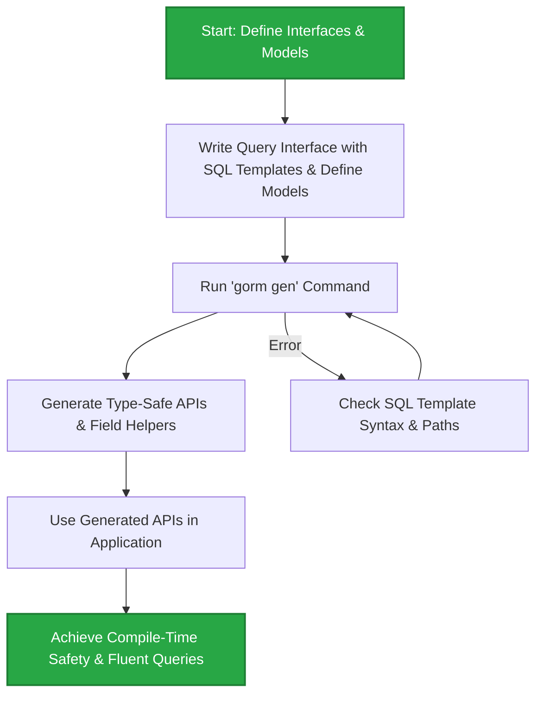

# Getting Started: Generating Type-Safe APIs

Welcome to your first step in leveraging GORM CLI’s powerful code generation capabilities. This guide walks you through installing the GORM CLI tool, defining your query interfaces and model structs, running the code generator, and using the generated, type-safe APIs immediately in your application.

By following these steps, you'll bootstrap a project that benefits from compile-time safety, fluent APIs, and significant productivity enhancements in your Go projects using GORM.

---

## 1. Workflow Overview

### What You Will Achieve
By the end of this guide, you will have:
- Installed the GORM CLI command line tool.
- Defined query interfaces using SQL templates and Go models.
- Run the GORM CLI generator (`gorm gen`) to produce type-safe query API code and field helpers.
- Integrated generated APIs directly into your Go application for safer, clearer database queries.

### Prerequisites
- Go 1.18 or higher installed and configured.
- A working Go project with GORM included.
- Basic familiarity with Go interfaces, structs, and GORM's standard ORM usage.

### Estimated Time
Approximately 15-25 minutes to complete the full setup and run a first code generation.

### Difficulty Level
Beginner to Intermediate - this guide is designed for users with some familiarity with Go but new to GORM CLI.

---

## 2. Step-by-Step Instructions

### Step 1: Install the GORM CLI Tool

The GORM CLI is a standalone binary that powers code generation.

```bash
# Install GORM CLI globally
 go install gorm.io/cli/gorm@latest
```

This command fetches and installs the latest version accessible from your `$GOPATH/bin`.

<Check>
Make sure your `$GOPATH/bin` is in your system `PATH`, so you can run the `gorm` command anywhere.
Run `gorm --help` to verify the installation.
</Check>

---

### Step 2: Define Your Query Interface and Model

GORM CLI generates code primarily from two elements:
- **Query interface:** Define your data access methods with embedded SQL templates.
- **Model structs:** Define your data schema and fields used by the generator.

Here is a minimal example to set up in your Go project:

```go
// models/user.go
package models

import "gorm.io/gorm"

type User struct {
  gorm.Model
  Name string
  Age  int
}

// queries/query.go
package queries

import (
  "time"
  "gorm.io/cli/gorm/examples/models"
)

type Query[T any] interface {
  // SELECT * FROM @@table WHERE id=@id
  GetByID(id int) (T, error)

  // SELECT * FROM @@table WHERE name=@name AND age=@age
  FilterByNameAndAge(name string, age int)

  // SELECT * FROM @@table
  // {{where}}
  //   {{if !start.IsZero()}}
  //     created_at > @start
  //   {{end}}
  //   {{if !end.IsZero()}}
  //     AND created_at < @end
  //   {{end}}
  // {{end}}
  FilterWithTime(start, end time.Time) ([]T, error)
}
```

<Tip>
The `@@table` placeholder dynamically resolves to the respective model's database table name.
Use `@param` annotations to bind method parameters safely to SQL.
</Tip>

---

### Step 3: Run the GORM Code Generator

With your interface and models ready, invoke the GORM CLI gen command.

```bash
gorm gen -i ./queries -o ./generated
```

- `-i`: Specifies the input directory or file containing the query interfaces.
- `-o`: Specifies the output directory for generated code (defaults to `./g`).

<Info>
If `-o` is omitted, the code is emitted into a default directory `./g`.
The tool recursively scans the input directory for Go files containing your interfaces and models.
</Info>

<Check>
After running, expect:
- Generated Go files containing your strongly typed API implementations.
- Field helper structs for your models to build type-safe queries, filters, and updates.
</Check>

<Warning>
If you encounter errors:
- Verify your interfaces have valid SQL template annotations.
- Make sure your Go project builds cleanly.
- Check that the input path contains your interfaces and model files.
For detailed troubleshooting, see the Troubleshooting guides.
</Warning>

---

### Step 4: Use the Generated APIs in Your Application

Import and use the generated code to perform queries safely and fluently.

Example usage:

```go
package main

import (
  "context"
  "fmt"

  "gorm.io/cli/gorm/generated" // adjust import path accordingly
  "gorm.io/gorm"
  "gorm.io/driver/sqlite"
  "gorm.io/cli/gorm/examples/models"
)

func main() {
  db, _ := gorm.Open(sqlite.Open("test.db"), &gorm.Config{})

  query := generated.Query[models.User](db)

  ctx := context.Background()

  // Fetch user by ID
  user, err := query.GetByID(ctx, 123)
  if err != nil {
    fmt.Println("Error fetching user:", err)
    return
  }
  fmt.Println("User:", user)

  // Filter by name and age
  result := query.FilterByNameAndAge("alice", 30)
  fmt.Println("Filtered result:", result)

  // Filter with time range
  from := time.Now().Add(-24 * time.Hour)
  to := time.Now()
  filteredUsers, err := query.FilterWithTime(ctx, from, to)
  if err != nil {
    fmt.Println("Error filtering users:", err)
    return
  }
  fmt.Println("Users created recently:", filteredUsers)
}
```

<Tip>
The generated Query interface implementation automatically injects `context.Context` if it is omitted in your interface definition method parameters.
</Tip>

---

## 3. Practical Tips & Best Practices

- **Organize your code:** Group your query interfaces and models logically in the same package or at least the same directory to simplify code generation.
- **Take advantage of `genconfig.Config` for customization:** You can configure output paths, field mapping, inclusion/exclusion rules by providing a package-level `genconfig.Config` value.
- **Iterate early and often:** Generate code regularly during development to catch errors quickly and integrate changes seamlessly.
- **Use field helpers for safety:** Use the generated field helpers for filters, updates, and associations instead of raw strings to gain type and compile-time safety.

---

## 4. Troubleshooting Common Issues

<AccordionGroup title="Common Problems and Solutions">
<Accordion title="CLI Not Found or Command Not Working">
Ensure that `$GOPATH/bin` is in your system's PATH environment variable.
Run `go install gorm.io/cli/gorm@latest` again to ensure the CLI is available.
Check by running `gorm --help`.
</Accordion>

<Accordion title="Generator Fails with Input Path Errors">
Verify that the `-i` path points to a directory or file containing your query interfaces.
Make sure files have valid Go code with correct SQL annotation comments.
Check file permissions.
</Accordion>

<Accordion title="Generated Code Does Not Compile">
Check that your models and interfaces are correctly defined.
Inspect generated files for error messages or malformed code.
Ensure Go modules and dependencies, including GORM, are properly installed.
</Accordion>

<Accordion title="Field Helper Mapping Issues">
When using custom types like `sql.NullTime`, ensure you map them appropriately in `genconfig.Config.FieldTypeMap` to generate correct helpers.
</Accordion>

<Accordion title="Context Not Passed to Methods">
GORM CLI automatically injects `context.Context` if omitted.
If you want to control this behavior, explicitly declare the context param in your interface methods.
</Accordion>
</AccordionGroup>

---

## 5. Next Steps & Related Documentation

- Explore **[Minimal Project Setup](../getting-started/config-gen-first-run/minimal-setup)** for organizing your initial interface and model files.
- Follow **[Generate Code: Your First Run](../getting-started/config-gen-first-run/run-generator)** for more detailed generator flags and options.
- Learn to **[Use the Generated APIs](../getting-started/config-gen-first-run/using-generated)** with practical code samples.
- Customize code generation with **[Basic Configuration with genconfig](../getting-started/config-gen-first-run/basic-configuration)**.
- For resolving errors, see **[Troubleshooting Common Issues](../getting-started/troubleshooting-faq/common-issues)**.
- Deepen your understanding of concepts in the **[Feature Summary](../../overview/core-concepts-architecture/feature-overview)** page.

---

## Diagram: Basic Workflow of API Generation



---

Thank you for starting your journey with GORM CLI. Harness these generation steps to build safer, cleaner, and more productive Go database code today!


---