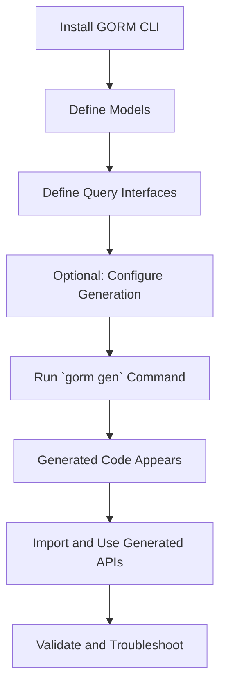

# Getting Started: Generate Your First Query API

This guide walks you through the entire process of using GORM CLI to generate your first type-safe query API. You will learn how to install the CLI, define your models and query interfaces, run the generator, and use the generated APIs in your Go project. By the end, you'll have a clear, functioning workflow to move from raw Go code annotations to a fluent, type-safe query layer.

---

## 1. Workflow Overview

### What You'll Accomplish
- Install the GORM CLI executable for your development environment.
- Define simple Go models (structs) and raw SQL query interfaces annotated with SQL templates.
- Run the GORM CLI generator to produce ready-to-use, type-safe query code and field helpers.
- Integrate and run the generated APIs in your Go application.

### Prerequisites
- Go 1.18 or newer installed and configured.
- A basic Go project setup where you can create interfaces and models.
- Familiarity with Go programming and GORM ORM basics.
- Project files arranged so that models and interfaces are accessible for generation.

### Expected Outcome
- A generated Go package containing query API implementations and field helpers.
- The ability to write type-safe, fluent queries using the generated code.
- Understanding of the simple code generation lifecycle.

### Time Commitment
Approximate duration: 15–30 minutes.

### Difficulty Level
Beginner to Intermediate (familiarity with Go programming recommended).

---

## 2. Step-by-Step Instructions

### Step 1: Install GORM CLI

1. Run the official installation command:

```bash
 go install gorm.io/cli/gorm@latest
```

2. Confirm installation by running:

```bash
gorm gen --help
```

You should see CLI usage information.


### Step 2: Define Your Models

Create your Go structs representing database tables. Example:

```go
package models

import "gorm.io/gorm"

type User struct {
  gorm.Model
  Name string
  Age  int
}
```

Save this as `models/user.go` or a similar path.


### Step 3: Define Your Query Interfaces

Create Go interfaces with method comments containing SQL templates. These define your desired query signatures and SQL logic.

Example interface `Query[T any]`:

```go
package queries

type Query[T any] interface {
  // SELECT * FROM @@table WHERE id=@id
  GetByID(id int) (T, error)

  // where("name=@name AND age=@age")
  FilterByNameAndAge(name string, age int)
}
```

Save this as `queries/query.go` or alongside your models.


### Step 4: Prepare Optional Generation Configuration (Optional)

In your package, you can optionally provide a `genconfig.Config` variable to control:
- Output directory (`OutPath`)
- Interface/model inclusion or exclusion
- Field helper mappings

Example:

```go
package queries

import "gorm.io/cli/gorm/genconfig"

var _ = genconfig.Config{
  OutPath: "./generated",
  IncludeInterfaces: []any{"Query*"},
}
```


### Step 5: Run the Code Generator

Execute the CLI to process interfaces and models, generating the query APIs and field helpers.

```bash
gorm gen -i ./queries -o ./generated
```

- `-i` specifies the input directory or file containing your query interfaces.
- `-o` specifies the output directory for generated code (defaults to `./g`).

You should see generated `.go` files appear under `./generated`.


### Step 6: Use the Generated Query APIs

Import the generated code and use it with your GORM `*gorm.DB` instance.

Example usage:

```go
import (
  "context"
  "generated" // replace with your generation module path
  "gorm.io/gorm"
)

func Example(db *gorm.DB) error {
  ctx := context.Background()
  user, err := generated.Query[models.User](db).GetByID(ctx, 1)
  if err != nil {
    return err
  }
  fmt.Println("User name:", user.Name)
  return nil
}
```

This calls the type-safe, generated query method that executes your SQL with parameter binding.


### Step 7: Validate Your Setup

Run your application and verify:
- Generated code compiles without errors.
- Queries execute successfully returning data or updating rows.

Troubleshoot typical issues if you encounter errors (see troubleshooting section).

---

## 3. Practical Examples

### Complete Interface Example

```go
package examples

type Query[T any] interface {
  // SELECT * FROM @@table WHERE id=@id
  GetByID(id int) (T, error)

  // SELECT * FROM @@table WHERE @@column=@value
  FilterWithColumn(column string, value string) (T, error)

  // UPDATE @@table
  // {{set}}
  //   {{if user.Name != ""}} name=@user.Name, {{end}}
  //   {{if user.Age > 0}} age=@user.Age {{end}}
  // {{end}}
  // WHERE id=@id
  UpdateInfo(user models.User, id int) error
}
```

### CLI Command Example

```bash
gorm gen -i ./examples -o ./generated
```

### Using With GORM

```go
user, err := generated.Query[models.User](db).GetByID(ctx, 123)
users, err := generated.Query[models.User](db).FilterWithColumn(ctx, "name", "jinzhu")
err := generated.Query[models.User](db).UpdateInfo(ctx, models.User{Name: "jinzhu", Age: 20}, 1)
```

---

## 4. Troubleshooting & Best Practices

<AccordionGroup title="Common Issues and Solutions">
<Accordion title="CLI Installation Problems">
- Ensure Go 1.18+ is installed.
- Verify your `GOPATH/bin` is in your system `PATH`.
- Use `go install gorm.io/cli/gorm@latest` to install.
</Accordion>
<Accordion title="Generation Errors - Input Issues">
- Ensure interfaces have correct SQL template comments.
- Validate that model structs and interfaces are in accessible packages.
- Check your `-i` input path points to correct files/directories.
- Required flags like `-i` must be specified.
</Accordion>
<Accordion title="Compilation Failures After Generation">
- Confirm your project imports the generated package paths correctly.
- Check for naming conflicts or missing dependencies.
- Make sure your Go modules are tidy and updated.
</Accordion>
<Accordion title="Unexpected SQL or Runtime Errors">
- Review your SQL templates for syntax errors.
- Verify the placeholders correspond exactly to method parameters.
- Use template DSL directives carefully (e.g., @@table, @param).
</Accordion>
</AccordionGroup>

### Best Practices
- Keep models and interfaces logically organized to ease generation and maintenance.
- Use the `genconfig.Config` to finely control generation scope.
- Regularly regenerate after major model or interface changes.
- Use context-aware supplied generated APIs to keep cancellation and tracing effective.

---

## 5. Workflow Diagram



---

## 6. Next Steps & Related Documentation

- After generating your first query API, proceed to [Validate Usage and Run Queries](/getting-started/first-run-and-validation/validate-usage) to confirm and experiment with your generated code.
- Explore [Defining Models and Query Interfaces](/getting-started/first-run-and-validation/create-models-and-interfaces) for advanced query template techniques.
- Consult the [Troubleshooting Common Issues](/getting-started/troubleshooting-and-help/troubleshooting-common-issues) guide if you encounter setup or runtime problems.
- To customize generation behaviors, see [Configuration Basics](/getting-started/setup-and-installation/configuration-basics) and [Customizing Code Generation](/guides/advanced-patterns/customizing-generation).

---

By following this guide, you establish a solid foundation with GORM CLI, enabling rapid development of type-safe, maintainable, and powerful database query layers integrated tightly with GORM ORM.