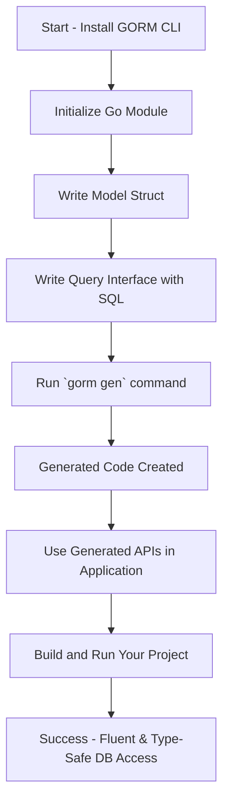

# Getting Started with GORM CLI

Welcome to your step-by-step companion guide for getting started with the GORM CLI. This guide walks you through installing the tool, setting up a new Go project with models and query interfaces, generating your first type-safe code, and understanding how the generated files are organized. By the end, you'll confidently harness the power of GORM CLI to produce fluent and maintainable database layers with minimal effort.

---

## 1. Overview

### What You Will Accomplish
- Install the GORM CLI tool using the Go toolchain.
- Initialize a new Go project ready for GORM CLI code generation.
- Define your first GORM model struct and query interface with embedded SQL.
- Run the code generator (`gorm gen`) to produce type-safe query APIs and field helpers.
- Understand the generated directory and file structure to quickly integrate into your codebase.

### Prerequisites
- Go 1.18 or higher installed and properly configured on your system.
- Basic familiarity with Go modules and standard Go project layout.
- A terminal or command prompt with access to the internet to download the `gorm.io/cli/gorm` package.

### Expected Outcome
Following this guide will produce generated Go code:
- Concrete, type-safe query interfaces with embedded SQL bindings.
- Model-based field helpers for filtering, updating, and association management.

These generated APIs enable fluent, compile-time safe database operations built on top of GORM.

### Estimated Time
Approximately 15-30 minutes depending on familiarity with Go environment.

### Difficulty Level
Beginner to Intermediate — the guide is designed for developers new to GORM CLI but comfortable with basic Go development.

---

## 2. Step-by-Step Instructions

### Step 1: Install the GORM CLI Tool
1. Ensure you have [Go 1.18+ installed](https://go.dev/doc/install).
2. Run the installation command:

```bash
go install gorm.io/cli/gorm@latest
```

3. Confirm the CLI is in your system PATH by running:

```bash
gorm version
```
If you see version information, the tool is successfully installed.

<Tip>
If you encounter a "command not found" after installation, make sure your `$GOPATH/bin` or Go install root is included in your system PATH.
</Tip>

### Step 2: Initialize a New Go Module for Your Project
In your project directory, run:

```bash
mkdir mygormproject && cd mygormproject
go mod init github.com/yourusername/mygormproject
```

This sets up a clean workspace with module enabled.

### Step 3: Write Your First Model
Create a Go source file (e.g., `models/user.go`) and define a simple GORM model struct:

```go
package models

import "gorm.io/gorm"

type User struct {
  gorm.Model
  Name string
  Age  int
}
```

### Step 4: Create a Query Interface with Embedded SQL Templates
In the same package or directory, define a query interface that uses SQL templates in method comments. For example, `queries/user_query.go`:

```go
package models

type Query[T any] interface {
  // SELECT * FROM @@table WHERE id=@id
  GetByID(id int) (T, error)

  // where("name=@name AND age=@age")
  FilterByNameAndAge(name string, age int)
}
```

Note:
- SQL templates use directives like `@@table` to refer to your model’s table.
- Placeholders such as `@id`, `@name` map automatically to method parameters.

### Step 5: Run GORM CLI Code Generation
Back in your project root, run the generator command:

```bash
gorm gen -i ./models -o ./generated
```

- `-i` specifies the input directory containing your interfaces and models.
- `-o` specifies the output directory for generated code.

You should see console output like:

```
Generating file generated/user.go from models/user_query.go...
```

The `generated` folder now contains:
- Type-safe implementations of your query interfaces.
- Strongly typed field helpers based on your model structs.

### Step 6: Use the Generated Code in Your Application
In your application code, import the generated package and use the fluent APIs:

```go
import (
  "context"
  "gorm.io/gorm"
  "mygormproject/generated"
)

func example(db *gorm.DB) error {
  ctx := context.Background()

  // Retrieve user by ID
  user, err := generated.Query[models.User](db).GetByID(ctx, 123)
  if err != nil {
    return err
  }

  // Filter users by name and age
  err = generated.Query[models.User](db).FilterByNameAndAge("alice", 25).Find(ctx, &user)
  if err != nil {
    return err
  }

  return nil
}
```

### Step 7: Understand the Generated Directory Structure
- `generated/` (or your custom output path) contains generated `.go` files matching your interface files.
- Each generated file declares:
  - Query interface implementations named after your interfaces.
  - Global struct variables representing field helpers for your models.

Files preserve relative paths from input to output for clarity in larger projects.

---

## 3. Practical Example

Suppose you have the following files:

**models/user.go**
```go
package models

import "gorm.io/gorm"

type User struct {
 gorm.Model
 Name string
 Age int
}
```

**models/user_query.go**
```go
package models

type Query[T any] interface {
 // SELECT * FROM @@table WHERE id=@id
 GetByID(id int) (T, error)

 // where("name=@name AND age=@age")
 FilterByNameAndAge(name string, age int)
}
```

**Run generator**
```bash
gorm gen -i ./models -o ./generated
```

**Generated query usage**
```go
user, err := generated.Query[models.User](db).GetByID(ctx, 1)
if err != nil {
  // handle error
}
```

This minimal workflow demonstrates how GORM CLI transforms your Go interfaces into robust, ready-to-use database querying code.

---

## 4. Troubleshooting Tips

<AccordionGroup title="Common Issues and Solutions">
  <Accordion title="`gorm` command not found after install">
    Verify that `$GOPATH/bin` or your Go bin directory is included in your system PATH environment variable.
  </Accordion>
  <Accordion title='Generation command fails with "input must be a Go file or directory"'>
    Make sure the path supplied with `-i` points to a valid directory or `.go` file containing your interfaces and models.
  </Accordion>
  <Accordion title="Generated code does not reflect recent interface changes">
    Try cleaning the output directory or running `gorm gen` with a fresh output folder. Also, verify interface method signatures comply with expected forms (returning `(T, error)` or similar).
  </Accordion>
  <Accordion title="Error: 'finish method must return at least one value' when generating">
    Confirm that any method in your interface with a raw SQL template comment returns at least one value (usually a data struct and/or an `error`).
  </Accordion>
  <Accordion title="Ambiguous or multiple output directories after generation">
    Explicitly use `-o <dir>` to select your output directory. Avoid relying on defaults if multiple configurations are in play.
  </Accordion>
</AccordionGroup>

### Best Practices
- Keep models and interfaces in the same package or directory for straightforward generation.
- Use consistent naming conventions for your interfaces (e.g., prefix interfaces with `Query` to aid inclusion via config).
- Validate generated code promptly to catch schema or interface mismatches early.
- Use configuration files (`genconfig.Config`) sparingly at first and expand as your project complexity grows.

---

## 5. Next Steps & Additional Resources

- After mastering this guide, explore [Building Type-Safe Queries with Interfaces](https://your.documentation/guides/core-workflows/type-safe-queries) to deepen your understanding of template-based SQL DSL.
- Learn how to use [Model-Driven Field Helpers](https://your.documentation/guides/core-workflows/field-helpers) for intuitive filtering and association management.
- Consult [Configuring the Generator](https://your.documentation/getting-started/configuration/generator-configuration) to customize code generation for advanced scenarios.
- Review [Validating Your Generated APIs](https://your.documentation/getting-started/validation/validating-generated-code) to test and verify your generated code.
- For troubleshooting, see [Troubleshooting Common Issues](https://your.documentation/getting-started/validation/troubleshooting).

You can always return to this guide or the related quickstart and overview pages to stay grounded as your usage expands.

---

## Appendix: Summary Mermaid Diagram of Workflow



---

This guide sets the foundation for effective and efficient use of GORM CLI. Welcome to powerful, idiomatic Go ORM development!


---

## References & Links

- [GORM CLI Official GitHub Repository](https://github.com/go-gorm/cli)
- [Installing GORM CLI](https://your.documentation/getting-started/setup/installing-gorm-cli)
- [Quickstart Workflow](https://your.documentation/overview/integration-getting-started/quickstart-workflow)
- [Project Setup & Model Definition](https://your.documentation/getting-started/configuration/project-setup)
- [Configuring the Generator](https://your.documentation/getting-started/configuration/generator-configuration)
- [Running the Generator](https://your.documentation/getting-started/configuration/generating-code)
- [Validating Your Generated APIs](https://your.documentation/getting-started/validation/validating-generated-code)
- [Troubleshooting Common Issues](https://your.documentation/getting-started/validation/troubleshooting)


---

_Last updated with GORM CLI `main` branch as of 2024-06._