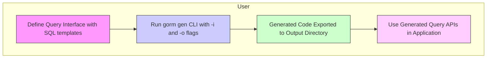

# Quickstart: Generating Type-Safe Query APIs

## Workflow Overview

This guide empowers you to write Go interfaces enriched with embedded SQL templates, run the GORM CLI generator to produce fully type-safe query API implementations, and perform database queries with compile-time guarantees. You will get hands-on with defining your first query interface, invoking the CLI generation tool, and using the generated APIs practically.

### Prerequisites

- Go 1.18 or higher (for generics support)
- Your Go project set up with GORM ORM and your model structs
- Basic familiarity with defining Go interfaces
- GORM CLI installed (`go install gorm.io/cli/gorm@latest`)

### Expected Outcome

By following this guide, you will:
- Create raw SQL-annotated Go interfaces for query definitions
- Generate concrete, type-safe query APIs and field helpers
- Execute queries and updates using generated code that integrates seamlessly with GORM

### Time Estimate

Approximately 15–30 minutes for initial setup and first run

### Difficulty Level

Beginner to Intermediate — perfect for users with basic Go and GORM knowledge

---

## Step-by-Step Instructions

<Steps>
<Step title="Step 1: Define Your Query Interface with SQL Templates">
Start by writing an interface in Go that embeds raw SQL as templated comments. This interface represents your desired queries with type-safe method signatures.

For example, create a `Query` interface with data retrieval and update methods:

```go
// examples/query.go
package examples

type Query[T any] interface {
  // SELECT * FROM @@table WHERE id=@id
  GetByID(id int) (T, error)

  // SELECT * FROM @@table WHERE @@column=@value
  FilterWithColumn(column string, value string) (T, error)

  // Dynamic conditional query example
  QueryWith(user models.User) (T, error)

  // UPDATE example using conditional SET clauses
  UpdateInfo(user models.User, id int) error
}
```

Make sure your methods include descriptive comments containing your SQL queries using the GORM CLI's SQL templating DSL.

After defining the interface, ensure the accompanying model structs (e.g., `User`) are defined accordingly.

</Step>

<Step title="Step 2: Run the GORM CLI Generator">
Use the `gorm gen` CLI command to generate the query API implementations and field helpers.

Example command:

```bash
gorm gen -i ./examples -o ./generated
```

- `-i` specifies the input directory containing your interfaces and models
- `-o` specifies where generated code will be placed

The generator will parse your interfaces' SQL template comments and produce concrete implementations you can call from your application.

If you need to customize generation (e.g., exclude certain interfaces), use package-level `genconfig.Config` declarations in your source code.

</Step>

<Step title="Step 3: Import and Use the Generated Query APIs">
Once generated, import the generated package and start using the typed APIs in your Go application.

Example usage:

```go
import (
  "context"
  "gorm.io/gorm"
  "your_project/generated"
  "your_project/examples/models"
)

func exampleUsage(db *gorm.DB) error {
  ctx := context.Background()

  // Fetch user by ID
  user, err := generated.Query[models.User](db).GetByID(ctx, 123)
  if err != nil {
    return err
  }

  // Filter users by a dynamic column
  result, err := generated.Query[models.User](db).FilterWithColumn(ctx, "name", "jinzhu")
  if err != nil {
    return err
  }

  // Update user info
  err = generated.Query[models.User](db).UpdateInfo(ctx, models.User{Name: "newname", Age: 30}, 123)
  if err != nil {
    return err
  }

  return nil
}
```

This code is now fully type-safe and has compile-time verification of the queries you defined.

</Step>

</Steps>

---

## Practical Examples

### Example Interface `Query[T any]` with SQL Templates

```go
package examples

type Query[T any] interface {
  // SELECT * FROM @@table WHERE id=@id
  GetByID(id int) (T, error)

  // SELECT * FROM @@table WHERE @@column=@value
  FilterWithColumn(column string, value string) (T, error)

  // Dynamic query with conditional filters
  QueryWith(user models.User) (T, error)

  // Update with conditional SET clauses
  UpdateInfo(user models.User, id int) error
}
```

### Running the Generator

Run:

```bash
gorm gen -i ./examples -o ./generated
```

### Using Generated APIs

```go
// Fetch by ID
user, err := generated.Query[models.User](db).GetByID(ctx, 123)

// Filter by column dynamically
result, err := generated.Query[models.User](db).FilterWithColumn(ctx, "email", "user@example.com")

// Update a user
err = generated.Query[models.User](db).UpdateInfo(ctx, models.User{Name: "Alice"}, 123)
```

These calls use the strongly typed generated code, minimizing runtime errors.

---

## Tips and Best Practices

- **Use SQL Templates Consistently:** Follow the template DSL syntax carefully in method comments to enable correct code generation.
- **Keep Models and Interfaces Together:** Define your model structs and query interfaces in the same package or directory for better generator discovery.
- **Use Context Parameters:** Include `context.Context` in your method signatures if you wish to control request lifecycles explicitly; the generator injects them automatically if omitted.
- **Configure Generation with `genconfig.Config`:** Use package-level configurations to customize generated code locations, mappings, inclusions, and exclusions.

---

## Troubleshooting

<Accordion title="Generator Fails to Recognize Interfaces or Structs">
Check if your interfaces and model structs are correctly located under the input directory (`-i` flag).

Confirm no conflicting `genconfig.Config` filters exclude your interfaces or types unintentionally.

</Accordion>

<Accordion title="SQL Template Syntax Errors or Missing Bindings">
Verify that SQL templates in comments use the correct placeholder syntax `@param`, `@@table`, `{{where}}`, and other directives exactly as documented.

Improper syntax will cause code generation errors or incomplete method bodies.

</Accordion>

<Accordion title="Generated Code Does Not Compile">
Ensure your Go environment is running version 1.18+ and GORM and its dependencies are properly installed.

Make sure you import the generated package correctly and call methods with the expected signatures.

</Accordion>

---

## Next Steps & Related Content

- Explore the [Generating and Using Model Field Helpers](https://your-docs/guides/core-workflows/guide-field-helpers) guide to automatically generate field-level helpers for advanced filtering and updates.
- Learn more about [Template-Driven Query Interfaces](https://your-docs/guides/advanced-patterns/guide-sql-templates) for powerful dynamic SQL constructions.
- Customize generation behavior with the [genconfig.Config](https://your-docs/guides/advanced-patterns/guide-genconfig) guide.
- Refer to [First Code Generation](https://your-docs/getting-started/quickstart-validation/first-code-generation) for detailed execution of the CLI.

---

## Summary Diagram



---

# References
- [GORM CLI README - Quick Start Section](https://github.com/go-gorm/cli#quick-start)
- See the [Template DSL](https://github.com/go-gorm/cli#template-based-queries) for SQL comment syntax examples
- Visit [Generating and Using Model Field Helpers Guide](https://your-docs/guides/core-workflows/guide-field-helpers)
- Explore [Configuration Setup](https://your-docs/getting-started/introduction-setup/configuration-setup) for customizing generation

---

Happy coding with fully type-safe, fluent database queries powered by GORM CLI!