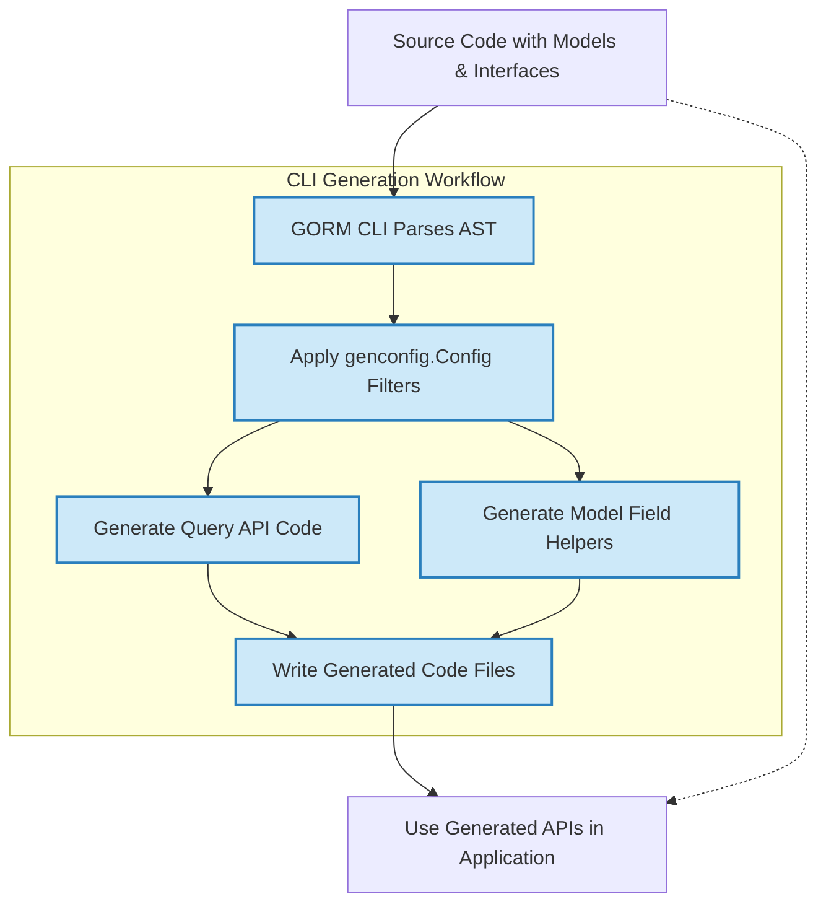

# Typical Workflow: From Models to Generated Code

## Workflow Overview

### Task Description
This guide walks you through the typical workflow of preparing your Go source code with models and query interfaces, running the GORM CLI code generator, and integrating the generated type-safe query APIs and field helpers into your application. You will learn how to structure your directory, configure the CLI tool, manage output locations, and incorporate generated code for seamless database operations.

### Prerequisites
- Installed GORM CLI (requires Go 1.18+), following the [Installation guide](https://gorm.io/cli/gorm/getting-started/introduction-setup/installation).
- Basic Go models defined using GORM ORM conventions.
- Query interfaces with embedded SQL templates in your codebase.
- Optional: package-level or file-level `genconfig.Config` setup to customize generation behavior.

### Expected Outcome
By completing this workflow, you will have generated:
- Type-safe, interface-driven query APIs based on your annotated Go interfaces.
- Fluent, strongly-typed field helper variables derived from your model structs.

You will be able to use these generated components in your application to perform compile-time checked, readable, and maintainable database queries and updates.

### Time Estimate
Approximately 10-30 minutes depending on the size of your codebase and familiarity with the CLI.

### Difficulty Level
Beginner to Intermediate (programmers familiar with Go and GORM)

---

## Step-by-Step Instructions

### 1. Organize Your Go Source Files

Your source directory should include:
- **Model Structs**: Define your data models as Go structs, typically embedded with `gorm.Model` or contain appropriate GORM tags.
- **Query Interfaces**: Define Go interfaces in the same package or directory with methods commented using SQL templates for generating query APIs.
- **Optional Configuration Files**: Place a package-level `genconfig.Config` variable if you want to customize generation (e.g., output path, field mappings, inclusions/exclusions).

**Example directory layout:**

```text
/project-root
   /models
       user.go   # Model structs
   /queries
       query.go  # Query interfaces with SQL templates
       config.go # Optional genconfig.Config
```

### 2. Prepare Query Interfaces and Models

Ensure your interfaces use SQL templates in comments accurately describing the intended database operations.

Example from a query.go file:

```go
package queries

type Query[T any] interface {
  // SELECT * FROM @@table WHERE id=@id
  GetByID(id int) (T, error)

  // WHERE name=@name AND age=@age
  FilterByNameAndAge(name string, age int)
}
```

Define your models accordingly:

```go
package models

type User struct {
  gorm.Model
  Name string
  Age  int
}
```

### 3. (Optional) Configure Generation Behavior

Add a `genconfig.Config` variable in your package to override defaults:

- Control output directory per package or file
- Map specific Go field types or `gen` tags to field helper types
- Include or exclude certain interfaces or structs from generation

Example config.go:

```go
package queries

import "gorm.io/cli/gorm/genconfig"

var _ = genconfig.Config{
    OutPath: "./generated",
    IncludeInterfaces: []any{"Query*"},
    ExcludeStructs: []any{"InternalDTO"},
}
```

### 4. Run the GORM CLI Generator

Use the CLI `gen` command to process your input directory and emit generated code:

```bash
gorm gen -i ./queries -o ./generated
```

- `-i` or `--input`: Path to the Go package directory or file containing your interfaces and models.
- `-o` or `--output`: Destination directory for the generated Go files.

On execution, the CLI:
- Parses Go files recursively under the input path.
- Applies filters from any discovered `genconfig.Config` configs.
- Processes Go interfaces with annotated SQL templates generating type-safe query methods.
- Generates model-based field helpers for filtered querying and CRUD operations.
- Writes formatted Go code preserving relative directory structure in the output directory.

Example CLI output:
```
Generating file ./generated/queries/query_gen.go from /path/to/queries/query.go...
```

### 5. Review Generated Code

The generated code typically contains:
- Query interface implementations with methods mapped to your SQL templates.
- Variables corresponding to your model structs exporting typed field helpers.

Example snippet:

```go
var User = struct {
  ID   field.Number[int64]
  Name field.String
  Age  field.Number[int]
}{
  ID:   field.Number[int64]{}.WithColumn("id"),
  Name: field.String{}.WithColumn("name"),
  Age:  field.Number[int]{}.WithColumn("age"),
}
```

### 6. Integrate the Generated APIs into Application Logic

Use the generated query API and field helpers to build safe and fluent database queries.

Example usage:

```go
user, err := generated.Query[models.User](db).GetByID(ctx, 1)
if err != nil {
  // handle error
}

users, err := gorm.G[models.User](db).
  Where(generated.User.Age.Gt(18)).
  Find(ctx)
```

### 7. Maintain Generated Code

- Generated files should not be manually edited; treat them as outputs.
- Always re-run `gorm gen` after making interface or model changes.
- Use `genconfig.Config` to fine-tune what is generated and where.

---

## Practical Tips and Best Practices

- **Consistent Package Layout**: Group your models and corresponding query interfaces under consistent Go packages or directories for simpler config and generation.
- **Gradual Onboarding**: Start with one or a few interfaces for generation, then expand coverage once comfortable.
- **Config Overrides**: Use `FieldTypeMap` and `FieldNameMap` in genconfig to handle special types like `sql.NullTime` or custom JSON fields.
- **Version Control**: Commit generated code to version control to keep history and aid in debugging.
- **Avoid Mixing Manual and Generated Code**: Separate your business logic from generated files clearly.

---

## Troubleshooting Common Issues

<AccordionGroup title="Typical Problems and Solutions">
<Accordion title="No Generated Files After Running CLI">
- Ensure the input path contains interfaces with properly commented SQL templates.
- Confirm `genconfig.Config` does not exclude all interfaces or structs accidentally.
- Run with verbose CLI logging for insight.
</Accordion>
<Accordion title="Errors Parsing Go Files or Interfaces">
- Make sure your Go code compiles and is free of syntax errors.
- Verify comments with SQL templates strictly follow the annotation patterns.
- Confirm Go generics are used with Go 1.18 or newer.
</Accordion>
<Accordion title="Generated Code with Missing Fields or Methods">
- Check that the config filters (Include/Exclude) are not too restrictive.
- Confirm that your model struct fields are exported (start with uppercase).
- Look for anonymous embeddings that might affect field discovery.
</Accordion>
</AccordionGroup>

### Additional Tips

- To customize generation for only a single Go file rather than the whole package, set `FileLevel` to `true` in `genconfig.Config`.
- You can exclude entire packages or subdirectories by placing config files with exclusion rules.
- Periodically clean your output directory to avoid stale code before running generation.

---

## System Architecture Diagram



---

## Next Steps & Related Content

- Explore [Quickstart: Generating Type-Safe Query APIs](https://gorm.io/cli/gorm/guides/core-workflows/guide-quickstart) to learn in-depth about crafting query interfaces.
- Learn about [Generating and Using Model Field Helpers](https://gorm.io/cli/gorm/guides/core-workflows/guide-field-helpers) for better data manipulation.
- Review [Customizing Generation with genconfig.Config](https://gorm.io/cli/gorm/guides/advanced-patterns/guide-genconfig) for advanced scenarios.
- Validate your setup with the [First Code Generation guide](https://gorm.io/cli/gorm/getting-started/quickstart-validation/first-code-generation).
- Check the [Troubleshooting Common Issues](https://gorm.io/cli/gorm/getting-started/quickstart-validation/troubleshooting-common-issues) page if problems arise.


<Check>
After completing this workflow, your project will benefit from safer, clearer, and more maintainable database querying patterns using GORM CLI-generated code.
</Check>
