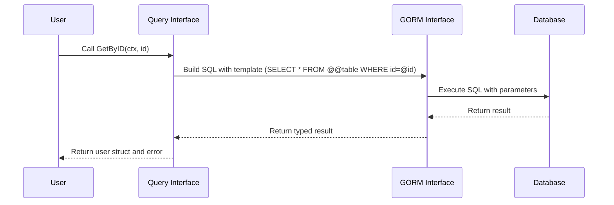

# Building Type-Safe Queries with Interfaces

Unlock the full power of GORM CLI by defining query interfaces embedded with SQL templates. This hands-on guide walks you through crafting interface-driven queries that produce robust, type-safe, and maintainable database access methods using GORM CLI's templating DSL.

---

## Workflow Overview

### What You Will Accomplish
This guide will help you define Go interfaces that encapsulate SQL queries using GORM CLI’s template DSL. You will generate precise, type-safe query APIs that integrate seamlessly with your models and GORM’s core APIs.

### Prerequisites
- Basic understanding of Go interfaces and generics.
- GORM CLI installed and configured in your Go development environment.
- Models defined as Go structs representing your database tables.
- Familiarity with SQL.

### Expected Outcome
- Go interfaces annotated with SQL query templates.
- Generated type-safe implementations accessible through fluent Go APIs.
- Ability to write powerful, custom queries via method calls with automatic parameter binding.

### Estimated Time
20-30 minutes for initial interface creation and first generation.

### Difficulty Level
Intermediate—familiarity with Go and SQL templating required.

---

## Step-by-Step Instructions

### 1. Define Your Query Interface
Create a Go interface that describes your queries. Use method comments to embed raw SQL templates and GORM CLI’s templating directives.

```go
// Query[T any] defines type-safe query methods for model T
// SQL templating guides the code generator.
type Query[T any] interface {
  // SELECT * FROM @@table WHERE id=@id
  GetByID(id int) (T, error)

  // SELECT * FROM @@table WHERE @@column=@value
  FilterWithColumn(column string, value string) (T, error)

  // Conditional WHERE clauses using {{if}} and parameter fields.
  // SELECT * FROM @@table
  //   {{if user.ID > 0}}
  //       WHERE id=@user.ID
  //   {{else if user.Name != ""}}
  //       WHERE name=@user.Name
  //   {{end}}
  QueryWith(user models.User) (T, error)

  // Dynamic UPDATE with {{set}} and conditionals
  // UPDATE @@table
  //  {{set}}
  //    {{if user.Name != ""}} name=@user.Name, {{end}}
  //    {{if user.Age > 0}} age=@user.Age, {{end}}
  //    {{if user.Age >= 18}} is_adult=1 {{else}} is_adult=0 {{end}}
  //  {{end}}
  // WHERE id=@id
  UpdateInfo(user models.User, id int) error

  // Iteration and conditional filtering over slices
  // SELECT * FROM @@table
  // {{where}}
  //   {{for _, user := range users}}
  //     {{if user.Name != "" && user.Age > 0}}
  //       (name = @user.Name AND age=@user.Age AND role LIKE concat("%",@user.Role,"%")) OR
  //     {{end}}
  //   {{end}}
  // {{end}}
  Filter(users []models.User) ([]T, error)

  // Simple where clause using shorthand
  // where("name=@name AND age=@age")
  FilterByNameAndAge(name string, age int)

  // Filtering by time range using zero-value checks
  // SELECT * FROM @@table
  //  {{where}}
  //    {{if !start.IsZero()}}
  //      created_at > @start
  //    {{end}}
  //    {{if !end.IsZero()}}
  //      AND created_at < @end
  //    {{end}}
  //  {{end}}
  FilterWithTime(start, end time.Time) ([]T, error)
}
```

### 2. Understand Template DSL Directives

Your comments support these DSL features:

| Directive   | Description                                  | Example Usage                                   |
|-------------|----------------------------------------------|------------------------------------------------|
| `@@table`   | Inserts the model’s database table name     | `SELECT * FROM @@table WHERE id=@id`            |
| `@@column`  | Inserts a dynamic column name                | `WHERE @@column=@value`                          |
| `@param`    | Maps Go method parameters to SQL parameters | `WHERE name=@user.Name`                          |
| `{{where}}` | Conditional WHERE clause wrapping             | `{{where}} age > 18 {{end}}`                     |
| `{{set}}`   | Conditional UPDATE SET clause                  | `{{set}} name=@name {{end}}`                     |
| `{{if}}`    | Conditionals inside template                   | `{{if age > 0}} AND age=@age {{end}}`           |
| `{{for}}`   | Iterate collections in params                  | `{{for _, user := range users}}...{{end}}`      |

### 3. Generate the Query API

Run the generation command pointing to your source file or package containing the interfaces:

```bash
gorm gen -i ./examples -o ./generated
```

- `-i` specifies the input package or file with your interfaces.
- `-o` sets the output directory for generated code.

### 4. Use Generated Query APIs

The generator produces concrete implementations accessible via functions named after your interfaces:

```go
// Fetch user by ID with type safety
user, err := generated.Query[User](db).GetByID(ctx, 123)

// Filter users by name and age
users, err := generated.Query[User](db).FilterByNameAndAge("jinzhu", 25).Find(ctx)

// Update user information
err = generated.Query[User](db).UpdateInfo(ctx, User{Name: "jinzhu", Age: 20}, 1)
```

### 5. Verify Correct Usage

- Generated methods bind Go parameters safely.
- Complex SQL with conditionals and loops compiles into fluent Go code.
- Generated code integrates into the usual GORM DB workflows.

---

## Practical Examples

### Example Interface Method with Conditional WHERE
```go
// SELECT * FROM @@table
// {{where}}
//   {{if user.Name != ""}} name=@user.Name {{end}}
//   {{if user.Age > 0}} AND age=@user.Age {{end}}
// {{end}}
SearchUsers(user User) ([]T, error)
```

*This method generates a SQL SELECT with conditional filters on `Name` and `Age` fields only when parameters are provided.*

### Using a Dynamic Column Parameter
```go
// SELECT * FROM @@table WHERE @@column=@value
FilterWithColumn(column string, value string) (T, error)
```

*Here, the column name is dynamic and determined at runtime, useful for flexible queries.*

### Generic Update Using Set Clause
```go
// UPDATE @@table
// {{set}}
//   {{if user.Name != ""}} name=@user.Name, {{end}}
//   {{if user.Age > 0}} age=@user.Age, {{end}}
//   {{if user.Age >= 18}} is_adult=1 {{else}} is_adult=0 {{end}}
// {{end}}
// WHERE id=@id
UpdateInfo(user User, id int) error
```

*This method conditionally updates fields based on input values, showcasing powerful templated SQL updates.*

---

## Troubleshooting & Tips

<AccordionGroup title="Common Issues">
<Accordion title="Methods Not Generated">
Ensure your interface methods have SQL templates documented as method comments. Missing or invalid SQL templates will cause no code generation.
</Accordion>
<Accordion title="SQL Template Syntax Errors">
Check for unclosed `{{if}}`, `{{for}}`, or mismatched directives. Templates must be well-formed to generate compile-ready code.
</Accordion>
<Accordion title="Unexpected SQL Parameters">
Verify that all parameters referenced (e.g., `@user.Name`) exist in your method signature. Typo or missing parameters cause generation failures.
</Accordion>
</AccordionGroup>

<Tip>
Use meaningful method names reflecting the query intent. Clear names improve maintainability and readability in large projects.
</Tip>

<Tip>
Start with simple queries and extend to conditional and iterative templates as you gain confidence with the DSL.
</Tip>

<Warning>
Do not embed unsafe raw SQL or unescaped strings. Always use parameter placeholders (`@param`) to prevent injection.
</Warning>

---

## Next Steps & Related Content

- Review [Using Field Helpers for Filters, Updates, and Ordering](https://gorm.io/docs/concepts/field-helpers) to combine interface queries with model helpers.
- Explore [Handling Associations](https://gorm.io/docs/core-works/working-with-associations) for more complex relationship queries.
- Customize generation via `genconfig.Config` detailed in [Generation Configuration](https://gorm.io/docs/concepts/generation-configuration).
- Validate your generated code with [Validate Your First Generated Code](https://gorm.io/docs/getting-started/first-run/quick-validation) to ensure correctness.

---

## Summary Diagram



---

## Code Reference

You can find relevant example interfaces and generated code in the [GORM CLI GitHub repository examples directory](https://github.com/go-gorm/cli/tree/main/examples).

<Source url="https://github.com/go-gorm/cli" paths={[{"path": "examples/query.go", "range": "1-80"}]} branch="main" />