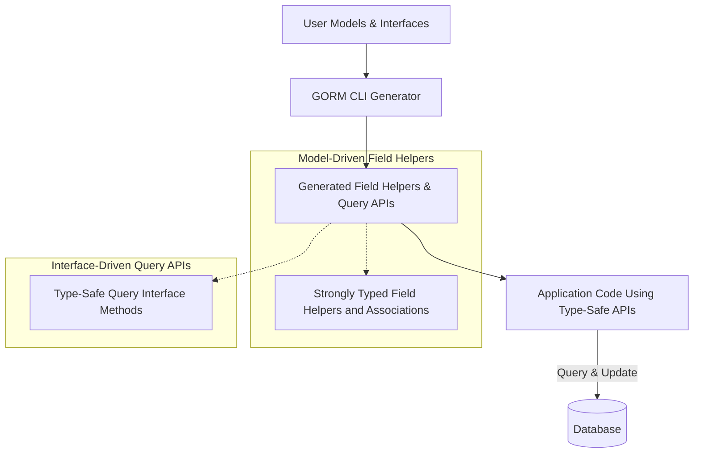

# Model-Driven Field Helper Generation

This guide explains how the GORM CLI generates model-driven field helpers from your Go model structs. These helpers empower you to build robust, type-safe queries and updates with compile-time guarantees, improving reliability and developer productivity.

---

## 1. What Are Model-Driven Field Helpers?

Model-driven field helpers are auto-generated Go variables and methods derived from your model structs. They provide fluent, strongly typed functionality for:

- Building query predicates (filters)
- Setting values for create and update operations
- Handling associations and relationships

These helpers ensure compile-time safety and maximize discoverability within your IDE or editor.

---

## 2. Prerequisites

Before working with model-driven field helpers:

- Define your Go model structs with exported fields representing your database schema.
- Install GORM CLI (`go install gorm.io/cli/gorm@latest`) and have Go 1.18+ to support generics.
- Have your project configured to run the generator with model definitions in place.

---

## 3. Expected Outcome

By following this guide, you'll be able to:

- Generate field helpers for your models using GORM CLI.
- Use generated helpers to construct type-safe query predicates and update expressions.
- Leverage association helpers for related model operations such as create, update, unlink, and delete.

---

## 4. How GORM CLI Generates Field Helpers

### Input Source

The generator introspects your Go model structs — including embedded structs and tag annotations — to identify fields and their types.

### Output Structure

For each model, GORM CLI creates a corresponding variable (e.g., `User`) as a struct containing field helpers per model field.

**Example snippet from generated code:**

```go
var User = struct {
    ID        field.Number[uint]
    Name      field.String
    Age       field.Number[int]
    Profile   examples.JSON
    Pets      field.Slice[models.Pet]
    Account   field.Struct[models.Account]
}{
    ID:        field.Number[uint]{}.WithColumn("id"),
    Name:      field.String{}.WithColumn("name"),
    Age:       field.Number[int]{}.WithColumn("age"),
    Profile:   examples.JSON{}.WithColumn("profile"),
    Pets:      field.Slice[models.Pet]{}.WithName("Pets"),
    Account:   field.Struct[models.Account]{}.WithName("Account"),
}
```

### Basic Field Helpers

For each basic field (`int`, `string`, `bool`, `time.Time` and compatible types), helpers are generated with:

- Predicate builders (e.g., `.Eq()`, `.Like()`, `.Between()`)
- Value setters (e.g., `.Set()`)
- Update expressions (e.g., `.Incr()`, `.SetExpr()`)

**Example usage:**

```go
// Filtering users where age > 18
users, err := gorm.G[User](db).Where(generated.User.Age.Gt(18)).Find(ctx)

// Incrementing age by 1 for name == 'alice'
gorm.G[User](db).
  Where(generated.User.Name.Eq("alice")).
  Set(generated.User.Age.Incr(1)).
  Update(ctx)

// Creating a new user with zero-values and flags
gorm.G[User](db).
  Set(
    generated.User.Name.Set("alice"),
    generated.User.Age.Set(0),
    generated.User.IsAdult.Set(false),
  ).
  Create(ctx)
```

### Handling Named and Custom Field Types

You can configure the generator to map certain Go types or struct tags to custom field helper types (e.g., JSON fields) using `genconfig.Config`.

**Example JSON field helper mapping:**

```go
var _ = genconfig.Config{
  FieldNameMap: map[string]any{
    "json": JSON{},
  },
}

// model
Profile string `gen:"json"` // this field will use the JSON helper
```

---

## 5. Working with Associations

Association fields like `has one`, `has many`, `belongs to`, and `many2many` generate specialized helpers:

- `field.Struct[T]` for single related structs
- `field.Slice[T]` for multiple related structs

These association helpers expose operations like:

- `Create`: create and link related models
- `CreateInBatch`: batch create and link related models
- `Update`: update associated rows with optional filters
- `Unlink`: remove association links (nullify foreign keys or remove join rows)
- `Delete`: delete associated rows or join rows

**Example usage:**

```go
// Create user with one pet
gorm.G[User](db).
  Set(
    generated.User.Name.Set("alice"),
    generated.User.Pets.Create(generated.Pet.Name.Set("fido")),
  ).
  Create(ctx)

// Update a user's pet named 'fido' to 'rex'
gorm.G[User](db).
  Where(generated.User.ID.Eq(1)).
  Set(generated.User.Pets.Where(generated.Pet.Name.Eq("fido")).Update(generated.Pet.Name.Set("rex"))).
  Update(ctx)

// Unlink all pets from user with ID=1
gorm.G[User](db).
  Where(generated.User.ID.Eq(1)).
  Set(generated.User.Pets.Unlink()).
  Update(ctx)
```

### Association Semantics

| Association Type | Unlink Behavior              | Delete Behavior                          |
|------------------|-----------------------------|----------------------------------------|
| belongs to       | Nullifies parent foreign key| Deletes associated rows                 |
| has one/has many | Nullifies child foreign keys | Deletes child rows                      |
| many2many        | Removes join table rows only | Removes join table rows only, parent rows unchanged |

---

## 6. Step-by-Step: Generating & Using Field Helpers

<Steps>
<Step title="Define Your Models">
Write your Go model structs with fields representing your tables.

Example:
```go
type User struct {
  ID     uint
  Name   string
  Age    int
  Profile string `gen:"json"`
  Pets   []Pet
}
```
</Step>
<Step title="Configure Generator (Optional)">
Create or update `genconfig.Config` to customize output or field mappings.

Example:
```go
var _ = genconfig.Config{
  OutPath: "generated",
  FieldNameMap: map[string]any{"json": JSON{}},
}
```
</Step>
<Step title="Run GORM CLI">
Run the generator with
```bash
gorm gen -i ./path/to/models -o ./generated
```
This scans your models and generates the field helpers.
</Step>
<Step title="Use Generated Helpers">
Import the generated package and use the helpers to build queries and updates.

Examples:
```go
users, err := gorm.G[User](db).Where(generated.User.Age.Gt(18)).Find(ctx)

err := gorm.G[User](db).
  Set(generated.User.Name.Set("newname"), generated.User.Age.Incr(2)).
  Where(generated.User.ID.Eq(1)).
  Update(ctx)
```
</Step>
</Steps>

---

## 7. Tips and Best Practices

- Prefer using generated field helpers over raw SQL strings to gain compile-time checks and refactor safety.
- Use configuration to map your custom data types (e.g., JSON) to appropriate field helpers.
- Exploit association helpers to manipulate complex relationships safely and efficiently.
- Remember to run `gorm gen` again after changing your model structs or configuration.

## 8. Common Pitfalls & Troubleshooting

<AccordionGroup title="Troubleshooting Model-Driven Field Helper Generation">
<Accordion title="Field Helpers Not Generated for Some Structs">
Ensure your struct is exported and included by the generation filters (`IncludeStructs`, etc.).

Check your `genconfig.Config` settings.
</Accordion>
<Accordion title="Association Helpers Missing or Incorrect">
Verify that fields representing associations are typed correctly (`[]T` for slices, `T` or pointers for single associations).

Ensure GORM tags defining relations are set on your model if needed.
</Accordion>
<Accordion title="Custom Field Helpers Not Used">
Confirm field tags (like `gen:"json"`) match keys in `FieldNameMap`.

Verify you run the generator with the correct configuration in scope.
</Accordion>
</AccordionGroup>

---

## 9. Additional Resources & Next Steps

- Dive into the [Working with Associations & Relationships](/guides/advanced-patterns/working-with-associations) guide for deeper mastery on association operations.
- Explore the [Using Template SQL & DSL in Custom Queries](/guides/advanced-patterns/template-sql-dsl) to combine field helpers with advanced query interfaces.
- Customize your code generation further via [Customizing Code Generation & Field Mapping](/guides/advanced-patterns/customizing-code-generation).

---

### Summary Diagram: How Field Helper Generation Fits in GORM CLI Workflow



---