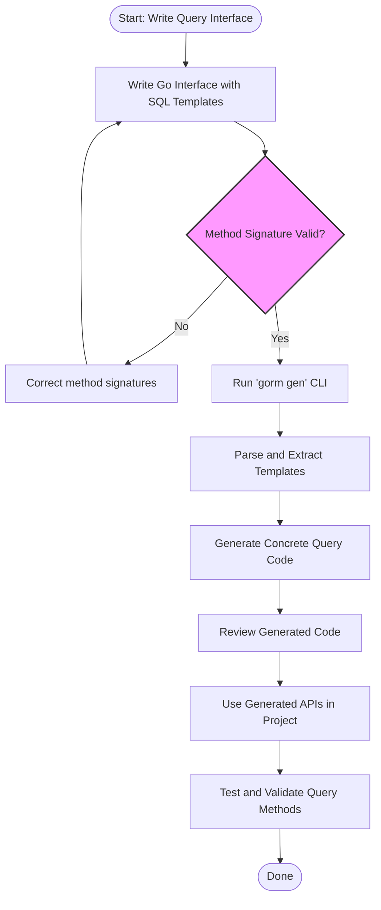

# Building Query APIs from Interfaces

## 1. Introduction

This guide empowers you to leverage the GORM CLI tool to define Go interfaces annotated with SQL templates, from which the tool generates robust, compile-time safe, concrete query methods. By following this approach, you gain type-safe, expressive, and maintainable query APIs tightly integrated with GORM models.

Here, you will learn how to:

- Declare interfaces with embedded SQL templates directly in Go comments
- Generate query implementations automatically
- Use template-based querying to write dynamic, parameterized SQL with ease
- Apply best practices for interface design and method signatures

---

## 2. Workflow Overview

### Task Description
Create type-safe query APIs from user-defined Go interfaces that contain raw SQL statements and templates as documentation comments. The generator compiles these into concrete implementations integrated with GORM for seamless querying.

### Prerequisites
- Familiarity with Go interfaces and methods
- Defined GORM model structs representing your database tables
- Installed GORM CLI executable (`gorm gen`)

### Expected Outcome
- Generated Go files with concrete implementations of your query interfaces
- Ability to call strongly typed query methods with automatic SQL parameter binding

### Time Estimate
Approximately 15-30 minutes from writing interfaces to generating and using the code.

### Difficulty Level
Intermediate (requires basic knowledge of Go, SQL, and GORM)

---

## 3. Defining Query Interfaces with SQL Templates

### 3.1. Structure of Query Interfaces
Your interfaces define query methods with raw SQL embedded as specially formatted comments above each method. Methods reflect the queries you intend to run, and the SQL templates support dynamic placeholders.

### 3.2. Annotating Methods with SQL
Use Go comment blocks immediately preceding the methods to embed SQL or templated SQL statements. Placeholders and template directives enable powerful dynamic querying.

#### Key Template DSL Elements:
- `@@table` — resolves automatically to the model’s table name
- `@param` — binds Go method parameters or struct fields
- `{{where}} ... {{end}}` — conditional WHERE clauses
- `{{set}} ... {{end}}` — conditional SET clauses used in updates
- `{{if}} ... {{end}}` — conditional SQL fragments
- `{{for}} ... {{end}}` — iteration over collections

### 3.3. Interface Example
```go
// Query interface defines abstract methods with SQL templates
// for the generic type T (model).
type Query[T any] interface {

  // SELECT all columns by ID
  //
  // SELECT * FROM @@table WHERE id=@id
  GetByID(id int) (T, error)

  // SELECT by arbitrary column
  //
  // SELECT * FROM @@table WHERE @@column=@value
  FilterWithColumn(column string, value string) (T, error)

  // Dynamic query with conditional where clauses
  //
  // SELECT * FROM @@table
  // {{where}}
  //   {{if user.ID > 0}} WHERE id=@user.ID
  //   {{else if user.Name != ""}} WHERE name=@user.Name
  // {{end}}
  QueryWith(user models.User) (T, error)

  // Update with conditional SET clause
  //
  // UPDATE @@table
  //  {{set}}
  //    {{if user.Name != ""}} name=@user.Name, {{end}}
  //    {{if user.Age > 0}} age=@user.Age, {{end}}
  //    {{if user.Age >= 18}} is_adult=1 {{else}} is_adult=0 {{end}}
  //  {{end}}
  // WHERE id=@id
  UpdateInfo(user models.User, id int) error

  // Complex filter with multiple users
  //
  // SELECT * FROM @@table
  // {{where}}
  //   {{for _, user := range users}}
  //     {{if user.Name != "" && user.Age > 0}}
  //       (name = @user.Name AND age=@user.Age AND role LIKE CONCAT("%",@user.Role,"%")) OR
  //     {{end}}
  //   {{end}}
  // {{end}}
  Filter(users []models.User) ([]T, error)

  // Simple filter by fixed parameters
  // where("name=@name AND age=@age")
  FilterByNameAndAge(name string, age int)

  // Time-range filter with zero-check
  //
  // SELECT * FROM @@table
  //  {{where}}
  //    {{if !start.IsZero()}}
  //      created_at > @start
  //    {{end}}
  //    {{if !end.IsZero()}}
  //      AND created_at < @end
  //    {{end}}
  //  {{end}}
  FilterWithTime(start, end time.Time) ([]T, error)
}
```

---

## 4. Generating Query Code

### 4.1. Running the Generator
After defining the interfaces and models, invoke:

```bash
gorm gen -i ./path/to/interfaces -o ./generated
```

- `-i`: input directory or file containing your interfaces
- `-o`: optional output directory (defaults to `./g`)

### 4.2. What Happens Internally
- The tool parses interface methods and extracts SQL templates
- Method signatures are validated and context parameters are injected if missing
- Template SQL is compiled into concrete methods using GORM query builders
- Files are output following package directory structures

### 4.3. Using the Generated Code
The generator produces types and method implementations that follow your interface signatures:

```go
// Import generated code
import "yourproject/generated"

// Use generated query
func someQueryUsage(ctx context.Context, db *gorm.DB) {
  userQuery := generated.Query[models.User](db)

  // Retrieve user by ID
  user, err := userQuery.GetByID(ctx, 123)

  // Complex filter
  filteredUsers, err := userQuery.FilterWithTime(ctx, startTime, endTime)
}
```

Note that generated method calls accept a `context.Context` parameter regardless of the original signature, ensuring compatibility with GORM context usage.

---

## 5. Best Practices and Tips

### 5.1. Method Signatures
- Always return an error as the last return value. For fetches, accompany return with data.
- Support context injection — the generator automatically adds `ctx context.Context` if missing.

### 5.2. SQL Templates
- Use `@@table` to generalize your queries so that the generator resolves table names dynamically from your models.
- Use `@param` or `@struct.Field` style placeholders for safe parameter binding.
- Utilize `{{where}}`, `{{set}}`, `{{if}}`, and `{{for}}` to conditionally build query parts for flexibility.
- Escape literal `@` signs as `\@` when needed inside SQL strings.

### 5.3. Handling Collections
- For slice or array parameters, combine with `{{for}}` loops for dynamic WHERE clauses.

### 5.4. Struct Parameter Binding
- When using structs as parameters, you can directly refer to fields with `@struct.FieldName` notation in the template.

### 5.5. Configuration
- Customize generation behavior with `genconfig.Config` in the package, e.g., adjusting output path or type mappings.

### 5.6. Debugging
- Ensure method return values conform to generator expectations (max two values; last must be error).
- SQL syntax errors inside comment templates will generate parsing failures.
- Use the generated files as reference to check how templates are rendered.

---

## 6. Practical Example

### Define Interface (e.g., `examples/query.go`)
```go
package examples

import "time"

// Query defines basic user queries
// Note: [T any] is generic for any model type

type Query[T any] interface {

  // Get user by ID
  // SELECT * FROM @@table WHERE id=@id
  GetByID(id int) (T, error)

  // Filter by column
  // SELECT * FROM @@table WHERE @@column=@value
  FilterWithColumn(column string, value string) (T, error)

  // Query with conditional fields
  // SELECT * FROM @@table
  // {{where}}
  //   {{if user.Name != ""}} name=@user.Name {{end}}
  //   {{if user.Age > 0}} AND age=@user.Age {{end}}
  // {{end}}
  QueryWith(user T) (T, error)

  // Update user info
  // UPDATE @@table
  // {{set}}
  //  {{if user.Name != ""}} name=@user.Name, {{end}}
  //  {{if user.Age > 0}} age=@user.Age {{end}}
  // {{end}}
  // WHERE id=@id
  UpdateUser(user T, id int) error

  // Filter by time range
  // SELECT * FROM @@table
  // {{where}}
  //   {{if !start.IsZero()}} created_at > @start {{end}}
  //   {{if !end.IsZero()}} AND created_at < @end {{end}}
  // {{end}}
  FilterWithTime(start, end time.Time) ([]T, error)
}
```

### After Generation, Use the Queries
```go
userQuery := generated.Query[models.User](db)

// Fetch by ID
user, err := userQuery.GetByID(ctx, 101)

// Filter by dynamic column
user2, err := userQuery.FilterWithColumn(ctx, "email", "alice@example.com")

// Update user information
err = userQuery.UpdateUser(ctx, models.User{Name: "Bob"}, 101)

// Time range filter
activeUsers, err := userQuery.FilterWithTime(ctx, time.Now().Add(-30*24*time.Hour), time.Now())
```

---

## 7. Troubleshooting

<AccordionGroup title="Common Issues and Solutions">
<Accordion title="Method Signature Errors">
Incorrect return signature triggers errors. Methods must return zero or one data value plus an `error` as the last return value.

Ensure the last return value is of type `error`. For example:

```go
GetUser(id int) (User, error)   // Correct
GetUser(id int) error           // Correct (no data, just error)
GetUser(id int) (User)          // Incorrect, missing error
GetUser(id int) (User, int)     // Incorrect, last must be error
```
</Accordion>
<Accordion title="Failed SQL Template Parsing">
Malformed SQL or template directives cause generation failure.

- Validate SQL syntax inside comments.
- Check for proper closing of `{{if}}`, `{{for}}`, and `{{end}}`.
- Escape literal `@` as `\@` inside SQL to avoid confusion.
</Accordion>
<Accordion title="Context Parameter Missing">
Generator auto-injects `ctx context.Context` if absent in method signatures.

If you experience context issues, explicitly add `ctx context.Context` as method's first parameter.
</Accordion>
</AccordionGroup>

---

## 8. Next Steps & Related Documentation

- **Writing Models and Query Interfaces:** Detailed guide on preparing your Go types and interfaces for generation.
- **Generating Code for the First Time:** How to execute the generator CLI command correctly.
- **Model-Driven Field Helpers in Action:** Learn how generated field helpers complement query APIs for filters and updates.
- **Mastering the SQL Template DSL:** Deep dive into the templating language for crafting flexible SQL.
- **Troubleshooting & Common Issues:** Diagnose typical errors during setup and generation.

Explore these to deepen your mastery of constructing powerful GORM CLI-based query APIs.

---

## 9. Visual Workflow Summary



---