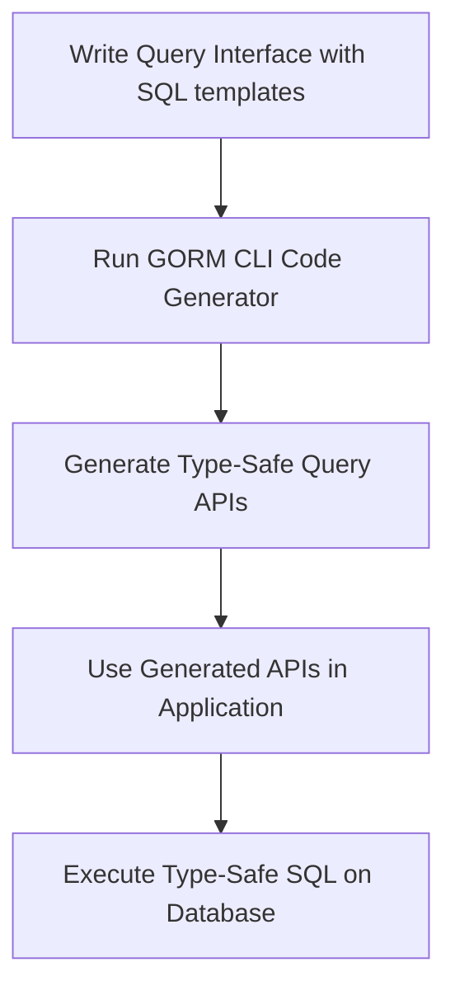

# Defining Query Interfaces & SQL Templates

## Workflow Overview

This guide walks you through the best practices for defining interface-driven query APIs using SQL templating in GORM CLI. It focuses on how to write method signatures with embedded SQL templates in comments, correctly bind parameters, and map those templates to concrete, type-safe query implementations.

### Prerequisites

- A Go project with GORM CLI installed and set up.
- Defined Go structs representing your database models.
- Basic understanding of Go interfaces and comments.
- Familiarity with SQL basics.

### Expected Outcome

By following this guide, you will be able to:

- Write Go interfaces with methods annotated with SQL template comments.
- Use GORM CLI to generate type-safe APIs from those interfaces.
- Understand how parameters and templates bind automatically.
- Leverage conditional and iterative directives in SQL templates.

### Time Estimate

15-30 minutes to write interfaces and understand templating syntax.

### Difficulty Level

Intermediate — requires knowledge of Go interfaces, SQL, and some template DSL.

---

## Step-by-Step Instructions

### 1. Define Your Query Interface with SQL Comment Templates

Write a Go interface with generic type parameters for your model. Above each method, include SQL or SQL-template comments describing the underlying query.

```go
// Query[T any] defines query methods with SQL templates
// to generate type-safe query APIs.
type Query[T any] interface {
    // GetByID retrieves a record by its ID
    //
    // SELECT * FROM @@table WHERE id=@id
    GetByID(id int) (T, error)

    // FilterWithColumn shows dynamic column binding
    //
    // SELECT * FROM @@table WHERE @@column=@value
    FilterWithColumn(column string, value string) (T, error)

    // QueryWith demonstrates conditional WHERE clause
    //
    // SELECT * FROM @@table
    //   {{if user.ID > 0}}
    //       WHERE id=@user.ID
    //   {{else if user.Name != ""}}
    //       WHERE name=@user.Name
    //   {{end}}
    QueryWith(user User) (T, error)

    // UpdateInfo shows dynamic SET clause for UPDATE with conditions
    //
    // UPDATE @@table
    //  {{set}}
    //    {{if user.Name != ""}} name=@user.Name, {{end}}
    //    {{if user.Age > 0}} age=@user.Age, {{end}}
    //    {{if user.Age >= 18}} is_adult=1 {{else}} is_adult=0 {{end}}
    //  {{end}}
    // WHERE id=@id
    UpdateInfo(user User, id int) error

    // Filter demonstrates array iteration with conditional filters
    //
    // SELECT * FROM @@table
    // {{where}}
    //   {{for _, user := range users}}
    //     {{if user.Name != "" && user.Age > 0}}
    //       (name = @user.Name AND age=@user.Age AND role LIKE concat("%",@user.Role,"%")) OR
    //     {{end}}
    //   {{end}}
    // {{end}}
    Filter(users []User) ([]T, error)

    // FilterByNameAndAge simple WHERE clause with fixed SQL
    // where("name=@name AND age=@age")
    FilterByNameAndAge(name string, age int)

    // FilterWithTime conditional WHERE with time range filters
    //
    // SELECT * FROM @@table
    //  {{where}}
    //    {{if !start.IsZero()}}
    //      created_at > @start
    //    {{end}}
    //    {{if !end.IsZero()}}
    //      AND created_at < @end
    //    {{end}}
    //  {{end}}
    FilterWithTime(start, end time.Time) ([]T, error)
}
```

> **Tip:**
> - Use `@@table` to reference the table name from the model.
> - Bind method parameters with `@` placeholders, e.g., `@id`.
> - Escape literal `@` with `\@`.

### 2. Understand Parameter Binding and Method Signatures

- Parameters in the method signature correspond to placeholders in SQL comments.
- Use named parameters like `@param` to bind precisely.
- For struct parameters, access their fields using `@struct.Field` syntax.
- The generator automatically injects `context.Context` if not present.
- Methods returning one value must return an error; two values are typically `(result, error)`.

### 3. Use SQL Template DSL for Dynamic Queries

GORM CLI supports Go text/template style directives to generate conditional and iterative SQL:

| Directive | Purpose                                    | Usage Example                                        |
| --------- | ------------------------------------------|----------------------------------------------------|
| `{{where}}` | Conditional WHERE clause block              | `{{where}} age > 18 {{end}}`                         |
| `{{set}}`   | Conditional SET clause block (for UPDATE)  | `{{set}} name=@name {{end}}`                         |
| `{{if}}`    | Conditional execution of partial SQL        | `{{if age > 0}} AND age=@age {{end}}`                |
| `{{for}}`   | Loop over collections                       | `{{for _, u := range users}} ... {{end}}`            |

Examples:

```sql
-- Dynamic filter by user struct
SELECT * FROM @@table
{{where}}
  {{if user.ID > 0}}
      WHERE id=@user.ID
  {{else if user.Name != ""}}
      WHERE name=@user.Name
  {{end}}
{{end}}

-- Update with conditional fields
UPDATE @@table
{{set}}
  {{if user.Name != ""}} name=@user.Name, {{end}}
  {{if user.Age > 0}} age=@user.Age, {{end}}
  {{if user.Age >= 18}} is_adult=1 {{else}} is_adult=0 {{end}}
{{end}}
WHERE id=@id
```

### 4. Place the Interface and Models in Your Project

- Organize the interface and models in the same package or directory.
- This ensures the generator can resolve types and table names effectively.

### 5. Run GORM CLI Generation

Execute the code generator with the input directory containing your interfaces.

```bash
gorm gen -i ./examples -o ./generated
```

The generator creates concrete, type-safe query APIs where each method implements the specified SQL template.

### 6. Use the Generated APIs

```go
// Retrieve a user by ID
user, err := generated.Query[User](db).GetByID(ctx, 123)

// Filter users by name and age
users, err := generated.Query[User](db).FilterByNameAndAge("jinzhu", 25).Find(ctx)

// Update user info
err = generated.Query[User](db).UpdateInfo(ctx, User{Name: "jinzhu", Age: 20}, 1)
```

### 7. Verify Your Generated Code

- Ensure generated code compiles without errors.
- Try simple queries to confirm expected SQL behavior.
- Refer to [Validate & Use Your Generated APIs](../getting-started/config-first-use/validate-generated-code.md) for validation steps.

---

## Practical Examples

### Example Interface Snippet

```go
// QueryWith demonstrates conditional SQL with struct param
//
// SELECT * FROM @@table
//   {{if user.ID > 0}}
//       WHERE id=@user.ID
//   {{else if user.Name != ""}}
//       WHERE name=@user.Name
//   {{end}}
QueryWith(user User) (T, error)
```

### Corresponding Generated Method Body

```go
func (e QueryImpl[T]) QueryWith(ctx context.Context, user models.User) (T, error) {
    var sb strings.Builder
    params := make([]any, 0, 2)
    sb.WriteString("SELECT * FROM ?")
    params = append(params, clause.Table{Name: clause.CurrentTable})
    if user.ID > 0 {
        sb.WriteString(" WHERE id=?")
        params = append(params, user.ID)
    } else if user.Name != "" {
        sb.WriteString(" WHERE name=?")
        params = append(params, user.Name)
    }

    var result T
    err := e.Raw(sb.String(), params...).Scan(ctx, &result)
    return result, err
}
```

### Conditional Update Example

```go
// UpdateInfo updates user fields dynamically
//
// UPDATE @@table
//  {{set}}
//    {{if user.Name != ""}} name=@user.Name, {{end}}
//    {{if user.Age > 0}} age=@user.Age, {{end}}
//    {{if user.Age >= 18}} is_adult=1 {{else}} is_adult=0 {{end}}
//  {{end}}
// WHERE id=@id
UpdateInfo(user User, id int) error
```

---

## Troubleshooting & Tips

<AccordionGroup title="Common Issues and Solutions">
<Accordion title="Method Signature Issues">
Ensure your methods declare correct return types: either `error` alone or `(T, error)` for queries. The generator requires at least the last return value to be `error`. If missing, you will get a panic during generation.
</Accordion>
<Accordion title="Template Syntax Errors">
Mismatched or unclosed `{{if}}`, `{{for}}`, or `{{end}}` directives cause generation errors. Validate SQL templates carefully and use simple indentation.
</Accordion>
<Accordion title="Parameters Not Binding Correctly">
Use `@parameter` exactly matching method param names. When passing structs, use `@struct.Field` syntax. Escape literal `@` with `\@`.
</Accordion>
<Accordion title="Unintended Literal SQL">
Avoid embedding unsafe raw SQL or concatenations. Use provided template directives for dynamic SQL.
</Accordion>
</AccordionGroup>

<Tip>
Use Go’s strong type system by leveraging generic interfaces with GORM CLI for compile-time validation of your queries.
</Tip>

---

## Next Steps & Related Content

- Explore [Using Generated Field Helpers for Filtering and Updates](../core-workflows/using-generated-field-helpers.md) to learn how fields map to fluent APIs.
- Dive into [Working with Associations](../core-workflows/associations-best-practices.md) to handle relational data.
- Customize code generation with [Configuring Generation](../advanced-usage/configuring-generation.md) via `genconfig.Config`.
- Review [SQL Template DSL Cookbook](../advanced-usage/template-dsl-cookbook.md) for advanced templating patterns.

---

## Summary Diagram: Query Interface to Generated Code Flow



---