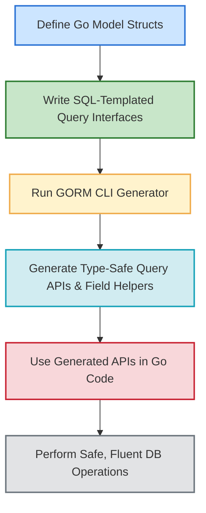

# Quickstart: Generate Type-Safe APIs

Welcome to your first end-to-end journey with GORM CLI. This guide takes you through defining your Go models and query interfaces, running the GORM CLI code generator, and using the generated fluent, type-safe query APIs in your project.

By following these steps, you'll eliminate boilerplate, catch errors at compile time, and write expressive queries with ease.

---

## 1. Workflow Overview

### What You Will Accomplish
- Define Go struct models representing your database tables.
- Write interfaces with embedded SQL templates to express queries.
- Run the GORM CLI generator to produce type-safe query APIs and field helpers.
- Use the generated APIs in your Go project to perform safe, fluent database operations.

### Prerequisites
- Go 1.18 or later installed.
- A Go project with GORM v2 configured.
- Basic understanding of Go generics and GORM modeling.

### Expected Outcome
- Generated Go code exposing query interfaces with methods that are:
  - Type-safe
  - Easy to read and maintain
  - Integrated with GORM
- Model-driven field helpers to build predicates and updates.

### Estimated Time
Approximately 15-30 minutes depending on familiarity.

### Skill Level
Beginner to Intermediate

---

## 2. Step-by-Step Instructions

### Step 1: Define Your Models
Create Go structs representing your database tables. Each exported field corresponds to a column.

```go
// examples/models/user.go
package models

import (
  "time"
  "gorm.io/gorm"
)

// User represents a database user record
// ID, timestamps, and common fields
// GORM tags as usual

type User struct {
  gorm.Model
  Name    string
  Age     int
  Profile string `gen:"json"` // Custom field helper mapping
}
```

> Tip: Use `gen:"json"` struct tags to indicate custom field helpers such as JSON fields.

### Step 2: Write Query Interfaces with Embedded SQL Templates
Define Go interfaces that describe your queries and updates with SQL in comments.

```go
// examples/query.go
package examples

import (
  "time"
  "gorm.io/cli/gorm/genconfig"
  "gorm.io/cli/gorm/field"
  "gorm.io/cli/gorm/examples/models"
)

// Query provides type-safe query methods for User
// Go 1.18 generics used with any model type T

// The SQL comments use GORM CLI template DSL for dynamic queries

type Query[T any] interface {
  // SELECT * FROM @@table WHERE id=@id
  GetByID(id int) (T, error)

  // SELECT * FROM @@table WHERE @@column=@value
  FilterWithColumn(column string, value string) (T, error)

  // SELECT * FROM users
  // {{where}}
  //   {{if user.ID > 0}} WHERE id=@user.ID {{end}}
  // {{end}}
  QueryWith(user models.User) (T, error)

  // UPDATE @@table
  // {{set}}
  //  {{if user.Name != ""}} name=@user.Name, {{end}}
  //  {{if user.Age > 0}} age=@user.Age, {{end}}
  // {{end}}
  // WHERE id=@id
  UpdateInfo(user models.User, id int) error
}

// Package-level genconfig to map Go types to field helpers

var _ = genconfig.Config{
  OutPath: "examples/output",
  FieldTypeMap: map[any]any{
    sql.NullTime{}: field.Time{},
  },
  FieldNameMap: map[string]any{
    "json": JSON{},
  },
}
```

> Note: The `@@table` placeholder resolves to the model's table name dynamically.

### Step 3: Run GORM CLI to Generate Code
Use the GORM CLI `gen` command to process your interfaces and generate code.

```bash
gorm gen -i ./examples -o ./generated
```

- `-i` points to the directory containing your interfaces (and optionally models).
- `-o` specifies where to place generated code.

<Tip>
Ensure your interfaces return the correct values and include error returns as per GORM CLI requirements for generation.
</Tip>

### Step 4: Use the Generated APIs
Import the generated package and invoke generated query interface methods in your Go code.

```go
package main

import (
  "context"
  "fmt"
  "gorm.io/cli/gorm/examples/generated"
  "gorm.io/cli/gorm/examples/models"
  "gorm.io/gorm"
  _ "gorm.io/driver/sqlite"
)

func main() {
  db, _ := gorm.Open(sqlite.Open("test.db"), &gorm.Config{})
  ctx := context.Background()

  // Create the query interface from generated code
  query := generated.Query[models.User](db)

  // Fetch User by ID
  user, err := query.GetByID(ctx, 123)
  if err != nil {
    fmt.Println("Error fetching user:", err)
    return
  }
  fmt.Println("Fetched User:", user)

  // Update User info
  err = query.UpdateInfo(ctx, models.User{Name: "Alice", Age: 30}, 123)
  if err != nil {
    fmt.Println("Error updating user:", err)
  }
}
```

> The generated API handles SQL template substitution for you, enforcing type safety and parameter binding.

---

## 3. Examples & Snippets

### Example interface method with SQL template

```go
// Query users by name and age
// SELECT * FROM @@table WHERE name=@name AND age=@age
FilterByNameAndAge(name string, age int) ([]T, error)
```

### Generated code usage for a common query

```go
users, err := generated.Query[models.User](db).FilterByNameAndAge(ctx, "jinzhu", 25)
```

### Custom JSON field helper example

```go
// In config.go
var _ = genconfig.Config{
  FieldNameMap: map[string]any{
    "json": JSON{},
  },
}

// In model
Profile string `gen:"json"`

// Usage
err := generated.Query[models.User](db).Where(
  generated.User.Profile.Equal("$.vip", true),
).Take(ctx)
```

### Configuration snippet for filtering interfaces

```go
var _ = genconfig.Config{
  IncludeInterfaces: []any{"Query*"},
}
```

> This restricts generation to interfaces whose names start with "Query".

---

## 4. Troubleshooting & Tips

### Common Issues

- **No code generated:** Verify your interfaces are exported and methods include SQL template comments.
- **Method signature errors:** Methods must return `(T, error)` or `(error)` properly. The error must always be the last return value.
- **Incorrect output path:** Use `-o` to specify the output directory; check for `genconfig.Config.OutPath` settings.
- **Unrecognized field types:** Map custom Go types in `FieldTypeMap` or use `FieldNameMap` for struct tags.

### Best Practices

- Keep your query interfaces and models organized in the same or adjacent packages.
- Use meaningful SQL templates with placeholders to increase readability.
- Encapsulate complex conditional logic in SQL template DSL (`{{if}}`, `{{where}}`, `{{set}}`, `{{for}}`).
- Apply generation filters via `genconfig.Config` to control what interfaces/structs are processed.

### Performance Considerations

Generated code is lightweight and idiomatic; relying on GORM internals ensures efficient SQL building and execution.

To optimize:
- Leverage field helpers for predicate reuse.
- Use batch operations where possible.
- Avoid overly complex templates that may be harder to maintain.

### Alternative Approaches

- You may write pure GORM code without templates, but lose compile-time safety.
- Custom field helpers extend capabilities beyond standard types.

---

## 5. Next Steps & Related Content

- **Using Generated APIs: First Query**: Learn how to run read/write queries using the APIs you generate.
- **Working with Model-Driven Field Helpers**: Deep dive on the field helper patterns and predicates.
- **Guided: Managing Associations Safely**: Explore generated association helpers for safer relationship handling.
- **Customizing Code Generation with Config**: Adjust your generation with advanced configuration.
- **Template DSL and SQL Templating**: Master complex query logic with the built-in templating syntax.

---

For detailed conceptual understanding, see [Architecture Overview](../../../overview/core-concepts/architecture-overview) and [Core Terminology & Concepts](../../../overview/core-concepts/core-terminology).

For practical tooling instructions, see [Installing GORM CLI](../../../getting-started/setup-and-installation/installation) and [Basic Generation Configuration](../../../getting-started/configuration-troubleshooting/basic-configuration).

To get help for common errors, check [Troubleshooting Common Issues](../../../getting-started/configuration-troubleshooting/troubleshooting-common-issues).

---

# Diagram: End-to-End Quickstart Workflow



---

# Quick Reference

- Generate code:
  ```bash
  gorm gen -i ./examples -o ./generated
  ```

- Interface method example:
  ```go
  // SELECT * FROM @@table WHERE id=@id
  GetByID(id int) (T, error)
  ```

- Import and use:
  ```go
  q := generated.Query[models.User](db)
  user, err := q.GetByID(ctx, 1)
  ```

---

Congratulations! You now have a solid foundation to generate and use type-safe APIs with GORM CLI.

Explore further guides and deepen your mastery of the powerful, expressive query APIs you just unlocked.
