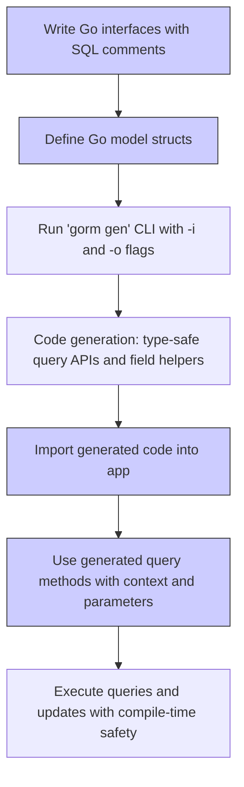

# Getting Started: Quickstart

Welcome to GORM CLI! This quickstart guide walks you through everything you need to go from zero to your first type-safe generated query API and model-driven field helpers. Designed for new users, it covers installation, minimal configuration, writing your first query interfaces and models, running the generator, and integrating the generated code into your project.

---

## 1. What You Will Achieve

By following this guide, you will:

- Install the GORM CLI tool on your system.
- Write Go interfaces with SQL templates to define your queries.
- Define simple model structs for field helper generation.
- Run the CLI to generate type-safe query APIs and field helpers.
- Use the generated code in your Go application to perform type-safe database operations.

**Estimated Time:** 15-30 minutes

**Difficulty:** Beginner — no prior GORM CLI experience needed.

---

## 2. Prerequisites

Before starting, ensure:

- You have Go 1.18 or higher installed. You can check with:

  ```bash
  go version
  ```

- Your project includes `gorm.io/gorm` as a dependency.

- Familiarity with Go interfaces and structs.

- A basic Go project setup where you can write and run Go code.

---

## 3. Install GORM CLI

Install the CLI tool with the recommended command:

```bash
 go install gorm.io/cli/gorm@latest
```

This installs the `gorm` executable into your Go bin path.

<Check>
If the `gorm` command isn’t found after installation, ensure your `$GOPATH/bin` or Go binaries directory is included in your system PATH.
</Check>

---

## 4. Write Your First Query Interface and Model

The GORM CLI generates code from Go interfaces with special SQL comments and from your model structs.

Create an interface file, e.g., `examples/query.go`:

```go
package examples

import (
	"time"

	"gorm.io/cli/gorm/examples/models"
)

type Query[T any] interface {
	// SELECT * FROM @@table WHERE id=@id
	GetByID(id int) (T, error)

	// where("name=@name AND age=@age")
	FilterByNameAndAge(name string, age int)

	// SELECT * FROM @@table
	//  {{where}}
	//    {{if !start.IsZero()}}
	//      created_at > @start
	//    {{end}}
	//    {{if !end.IsZero()}}
	//      AND created_at < @end
	//    {{end}}
	//  {{end}}
	FilterWithTime(start, end time.Time) ([]T, error)
}
```

And create a model file, for example `examples/models/user.go`:

```go
package models

type User struct {
	ID   uint
	Name string
	Age  int
	// Add other fields as needed
}
```

---

## 5. Run the GORM CLI Generator

From your project root, run the generator:

```bash
gorm gen -i ./examples -o ./generated
```

- `-i` or `--input`: path to your interface and models source code directory or file.
- `-o` or `--output`: directory where generated code is saved (defaults to `./g`).

The tool parses your Go interfaces, picks up SQL annotations in comments, maps your model structs, and produces type-safe APIs and field helpers in the output folder.

<Info>
The generator automatically adds a `context.Context` parameter to your interface methods if not explicitly present.
</Info>

---

## 6. Using the Generated Code

After generation, import the generated package and use the fluent APIs:

```go
package main

import (
	"context"
	"fmt"

	"gorm.io/driver/sqlite"
	"gorm.io/gorm"
	"your-module/generated" // adjust import path
	"your-module/examples/models"
)

func main() {
	db, err := gorm.Open(sqlite.Open("test.db"), &gorm.Config{})
	if err != nil {
		panic(err)
	}

	ctx := context.Background()

	// Use generated query API
	q := generated.Query[models.User](db)

	// Call your SQL template method
	user, err := q.GetByID(ctx, 1)
	if err != nil {
		panic(err)
	}

	fmt.Println("User:", user)
}
```

You can also use generated field helpers for filters and updates:

```go
users, err := gorm.G[models.User](db).
  Where(generated.User.Age.Gt(18)).
  Find(ctx)
```

---

## 7. Troubleshooting Tips

<AccordionGroup title="Common Quickstart Issues">
<Accordion title="Cannot find 'gorm' command after install">

Ensure your Go bin directory is in your PATH environment variable. Example:

```bash
export PATH=$PATH:$(go env GOPATH)/bin
```

Then try running:

```bash
gorm --version
```

</Accordion>
<Accordion title="Errors parsing interfaces or models">

- Confirm your input path (`-i`) points to the correct directory.
- Interfaces must have SQL template comments documented exactly as shown with `SELECT` or conditional blocks.
- Model structs must be accessible in the input path.

</Accordion>
<Accordion title="Generated code has no methods or structs">

Check for package-level `genconfig.Config` filters that might exclude interfaces or structs.
Also ensure interfaces include methods with valid SQL annotations.

</Accordion>
</AccordionGroup>

---

## 8. Next Steps

- Learn to customize generation using `genconfig.Config` to filter or map fields. Visit [Configuring the Generator](/getting-started/configuration-troubleshooting/configuring-generator).
- Explore SQL Template DSL for advanced queries. See [Template-Driven Queries](/guides/advanced-patterns/template-dsl).
- Dive into association handling for relationships between models. See [Working with Associations](/guides/advanced-patterns/associations).

---

## Diagram: Quickstart Workflow Overview



---

## Summary
This quickstart guide gave you step-by-step instructions to install GORM CLI, write your first type-safe query interfaces, define model structs, run the generator, and begin using generated code effectively in your Go projects. By following these steps, you have a solid foundation to start leveraging GORM CLI to reduce boilerplate and enforce compile-time SQL safety.

---

## References

- [Installation Guide](/getting-started/essential-setup/installation)
- [Quickstart: Your First Code Generation](/getting-started/essential-setup/quickstart-your-first-generation)
- [Configuring the Generator](/getting-started/configuration-troubleshooting/configuring-generator)
- [Using Generated Code](/guides/core-workflows/using-generated-code)
- [Working with Associations](/guides/advanced-patterns/associations)
- [Template-Driven Queries: SQL Template DSL](/guides/advanced-patterns/template-dsl)

---

## Practical Tips

- Always test your generated code with a small set of data.
- Use the `-o` output flag to keep generated code separate.
- Keep your interfaces clear and well documented with SQL templates.
- Incrementally add more methods and queries as you grow your project.
- Use provided examples as reference code layouts.

With this guide, you are fully equipped to get started using GORM CLI confidently and productively.

---

Enjoy building with GORM CLI!
