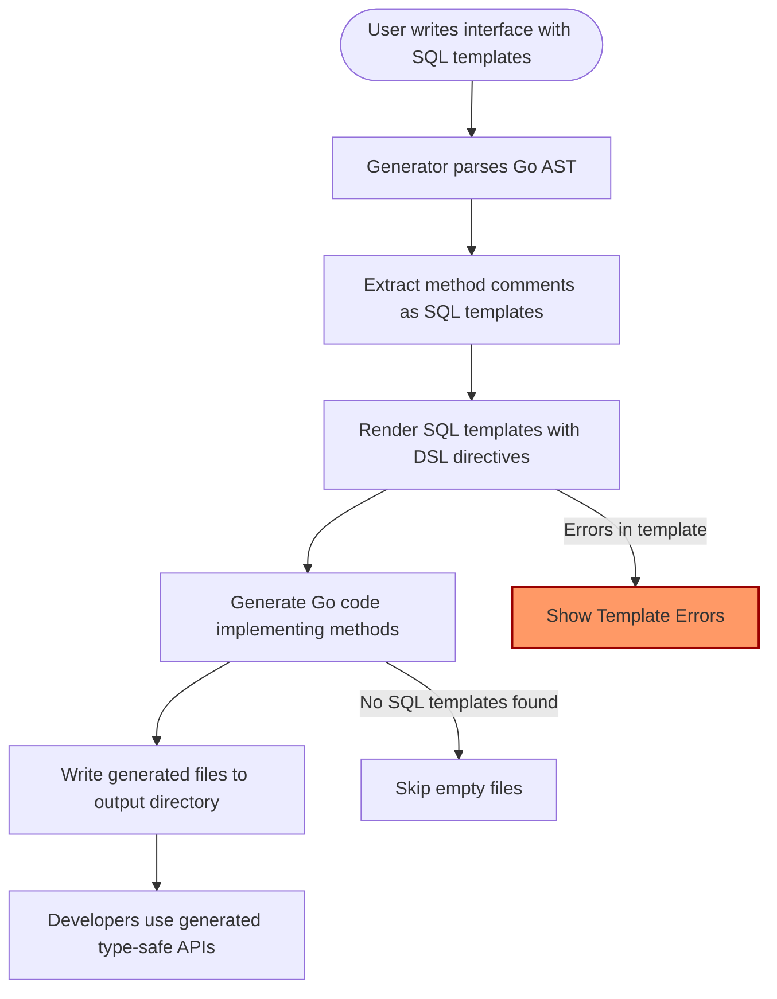

# Building Template-Based Query APIs

Unlock the power of SQL template-driven interfaces to define custom, type-safe query methods. This guide walks you through writing SQL templates using GORM CLI’s template DSL, binding dynamic parameters, crafting flexible query and update statements, and leveraging conditional expressions to build powerful and maintainable query APIs.

---

## 1. Workflow Overview

### Task Description
Create type-safe, customized query APIs by defining Go interfaces with embedded SQL templates. These interfaces generate strongly typed methods that integrate seamlessly with GORM.

### Prerequisites
- Have Go 1.18+ installed.
- Define your data model structs in Go.
- Write interface methods with SQL templates in comments following GORM CLI conventions.
- Install and configure GORM CLI generator.

### Expected Outcome
You will produce generated query methods that execute dynamic SQL based on your templates, automatically binding parameters with compile-time safety.

### Time Estimate
20–30 minutes to write and generate initial query interfaces plus example usage.

### Difficulty Level
Intermediate. Familiarity with Go interfaces, templating syntax, and SQL basics is assumed.

---

## 2. Getting Started with Template-Based Queries

Define a Go interface representing queries you want to execute. Use method comments to add SQL templates using the GORM CLI SQL DSL.

### Key DSL Features

| Directive   | Purpose                            | Example                                  |
| ----------- | ---------------------------------- | ---------------------------------------- |
| `@@table`   | Resolves to the corresponding model's table name | `SELECT * FROM @@table WHERE id=@id` |
| `@@column`  | Dynamic column name binding        | `SELECT * FROM @@table WHERE @@column=@value` |
| `@param`    | Binds method parameters to SQL     | `WHERE name=@user.Name`                   |
| `{{where}}` | Starts a conditional WHERE clause  | 
```
SELECT * FROM @@table
{{where}}
  {{if name != ""}} name=@name {{end}}
  {{if age > 0}} AND age=@age {{end}}
{{end}}
```
|
| `{{set}}`   | Starts a conditional SET clause (for UPDATE) | 
```
UPDATE @@table
{{set}}
  {{if user.Name != ""}} name=@user.Name, {{end}}
  {{if user.Email != ""}} email=@user.Email {{end}}
{{end}}
WHERE id=@id
```
|
| `{{if}}`    | Conditional template fragment      | `{{if age > 0}} AND age=@age {{end}}`    |
| `{{for}}`   | Iterate over a collection           | 
```
{{for _, tag := range tags}}
  {{if tag != ""}} tags LIKE concat('%',@tag,'%') OR {{end}}
{{end}}
```
|

### Example Interface

```go
// Query[T any] defines generic query methods with SQL templates
type Query[T any] interface {
  // SELECT * FROM @@table WHERE id=@id
  GetByID(id int) (T, error)

  // SELECT * FROM @@table WHERE @@column=@value
  FilterWithColumn(column string, value string) (T, error)

  // UPDATE @@table
  // {{set}}
  //   {{if user.Name != ""}} name=@user.Name, {{end}}
  //   {{if user.Age > 0}} age=@user.Age, {{end}}
  // {{end}}
  // WHERE id=@id
  UpdateInfo(user T, id int) error

  // SELECT * FROM @@table
  // {{where}}
  //   {{for _, u := range users}}
  //     {{if u.Name != "" && u.Age > 0}}
  //       (name=@u.Name AND age=@u.Age) OR
  //     {{end}}
  //   {{end}}
  // {{end}}
  Filter(users []T) ([]T, error)
}
```

<Tip>
Each method comment is a raw SQL or templated SQL string that the generator parses to produce safe, efficient implementation.
</Tip>

---

## 3. Step-by-Step Instructions

### 3.1 Write Your Interface Methods with SQL Templates

1. **Define a generic interface:** Use a type parameter `[T any]` to refer to your model type.
2. **Annotate each method with SQL in comments:**
   - Use `@@table` to refer abstractly to the table for type `T`.
   - Bind inputs as `@parameterName`.
   - Use `{{where}}` and `{{set}}` blocks for conditional SQL fragments.

### 3.2 Implement Dynamic Conditions

- Use `{{if condition}} ... {{end}}` to add SQL fragments only when parameters meet criteria.
- Compose complex conditionals with `{{else if}}` and `{{else}}` for multiple branches.
- Iterate over slices with `{{for}}` to build dynamic clauses.

### 3.3 Bind Dynamic Columns and Values

- Use `@@column` for dynamic column names and `@value` for corresponding values.
- Ensure method parameters match placeholders.

### 3.4 Create Update Templates with `{{set}}`

- Use `{{set}}` block in method comments to conditionally generate `SET` clauses for UPDATE statements.
- Use conditionals to omit zero-values or optional fields.

### 3.5 Generate Code Using CLI

Run:
```bash
gorm gen -i path/to/interfaces -o path/to/generated
```
This analyzes your interfaces and models, producing ready-to-use Go implementations.

### 3.6 Use Generated APIs

Example usage:
```go
user, err := generated.Query[User](db).GetByID(ctx, 123)
users, err := generated.Query[User](db).Filter(usersSlice).Find(ctx)
err = generated.Query[User](db).UpdateInfo(ctx, user, userID)
```

---

## 4. Examples & Templates

### Example: Conditional WHERE Clause with `{{where}}` and `{{if}}`

```sql
SELECT * FROM @@table
{{where}}
  {{if user.Name != ""}} name=@user.Name {{end}}
  {{if user.Age > 0}} AND age=@user.Age {{end}}
{{end}}
```

### Example: Dynamic UPDATE Using `{{set}}` and Conditionals

```sql
UPDATE @@table
{{set}}
  {{if user.Name != ""}} name=@user.Name, {{end}}
  {{if user.Age > 0}} age=@user.Age, {{end}}
  {{if user.Age >= 18}} is_adult=1 {{else}} is_adult=0 {{end}}
{{end}}
WHERE id=@id
```

### Example: Iteration Over Slice with `{{for}}`

```sql
SELECT * FROM @@table
{{where}}
  {{for _, user := range users}}
    {{if user.Name != "" && user.Age > 0}}
      (name=@user.Name AND age=@user.Age AND role LIKE concat("%",@user.Role,"%")) OR
    {{end}}
  {{end}}
{{end}}
```

<Tip>
Escaping is supported using `\@` to insert literal @ characters without binding.
</Tip>

---

## 5. Tips, Best Practices & Common Pitfalls

- **Always match parameter names:** Each `@param` in SQL templates must correspond to a method parameter.
- **Keep SQL idiomatic:** Templates should produce valid SQL for your target database.
- **Use `@@table` to abstract table names:** Avoid hardcoding table names.
- **Leverage conditionals to skip zero or empty values:** This optimizes generated queries.
- **Avoid unsupported directives:** Only use listed DSL constructs (`{{where}}, {{set}}, {{for}}, {{if}}`, etc.).
- **String escaping:** Escaped `\@` prevents placeholders from being parsed as parameters.

<Warning>
Unmatched or missing parameters in templates cause generator errors. Validate names carefully.
</Warning>

---

## 6. Troubleshooting

### Problem: Generated code reports missing parameters
- Verify all `@param` placeholders map to method parameters exactly.

### Problem: `{{where}}` or `{{set}}` block is empty and causes invalid SQL
- Ensure conditional logic inside blocks covers all cases gracefully.
- The generator trims connectors (AND/OR) to keep SQL valid.

### Problem: Compilation errors after generation
- Check for typos or invisible characters in templates.
- Use `gorm gen -v` for verbose output to debug parsing.

---

## 7. Next Steps & Related Content

- Learn about **Working with Field Helpers and Predicates** to build complex filters using generated helpers.
- Explore **Managing Associations in Generated Code** to handle relations atomically and safely.
- Customize generation via **genconfig** for advanced project needs.
- Dive deeper into **Handling JSON Columns and Custom Helpers** to extend query capabilities.

For detailed examples and reference implementations, explore the `examples/query.go` and generated code in your output directory.

---

## Appendix: Mermaid.js Diagram of Template-Based Query Flow



---

# Reference: Example SQL Template Method Comment

```go
// SELECT * FROM @@table WHERE id=@id
GetByID(id int) (T, error)
```

The template supports complex logic:

```go
// UPDATE @@table
// {{set}}
//  {{if user.Name != ""}} name=@user.Name, {{end}}
//  {{if user.Age > 0}} age=@user.Age, {{end}}
// {{end}}
// WHERE id=@id
UpdateUser(user User, id int) error
```

See section 4 for diverse examples.

---

## Additional Resources
- [GORM CLI README](https://github.com/go-gorm/cli/blob/main/README.md)
- [SQL Template DSL Concepts](https://gorm.io/cli/gorm-docs#template-dsl)
- [Code Generation Architecture Overview](/overview/core-concepts/system-architecture)

---

Start building your powerful, type-safe, templated query APIs now with GORM CLI!


