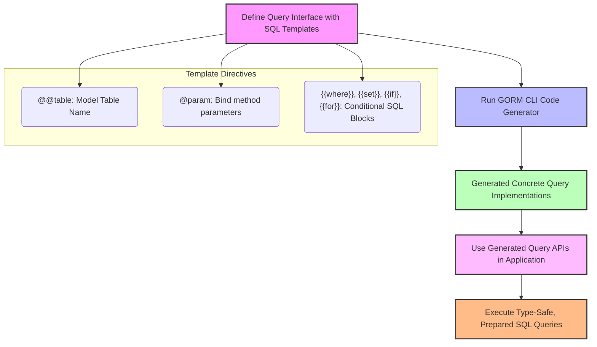

# Working with Type-Safe Queries

This guide walks you through building interface-driven, type-safe querying using SQL templates in GORM CLI. You will learn how to author query interfaces with embedded SQL templates, leverage SQL template directives and comments, and consume the generated methods to achieve secure, maintainable data access.

---

## Workflow Overview

### What You Will Accomplish
You will define Go interfaces with SQL templates in comments, which GORM CLI uses to generate concrete, type-safe query methods. This approach eliminates manual query construction at runtime and introduces compile-time safety to your data access code.

### Prerequisites
- Go 1.18 or later with generics support
- GORM CLI installed (`gorm.io/cli/gorm`)
- A Go project using GORM and properly defined model structs
- Basic familiarity with SQL and Go interfaces

### Expected Outcome
By following this guide, you will have:
- Defined interfaces with SQL templates to express queries
- Generated type-safe query methods automatically
- Used the generated APIs to perform database queries in a secure and maintainable manner

### Time Estimate
Approximately 15-30 minutes, depending on your familiarity with GORM and Go interfaces.

### Difficulty Level
Beginner to Intermediate

---

## Step-by-Step Instructions

### 1. Define a Query Interface with SQL Templates

Start by declaring an interface in Go with methods that represent the queries you want to run. Use comments above each method to add SQL templates and directives. 

Example:
```go
// Query[T any] defines type-safe query methods for entity T.
type Query[T any] interface {
  // SELECT * FROM @@table WHERE id=@id AND name = "@name"
  GetByID(id int) (T, error)

  // SELECT * FROM @@table WHERE @@column=@value
  FilterWithColumn(column string, value string) (T, error)

  // UPDATE @@table
  // {{set}}
  //   {{if user.Name != ""}} name=@user.Name, {{end}}
  //   {{if user.Age > 0}} age=@user.Age, {{end}}
  //   {{if user.Age >= 18}} is_adult=1 {{else}} is_adult=0 {{end}}
  // {{end}}
  // WHERE id=@id
  UpdateInfo(user User, id int) error
}
```

**Key points:**
- Use the `@@table` directive to inject the model’s table name.
- Use `@param` to bind Go method parameters to SQL parameters.
- Use directives like `{{set}}`, `{{where}}`, and `{{if}}` for conditional and dynamic SQL.


### 2. Place Your Query Interface in the Right Package

For best results, put your interface in a dedicated package or folder together with your model definitions. GORM CLI will scan these files during code generation.

Example package structure:
```
/project
  /models
    user.go
  /queries
    query.go  // defines `Query[T any]` interfaces with templates
```

### 3. Run the Code Generator

Invoke GORM CLI's generator with your query interface source code.

Example:
```bash
gorm gen -i ./queries -o ./generated
```

This creates type-safe, concrete implementations of your query interfaces in the output directory.

### 4. Use the Generated Query Methods

In your application code, import the generated package and call the generated methods. Note the automatic injection of `context.Context` in the method signatures.

Example usage:
```go
// SELECT * FROM users WHERE id=123
user, err := generated.Query[User](db).GetByID(ctx, 123)
if err != nil {
    // handle error
}

// UPDATE users SET name='jinzhu', age=20, is_adult=1 WHERE id=1
err = generated.Query[User](db).UpdateInfo(ctx, User{Name: "jinzhu", Age: 20}, 1)
if err != nil {
    // handle error
}
```

### 5. Leverage Advanced SQL Template DSL Features

Use the following directives to build dynamic and maintainable SQL:
- `@@table` – resolves to your model's actual table name
- `@@column` – binds a dynamic column name
- `@param` – maps method parameters into safe positional parameters
- `{{where}}` and `{{set}}` – conditional SQL blocks for WHERE and SET clauses
- `{{if}}`, `{{else}}`, `{{for}}` – conditional and iterative constructs

Example:
```sql
SELECT * FROM @@table
{{where}}
  {{if !start.IsZero()}} created_at > @start {{end}}
  {{if !end.IsZero()}} AND created_at < @end {{end}}
{{end}}
```

This builds the WHERE clause only when date filters are non-empty.

---

## Examples & Code Samples

### Example Interface Definition
```go
package examples

// Query interface with various SQL templates

type Query[T any] interface {
  // SELECT * FROM @@table WHERE id=@id
  GetByID(id int) (T, error)

  // SELECT * FROM @@table WHERE @@column=@value
  FilterWithColumn(column string, value string) (T, error)

  // UPDATE @@table
  // {{set}}
  //   {{if user.Name != ""}} name=@user.Name, {{end}}
  //   {{if user.Age > 0}} age=@user.Age, {{end}}
  //   {{if user.Age >= 18}} is_adult=1 {{else}} is_adult=0 {{end}}
  // {{end}}
  // WHERE id=@id
  UpdateInfo(user User, id int) error
}
```

### Generated Method Example
Conceptually, `GetByID` generates code equivalent to:

```go
func (e QueryImpl[T]) GetByID(ctx context.Context, id int) (T, error) {
  var sb strings.Builder
  params := make([]any, 0, 2)

  sb.WriteString("SELECT * FROM ? WHERE id=?")
  params = append(params, clause.Table{Name: clause.CurrentTable}, id)

  var result T
  err := e.Raw(sb.String(), params...).Scan(ctx, &result)
  return result, err
}
```

The generator creates this boilerplate with placeholders safely bound.

### Template with Iteration
```sql
SELECT * FROM @@table
{{where}}
  {{for _, user := range users}}
    {{if user.Name != "" && user.Age > 0}}
      (name = @user.Name AND age=@user.Age) OR
    {{end}}
  {{end}}
{{end}}
```

Used for methods that filter by multiple user criteria in a single query.

---

## Troubleshooting & Tips

### Common Issues

- **SQL syntax errors in templates**: Carefully check template directives and ensure SQL fragments are valid.
- **Missing context in method signatures**: GORM CLI automatically adds `context.Context` if absent, verify usage accordingly.
- **Unbound parameters**: Confirm all placeholders `@param` correspond to actual method parameters.
- **Incorrect interface naming or package placement**: The generator relies on conventions; interfaces must be properly declared in scanned packages.

### Best Practices

- Use explicit method comments with clear SQL template annotations.
- Start with simple queries, then incrementally add complexity with `if` and `for` directives.
- Maintain separate packages or folders for query interfaces to organize code and simplify generation.
- Validate generated code by building and running tests before use.

### Performance Considerations

- Generated methods build SQL strings with positional parameters, providing efficient query construction and safe execution.
- Avoid overly complex templates that create very large SQL strings at runtime; consider breaking queries into smaller parts if needed.

### Alternative Approaches

- For dynamic filters without SQL templates, use GORM’s standard API with generated field helpers to build conditions.
- Use `genconfig.Config` to filter interfaces for generation or customize output (refer to Customizing Generation guide).

---

## Next Steps & Related Content

- **Quickstart Overview**: Get started with installation and your first generation run.
- **Model-Driven Field Helpers in Practice**: Learn how to generate and use field helpers alongside queries.
- **Customizing Generation with genconfig.Config**: Explore advanced customization of your generated code.
- **Managing Associations: Create, Update, Unlink, Delete**: Master association operations with type-safety.

Explore these guides to deepen your mastery and integrate type-safe queries seamlessly into your GORM projects.

---

## Additional Resources

- [GORM CLI on GitHub](https://github.com/go-gorm/cli) — Source code, examples, and issues
- [Official GORM Documentation](https://gorm.io/docs/) — Reference for GORM usage

---

## Visual Workflow Diagram



This workflow shows the user’s journey from interface definition to executing type-safe queries.

---

# Summary
This guide empowers you to create type-safe, interface-driven query methods using GORM CLI's SQL templating system. You will learn to write annotated query interfaces, generate concrete implementations, and consume them for secure database access with compile-time safety.

## Main Sections
- Workflow overview of type-safe query generation
- Defining SQL-templated interfaces
- Running the code generator
- Using generated methods
- Template DSL directives with examples
- Troubleshooting common pitfalls and best practices
- Next steps linking to related guides

## Key References
- [Quickstart Overview](/getting-started/first-steps/quickstart-overview)
- [Model-Driven Field Helpers in Practice](/guides/core-workflows/field-helper-patterns)
- [Customizing Generation with genconfig.Config](/guides/core-workflows/customizing-generation)
- [Managing Associations](/guides/core-workflows/associations-management)

## Recommended Next Steps
After mastering interface-based type-safe queries, explore model-driven field helpers to complement your querying capabilities and review customization options for advanced code generation scenarios.

---

