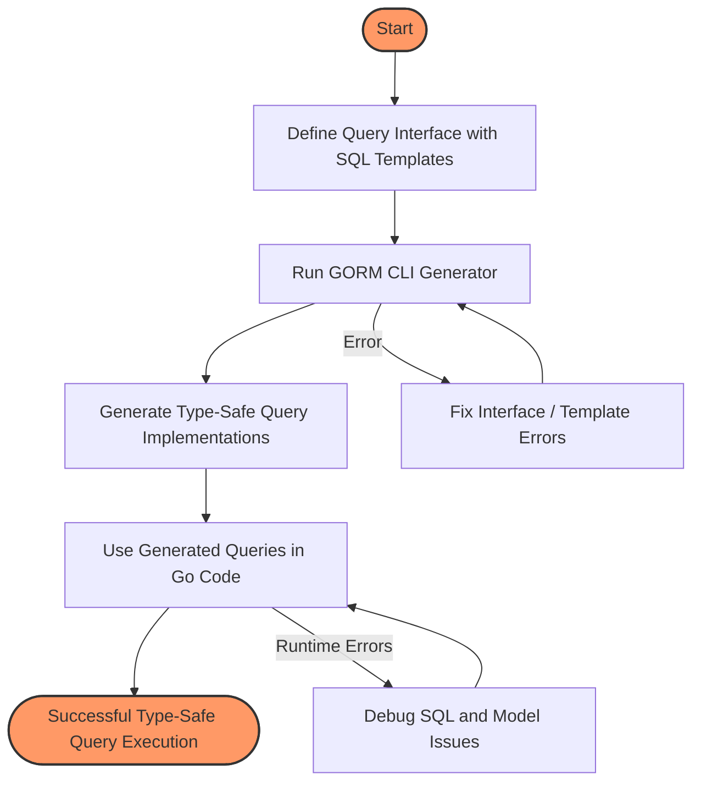

# Type-Safe Queries with Interfaces

Harness the power of GORM CLI to define concise, type-safe query interfaces embedded with SQL templates. This page guides you through creating query interfaces, generating concrete implementations automatically, and writing robust queries with filtering and updates — all while enjoying the safety and clarity of Go generics.

---

## Workflow Overview

### What You Will Achieve
You will learn how to:
- Define Go interfaces annotated with SQL template comments.
- Generate and use type-safe query methods tailored to your models.
- Customize complex database queries with placeholders and conditional logic.
- Integrate seamlessly with GORM’s `*gorm.DB` for fluent, composable querying.

### Prerequisites
- Basic familiarity with Go generics and interfaces.
- An existing GORM project with models defined.
- GORM CLI installed and your environment set up (see [Install GORM CLI](../getting-started/setup-introduction/installation) and [Prerequisites & System Requirements](../getting-started/setup-introduction/prerequisites)).

### Outcome
By the end of this guide, you will confidently write query interfaces that produce concrete, compile-time safe, SQL-backed query APIs usable in your Go projects for reading and updating data.

### Estimated Time
About 20 minutes to understand concepts and practice with provided examples.

### Difficulty
Intermediate Go developer comfortable with generics and SQL.

---

## Step-by-Step Instructions

### 1. Define Your Query Interfaces with SQL Templates

Start by writing interfaces where each method includes an SQL statement or template as a Go comment immediately preceding it. These comments define the exact query logic.

```go
// Query is a generic interface for user queries
// Each method comment defines the embedded SQL or DSL template
// Placeholders link Go method params with SQL parameters

type Query[T any] interface {
  // SELECT * FROM @@table WHERE id=@id
  GetByID(id int) (T, error)

  // SELECT * FROM @@table WHERE @@column=@value
  FilterWithColumn(column string, value string) (T, error)

  // SELECT * FROM users
  //   {{if user.ID > 0}}
  //       WHERE id=@user.ID
  //   {{else if user.Name != ""}}
  //       WHERE name=@user.Name
  //   {{end}}
  QueryWith(user models.User) (T, error)

  // UPDATE @@table
  //  {{set}}
  //    {{if user.Name != ""}} name=@user.Name, {{end}}
  //    {{if user.Age > 0}} age=@user.Age, {{end}}
  //    {{if user.Age >= 18}} is_adult=1 {{else}} is_adult=0 {{end}}
  //  {{end}}
  // WHERE id=@id
  UpdateInfo(user models.User, id int) error

  // SELECT * FROM @@table
  // {{where}}
  //   {{for _, user := range users}}
  //     {{if user.Name != "" && user.Age > 0}}
  //       (name = @user.Name AND age=@user.Age AND role LIKE concat("%",@user.Role,"%")) OR
  //     {{end}}
  //   {{end}}
  // {{end}}
  Filter(users []models.User) ([]T, error)

  // where("name=@name AND age=@age")
  FilterByNameAndAge(name string, age int)

  // SELECT * FROM @@table
  //  {{where}}
  //    {{if !start.IsZero()}}
  //      created_at > @start
  //    {{end}}
  //    {{if !end.IsZero()}}
  //      AND created_at < @end
  //    {{end}}
  //  {{end}}
  FilterWithTime(start, end time.Time) ([]T, error)
}
```

#### Key Points:
- Use `@@table` to dynamically reference the current model’s table.
- Use `@param` placeholders to bind Go method parameters safely into SQL.
- Conditional blocks (`{{if ...}} ... {{end}}`) allow dynamic query parts.
- Iterations (`{{for ...}}`) enable composing complex WHERE conditions.

<Tip>
The method comments are parsed by GORM CLI to generate concrete query implementations — keeping your code DRY and type-safe.
</Tip>

---

### 2. Generate the Concrete Type-Safe Query API

Run the GORM CLI generator pointed to the directory containing your query interface and models. The CLI analyzes interfaces, extracts SQL templates, and generates fully typed query implementations with added `context.Context` parameters.

```bash
gorm gen -i ./examples -o ./generated
```

The generator produces files with type parameters and methods that build SQL queries from templates behind the scenes.

For example, the generated interface and struct look like this:

```go
func Query[T any](db *gorm.DB, opts ...clause.Expression) _QueryInterface[T] {
  return _QueryImpl[T]{
    Interface: gorm.G[T](db, opts...),
  }
}

type _QueryInterface[T any] interface {
  gorm.Interface[T]
  GetByID(ctx context.Context, id int) (T, error)
  FilterWithColumn(ctx context.Context, column string, value string) (T, error)
  QueryWith(ctx context.Context, user models.User) (T, error)
  UpdateInfo(ctx context.Context, user models.User, id int) error
  Filter(ctx context.Context, users []models.User) ([]T, error)
  FilterByNameAndAge(ctx context.Context, name string, age int) _QueryInterface[T]
  FilterWithTime(ctx context.Context, start time.Time, end time.Time) ([]T, error)
}

// _QueryImpl implements the generated interface
// with concrete SQL and query building logic.
```

---

### 3. Use the Generated Type-Safe Queries in Your Code

Import the generated package and invoke the generated query constructors. Use method chaining and pass the Go `context.Context` for request-scoped cancellation and tracing.

```go
import (
  "context"
  "log"

  "gorm.io/gorm"
  "your_project/generated"
  "your_project/models"
)

func main() {
  ctx := context.Background()
  db := setupGormDB() // your GORM DB initialization

  query := generated.Query[models.User](db)

  // Simple Select by ID
  user, err := query.GetByID(ctx, 123)
  if err != nil {
    log.Fatalf("failed to get user: %v", err)
  }

  // Filter by dynamic column
  result, err := query.FilterWithColumn(ctx, "email", "foo@example.com")
  if err != nil {
    log.Fatalf("query error: %v", err)
  }

  // Complex conditional query
  u, err := query.QueryWith(ctx, models.User{Name: "jinzhu"})

  // Update user info
  err = query.UpdateInfo(ctx, models.User{Name: "jinzhu", Age: 30}, 123)

  // Filter with slices
  users, err := query.Filter(ctx, []models.User{{Name: "alice", Age: 25}, {Name: "bob", Age: 30}})

  // Filter by name and age with chaining
  filteredQuery := query.FilterByNameAndAge(ctx, "alice", 25)
  filteredResult, err := filteredQuery.Find(ctx)
}
```

<Tip>Generated query methods integrate completely with GORM’s `*gorm.DB` API, allowing composition with additional filters, ordering, or preloading as needed.</Tip>

---

### 4. Customize Query Behavior Using the Template DSL

Master the GORM CLI SQL Template DSL for dynamic, safe, and flexible queries:

| Directive   | Description                                 | Example Usage                                   |
|-------------|---------------------------------------------|------------------------------------------------|
| `@@table`   | Current model’s SQL table name               | `SELECT * FROM @@table WHERE id=@id`            |
| `@@column`  | Dynamic column name binding                   | `@@column=@value`                               |
| `@param`    | Bind Go method params safely to SQL          | `WHERE name=@user.Name`                         |
| `{{where}}` | Conditionally add WHERE clause with content  | `{{where}} age > 18 {{end}}`                     |
| `{{set}}`   | Conditionally add SET clause in UPDATE       | `{{set}} name=@name {{end}}`                     |
| `{{if}}`    | Conditional SQL fragments in templates       | `{{if age > 0}} AND age=@age {{end}}`           |
| `{{for}}`   | Loop over slice or collections in SQL        | `{{for _, tag := range tags}} ... {{end}}`      |

Use these templates inside the method comment to customize every SQL you need, supporting complex filter combinations, update logic, and more.

---

## Example: From Interface to Concrete Methods

```go
// Interface with SQL template
// SELECT * FROM @@table WHERE id=@id
func GetByID(id int) (T, error)
```

Generated method for it roughly translates to:

```go
func (e _QueryImpl[T]) GetByID(ctx context.Context, id int) (T, error) {
  var sb strings.Builder
  params := make([]any, 0, 2)

  sb.WriteString("SELECT * FROM ? WHERE id=?")
  params = append(params, clause.Table{Name: clause.CurrentTable}, id)

  var result T
  err := e.Raw(sb.String(), params...).Scan(ctx, &result)
  return result, err
}
```

The method builds the SQL query dynamically, safely inserts parameters, performs the query using GORM, and returns the results using your model type.

---

## Troubleshooting & Tips

<AccordionGroup title="Common Issues and Solutions">
<Accordion title="Generated Methods Missing context.Context Parameter">
	This is expected. GORM CLI auto-injects `context.Context` in generated implementations even if the interface methods lack it.
</Accordion>
<Accordion title="Queries Return No Rows or Errors">
	Verify your SQL template syntax carefully. Use explicit `@@table`, `@param`, and ensure your model fields and methods match.
	Check generated code for SQL correctness.
</Accordion>
<Accordion title="Dynamic Filtering Logic Not Applying Correctly">
	Review use of `{{where}}` and `{{if}}` blocks. Ensure condition expressions are valid Go-expressions referencing method parameters.
</Accordion>
<Accordion title="Compilation Errors in Generated Code">
	Ensure your input interface complies with GORM CLI method signature rules and template syntax.
	Review field types and imports for conflicts.
	Check for missing go modules.
</Accordion>
</AccordionGroup>

<Tip>
Use the `genconfig.Config` to include only desired interfaces for generation and customize paths to avoid noise.
</Tip>

---

## Best Practices

- **Write clear, concise SQL templates:** Make queries easy to read and maintain.
- **Use placeholders (`@param`) over string concatenation:** Prevent SQL injection and maintain safety.
- **Leverage conditionals and loops for flexibility:** Keep interfaces stable but powerful.
- **Keep interfaces organized:** Group related queries sensibly.
- **Regularly regenerate code:** Reflect model or interface changes.
- **Test generated queries:** Validate behavior immediately after generation.

---

## Next Steps & Related Content

- Explore [Using the Generated Code](../getting-started/initial-usage/use-generated-code) to learn how to apply this API in real projects.
- Dive deeper into [Model-Driven Field Helpers](../guides/core-workflows/model-field-helpers) for fluent query composition.
- Customize your generation with [Customizing Code Generation with Config](../guides/advanced-usage/customizing-generation).
- Understand the underlying process in [How Code Generation Works](../overview/integration-and-use/generation-workflow).

For troubleshooting, see [Troubleshooting & Common Setup Issues](../getting-started/initial-usage/troubleshooting).

---

## Diagram: Query Interface Generation Workflow



---


## Additional Example - Simple Query and Update

```go
// Interface method with conditional update
// UPDATE @@table
// {{set}}
//   {{if user.Name != ""}} name=@user.Name, {{end}}
//   {{if user.Age > 0}} age=@user.Age, {{end}}
// {{end}}
// WHERE id=@id
UpdateInfo(user models.User, id int) error
```

Generated method correctly implements dynamic SET clauses based on non-zero fields, ensuring only intended columns are modified.

---

By mastering the `Type-Safe Queries with Interfaces` approach, you'll write expressive, maintainable, and bug-resistant database access code that leverages GORM CLI's strengths fully.

---

For full context and detailed usage, visit the [GORM CLI official docs](https://gorm.io/cli).
