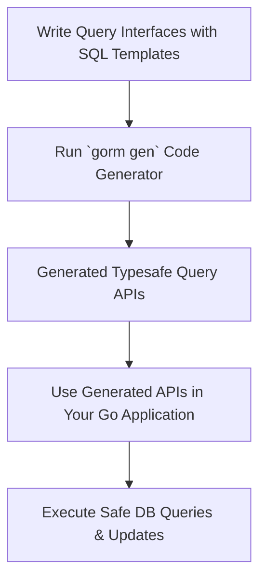

# Generating Type-Safe Query APIs

## Overview
This guide walks you through creating Go interfaces annotated with SQL templates to generate type-safe, fluent query APIs using GORM CLI. You will learn how to define interface methods with SQL comments, run the code generator, and leverage the generated APIs to perform strongly typed database queries and updates. The focus is on expressing complex filtering and searching logic in a comprehensive yet maintainable interface-driven form.

---

## 1. Workflow Overview

### Task Description
Create Go interfaces embedded with raw SQL annotations to define database queries and updates; run the GORM CLI generator to produce type-safe Go code; and consume the generated query APIs to interact with your database safely and effectively.

### Prerequisites
- A Go project using GORM as ORM.
- Go 1.18+ installed (with generics support).
- GORM CLI installed (`go install gorm.io/cli/gorm@latest`).
- Models defined as Go structs compatible with GORM.

### Expected Outcome
You will have generated strongly typed query APIs representing your defined SQL logic, enabling fluent and safe database operations within your Go codebase.

### Time Estimate
Approximately 15–30 minutes including writing interfaces, running the generator, and testing queries.

### Difficulty Level
Intermediate — familiarity with Go interfaces, GORM ORM, and SQL improves your experience.

---

## 2. Defining Query Interfaces with SQL Templates

GORM CLI uses Go interfaces where method comments contain SQL templates. These templates determine the SQL executed for each method and the generator produces corresponding Go implementations.

### Writing Interface Methods
- Create a generic interface, e.g. `Query[T any]`, to specify the type context.
- Add methods annotated with SQL templates in Go method comments.
- Use directives like `@@table`, `@@column`, and `@param` to bind Go parameters to SQL safely.
- Use the `{{where}}`, `{{set}}`, and `{{if}}` template DSL for conditional/complex query building.

#### Example Interface Definition:
```go
// Query interface for user-related queries
// Place inside the same package or directory as your models

type Query[T any] interface {
  // SELECT * FROM @@table WHERE id=@id AND name = "@name"
  GetByID(id int) (T, error)

  // SELECT * FROM @@table WHERE @@column=@value
  FilterWithColumn(column string, value string) (T, error)

  // SELECT * FROM users
  // {{if user.ID > 0}}
  //     WHERE id=@user.ID
  // {{else if user.Name != ""}}
  //     WHERE name=@user.Name
  // {{end}}
  QueryWith(user models.User) (T, error)

  // UPDATE @@table
  //  {{set}}
  //    {{if user.Name != ""}} name=@user.Name, {{end}}
  //    {{if user.Age > 0}} age=@user.Age, {{end}}
  //    {{if user.Age >= 18}} is_adult=1 {{else}} is_adult=0 {{end}}
  //  {{end}}
  // WHERE id=@id
  UpdateInfo(user models.User, id int) error

  // SELECT * FROM @@table
  // {{where}}
  //   {{for _, user := range users}}
  //     {{if user.Name != "" && user.Age > 0}}
  //       (name = @user.Name AND age=@user.Age AND role LIKE concat("%",@user.Role,"%")) OR
  //     {{end}}
  //   {{end}}
  // {{end}}
  Filter(users []models.User) ([]T, error)

  // where("name=@name AND age=@age")
  FilterByNameAndAge(name string, age int)

  // SELECT * FROM @@table
  //  {{where}}
  //    {{if !start.IsZero()}}
  //      created_at > @start
  //    {{end}}
  //    {{if !end.IsZero()}}
  //      AND created_at < @end
  //    {{end}}
  //  {{end}}
  FilterWithTime(start, end time.Time) ([]T, error)
}
```

### Explanation of Template DSL
| Directive   | Description                                   | Example Usage                                    |
|-------------|-----------------------------------------------|-------------------------------------------------|
| `@@table`   | Resolves to the model's table name             | `SELECT * FROM @@table WHERE id=@id`             |
| `@@column`  | Resolves to a dynamically specified column    | `WHERE @@column=@value`                          |
| `@param`    | Binds Go method parameters to SQL parameters  | `WHERE name=@user.Name`                          |
| `{{where}}` | Conditionally generates WHERE clauses          | `{{where}} age > 18 {{end}}`                     |
| `{{set}}`   | Conditionally generates SET clauses for UPDATE| `{{set}} name=@name {{end}}`                      |
| `{{if}}`    | Conditional logic within SQL                    | `{{if age > 0}} AND age=@age {{end}}`            |
| `{{for}}`   | Iteration over collections in SQL templates    | `{{for _, tag := range tags}} ... {{end}}`       |

### Practical Notes
- Parameters are automatically bound safely to SQL.
- Methods may return either a single value, slice, or error depending on use.
- You can mix filtering logic and updates in the templates.

---

## 3. Running the Code Generator

Once your interfaces with SQL templates are defined, use the GORM CLI code generator to produce your typesafe query API implementations.

### Command Usage
```bash
gorm gen -i ./path/to/interfaces -o ./generated
```

- `-i` (--input): Path to your Go package or file containing the interface definitions.
- `-o` (--output): Directory where generated Go files will be placed.

### What Happens Internally
- The CLI parses interface methods and SQL templates.
- It generates Go implementations with strongly typed methods.
- It also generates model-driven field helpers for predicate and update usage.

### Example
```bash
gorm gen -i ./examples -o ./generated
```

This command reads interfaces in `./examples` and creates generated files in `./generated`.

### Tips
- Keep interfaces and models in the same package or directory to simplify imports.
- Use generation config (`genconfig.Config`) for customizing output paths and type mappings if needed.
- Run generator after changing interfaces to keep generated code in sync.

---

## 4. Using Generated Query APIs

After running the generator, your interfaces will have concrete implementations ready to use in your application.

### Instantiating Query Interfaces
Use the generated constructor function named after your interface, e.g., `Query[T any]`:

```go
query := generated.Query[User](db)
```

### Calling Generated Methods
Invoke your SQL template methods as normal Go functions. Context is injected automatically.

Example:
```go
// Retrieve a user by ID
user, err := query.GetByID(ctx, 123)
if err != nil {
    // handle error
}

// Filter users by dynamic column
result, err := query.FilterWithColumn(ctx, "role", "admin")

// Conditional query
user, err = query.QueryWith(ctx, User{Name: "alice"})

// Update user info
err = query.UpdateInfo(ctx, User{Name: "alice", Age: 30}, 123)
```

---

## 5. Real-World Examples

### Example: Get User by ID
```go
user, err := generated.Query[User](db).GetByID(ctx, 123)
if err != nil {
    log.Fatal(err)
}
fmt.Printf("User: %+v\n", user)
```

### Example: Filter Users by Name and Age
```go
query := generated.Query[User](db)
filteredQuery := query.FilterByNameAndAge(ctx, "alice", 25)
users, err := filteredQuery.Find(ctx)
```

### Example: Update User Info Conditionally
```go
err := generated.Query[User](db).UpdateInfo(ctx, User{Name: "bob", Age: 20}, 456)
if err != nil {
    log.Fatal(err)
}
```

### Example: Complex Filtering with Time Window
```go
results, err := generated.Query[User](db).FilterWithTime(ctx, time.Now().Add(-24*time.Hour), time.Now())
```

---

## 6. Best Practices & Tips

- **Keep Your SQL Templates Clear:** Write readable templates with proper formatting and comments.
- **Use `@@table` for Table References:** Avoid hardcoding table names; let the generator resolve model tables automatically.
- **Leverage Template DSL:** Use `{{where}}`, `{{set}}`, and `{{if}}` to avoid bloated queries and guard conditions.
- **Use Context:** All query methods accept Go `context.Context` for cancellations and deadlines.
- **Regularly Regenerate:** Run the generator after interface changes to avoid method signature mismatches.
- **Integrate Field Helpers:** Use generated field helpers for predicates and sets in queries outside the raw SQL interfaces.

---

## 7. Troubleshooting

### Common Issues
- **Empty Output:** Ensure your interface is in the input path given to `gorm gen` and is correctly annotated.
- **Template Errors:** Verify SQL templates syntax. Use simple SQL initially before adding conditionals.
- **Context Missing:** The generator injects context if missing, but include it explicitly if you want direct control.
- **Import Conflicts:** Keep your generated code’s package consistent to avoid import mismatches.

### How to Fix
- Review the interface comments for typos or malformed templates.
- Run `gorm gen` with verbose mode (if available) to see parser errors.
- Confirm Go version meets 1.18 or above.

---

## 8. Next Steps & Related Content

- Explore [Using Generated APIs](https://docs/getting-started/first-run-generation/first-usage) for advanced usage.
- Customize code generation for your project in [Customizing Code Generation](https://docs/getting-started/configuration-validation/customizing-generation).
- Deep dive into [Template-Based SQL Syntax](https://docs/concepts/data-models-config/template-dsl) for writing modular SQL.
- Learn about [Field Helpers and Associations](https://docs/guides/core-workflows/field-helper-usage) to enhance query capabilities.

---

## Reference Links
- [What is GORM CLI?](https://docs/getting-started/introduction-setup/about-gorm-cli)
- [Generating Code](https://docs/getting-started/first-run-generation/generating-code)
- [GORM CLI Repository](https://github.com/go-gorm/cli)

---

## Summary Diagram of Workflow


---

By following this guide, you'll master constructing expressive, type-safe queries that improve code reliability and developer productivity when working with GORM and relational databases in Go.
