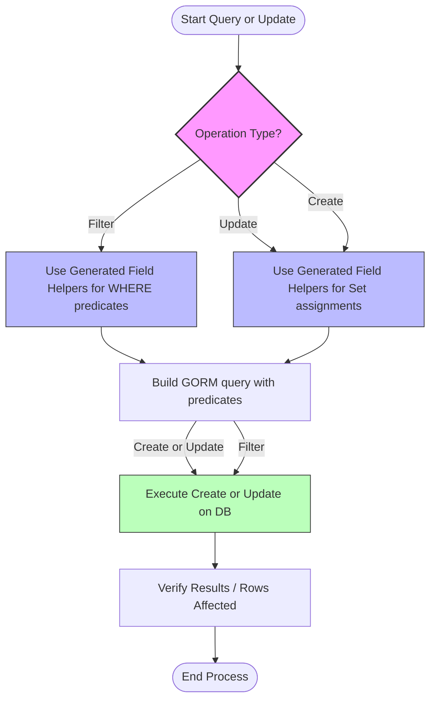

# Using Generated Field Helpers for Filtering and Updates

## Workflow Overview

### Task Description
This guide shows you how to utilize the generated, strongly typed field helpers created by GORM CLI for building expressive, compile-time safe filters, updates, and orderings in your Go projects using GORM. Learn everyday patterns such as predicates for filtering, expressions for advanced updates, and concise field value assignments.

### Prerequisites
- You have run the GORM CLI generator (`gorm gen`) against your model structs to produce generated field helper variables.
- You have a GORM database instance (`*gorm.DB`) ready for query construction.
- Basic familiarity with Go generics and GORM query building.

### Expected Outcome
By following this guide, you will comfortably construct precise type-safe WHERE clauses, perform updates using expressive Set assignments—including zero values and SQL expressions—and use association helpers to manage related entities.

### Time Estimate
15-30 minutes, depending on familiarity with GORM and Go generics.

### Difficulty Level
Intermediate — practical Go coding experience assumed.

---

## Step-by-Step Instructions

### 1. Using Field Helpers to Build Filters

Each generated field helper corresponds to a model field and provides methods like `Eq()`, `Gt()`, `IsNull()`, and `Between()` to build SQL predicates.

#### How to Filter with Field Helpers

- Use `generated.<Model>.<Field>.<Predicate>(value)` to create expressions.
- Pass these expressions to GORM’s `Where()` or `Find()` methods for querying.

```go
// Find users with age greater than 18 AND role equals "active"
var users []models.User
err := gorm.G[models.User](db).
	Where(
		generated.User.Age.Gt(18),
		generated.User.Role.Eq("active"),
	).Find(ctx, &users)
if err != nil {
	// handle error
}
```

#### Verifying Filter Expressions
Check that the generated field corresponds correctly to your DB column and that predicates correctly reflect intended SQL.

### 2. Updating Records Using Field Helpers and Set Assignments

Updates can use the fluent `Set()` method with field helpers to assign values, including zero values and SQL expressions.

#### Simple Update Example

Update all users with role "pending" to "active":

```go
rowsAffected, err := gorm.G[models.User](db).
	Where(generated.User.Role.Eq("pending")).
	Update(ctx, "role", "active")
if err != nil {
	// handle error
}
```

#### Using `Set()` with Assignments
To update multiple fields with safety and clarity, chain `Set()` assignments before calling `Update(ctx)`:

```go
rows, err := gorm.G[models.User](db).
	Where(generated.User.Role.Eq("pending"))
	.Set(
		generated.User.Role.Set("active"),
		generated.User.IsAdult.Set(true),
	).
	Update(ctx)
if err != nil {
	// handle error
}
```

#### Setting Zero Values
Zero values are fully supported and will be persisted correctly:

```go
_, err := gorm.G[models.User](db).
	Where(generated.User.Name.Eq("alice"))
	.Set(
		generated.User.Age.Set(0),
		generated.User.IsAdult.Set(false),
		generated.User.Role.Set(""),
		generated.User.Score.Set(sql.NullInt64{}),
	).
	Update(ctx)
if err != nil {
	// handle error
}
```

#### Using SQL Expressions with `SetExpr()` and Increment

You can use raw SQL expressions or increment fields safely using helpers:

```go
// Increment age by 1 for user named 'bob'
_, err := gorm.G[models.User](db).
	Where(generated.User.Name.Eq("bob"))
	.Set(generated.User.Age.SetExpr(clause.Expr{SQL: "age + ?", Vars: []any{1}}))
	.Update(ctx)

// Or more concisely:
_, err = gorm.G[models.User](db).
	Where(generated.User.Name.Eq("bob"))
	.Set(generated.User.Age.Incr(3))
	.Update(ctx)
```

### 3. Creating Records with `Set()` Assignments

You can also use `Set()` chained assignments followed by `Create(ctx)` to insert new rows:

```go
err := gorm.G[models.User](db).
	Set(
		generated.User.Name.Set("new_user"),
		generated.User.Age.Set(29),
		generated.User.Role.Set("active"),
		generated.User.IsAdult.Set(true),
		generated.User.Score.Set(sql.NullInt64{Int64: 99, Valid: true}),
	).
	Create(ctx)
if err != nil {
	// handle error
}
```

### 4. Combining Complex Sets with Filters

You can combine zero values, string updates, expressions, and filter predicates in one fluent API call.

```go
_, err := gorm.G[models.User](db).
	Where(generated.User.Name.Eq("cathy"))
	.Set(
		generated.User.Role.Set(""), // set empty string
		generated.User.IsAdult.Set(false),
		generated.User.Score.Set(sql.NullInt64{}),
		generated.User.Age.SetExpr(clause.Expr{SQL: "age + ?", Vars: []any{2}}),
	).
	Update(ctx)
```

### 5. Using Field Helpers for Counting and Deleting

- **Counting**:

```go
count, err := gorm.G[models.User](db).
	Where(generated.User.Role.Eq("active"))
	.Count(ctx, "*")
```

- **Deleting Matching Rows**:

```go
rowsDeleted, err := gorm.G[models.User](db).
	Where(generated.User.Role.Eq("pending"))
	.Delete(ctx)
```

### 6. Filtering on Null and Non-Null Values

Field helpers support `IsNull()` and `IsNotNull()` predicates to test nullable columns.

```go
// Find users with LastLogin IS NULL
usersWithNullLogin, err := gorm.G[models.User](db).
	Where(generated.User.LastLogin.IsNull()).
	Find(ctx)

// Find users with Score IS NOT NULL
usersWithScore, err := gorm.G[models.User](db).
	Where(generated.User.Score.IsNotNull()).
	Find(ctx)
```

### 7. Advanced: Using Custom Field Helpers (Example: JSON)

If you map model fields to custom helpers (like JSON), you can use specialized expression builders:

```go
// Find users where Profile JSON field VIP flag is true
user, err := gorm.G[models.User](db).
	Where(generated.User.Profile.Equal("$.vip", true)).
	Take(ctx)
```

---

## Examples & Code Samples

```go
// Filter users over 18 years old and active
var users []models.User
err := gorm.G[models.User](db).
	Where(
		generated.User.Age.Gt(18),
		generated.User.Role.Eq("active"),
	).Find(ctx, &users)

// Update role "pending" to "active"
rows, err := gorm.G[models.User](db).
	Where(generated.User.Role.Eq("pending")).
	Set(generated.User.Role.Set("active")).Update(ctx)

// Create new user with some fields
err = gorm.G[models.User](db).
	Set(
		generated.User.Name.Set("john"),
		generated.User.Age.Set(30),
		generated.User.IsAdult.Set(true),
	).
	Create(ctx)

// Increment age field
_, err = gorm.G[models.User](db).
	Where(generated.User.Name.Eq("mary"))
	.Set(generated.User.Age.Incr(2)).Update(ctx)

// Delete users with role "inactive"
_, err = gorm.G[models.User](db).
	Where(generated.User.Role.Eq("inactive")).Delete(ctx)

// Filter users with last login IS NULL
users, err = gorm.G[models.User](db).
	Where(generated.User.LastLogin.IsNull()).Find(ctx)

// Using JSON custom helper
user, err = gorm.G[models.User](db).
	Where(generated.User.Profile.Equal("$.vip", true)).
	Take(ctx)
```

---

## Troubleshooting & Tips

### Common Issues
- **Zero values ignored in updates:** Always use the `Set()` method with generated helpers to explicitly set zero values. Standard `Update()` with a map or struct may omit zero values.
- **Predicate methods not found:** Ensure your code imports the correct generated package and uses the generated field variable (e.g., `generated.User.Age.Gt(18)`).
- **Updates not applied:** Confirm the `.Update(ctx)` is called after `Set(...)` and filtering is correct.
- **Null checks not working:** Use `IsNull()` or `IsNotNull()` field helper methods for nullable columns.

### Best Practices
- Use field helpers for all filtering and updates to gain compile-time safety.
- Favor `Set()` assignments over raw `Update` map for clarity and precision.
- Combine multiple filters easily by passing multiple predicates to `.Where()`.
- When incrementing numeric fields, prefer `.Incr()` or `.SetExpr()` for atomic updates.
- For nullable fields, leverage null types (e.g., `sql.NullInt64`) with corresponding helpers.

### Performance Considerations
- Filtering with generated predicates results in efficient SQL where clauses.
- Batched updates or creates can be composed with `Set()` efficiently.

### Alternative Approaches
If you prefer raw SQL or GORM chains, you can mix generated helpers with standard GORM where clauses, but you lose type safety.

---

## Next Steps & Related Content

### What's Next
- Explore [Working with Associations: Create, Update, Unlink, Delete](/guides/core-workflows/associations-best-practices) for managing related entities using association field helpers.
- Learn about [Defining Query Interfaces & SQL Templates](/guides/core-workflows/query-apis-and-templates) to generate your own type-safe query APIs.
- Customize field helper generation with [Configuring Generation with genconfig.Config](/guides/advanced-usage/configuring-generation).

### Related Guides
- [Quickstart Workflow](/overview/feature-highlights-getting-started/quickstart-workflow)
- [Validate & Use Your Generated APIs](/getting-started/config-first-use/validate-generated-code)
- [Using and Defining Custom Field Helpers](/guides/advanced-usage/custom-field-helpers)

### Resources
- Official GORM CLI repo on GitHub: https://github.com/go-gorm/cli
- GORM ORM library: https://gorm.io/

---

## Summary Diagram
This Mermaid diagram illustrates the typical user flow when using generated field helpers for filtering and updates in GORM CLI.


