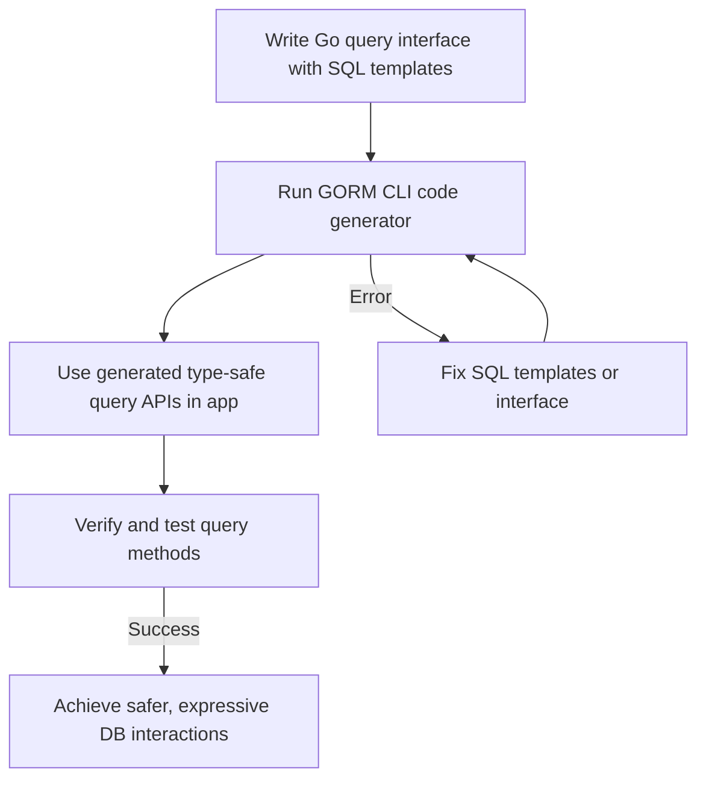

# Using Type-Safe Query APIs

This guide takes you through designing and effectively using GORM CLI-generated type-safe query APIs based on Go interfaces decorated with SQL templates. You will learn how to create robust query methods, leverage expressive filtering and updating patterns, and integrate the resulting APIs practically within your Go applications. By following this workflow, you will enhance productivity, enforce compile-time safety, and simplify complex database interactions.

---

## 1. Workflow Overview

### Task Description
This document guides you on how to write query interfaces with inline SQL templates, generate type-safe query APIs using GORM CLI, and utilize those APIs for selecting, filtering, and updating data in a type-safe manner.

### Prerequisites
- You have installed GORM CLI and set it up correctly in your Go project
- Defined your Go model structs representing your database schema
- Written Go interfaces with method signatures and SQL/templating comments
- Basic familiarity with GORM usage and Go generics (Go 1.18+)

### Expected Outcome
- Generated concrete query implementations from your interfaces
- Ability to invoke type-safe methods to perform custom SQL queries
- Usage of advanced query-building features such as conditional WHERE and SET clauses
- Practical understanding of how query templates translate into working API methods

### Time Estimate
15–30 minutes to write interfaces, generate code, and run your first query

### Difficulty Level
Intermediate: requires some knowledge of Go generics, GORM, and SQL templating concepts

---

## 2. Step-by-Step Instructions

### Step 1: Define Your Query Interface with SQL Templates
Create an interface describing the queries you want, adding SQL templates or directives as method comments.

Example:
```go
// Query defines type-safe queries for User model
// The SQL template directives appear as comments.
type Query[T any] interface {
  // SELECT * FROM @@table WHERE id=@id AND name = "\@name"
  GetByID(id int) (T, error)

  // SELECT * FROM @@table WHERE @@column=@value
  FilterWithColumn(column string, value string) (T, error)

  // SELECT * FROM users
  //   {{if user.ID > 0}}
  //       WHERE id=@user.ID
  //   {{else if user.Name != ""}}
  //       WHERE name=@user.Name
  //   {{end}}
  QueryWith(user models.User) (T, error)

  // UPDATE @@table
  //  {{set}}
  //    {{if user.Name != ""}} name=@user.Name, {{end}}
  //    {{if user.Age > 0}} age=@user.Age, {{end}}
  //    {{if user.Age >= 18}} is_adult=1 {{else}} is_adult=0 {{end}}
  //  {{end}}
  // WHERE id=@id
  UpdateInfo(user models.User, id int) error

  // SELECT * FROM @@table
  // {{where}}
  //   {{for _, user := range users}}
  //     {{if user.Name != "" && user.Age > 0}}
  //       (name = @user.Name AND age=@user.Age AND role LIKE concat("%",@user.Role,"%")) OR
  //     {{end}}
  //   {{end}}
  // {{end}}
  Filter(users []models.User) ([]T, error)

  // where("name=@name AND age=@age")
  FilterByNameAndAge(name string, age int)

  // SELECT * FROM @@table
  //  {{where}}
  //    {{if !start.IsZero()}}
  //      created_at > @start
  //    {{end}}
  //    {{if !end.IsZero()}}
  //      AND created_at < @end
  //    {{end}}
  //  {{end}}
  FilterWithTime(start, end time.Time) ([]T, error)
}
```

> **Tip:**
> - Use `@@table` to refer to the model's table name dynamically.
> - Use `@param` syntax to bind Go function parameters safely.
> - Use templating directives like `{{where}}`, `{{set}}`, `{{if}}`, and `{{for}}` for flexible SQL generation.


### Step 2: Generate the Query API Code
Run the GORM CLI code generator to transform your interface and models into implementation code.

```bash
gorm gen -i ./examples -o ./generated
```

This command scans the specified input directory with your interfaces and models, generating type-safe query APIs in the output directory.

### Step 3: Use the Generated Query APIs
Import the generated package in your Go application and call the generated methods.

Examples:
```go
// Import the generated package
import (
  "context"
  "generated" // your generated code package
  "gorm.io/gorm"
  "gorm.io/cli/gorm/examples/models"
)

func exampleUsage(db *gorm.DB) error {
  ctx := context.Background()

  // Initialize query interface for User
  query := generated.Query[models.User](db)

  // Execute GetByID to fetch a user with id 123
  user, err := query.GetByID(ctx, 123)
  if err != nil {
    return err
  }

  // Use FilterByNameAndAge chained with Find
  users, err := query.FilterByNameAndAge("alice", 30).Find(ctx)
  if err != nil {
    return err
  }

  // Use QueryWith with conditional SQL
  result, err := query.QueryWith(ctx, models.User{Name: "dan"})
  if err != nil {
    return err
  }

  // Update user info with conditional SET
  err = query.UpdateInfo(ctx, models.User{Name: "jon", Age: 25}, 123)
  if err != nil {
    return err
  }

  return nil
}
```

### Step 4: Understand Generated Method Behavior
- **GetByID(id int) (T, error)**
  Runs `SELECT * FROM @@table WHERE id = ? AND name = "@name"` — demonstrates fixed name condition.

- **FilterWithColumn(column, value) (T, error)**
  Runs `SELECT * FROM @@table WHERE ? = ?` — allows dynamic column filtering.

- **QueryWith(user User) (T, error)**
  Builds conditional WHERE clause based on populated fields in `user` parameter.

- **UpdateInfo(user User, id int) error**
  Runs dynamic UPDATE with conditional SET clause showcasing flexible update logic.

- **Filter(users []User) ([]T, error)**
  Accepts slice of users and generates OR-connected composite WHERE clause.

- **FilterByNameAndAge(name string, age int)**
  Applies a WHERE filter directly onto the query builder, enabling chaining.

- **FilterWithTime(start, end time.Time) ([]T, error)**
  Filters by a time window with optional boundary conditions.


### Step 5: Verify and Troubleshoot
- After code generation, write tests or quick validation to confirm methods behave as expected.
- Verify that your SQL template syntax in comments matches GORM CLI expectations.
- If you encounter errors, refer to troubleshooting guides and ensure your Go environment meets version and dependency requirements.

---

## 3. Examples & Code Samples

### SQL Template Examples from Interface
```sql
-- Basic query by ID and fixed name
SELECT * FROM @@table WHERE id=@id AND name = "@name"

-- Dynamic column filter
SELECT * FROM @@table WHERE @@column=@value

-- Conditional WHERE clause
SELECT * FROM users
{{if user.ID > 0}}
  WHERE id=@user.ID
{{else if user.Name != ""}}
  WHERE name=@user.Name
{{end}}

-- Conditional SET clause for UPDATE
UPDATE @@table
{{set}}
  {{if user.Name != ""}} name=@user.Name, {{end}}
  {{if user.Age > 0}} age=@user.Age, {{end}}
  {{if user.Age >= 18}} is_adult=1 {{else}} is_adult=0 {{end}}
{{end}}
WHERE id=@id
```

### Go Usage Example
```go
user, err := generated.Query[models.User](db).GetByID(ctx, 123)
if err != nil {
  log.Fatal(err)
}

results, err := generated.Query[models.User](db).FilterByNameAndAge("alice", 20).Find(ctx)

err = generated.Query[models.User](db).UpdateInfo(ctx, models.User{Name: "jinzhu", Age: 20}, 1)
```

### Advanced Filtering Example
```go
filters := []models.User{
  {Name: "alice", Age: 20, Role: "active"},
  {Name: "dan", Age: 40, Role: "pending"},
}
users, err := generated.Query[models.User](db).Filter(ctx, filters)
```

This translates into a dynamically OR-joined WHERE condition with ANDed attribute checks, increasing expressiveness while maintaining type safety.

---

## 4. Troubleshooting & Tips

### Common Issues
- **Empty or invalid SQL templates:** Ensure templates in method comments have valid syntax and placeholders.
- **Missing context parameter:** If your method signature lacks `context.Context`, the generator will add it automatically, but explicit use is recommended.
- **Incorrect dynamic bind usage:** Use only defined parameters and respect Go syntax inside templates.
- **Field name mismatches:** Confirm that `@@table` and `@@column` correspond correctly to your model's table and columns.

### Best Practices
- Write simple test queries first for validation before complex conditional SQL.
- Use `FilterByNameAndAge`-style methods to chain conditions fluently.
- Keep SQL templates readable with indentation and comments.
- Utilize the `genconfig.Config` to customize generation behavior and map custom field helpers.

### Performance Considerations
- Avoid overly complex dynamic SQL inside templates to retain optimized query plans.
- When filtering on slices, consider batching to reduce SQL statement length.

### Alternative Approaches
- For very complex queries, consider manual SQL execution or raw GORM builder API alongside generated APIs.
- Use association helpers and field-driven predicates for filtering related models.

---

## 5. Next Steps & Related Content

- **Project Configuration:** Customize code generation via `genconfig.Config` for output paths and field mappings. See [Project Configuration](/getting-started/first-steps/project-configuration).
- **Quick Validation:** Test and verify your generated query methods work as expected. See [Quick Validation](/getting-started/first-steps/quick-validation).
- **Model-Driven Field Helpers:** Combine query APIs with generated helpers for updates and filters. See [Model-Driven Field Helpers and Updates](/guides/core-workflows/model-driven-field-helpers).
- **Advanced Patterns:** Explore complex association queries and custom generation techniques. See [Working with Associations](/guides/advanced-patterns/working-with-associations) and [Customizing Generation](/guides/advanced-patterns/customizing-generation).
- **Template-Based SQL DSL:** Deep dive into the SQL templating language for maximum flexibility. See [SQL Template DSL: Power and Flexibility](/guides/advanced-patterns/template-sql-dsl).

---

## Summary Diagram



---

By following this guide, you transform SQL query intents into type-checked, discoverable methods, significantly improving your Go application's database interaction quality and developer experience.


