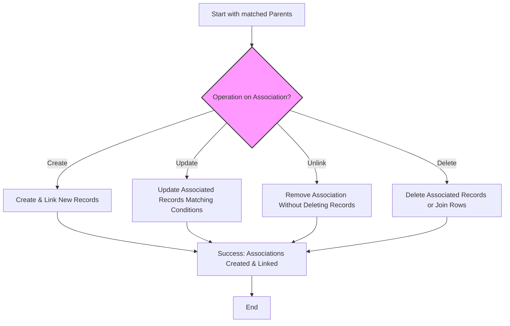

# Handling Associations: Create, Update, Unlink & Delete

In this guide, you will master using GORM CLI's automatic association helpers to manage parent-child relations with confidence and efficiency. It breaks down real-world scenarios such as linking, unlinking, deleting, and batch operations — all implemented in a type-safe, intuitive way that boosts productivity and reduces runtime errors.

---

## 1. Understanding Association Helpers

The generated field helpers for associations provide a powerful layer over GORM's core to manage related entities automatically. They appear as struct or slice fields on generated models (e.g., `generated.User.Pets`, `generated.User.Account`) with methods that represent common association operations.

### What You Can Achieve
- **Create:** Add new related records and link to parents in one operation.
- **Update:** Modify associated records matching optional conditions.
- **Unlink:** Detach associations without deleting related data.
- **Delete:** Remove associated records completely (or just join rows in many2many).
- **Batch Operations:** Create/link multiple associated records efficiently.

### Types of Association Helpers
| Association Type | Helper Type | Example Field           |
|------------------|--------------|------------------------|
| Has One / Belongs To | `field.Struct[T]` | `generated.User.Account`  |
| Has Many / Many2Many  | `field.Slice[T]`  | `generated.User.Pets`     |

---

## 2. Prerequisites

Before progressing, ensure you have:
- Generated your field helpers with GORM CLI by running `gorm gen` on your models.
- Imported the generated packages (`examples/output/models` in examples).
- Set up a valid GORM `*gorm.DB` instance initialized with your database.
- Familiarity with basic GORM query usage and context handling.

---

## 3. Step-by-Step Usage Guide

Follow these actionable steps to effectively handle associations.

### Step 1: Creating and Linking Associations

Use `.Set(...).Create(...)` or `.Set(...).CreateInBatch(...)` inside a `gorm.G[T]` chain to insert parent with associated children.

```go
// Create a new User with one Pet linked (Has Many)
gorm.G[User](db).
  Set(
    generated.User.Name.Set("alice"),
    generated.User.Pets.Create(generated.Pet.Name.Set("fido")),
  ).
  Create(ctx)

// Create new User and link multiple Languages (Many2Many)
gorm.G[User](db).
  Set(
    generated.User.Name.Set("polyglot"),
    generated.User.Languages.CreateInBatch([]models.Language{{Code: "EN"}, {Code: "FR"}}),
  ).
  Create(ctx)
```

> **TIP:** `Create()` on `field.Struct` creates exactly one associated record per matched parent, while `CreateInBatch()` on `field.Slice` enables efficient batch inserts for multiple records.


### Step 2: Updating Associated Records with Optional Conditions

Use `.Where(...).Update(...)` to selectively modify associated records matching filter criteria.

```go
// Update pet named "fido" to "rex" for user with ID 1
gorm.G[User](db).
  Where(generated.User.ID.Eq(1)).
  Set(
    generated.User.Pets.Where(generated.Pet.Name.Eq("fido")).
      Update(generated.Pet.Name.Set("rex")),
  ).
  Update(ctx)
```

> **Note:** Conditions inside `.Where()` apply to the associated records, not the parent.


### Step 3: Unlinking Associations Without Deleting Data

Unlink breaks the relation by nullifying foreign keys or removing join rows in many2many, leaving actual records intact.

```go
// Unlink all pets from user ID 1 (sets pets' user_id to NULL)
gorm.G[User](db).
  Where(generated.User.ID.Eq(1)).
  Set(generated.User.Pets.Unlink()).
  Update(ctx)

// Unlink belongs to association (Company) from user (sets user.CompanyID to NULL)
gorm.G[User](db).
  Where(generated.User.ID.Eq(1)).
  Set(generated.User.Company.Unlink()).
  Update(ctx)
```

> **Warning:** Unlink preserves associated data but removes linkage; use Delete if you want to remove records.


### Step 4: Deleting Associated Records

Deletes remove associated rows. In many2many associations, only join table rows are deleted, preserving related records.

```go
// Delete all pets named "a" for user ID 1
gorm.G[User](db).
  Where(generated.User.ID.Eq(1)).
  Set(generated.User.Pets.Where(generated.Pet.Name.Eq("a")).Delete()).
  Update(ctx)

// Delete a m2m join row but keep the language row
// (removes join but keeps Language entity)
gorm.G[User](db).
  Where(generated.User.ID.Eq(1)).
  Set(generated.User.Languages.Where(generated.Language.Code.Eq("EN")).Delete()).
  Update(ctx)
```


### Step 5: Batch Creating and Linking Associated Records

Efficiently link multiple existing or new associated records to each parent using `CreateInBatch`.

```go
// Batch create multiple pets linked to a user
gorm.G[User](db).
  Where(generated.User.ID.Eq(1)).
  Set(generated.User.Pets.CreateInBatch([]models.Pet{{Name: "bm1"}, {Name: "bm2"}})).
  Update(ctx)

// Batch create and link many2many Languages
gorm.G[User](db).
  Where(generated.User.ID.Eq(1)).
  Set(generated.User.Languages.CreateInBatch([]models.Language{{Code: "B1"}, {Code: "B2"}})).
  Update(ctx)
```

---

## 4. Association Semantics & Behaviors

Understanding how operations affect related tables depending on association types is critical.

| Association Type | Unlink Effect               | Delete Effect                      |
|------------------|----------------------------|----------------------------------|
| Belongs To       | Parent FK set to NULL      | Deletes associated rows           |
| Has One / Has Many| Child FK set to NULL       | Deletes child rows                |
| Many2Many        | Removes join table rows    | Removes join rows only, keeps rows|

> Polymorphic associations behave similarly to Has One / Has Many with appropriate FK nulling.


---

## 5. Practical Tips & Best Practices

- **Always set filters on parents before applying association helpers.** Use `.Where(...)` on the parent to select which parents the association change applies to.
- **Use `.Where(...)` on association helpers to filter which linked records to operate on.**
- **Prefer `.Update(...)` for partial updates to related records; `.Create(...)` to add new linked data.**
- **Batch operations reduce SQL round trips but beware of transaction size on very large batches.**
- **Unlink instead of delete to preserve data integrity where appropriate.**
- **Polymorphic associations unlink by zeroing owner foreign keys but preserve rows unless explicitly deleted.**


---

## 6. Common Pitfalls & Troubleshooting

<AccordionGroup title="Troubleshooting Association Operations">
<Accordion title="Association changes don't apply as expected">
- Ensure the parent `.Where(...)` correctly targets the intended parent rows.
- Verify association helper names correspond to actual model associations.
- Check `.Set(...)` and `.Update(ctx)` chaining is correctly performed.
- Use logs or SQL debug mode to inspect generated SQL.
</Accordion>

<Accordion title="Unlink fails to clear foreign keys">
- Confirm foreign keys in database allow NULLs.
- Check association setup follows GORM FK conventions.
- Unlink requires update permission on child or parent tables.
</Accordion>

<Accordion title="Batch create doesn't link associations">
- Validate the batch records are constructed with required fields.
- Ensure association is a `field.Slice`, as batch create is unsupported on `field.Struct`.
- Check for generation config or field mapping interference.
</Accordion>

<Accordion title="Delete removes join rows but not related records in many2many">
- This is by design. Delete on many2many will only delete join table rows.
- To remove related records themselves, delete them manually.
</Accordion>
</AccordionGroup>


---

## 7. Real-World Use Case Examples

```go
// 1) Create user with pets and languages
user := generated.User.Name.Set("alice")
pets := generated.User.Pets.Create(generated.Pet.Name.Set("fluffy"))
languages := generated.User.Languages.CreateInBatch([]models.Language{{Code: "EN"}, {Code: "FR"}})

res, err := gorm.G[User](db).
  Set(user, pets, languages).
  Create(ctx)

// 2) Update pets named "fluffy" to "fido" for users named "alice"
res, err = gorm.G[User](db).
  Where(generated.User.Name.Eq("alice")).
  Set(generated.User.Pets.Where(generated.Pet.Name.Eq("fluffy")).Update(generated.Pet.Name.Set("fido"))).
  Update(ctx)

// 3) Unlink all languages from user with ID 1
gorm.G[User](db).
  Where(generated.User.ID.Eq(1)).
  Set(generated.User.Languages.Unlink()).
  Update(ctx)

// 4) Delete pets named "old" linked to user 1
gorm.G[User](db).
  Where(generated.User.ID.Eq(1)).
  Set(generated.User.Pets.Where(generated.Pet.Name.Eq("old")).Delete()).
  Update(ctx)
```

---

## 8. Next Steps & Related Topics

- Explore the [Interface-Driven Query APIs](https://gorm.io/docs/concepts/interface-driven-queries) for advanced querying.
- Learn about [Model-Driven Field Helpers](https://gorm.io/docs/concepts/model-driven-field-helpers) for filters and updates.
- Deep dive into [Generation Configuration](https://gorm.io/docs/concepts/generation-configuration) to customize association helper output.
- Review [Template DSL and SQL Templating](https://gorm.io/docs/concepts/template-dsl) for complex SQL logic in queries.

---

## 9. Summary Diagram: Association Operations Workflow



---

With this guide, you now hold a practical and in-depth understanding to handle associations in your GORM CLI-generated codebase with type safety, clarity, and confidence.
