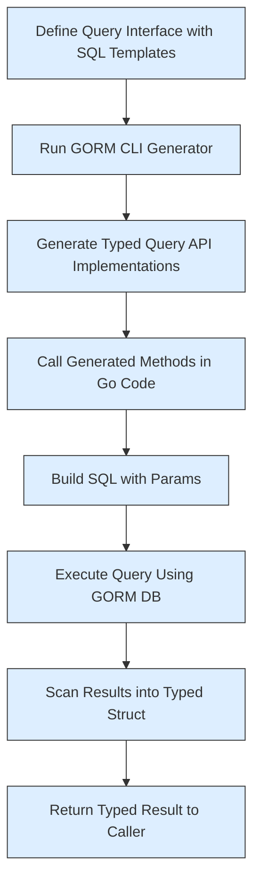

# Working with Type-Safe Query APIs

Discover how to design and use interface-driven queries with SQL templates, enabling you to generate strongly-typed query methods for GORM projects. This guide walks you through defining Go interfaces with embedded SQL in comments, generating concrete query APIs, and executing queries with compile-time safety and productivity.

---

## 1. What Are Type-Safe Query APIs?

GORM CLI transforms your Go interfaces annotated with SQL templates into concrete, type-safe query implementations. This means you write clear, readable method interfaces with SQL comments — and the tool generates strongly-typed, auto-complete-friendly code that interacts seamlessly with your database using GORM.

These query APIs offer:

- Compile-time safety catching mismatched types or missing params
- Fluent, discoverable method signatures that ease coding
- Flexible SQL templating (dynamic WHERE, SET, and iteration)

## 2. Designing Query Interfaces

### Core Patterns

To create a query interface recognized by GORM CLI:

- Define an interface named with a prefix like `Query*` (configurable, but follows this convention by default).
- For each method, write a SQL template comment describing the intended SQL query or update.
- Use placeholders and directives in the comments to bind Go method parameters safely.

### SQL Template Syntax

| Directive   | Purpose                                    | Example                                         |
|-------------|--------------------------------------------|------------------------------------------------|
| `@@table`   | Resolves to the model's table name          | `SELECT * FROM @@table WHERE id=@id`            |
| `@@column`  | Dynamic column name placeholder             | `WHERE @@column=@value`                          |
| `@param`    | Maps Go method parameters to SQL params     | `WHERE name=@user.Name`                          |
| `{{where}}` | Wraps conditional WHERE clauses              | `{{where}} age > 18 {{end}}`                     |
| `{{set}}`   | Wraps conditional SET clauses (for UPDATE)  | `{{set}} name=@name {{end}}`                     |
| `{{if}}`    | Conditional SQL fragments                      | `{{if age > 0}} AND age=@age {{end}}`            |
| `{{for}}`   | Iteration over a slice/map                      | `{{for _, t := range tags}} ... {{end}}`         |

### Example Interface

```go
// Query defines template-driven query methods.
type Query[T any] interface {
  // SELECT * FROM @@table WHERE id=@id
  GetByID(id int) (T, error)

  // SELECT * FROM @@table WHERE @@column=@value
  FilterWithColumn(column string, value string) (T, error)

  // SELECT * FROM users
  // {{where}}
  //   {{if user.ID > 0}} WHERE id=@user.ID {{end}}
  //   {{else if user.Name != ""}} WHERE name=@user.Name {{end}}
  // {{end}}
  QueryWith(user models.User) (T, error)

  // UPDATE @@table
  // {{set}}
  //   {{if user.Name != ""}} name=@user.Name, {{end}}
  //   {{if user.Age > 0}} age=@user.Age, {{end}}
  //   {{if user.Age >= 18}} is_adult=1 {{else}} is_adult=0 {{end}}
  // {{end}}
  // WHERE id=@id
  UpdateInfo(user models.User, id int) error

  // SELECT * FROM @@table
  // {{where}}
  //   {{for _, user := range users}}
  //     {{if user.Name != "" && user.Age > 0}}
  //       (name = @user.Name AND age=@user.Age AND role LIKE concat("%",@user.Role,"%")) OR
  //     {{end}}
  //   {{end}}
  // {{end}}
  Filter(users []models.User) ([]T, error)

  // where("name=@name AND age=@age")
  FilterByNameAndAge(name string, age int)

  // SELECT * FROM @@table
  // {{where}}
  //   {{if !start.IsZero()}} created_at > @start {{end}}
  //   {{if !end.IsZero()}} AND created_at < @end {{end}}
  // {{end}}
  FilterWithTime(start, end time.Time) ([]T, error)
}
```

## 3. Writing SQL Templates: Best Practices

- Use `@@table` to reference the current model table dynamically.
- Bind method parameters with `@param` for safe SQL parameterization.
- Use `{{where}}` and `{{set}}` blocks to conditionally include SQL fragments.
- Employ `{{if CONDITION}}` to check parameters or struct fields inside templates.
- When filtering multiple records, use `{{for}}` iteration over slices safely.
- Escape special characters inside SQL comments properly.

<Tip>
SQL template comments translate directly into generated methods, so verify your SQL and bindings carefully.
</Tip>

## 4. Generating Query Code

Once your interfaces are ready:

1. Run the GORM CLI generator, specifying input Go file(s) containing interfaces:

```bash
gorm gen -i ./path/to/your/interfaces -o ./generated
```

2. The generator outputs strongly-typed implementations in the specified output directory.

3. These implementations inject `context.Context` automatically if not present.

## 5. Using Generated Query APIs

After generation, you can consume the query APIs as follows:

```go
import (
  "context"
  "yourmodule/generated"
  "gorm.io/gorm"
)

func Example(db *gorm.DB) error {
  ctx := context.Background()

  // Query single user by ID
  user, err := generated.Query[User](db).GetByID(ctx, 123)
  if err != nil {
    return err
  }

  // Filter users by dynamic column value
  filteredUser, err := generated.Query[User](db).FilterWithColumn(ctx, "email", "user@example.com")
  if err != nil {
    return err
  }

  // Update user info conditionally
  err = generated.Query[User](db).UpdateInfo(ctx, User{Name: "Alice", Age: 30}, 123)
  if err != nil {
    return err
  }

  // Use fluent filters
  filteredQuery := generated.Query[User](db).FilterByNameAndAge(ctx, "Alice", 30)
  users, err := filteredQuery.Find(ctx)
  if err != nil {
    return err
  }

  // Filtering with time interval
  usersInRange, err := generated.Query[User](db).FilterWithTime(ctx, start, end)
  if err != nil {
    return err
  }

  // You now have strongly typed, safe, and flexible query APIs!
  _ = user
  _ = filteredUser
  _ = users
  _ = usersInRange
  return nil
}
```

## 6. Deep Dive: How It Works Under the Hood

- The generated code builds SQL strings dynamically using `strings.Builder` inside each method.
- Parameter placeholders with `clause.Table` and `clause.Column` keep queries safe.
- Queries automatically use GORM's DSL and scan results into your typed structs.
- The generator adds `context.Context` parameters when missing to support cancellation and deadlines.

## 7. Common Pitfalls & Troubleshooting

<AccordionGroup title="Troubleshooting Common Issues">
<Accordion title="Method Missing Context Parameter">
If your interface method lacks a `context.Context` param, GORM CLI auto-injects it. If you call your method without a context, add one explicitly to avoid errors.
</Accordion>
<Accordion title="SQL Template Syntax Errors">
Carefully validate your SQL templating comments. Missing closing directives or malformed conditionals cause generation or runtime failures.
</Accordion>
<Accordion title="Interface Name Patterns Not Matching">
Ensure interface names match the configured include patterns, e.g., starting with `Query`. Otherwise, the generator skips them.
</Accordion>
<Accordion title="Parameter and Placeholder Mismatches">
Make sure each method parameter is correctly referenced using `@param` syntax in your SQL comments to prevent bind errors.
</Accordion>
</AccordionGroup>

## 8. Best Practices and Tips

- Keep query interfaces small and focused per model or feature.
- Use Go generics to maintain reusable types and implementations.
- Combine multiple filters through fluent methods that return the interface.
- Leverage the full SQL template DSL for advanced dynamic queries.
- Test generated code early and validate SQL correctness with your DB.

## 9. Visualization: Query Execution Flow



## 10. Where to Go Next

- Explore [Preparing Your Models and Interfaces](/getting-started/first-run-basic-usage/prepare-code) to properly define models and interfaces.
- Learn how to run the generator with [Running the Generator](/getting-started/first-run-basic-usage/run-generator).
- Combine these query APIs with field helpers from [Using Model-Driven Field Helpers](/guides/core-workflows/using-model-field-helpers).
- Customize generation via [Configuring GORM CLI](/getting-started/configuration-and-troubleshooting/configuring-generator).


---

### References and Related Links

- [GORM CLI Overview — What is GORM CLI?](/overview/product-introduction/what-is-gorm-cli)
- [Core Features Overview](/overview/product-introduction/feature-highlights)
- [Example Query Interface Source](https://github.com/go-gorm/cli/blob/main/examples/query.go)
- [Generated Code Example](https://github.com/go-gorm/cli/blob/main/examples/output/query.go)
- [SQL Template DSL Explanation in README](README.md)


---

# Appendix: Complete Sample Query Interface (Go)

```go
package examples

import (
  "time"
  "gorm.io/cli/gorm/examples/models"
)

type Query[T any] interface {
  // SELECT * FROM @@table WHERE id=@id
  GetByID(id int) (T, error)

  // SELECT * FROM @@table WHERE @@column=@value
  FilterWithColumn(column string, value string) (T, error)

  // SELECT * FROM users
  // {{where}}
  //   {{if user.ID > 0}} WHERE id=@user.ID {{end}}
  //   {{else if user.Name != ""}} WHERE name=@user.Name {{end}}
  // {{end}}
  QueryWith(user models.User) (T, error)

  // UPDATE @@table
  // {{set}}
  //   {{if user.Name != ""}} name=@user.Name, {{end}}
  //   {{if user.Age > 0}} age=@user.Age, {{end}}
  //   {{if user.Age >= 18}} is_adult=1 {{else}} is_adult=0 {{end}}
  // {{end}}
  // WHERE id=@id
  UpdateInfo(user models.User, id int) error

  // SELECT * FROM @@table
  // {{where}}
  //   {{for _, user := range users}}
  //     {{if user.Name != "" && user.Age > 0}}
  //       (name = @user.Name AND age=@user.Age AND role LIKE concat("%",@user.Role,"%")) OR
  //     {{end}}
  //   {{end}}
  // {{end}}
  Filter(users []models.User) ([]T, error)

  // where("name=@name AND age=@age")
  FilterByNameAndAge(name string, age int)

  // SELECT * FROM @@table
  // {{where}}
  //   {{if !start.IsZero()}} created_at > @start {{end}}
  //   {{if !end.IsZero()}} AND created_at < @end {{end}}
  // {{end}}
  FilterWithTime(start, end time.Time) ([]T, error)
}
```


---