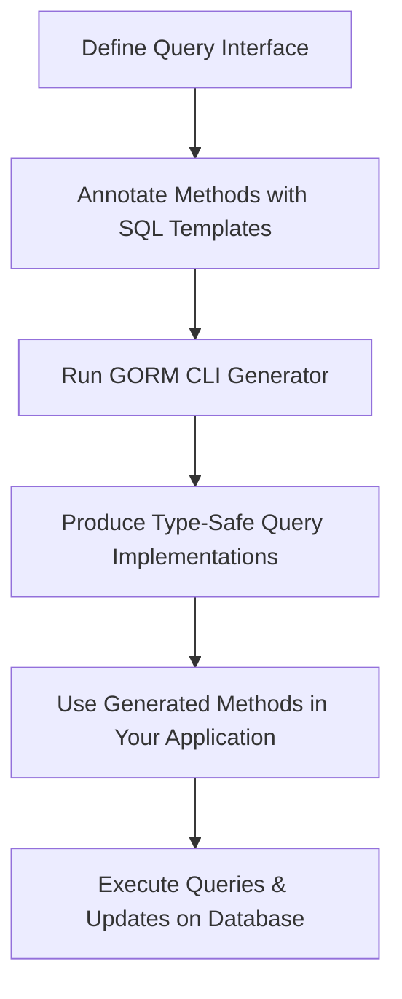

# Writing Type-Safe Queries from Interfaces

## Overview
This guide walks you through the foundational pattern of defining query interfaces with embedded SQL templates and generating concrete, strongly-typed query methods for use with GORM CLI. It focuses exclusively on how to use Go interfaces to declare your SQL-driven queries in a type-safe manner, enabling you to write flexible, reusable, and maintainable database calls with compile-time safety.

By mastering this page, you will understand how to create query interfaces, annotate them with SQL templates in comments, and generate actual Go code for your query operations.

---

## 1. Workflow Overview

### Task Description
Learn how to write Go interfaces that define raw SQL queries using template directives in method comments, and generate corresponding strongly-typed query implementations automatically from these interfaces. This provides a seamless way to express queries declaratively and gain type safety.

### Prerequisites
- A Go project using GORM with Go 1.18+ (generics support)
- Basic understanding of Go interfaces and methods
- Familiarity with SQL query basics
- Installed GORM CLI tool (`gorm.io/cli/gorm`)

### Expected Outcome
- You will define interfaces with annotated SQL templates for common querying use cases
- You will run GORM CLI generator to produce typesafe query implementations
- You will be able to invoke generated methods to perform complex database queries

### Time Estimate
About 15-30 minutes to write your first interface, generate code, and integrate it into your application.

### Difficulty Level
Intermediate: Requires comfort with interfaces, SQL, and Go generics

---

## 2. Defining Your Query Interfaces

### Writing Interface Methods with SQL Templates
Your query interfaces describe methods you want to expose for querying data, along with the exact SQL templates as structured comments. Method parameters map to SQL placeholders, ensuring type-safe query construction.

Example interface:

```go
// Query defines user-related query methods
// with embedded SQL templates for generation.
type Query[T any] interface {
  // GetByID queries a record by id
  //
  // SELECT * FROM @@table WHERE id=@id AND name = "\@name"
  GetByID(id int) (T, error)

  // FilterWithColumn queries based on a dynamic column/value
  // SELECT * FROM @@table WHERE @@column=@value
  FilterWithColumn(column string, value string) (T, error)

  // QueryWith demonstrates conditional SQL with if-else
  // SELECT * FROM users
  //   {{if user.ID > 0}}
  //       WHERE id=@user.ID
  //   {{else if user.Name != ""}}
  //       WHERE name=@user.Name
  //   {{end}}
  QueryWith(user models.User) (T, error)

  // UpdateInfo shows dynamic UPDATE with set template
  // UPDATE @@table
  //  {{set}}
  //    {{if user.Name != ""}} name=@user.Name, {{end}}
  //    {{if user.Age > 0}} age=@user.Age, {{end}}
  //    {{if user.Age >= 18}} is_adult=1 {{else}} is_adult=0 {{end}}
  //  {{end}}
  // WHERE id=@id
  UpdateInfo(user models.User, id int) error

  // Filter demonstrates complex filtering with loops
  // SELECT * FROM @@table
  // {{where}}
  //   {{for _, user := range users}}
  //     {{if user.Name != "" && user.Age > 0}}
  //       (name = @user.Name AND age=@user.Age AND role LIKE concat("%",@user.Role,"%")) OR
  //     {{end}}
  //   {{end}}
  // {{end}}
  Filter(users []models.User) ([]T, error)

  // FilterByNameAndAge is a simple where clause method
  // where("name=@name AND age=@age")
  FilterByNameAndAge(name string, age int)

  // FilterWithTime shows conditional filters on time ranges
  // SELECT * FROM @@table
  //  {{where}}
  //    {{if !start.IsZero()}}
  //      created_at > @start
  //    {{end}}
  //    {{if !end.IsZero()}}
  //      AND created_at < @end
  //    {{end}}
  //  {{end}}
  FilterWithTime(start, end time.Time) ([]T, error)
}
```

### Template Directive Highlights
- `@@table`: Resolves to the model's underlying table name
- `@@column`: Used for dynamic columns
- `@param`: Binds Go method parameters to SQL placeholders
- `{{where}}`, `{{set}}`: Conditional SQL sections
- `{{if}}`, `{{else}}`, `{{end}}`: Control flow inside templates
- `{{for}}`: Looping over slices or arrays in queries

<Tip>
Use Go method parameter names, struct fields, and loop variables carefully to ensure smooth mapping to SQL placeholders.
</Tip>

### Practical Tips
- Include accurate, expressive SQL templates in method comments
- Use conditional templates to build flexible WHERE/SET clauses
- Parameter types in your interface must be consistent with model fields

---

## 3. Generating Code from Interfaces

Once your interfaces are ready with the SQL templates, invoke the GORM CLI generator:

```bash
gorm gen -i ./your_package -o ./generated
```

- The `-i` flag points to your Go source directory containing query interfaces
- The `-o` flag designates output directory for generated code

Generated code includes:
- Concrete implementations of your interfaces with type-safe method signatures
- Auto-generated SQL building logic based on your templates

Example generated method signature:

```go
func Query[T any](db *gorm.DB, opts ...clause.Expression) QueryInterface[T] {
  return QueryImpl[T]{Interface: gorm.G[T](db, opts...)}
}

func (e QueryImpl[T]) GetByID(ctx context.Context, id int) (T, error) {
  // Generated query building logic
}
```

You may now import and call these generated methods directly.

---

## 4. Using Your Generated Query Methods

### Invoking Queries
You can call the generated methods with clear intent and receive typed results:

```go
query := generated.Query[models.User](db)
user, err := query.GetByID(ctx, 123)
if err != nil {
  // handle error
}
fmt.Println(user.Name)
```

### Working With Filters
Complex filtering is handled through generated methods that accept parameters or slices:

```go
users, err := query.Filter(ctx, []models.User{
  {Name: "alice", Age: 20, Role: "active"},
  {Name: "bob", Age: 30, Role: "admin"},
})
```

### Updating Records
Dynamically generated update methods respect your conditional set clauses:

```go
err := query.UpdateInfo(ctx, models.User{Name: "alice", Age: 25}, 1)
```
This automatically crafts an UPDATE statement setting only specified fields.

---

## 5. Examples & Patterns

### Example 1: Simple GetByID Query
SQL Template:
```sql
SELECT * FROM @@table WHERE id=@id AND name = "\@name"
```
Generated Go method lets you fetch by ID with enforced type safety.

### Example 2: Conditional QueryWith Method
Shows how to use `{{if}}` and `else if` to choose query filters:

```sql
SELECT * FROM users
{{if user.ID > 0}}
  WHERE id=@user.ID
{{else if user.Name != ""}}
  WHERE name=@user.Name
{{end}}
```

### Example 3: Bulk Filtering with For Loop
This dynamic query constructs WHERE conditions by iterating a slice:

```sql
SELECT * FROM @@table
{{where}}
  {{for _, user := range users}}
    {{if user.Name != "" && user.Age > 0}}
      (name = @user.Name AND age=@user.Age AND role LIKE concat("%",@user.Role,"%")) OR
    {{end}}
  {{end}}
{{end}}
```

<Tip>
Use loops and conditionals to handle complex filtering scenarios without repetitive code.
</Tip>

---

## 6. Troubleshooting & Best Practices

### Common Issues
- **Generated methods do not compile:** Verify your interface method signatures are correct and parameters match placeholders.
- **Empty or missing SQL fragments:** Check template directives and proper indentation in comments.
- **Unmatched placeholders:** Ensure every `@param` has a matching Go method parameter.
- **Confusion with `@@table` and `@@column`:** These are replaced dynamically; do not quote or alter them.

### Best Practices
- Start simple, then incrementally add conditional logic
- Clearly name interface methods reflecting query intent
- Use contextual comments to explain complex SQL patterns
- Regularly run unit tests to validate generated code

### Performance Considerations
- Prefer indexed columns in filters
- Avoid overly complex templates that generate inefficient SQL

---

## 7. Next Steps & Related Content

- Explore [Using Field Helpers for Filters & Updates](/guides/core-workflows/using-field-helpers) to complement your type-safe queries with fluent field predicates.
- Learn about [Managing Associations with Helpers](/guides/core-workflows/association-operations) for handling relational data.
- Deep dive into [Template DSL for Dynamic Queries](/guides/advanced-usage-patterns/template-dsl) to unlock advanced templating techniques.
- Review the [Basic Configuration Setup](/getting-started/first-steps/basic-configuration) guide to optimize code generation.
- Validate your generated APIs with practical tests in [Using the Generated APIs](/getting-started/first-steps/using-generated-apis).

---

## Appendix: Annotated Interface Code Snippet

```go
// Query is a generic interface for database queries on type T
// Methods include embedded SQL templates in comments
// with placeholders matched to method parameters.
type Query[T any] interface {
  GetByID(id int) (T, error) // SQL in comment: SELECT * FROM @@table WHERE id=@id AND name = "\@name"

  FilterWithColumn(column string, value string) (T, error) // SELECT * FROM @@table WHERE @@column=@value

  QueryWith(user models.User) (T, error) // Conditional WHERE clauses

  UpdateInfo(user models.User, id int) error // Dynamic UPDATE using {{set}} directive

  Filter(users []models.User) ([]T, error) // Loop-based filtering

  FilterByNameAndAge(name string, age int) // Simple where clause

  FilterWithTime(start, end time.Time) ([]T, error) // Time-based filter
}
```

This pattern ensures your query logic lives close to your type definitions with minimal boilerplate.

---

## Diagram: Query Interface to Generated Code Flow



---

By following this guide, you will master creating type-safe, expressive data queries from simple Go interfaces, unlocking the full power of GORM CLI.


