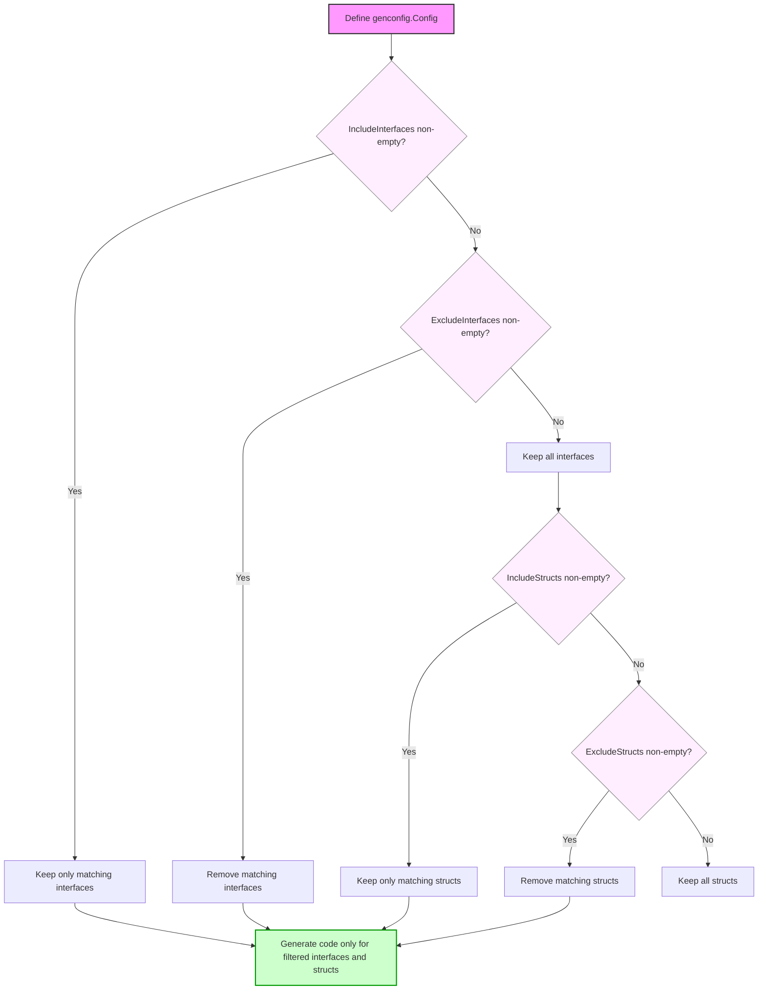

# Selective Generation: Including and Excluding APIs

Optimize and control your generated code output by selectively including or excluding specific interfaces and struct models using GORM CLI's powerful configuration options. This guide takes you step-by-step through customizing your generation scope with Include and Exclude rules, helping you focus on relevant query interfaces and models, cleanly organize your codebase, and avoid unnecessary generated artifacts.

---

### 1. Understanding Selective Generation

Selective generation allows you to whitelist or blacklist specific Go interface types and struct types when invoking the GORM CLI generator. By applying these filters, you can generate code only for chosen query APIs or model structs, tailoring outputs to your project’s immediate needs or modularizing large codebases.

These configurations are set in a `genconfig.Config` struct within your Go source files and let you define shell-style wildcard patterns or explicit type literals to include or exclude.

---

### 2. Prerequisites

- You should have your Go interfaces defined for queries with SQL annotations.
- Your data model structs should be declared in the same or accessible packages.
- Basic GORM CLI setup with code generation working is assumed (see [Basic Configuration](/getting-started/onboarding-core/basic-configuration) and [Your First Code Generation](/getting-started/onboarding-core/first-code-generation)).
- Familiarity with Go shell-style pattern matching (e.g., `*`, `?`) helps when crafting include/exclude patterns.

---

### 3. Expected Outcome

By following this guide, you will:
- Configure GORM CLI to generate only the specified subset of interfaces and/or structs.
- Reduce noise and clutter in your generated packages.
- Improve build efficiency by skipping irrelevant code.

---

### 4. Time Estimate

This configuration process typically takes 5-10 minutes once you are set up with GORM CLI.

---

### 5. Step-by-Step Configuration

<Steps>
<Step title="Create or Edit genconfig.Config">
Add a variable of type `genconfig.Config` in one of your Go source files where you define your interfaces or models. This config is automatically detected during generation.

Example:

```go
package examples

import "gorm.io/cli/gorm/genconfig"

var _ = genconfig.Config{
    // Selective filters here
}
```
</Step>

<Step title="Use IncludeInterfaces to Whitelist Query Interfaces">
Define interface names or patterns you want to generate among your query interfaces with `IncludeInterfaces`.

Example to include all interface names starting with `Query`:

```go
IncludeInterfaces: []any{"Query*"},
```

You can specify interfaces by exact name, patterns, or even by zero value typed literals like `models.Query(nil)` if applicable.

Only the interfaces matching these patterns will be generated. If `IncludeInterfaces` is non-empty, `ExcludeInterfaces` is ignored.
</Step>

<Step title="Use ExcludeInterfaces to Blacklist Query Interfaces">
Alternatively, specify interfaces you want to exclude from generation using `ExcludeInterfaces`.

Example:

```go
ExcludeInterfaces: []any{"*Deprecated*"},
```

This excludes interfaces containing `Deprecated` in their names.

Only applied if no `IncludeInterfaces` entries are present.
</Step>

<Step title="Use IncludeStructs to Whitelist Models">
Like interfaces, you can limit model structs generated with `IncludeStructs` using type names or patterns.

Example:

```go
IncludeStructs: []any{"User", "Account*", models.User{}},
```

This includes the struct named `User`, any structs starting with `Account`, and the explicitly typed `models.User`.
</Step>

<Step title="Use ExcludeStructs to Blacklist Models">
To exclude certain model structs from generation, use `ExcludeStructs` similarly.

Example:

```go
ExcludeStructs: []any{"*DTO"},
```

Prevents generation of any structs whose names end with `DTO`.

Ignored if `IncludeStructs` is non-empty.
</Step>

<Step title="Apply and Save the Config">
Save your changes in the source file. The generator automatically picks up the configuration during the next `gorm gen` run based on package scope and file location.
</Step>

<Step title="Run GORM CLI Code Generation">
Run generation in your project, specifying input and output paths as needed.

Example CLI command:

```bash
gorm gen -i ./path/to/your/interfaces -o ./generated
```

The generator applies your inclusion/exclusion rules and only outputs the filtered API and helpers.

Check the console logs to confirm which files were generated.
</Step>

<Step title="Verify Generated Code">
Inspect the generated code to confirm only the intended interfaces and structs were processed. The exports should match your filtering rules.

Use your standard testing or build workflow to ensure no compilation errors due to missing or excluded files.
</Step>
</Steps>

---

### 6. Practical Examples

The following example shows a `genconfig.Config` with selective generation rules:

```go
package pattern

import "gorm.io/cli/gorm/genconfig"

// Include only interfaces starting with “Query”
var _ = genconfig.Config{
    IncludeInterfaces: []any{"Query*"},
}
```

This setup generates code only for interfaces whose names begin with `Query`.

Another example excluding specific interfaces and structs:

```go
package nested

import "gorm.io/cli/gorm/genconfig"

// Exclude interface I3 and struct S3 in this package
var _ = genconfig.Config{
    FileLevel: false,      // Apply to package rather than file
    ExcludeInterfaces: []any{"I3"},
    ExcludeStructs: []any{"S3"},
}
```

This prevents `I3` and `S3` from generating code within the package.

---

### 7. Common Pitfalls & Troubleshooting

<AccordionGroup title="Common Issues with Selective Generation">
<Accordion title="No Code Generated After Applying Filters">
This occurs if your Include patterns are too restrictive or no matching interfaces/structs exist.

- Double-check the exact interface and struct names with package prefixes.
- Verify case sensitivity.
- Remember `Include*` rules override and disable excludes.
</Accordion>

<Accordion title="Patterns Do Not Match Expected Types">
- Confirm pattern syntax matches shell-style wildcard rules.
- Use explicit type literals for precision when needed (e.g., `models.User{}`).
- Ensure the package path is correct if fully qualifying selectors.
</Accordion>

<Accordion title="Generated Code Missing Expected Methods or Fields">
- Confirm the interfaces and structs included actually define those members.
- Check if other config options like `FieldNameMap` or custom tag mappings interfere.
- Rebuild entire project after changes.
</Accordion>

<Accordion title="File Level vs Package Level Configuration">
- `FileLevel: true` applies config only to the specific source file.
- The default `false` applies config to the entire Go package.
- Misunderstanding this can cause configs to be ignored if placed incorrectly.
</Accordion>
</AccordionGroup>

<Tip>
For troubleshooting and further guidance, use verbose logging of the generator and consult the [Troubleshooting Common Setup Issues](/getting-started/onboarding-core/troubleshooting-setup) page.
</Tip>

---

### 8. Best Practices

- Prefer `IncludeInterfaces` and `IncludeStructs` when you want an explicit whitelist. This ensures zero unexpected code.
- Use wildcard patterns thoughtfully to capture related types.
- Organize your config files close to the code you want to generate.
- Combine selective generation with `OutPath` overrides for modular project layouts.
- Test your config by iterative runs to refine selection gradually.

---

### 9. Next Steps & Related Content

- Explore the [Configuring Code Generation: genconfig.Config](/guides/customization-advanced/generator-configuration) guide to combine selective generation with other config options.
- Learn how to write and use [Template-Based Queries](/guides/core-usage-patterns/template-based-queries) alongside selective interfaces.
- Review the [Using Generated APIs](/getting-started/onboarding-core/using-generated-apis) to understand how selectively generated code integrates in your application.
- Visit the [Troubleshooting Common Setup Issues](/getting-started/onboarding-core/troubleshooting-setup) for detailed problem-solving.

---

### 10. Summary Diagram of Selective Generation Flow



---

By controlling your generation with selective includes and excludes, you harness precision and efficiency in GORM CLI code generation, enabling smooth scaling and focused development workflows.
