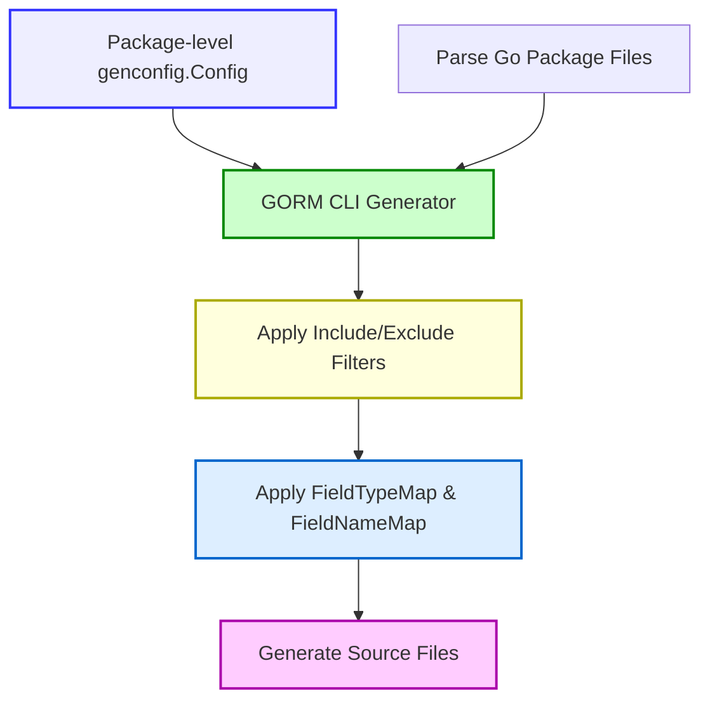

# Customizing Code Generation with genconfig.Config

## Overview
This guide explains how to customize the behavior and output of GORM CLI's code generation through the `genconfig.Config` struct. Users will learn how to control output paths, specify which interfaces and structs to include or exclude, map Go types and struct tags to field helper types, and override default settings to fit large projects and advanced use cases—such as handling JSON fields across multiple databases.

By leveraging `genconfig.Config`, you gain precise control over generation results and improve maintainability in complex codebases.

---

## 1. Purpose & Workflow Overview

### What You Will Achieve
- Configure output directories and file generation scopes.
- Define whitelist/blacklist rules for interfaces and structs.
- Map custom Go field types or tag names to generated field helpers.
- Override default wrappers and type mappings, enabling advanced scenarios like JSON field handling.
- Adapt generation patterns for large, multi-module projects.

### Prerequisites
- A basic understanding of Go interfaces, structs, and code generation.
- Familiarity with running `gorm gen` CLI command and generating initial code.
- Existing Go packages with models and interfaces ready for code generation.

### Time Estimate
~15–30 minutes, depending on project complexity and familiarity.

### Difficulty
Intermediate configuration—not necessary for beginners but critical for customization and scaling.

---

## 2. Introducing genconfig.Config

`genconfig.Config` is a Go struct that you define as a package-level variable inside your source files. The GORM CLI generator automatically discovers and applies these settings when generating code for that package or directory subtree.

### Key Configuration Fields

| Field Name             | Purpose |
|------------------------|---------|
| `OutPath`              | Overrides output directory for generated files in the package.
| `FileLevel`            | When true, config is applied at the file level instead of the whole package.
| `FieldTypeMap`         | Maps Go field types to custom field helper wrapper types.
| `FieldNameMap`         | Maps struct field tag names (`gen:"tag"`) to field helper wrappers.
| `IncludeInterfaces`    | Whitelist of interface types to generate.
| `ExcludeInterfaces`    | Blacklist of interface types to skip.
| `IncludeStructs`       | Whitelist of struct types to generate.
| `ExcludeStructs`       | Blacklist of struct types to skip.


### How Filtering Works
- If you specify any `IncludeInterfaces` or `IncludeStructs`, **only those matching patterns or type literals will generate code**. All others are skipped.
- If `Include*` lists are empty, `ExcludeInterfaces` and `ExcludeStructs` define which types to omit.
- Patterns support shell-style wildcards (e.g., `Query*`, `*Repo`) and can reference types via construction (e.g., `models.Query(nil)`).
- Type literals can be used to specify structs directly (e.g., `models.User{}`).

---

## 3. Step-by-Step Configuration Guide

<Steps>
<Step title="Step 1: Define genconfig.Config in your package">
Create a Go source file (e.g., `config.go`) within the package you want to generate code for.

Example:
```go
package examples

import (
  "database/sql"
  "gorm.io/cli/gorm/field"
  "gorm.io/cli/gorm/genconfig"
)

var _ = genconfig.Config{
  OutPath: "examples/output",
  FieldTypeMap: map[any]any{
    sql.NullTime{}: field.Time{},
  },
  FieldNameMap: map[string]any{
    "date": field.Time{},
    "json": JSON{},  // custom JSON field helper (defined elsewhere)
  },
  IncludeInterfaces: []any{"Query*"},
  ExcludeStructs:    []any{"*DTO"},
}
```

This configuration:
- Redirects generated code output to `examples/output`.
- Maps `sql.NullTime` Go type fields to `field.Time{}` helpers.
- Maps struct fields tagged with `gen:"json"` to a custom JSON field helper.
- Only includes interfaces whose names start with "Query".
- Excludes any structs with names ending in "DTO".

</Step>

<Step title="Step 2: Use Include/Exclude Filters to Control Scope">
- To **include specific interfaces or structs only**, set `IncludeInterfaces` or `IncludeStructs`. Exclusion lists are ignored if Include lists are non-empty.
- To **exclude certain types but include the rest**, set `ExcludeInterfaces` or `ExcludeStructs` and leave Include lists empty.

Example:
```go
var _ = genconfig.Config{
  IncludeInterfaces: []any{"Query*"},
  ExcludeInterfaces: []any{"*Deprecated*"}, // ignored because IncludeInterfaces is set
}
```

This ensures only interfaces with names starting with "Query" are generated.

Use patterns or type literals:
```go
IncludeInterfaces: []any{models.Query(nil), "CustomInterface*"},
IncludeStructs: []any{models.User{}, "Account*"},
```

</Step>

<Step title="Step 3: Map Go Types and Tags to Custom Field Helpers">
You can customize how field helpers are generated for your Go struct fields with:

- `FieldTypeMap`: Map concrete Go types to a field helper.
- `FieldNameMap`: Map `gen` struct tag names to a field helper (overrides `FieldTypeMap`).

Example mapping a JSON field helper:
```go
var _ = genconfig.Config{
  FieldNameMap: map[string]any{
    "json": JSON{},
  },
}
```

The generator uses this mapping when it encounters a struct field tagged `gen:"json"`.

---

### Practical JSON Field Example

1. Define a model:
```go
package models

type User struct {
  Profile string `gen:"json"`
}
```
2. Declare your JSON field helper (custom code must exist):
```go
type JSON struct {
  // implementation...
}
```
3. Configure mapping with `FieldNameMap` as shown above.

This setup lets generated code create customized SQL for JSON fields, helping cross-database compatibility.

</Step>

<Step title="Step 4: Use FileLevel for Granular Configuration">
By default, your config applies to the whole package. Setting `FileLevel: true` restricts it to the specific file where the configuration is declared.

Use-case:
- Large directories with many files might want specialized configs per file without affecting the entire package.

Example:
```go
var _ = genconfig.Config{
  FileLevel: true,
  ExcludeInterfaces: []any{"I3"},
  ExcludeStructs: []any{"S3"},
}
```

This config excludes types only in that file.

</Step>

<Step title="Step 5: Run the Generator with Your Config">
Once your config is defined, run `gorm gen` as usual:
```bash
gorm gen -i ./path/to/your/package -o ./generated
```
The generator detects and applies any `genconfig.Config` in packages automatically.

Verify:
- Output files are in your configured `OutPath`.
- Filtering and mappings take effect.

Troubleshoot using logs or re-check config patterns if unexpected types appear.
</Step>
</Steps>

---

## 4. Examples of Common Configurations

### Example: Whitelist Interfaces Only
```go
var _ = genconfig.Config{
  IncludeInterfaces: []any{"Query*"},
}
```
Only generate code for interfaces with names starting with "Query".

---

### Example: Blacklist Specific Nested Types Across Subtree
```go
var _ = genconfig.Config{
  ExcludeInterfaces: []any{nested.I2[any](nil), I3[any](nil)},
  ExcludeStructs:    []any{nested.S2{}, S3{}},
}
```
Exclude listed interfaces and structs in the directory subtree.

---

### Example: Map `sql.NullTime` to `field.Time{}`
```go
var _ = genconfig.Config{
  FieldTypeMap: map[any]any{
    sql.NullTime{}: field.Time{},
  },
}
```
This causes fields of type `sql.NullTime` to be generated with time-specific helpers.

---

### Example: Combining Multiple Filters and Mappings
```go
var _ = genconfig.Config{
    OutPath: "examples/output",
    IncludeInterfaces: []any{"Query*"},
    ExcludeInterfaces: []any{"*Deprecated*"},
    IncludeStructs: []any{"User", "Account*"},
    ExcludeStructs: []any{"*DTO"},
    FieldNameMap: map[string]any{
        "date": field.Time{},
        "json": JSON{},
    },
    FieldTypeMap: map[any]any{
        sql.NullTime{}: field.Time{},
    },
    FileLevel: false,
}
```
A comprehensive config controlling generation scope, output location, and type mappings.

---

## 5. Best Practices & Tips

- **Keep configs close to their packages:** Place `genconfig.Config` in the package or directory whose generation it customizes.
- **Use explicit patterns:** When filtering, prefer explicit and clear wildcards like `Query*` rather than overly broad glob patterns.
- **Leverage type literals:** Using type literals such as `models.User{}` improves clarity and reduces errors in include/exclude lists.
- **Override carefully:** Use `FileLevel` sparingly for advanced scenarios; most users benefit from package-wide configs.
- **Map custom fields thoughtfully:** Map field names (`gen` tags) for your custom SQL or DB types, such as JSON, to ensure generated code produces correct SQL.
- **Verify imports:** When using custom helpers, ensure they are imported or defined to avoid generator errors.

---

## 6. Troubleshooting

### Common Issues

- **Filters not working as expected:**
  - Double-check pattern spelling and casing.
  - Ensure the interface or struct names match the pattern.
  - Remember that `Include*` lists override `Exclude*` lists.

- **Output not appearing in configured directory:**
  - Confirm `OutPath` is set correctly in the config.
  - Make sure to pass the correct CLI `-o` flag or omit it to use default.

- **Fields mapped incorrectly or custom helpers ignored:**
  - Confirm field tag names match exactly (e.g., `gen:"json"`).
  - Ensure your custom helpers are available in the project.
  - `FieldNameMap` takes priority over `FieldTypeMap`.

- **File-level configs not applying:**
  - Verify `FileLevel` is set to `true`.
  - Ensure config is declared within the target file.

### Debugging Tips

- Review console output during generation for hints.
- Use type literals rather than strings to reduce pattern mismatch.
- Test your config incrementally, starting with simple filters and mappings.

---

## 7. Next Steps & Related Content

- **Customize Query Interfaces:** Dive deeper into [Writing Custom Queries with SQL Templates](../guides/advanced-patterns/template-queries) to combine genconfig customization and interface design.
- **Use Generated APIs:** Learn how to integrate generated field helpers via the [Using Model-Driven Field Helpers](../guides/core-workflows/using-field-helpers) guide.
- **Best Practices:** Explore the [Best Practices & Common Patterns](../guides/advanced-patterns/best-practices) for clean, maintainable code generation.
- **Troubleshooting:** Consult the [Troubleshooting Common Issues](../../getting-started/troubleshooting-faq/common-issues) for detailed problem-solving.

---

## Summary Diagram: genconfig.Config in the Generation Workflow


---

For full context on this and related aspects of GORM CLI, see the official documentation linked below.

---

# References
- [GORM CLI: Minimal Configuration Setup](../../getting-started/config-gen-first-run/basic-configuration)
- [Using Generated APIs with GORM CLI](../../getting-started/config-gen-first-run/using-generated)
- [Working with Associations & Field Helpers](../guides/core-workflows/using-field-helpers)
- [Writing SQL Templates in Interfaces](../guides/advanced-patterns/template-queries)
- [Best Practices & Common Patterns](../guides/advanced-patterns/best-practices)

---

*This document is part of the GORM CLI documentation suite. For feedback or to contribute, visit the [GORM CLI GitHub repository](https://github.com/go-gorm/cli).*