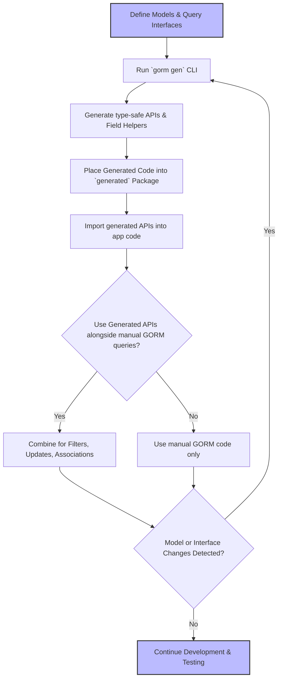

# Integrating with GORM and Existing Codebases

---

## Workflow Overview

### Purpose
This guide helps you seamlessly integrate GORM CLI-generated code into your existing GORM projects. It focuses on strategies to harmonize generated type-safe query APIs and model-driven field helpers with your hand-written logic. Additionally, it covers maintaining alignment over time as your database models and custom queries evolve.

### Prerequisites
- An existing GORM-based Go project with defined models and database connection setup.
- Installed GORM CLI tool (requires Go 1.18+).
- Basic familiarity with generating code using `gorm gen` and working with generated APIs.
- Your application is using generics-enabled Go version.

### Expected Outcome
- You will have a clear, reproducible integration process that allows generated APIs coexist with manual code.
- Understand how to organize generated code output for easy maintenance.
- Best practices to manage synchronization between generated code and evolving data models or query needs.

### Estimated Time
Approximately 20–30 minutes for initial integration and conceptual setup.

### Difficulty Level
Intermediate – assumes familiarity with Go programming, GORM ORM basics, and workflow automation.

---

## Step-by-Step Integration Instructions

### 1. Review Your Existing Models and Query Interfaces
Start by auditing your current GORM models and any custom SQL or query code you maintain manually. This knowledge helps you decide what portions can be generated by GORM CLI and where custom hand-crafted logic will remain.

### 2. Create or Adjust SQL Template Interfaces
Define Go interfaces with SQL templates for your common queries using the pattern documented in the CLI usage. Keep these interfaces modular and focused:

```go
// Your existing models package
package models

type User struct {
  ID uint
  Name string
  Age int
}

// Define SQL template query interface in the same or separate package
// with comments as SQL templates
package queries

type Query[T any] interface {
  // SELECT * FROM @@table WHERE id=@id
  GetByID(id int) (T, error)

  // Custom queries...
}
```

### 3. Run the GORM CLI Generator with Proper Input/Output
Use `gorm gen` pointing to the package containing your SQL interface definitions and models:

```bash
gorm gen -i ./queries -o ./generated
```

**Tip:** Match `-o` output directories to your project layout for clear separation between generated and manual code.

### 4. Incorporate Generated Code into Your Project
Import and use the generated APIs alongside your conventional GORM DB objects without conflict:

```go
import (
  "context"
  "gorm.io/gorm"
  "yourproject/generated"
  "yourproject/models"
)

func FetchUserByID(db *gorm.DB, id int) (models.User, error) {
  // Use generated type-safe query API
  return generated.Query[models.User](db).GetByID(context.Background(), id)
}
```

### 5. Harmonize Generated Field Helpers with Existing GORM Code
Generated field helpers allow you to write type-safe filters, updates, and association operations leveraging your existing GORM chains:

```go
// Use field helpers with GORM
db := getDB()
ctx := context.Background()
users, err := gorm.G[models.User](db).
  Where(generated.User.Age.Gt(18)).
  Find(ctx)
```

This means you can combine hand-written GORM expressions with generated helpers smoothly.

### 6. Maintain and Synchronize with Evolving Models
Whenever you make changes to your models or interfaces:
- Re-run the `gorm gen` command to regenerate updated APIs and helpers.
- Keep generated files separate (e.g., in `/generated` folder) to avoid overwriting manual code.
- Use `genconfig.Config` to control output paths and include/exclude patterns if needed.

### 7. Merge Generated Code with Hand-Written Logic
For complex queries or additional logic not suited for generation, write manual code in separate files and packages. Import and use generated APIs as reusable components rather than modifying generated sources.

### 8. Use Version Control Effectively
Track generated files under version control to enable smooth diffs and avoid losing manual edits. Avoid manual code changes inside generated files.

---

## Practical Tips & Best Practices

- **Isolate Generated Code:** Place generated code in dedicated sub-packages or folders like `/generated` or `/gen`.
- **Avoid Manual Edits:** Do not modify generated files; instead, customize interfaces or templates.
- **Use `genconfig.Config`:** Customize inclusion/exclusion rules to scope generation precisely in larger projects.
- **Integrate Testing:** Use automated tests to verify generated API correctness alongside your manual code (see `examples/output/query_test.go`).
- **Plan Interface Design:** Define interfaces granularly to allow maximum reuse and reduce regeneration scope.
- **Leverage Template Queries:** Use SQL templates in interfaces for type-safe, flexible query definitions.
- **Keep Context Consistent:** Use `context.Context` in all calls to support cancellation and tracing.

---

## Common Pitfalls & Troubleshooting

<AccordionGroup title="Troubleshooting Integration Issues">
<Accordion title="GORM CLI Command Fails or Does Not Generate Files">
- Verify your Go version is 1.18+ with generics support.
- Ensure the input path (`-i`) accurately points to your Go interfaces.
- Check for syntax errors or missing SQL templates in interfaces.
- Confirm output directory exists and is writable.
- Review CLI error messages and consult [Troubleshooting Common Issues](../getting-started/troubleshooting-faq/common-issues).
</Accordion>

<Accordion title="Generated Code is Out of Sync with Models">
- Always re-run the generator after model/interface changes.
- Use a clear separation between generated and manual code.
- If using complex mappings, double-check your `genconfig.Config`.
</Accordion>

<Accordion title="Conflicts Between Generated and Manual Code">
- Never modify generated source files.
- Encapsulate manual logic in separate files/packages.
- Use well-defined interfaces to decouple.
</Accordion>

<Accordion title="Runtime Errors with Generated APIs">
- Check if database schema matches your Go models.
- Validate use of correct context.
- Review generated SQL via logging for correctness.
</Accordion>
</AccordionGroup>

---

## Diagram: Workflow for Integrating Generated Code with Existing GORM Projects



---

## Next Steps & Related Content

- [Quickstart Workflow](../overview/getting-started-examples/quickstart-workflow) to understand the end-to-end generation process.
- [Using Model-Driven Field Helpers](../guides/core-workflows/using-field-helpers) to deepen knowledge of generated field helpers.
- [Writing Custom Queries with SQL Templates](../guides/advanced-patterns/template-queries) to extend interfaces with templated SQL.
- [Basic Configuration with genconfig.Config](../getting-started/config-gen-first-run/basic-configuration) for customizing code generation behavior.
- [Troubleshooting Common Issues](../getting-started/troubleshooting-faq/common-issues) for resolving integration errors.

---