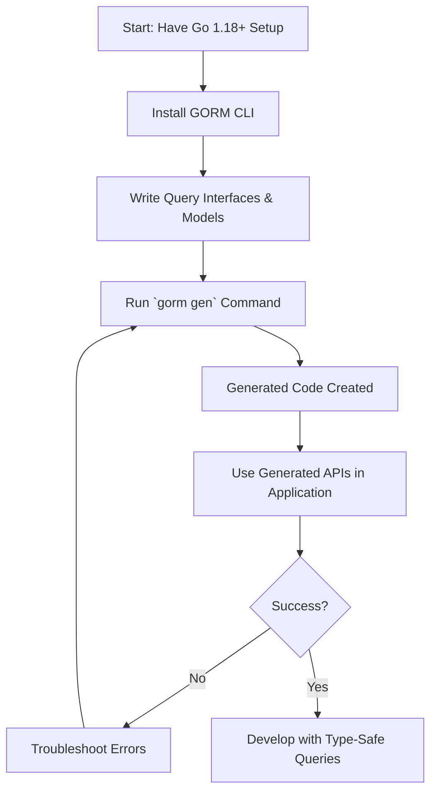

# Getting Started with GORM CLI

Welcome to your first hands-on guide to GORM CLI! This page will walk you through installing the CLI tool, explain the basic structure of the projects it generates, and demonstrate how to run your first code generation successfully. By following this guide, you'll gain immediate value from GORM CLI's core capabilities with clear, practical steps.

---

## 1. Introduction and Workflow Overview

### What You'll Achieve
- Install the GORM CLI tool on your development system.
- Understand the typical project structure generated by GORM CLI.
- Run your initial code generation command to produce query interfaces and field helpers.

This workflow unlocks type-safe, fluent APIs that integrate seamlessly with GORM, reducing boilerplate and preventing common runtime errors.

### Prerequisites
Before starting, ensure you have:
- Go 1.18 or newer installed on your system (GORM CLI requires generics support).
- A basic Go workspace set up with your project directory.

For detailed system requirements and environment checks, see the [System Requirements & Prerequisites guide](https://gorm.io/docs/getting-started/setup-installation/requirements-prerequisites).

### Estimated Time & Difficulty
- Time: ~10 minutes to install and run your first generation
- Difficulty: Beginner friendly

<Check>
This guide assumes no prior familiarity with GORM CLI but does require basic Go tooling knowledge.
</Check>

---

## 2. Installing GORM CLI

Follow these steps to install and verify the GORM CLI tool on your system.

### Step 1: Verify Go Version
Run this command to confirm you have Go 1.18 or above:

```bash
go version
```

If your Go version is older, please update it before proceeding.

### Step 2: Install the CLI
Use Go's install command to fetch and compile GORM CLI:

```bash
go install gorm.io/cli/gorm@latest
```

This will place the `gorm` executable in your `$GOPATH/bin` or `$HOME/go/bin`.

### Step 3: Verify Installation
Confirm the CLI is accessible:

```bash
gorm --help
```

You should see CLI usage help confirming a successful install.

<Tip>
If you encounter command not found errors, ensure your Go bin directory is in your system PATH.
</Tip>

---

## 3. Understanding the Project Structure Generated by GORM CLI

GORM CLI generates two key components when you run code generation:

- **Interface-Driven Query APIs**: Concrete type-safe implementations generated from your Go interfaces annotated with SQL templates.
- **Model-Driven Field Helpers**: Strongly-typed helpers for your Go structs representing database models. These enable fluent construction of filters, updates, and association operations.

### Generated Code Layout

After running GORM CLI, your output directory (default: `./g` or as specified with `-o`) typically contains:

- **generated query interfaces** in separate Go files matching your input interface packages.
- **field helpers** grouped by model structs providing predicates, setters, and association operations.

Example:
```
./generated/
  user_query.go   # generated query interface implementations
  user_fields.go  # model-driven field helpers for User struct
```

You can safely import these into your application code to begin writing queries and updates using type-safe, generated methods.

---

## 4. Running Your First Code Generation

Let's walk through a minimal, practical example to generate code and validate it.

### Step 1: Write Query Interface and Model
Create two files in your project directory `examples/`:

```go
// examples/query.go
package examples

type Query[T any] interface {
  // SELECT * FROM @@table WHERE id=@id
  GetByID(id int) (T, error)
}
```

```go
// examples/models/user.go
package models

import "gorm.io/gorm"

type User struct {
  gorm.Model
  Name string
  Age  int
}
```

### Step 2: Run the CLI Generator
Execute the generation command from your project root:

```bash
gorm gen -i ./examples -o ./generated
```

- `-i` points to your input directory containing interfaces and models.
- `-o` is the output directory for generated code.

<Tip>
You can skip `-o` to use the default `./g` folder.
</Tip>

### Step 3: Inspect Generated Files
After completion, look inside `generated/` for files like `query_gen.go` and field helper files.

Example of usage in your Go application:

```go
u, err := generated.Query[models.User](db).GetByID(ctx, 123)
if err != nil {
  log.Fatal(err)
}
fmt.Println(u.Name)
```

### Step 4: Validate Functionality
Integrate the generated code into your real or test application scenario to validate queries and updates.

---

## 5. Best Practices and Tips

- **Use Clear Naming Conventions** for your interfaces and models to keep generated code organized.
- **Keep SQL templates inline in comments** within your interface methods to fully leverage type safety.
- **Regularly regenerate** your code on model or interface changes to avoid stale helpers.
- **Explore `genconfig.Config`** for customizing generation output paths, filters, and field mappings once comfortable.

---

## 6. Common Pitfalls & Troubleshooting

<AccordionGroup title="Installation and Generation Troubleshooting">
<Accordion title="'gorm' command not found after install">
Ensure your Go bin directory is in your PATH environment variable, for example:

```bash
export PATH="$PATH:$(go env GOPATH)/bin"
```
Then retry.
</Accordion>
<Accordion title="Errors about Go version or generics support">
Verify you are running Go 1.18 or newer:

```bash
go version
```
If not, update your Go installation.
</Accordion>
<Accordion title="Code generation fails with syntax or annotation errors">
Double-check your Go interface comments for properly formatted SQL templates. Refer to the "Building Template-based Query APIs" guide for syntax.
</Accordion>
<Accordion title="Generated code missing or incomplete">
Confirm your input path is correct and contains Go files with proper interfaces and models. Missing tags or interfaces may result in empty output.
</Accordion>
</AccordionGroup>

---

## 7. What's Next?

Now that you have installed and generated your first code:

- Explore [Your First Code Generation](https://gorm.io/docs/getting-started/first-steps/your-first-generation) for deeper examples on writing interfaces and interpreting generated files.
- Learn how to customize generation via `genconfig.Config` in the [Basic Configuration](https://gorm.io/docs/getting-started/first-steps/initial-configuration) guide.
- Validate and test your generated APIs with examples in [Validating and Using Generated APIs](https://gorm.io/docs/getting-started/first-steps/validating-usage).


---

## Appendix: Example CLI Command Summary

| Command | Description |
|---------|-------------|
| `go install gorm.io/cli/gorm@latest` | Installs the GORM CLI tool |
| `gorm --help` | Shows CLI usage information |
| `gorm gen -i ./examples -o ./generated` | Generates code from interfaces in ./examples to ./generated |


---

## Visual Workflow Diagram




---

This completes your introduction to Getting Started with GORM CLI. You're now equipped to install, generate, and use safe, fluent query APIs in your Go projects.


---

## Related Documentation

- [System Requirements & Prerequisites](https://gorm.io/docs/getting-started/setup-installation/requirements-prerequisites)
- [Installing GORM CLI](https://gorm.io/docs/getting-started/setup-installation/installing-cli)
- [Your First Code Generation](https://gorm.io/docs/getting-started/first-steps/your-first-generation)
- [Basic Configuration](https://gorm.io/docs/getting-started/first-steps/initial-configuration)
- [Validating and Using Generated APIs](https://gorm.io/docs/getting-started/first-steps/validating-usage)

For further exploration, check out the full navigation under the Getting Started and Guides tabs.

---