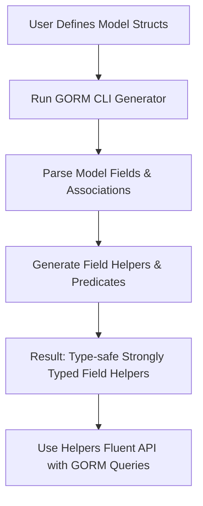

# Generating Field Helpers from Models

## Overview

This guide demonstrates how to define your Go model structs and generate strongly typed field helpers using GORM CLI. These field helpers offer type-safe predicates, filters, setters, and association operations that integrate fluently with GORM’s query builder. By following this workflow, you will unlock compile-time safety and a discoverable API for filtering, updating, and managing associated data.

---

## Prerequisites

- A Go project that uses GORM (version 1.18+ recommended for generics support).
- Defined model structs representing your database entities.
- GORM CLI installed on your system (see [Installing GORM CLI](../getting-started/setup-installation/installing-cli) for details).
- Basic familiarity with GORM’s querying and updating principles.

---

## What You Will Achieve

- Generate fluent, type-safe field helpers from your model structs.
- Use predicates like `Eq()`, `Gt()`, `Like()`, etc., on individual fields with strong typing.
- Perform model updates and filters without error-prone raw SQL strings.
- Manage associated data (e.g., has-many, belongs-to) via generated helpers.

---

## Time Estimate

About 15–30 minutes for a working generation and basic usage.

---

## Difficulty Level

Intermediate. Basic Go and GORM knowledge are assumed.

---

## Step-by-Step Instructions

### 1. Define Your Model Structs

Create or update your Go models with exported fields. Association fields should use the appropriate Go struct types for `has one`, `has many`, or `belongs to` relations.

```go
// models/user.go
package models

import (
  "database/sql"
  "gorm.io/gorm"
)

type User struct {
  gorm.Model
  Name      string
  Age       int
  Role      string
  IsAdult   bool
  Score     sql.NullInt64
  Profile   string `gen:"json"` // Example: a custom JSON field

  Pets      []Pet       // has many pets
  Account   Account     // has one account
  ManagerID uint
  Manager   *User       // belongs to another User
}

// Define related structs similarly
```

<Tip>
Use the `gen:"json"` struct tag when you want to map special fields (like JSON) to custom field helpers. You can configure these mappings in your generation config.
</Tip>

### 2. Create a `genconfig.Config` (Optional but Recommended)

Create a package-level configuration variable to customize the output directory, field mappings, and filtering.

```go
package models

import (
  "database/sql"
  "gorm.io/cli/gorm/field"
  "gorm.io/cli/gorm/genconfig"
)

var _ = genconfig.Config{
  OutPath: "generated",               // Output directory for generated code

  FieldTypeMap: map[any]any{
    sql.NullTime{}: field.Time{},     // Map sql.NullTime to field.Time helper
  },

  FieldNameMap: map[string]any{
    "json": JSON{},                  // Custom JSON helper for fields tagged `gen:"json"`
  },

  IncludeStructs: []any{"User", "Pet", "Account"},  // Only generate these structs
}
```

<Info>
If you do not configure a `genconfig.Config`, GORM CLI will generate helpers for all structs and place generated files in the default `./g` directory.
</Info>

### 3. Run the Code Generation CLI

Use the `gorm gen` command, specifying your input path and output path if not already set in config.

```bash
# Generate from the current directory or specify model package
gorm gen -i ./models -o ./generated
```

This scans the input package, processes models, applies configuration, and writes strongly typed field helpers for each struct.

<Check>
Ensure your environment uses Go 1.18+ as generics are required.
</Check>

### 4. Explore the Generated Field Helpers

Generated helpers expose fields as typed predicates and setters. Fields are grouped per struct.

Example of usage with generated helpers:

```go
import (
  "context"
  "gorm.io/gorm"
  "generated" // your generated package
)

func ExampleUsage(db *gorm.DB) error {
  ctx := context.Background()

  // Find users where Age > 18 and Role is active
  var users []models.User
  if err := gorm.G[models.User](db).
    Where(generated.User.Age.Gt(18), generated.User.Role.Eq("active")).
    Find(ctx, &users); err != nil {
    return err
  }

  // Update a user's role to 'active' where Name = 'alice'
  rowsAffected, err := gorm.G[models.User](db).
    Where(generated.User.Name.Eq("alice")).
    Set(generated.User.Role.Set("active")).
    Update(ctx)
  if err != nil {
    return err
  }
  fmt.Printf("Updated %d row(s)\n", rowsAffected)

  return nil
}
```

### 5. Manage Associations Using Helpers

Use generated association helpers to create, update, unlink, or delete related rows with full type safety.

```go
// Create a user with one pet
err := gorm.G[models.User](db).
  Set(
    generated.User.Name.Set("alice"),
    generated.User.Pets.Create(generated.Pet.Name.Set("fido")),
  ).
  Create(ctx)

// Update pet's name for user with ID=1
err = gorm.G[models.User](db).
  Where(generated.User.ID.Eq(1)).
  Set(
    generated.User.Pets.Where(generated.Pet.Name.Eq("fido")).Update(generated.Pet.Name.Set("rex")),
  ).
  Update(ctx)

// Unlink pets from user
err = gorm.G[models.User](db).
  Where(generated.User.ID.Eq(1)).
  Set(generated.User.Pets.Unlink()).
  Update(ctx)
```

### 6. Verify and Test Your Generated Code

Run your tests to ensure generated field helpers reflect your schema and queries run as expected. Check the generated code structure, field types, and column names.

Refer to test examples in `examples/output/models_field_helpers_test.go` for comprehensive usage and validation patterns.

---

## Best Practices

- **Keep models up to date.** Field helper generation reflects your model structs; update models before regenerating.
- **Leverage custom field mappings** for special Go types or DB fields, such as JSON.
- **Use include/exclude filters** in `genconfig.Config` to limit generation scope and keep generated code manageable.
- **Apply zero-valued setters explicitly** when updating fields to avoid unexpected omissions.
- **Combine predicates with GORM’s fluent API** for flexible, readable queries.

---

## Common Pitfalls and Troubleshooting

<AccordionGroup title="Troubleshooting Field Helper Generation">
<Accordion title="Field helpers do not generate for new fields">
Make sure your Go struct fields are exported (start with uppercase). Regenerate code after model changes.
</Accordion>

<Accordion title="Generated predicates not matching expected SQL columns">
Confirm your struct tags and naming conventions align with your database schema. Use `gen:"json"` or a config map if needed.
</Accordion>

<Accordion title="Association helpers fail or missing">
Check your model’s association declarations match GORM’s conventions. Regenerate to refresh.
</Accordion>

<Accordion title="Type mapping for custom types not applied">
Configure `FieldTypeMap` or `FieldNameMap` properly in `genconfig.Config` for your custom types.
</Accordion>

<Accordion title="Compilation errors after generation">
Check for conflicting packages and ensure the import paths match your project structure.
</Accordion>
</AccordionGroup>

---

## Additional Examples

### Using Field Helpers for Complex Filters

```go
// Filter users created after a date and with a score between 50 and 100
users, err := gorm.G[models.User](db).
  Where(
    generated.User.CreatedAt.Gt(someDate),
    generated.User.Score.Between(50, 100),
  ).
  Find(ctx)
```

### Incrementing a Numeric Field

```go
rows, err := gorm.G[models.User](db).
  Where(generated.User.Name.Eq("bob")).
  Set(generated.User.Age.Incr(1)).
  Update(ctx)
```

---

## Diagram: Model to Field Helpers Generation Flow



---

## Next Steps & Related Content

- Explore [Your First Code Generation](../getting-started/first-steps/your-first-generation) to combine queries with field helpers.
- Learn about [Working with Associations](../guides/real-world-patterns/working-with-associations) to manage related objects effectively.
- Customize your code generation workflow in [Configuration & Customization Essentials](../overview/features-and-integration/config-customization).
- Dive deeper into [Template-based Query APIs](../guides/essential-workflows/template-based-query-apis) for advanced querying needs.
- Troubleshoot generation issues in [Troubleshooting Installation & Setup](../getting-started/setup-installation/troubleshooting-install).

---

## Resources

- Official [GORM CLI GitHub repository](https://github.com/go-gorm/cli)
- Generated example models in `examples/output/models`
- Model-driven helpers tests in `examples/output/models_field_helpers_test.go`
- GORM official documentation: https://gorm.io

---

Harnessing the power of generated field helpers from your models unlocks a new level of safety, productivity, and clarity in your Go database code. Start small with basic fields, then expand to associations and custom field mappings as your project grows.

Happy coding with GORM CLI!
