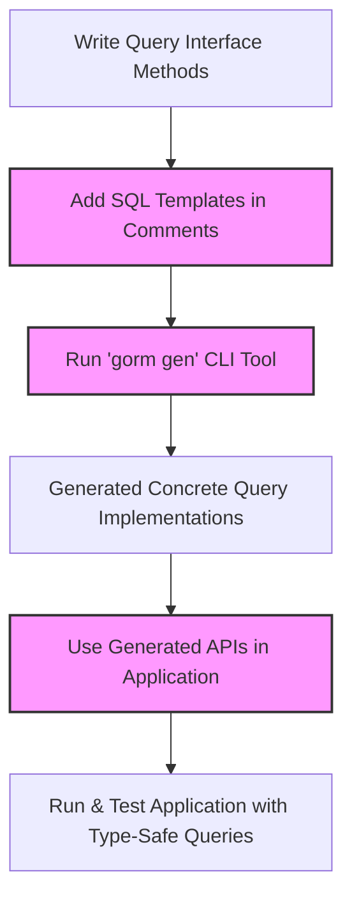

# Building Template-based Query APIs

This guide shows you how to write query interfaces with SQL templates, annotate methods for GORM CLI, and generate concrete, type-safe methods for your custom queries. You will learn the templating syntax, parameter binding mechanics, and how to effectively use the generated APIs to build flexible, maintainable database access code.

---

## 1. Understanding Template-based Query APIs

**What This Guide Helps You Accomplish:**
- Learn to write Go interfaces whose method comments contain SQL templates
- Use annotation conventions to embed raw SQL or templated SQL
- Generate type-safe, concrete implementations of these interfaces automatically
- Use generated query methods cleanly in your Go applications

**Why Use Template-based Query APIs?**  
Traditional raw SQL queries often lead to boilerplate code, lack compile-time safety, and are inconsistent. GORM CLI lets you write SQL templates in Go interface comments and auto-generates type-safe methods that integrate seamlessly with GORM, eliminating runtime errors and increasing productivity.

**Prerequisites:**
- Basic familiarity with Go interfaces and generics
- Working Go environment with GORM CLI installed
- A defined Go model struct for the related database table
- GORM ORM dependency setup

**Expected Outcome:**
- You will write Go interfaces with methods annotated by SQL templates.
- Use the CLI to generate concrete query implementations.
- Use the generated APIs in your app for flexible, safe query construction.

**Estimated Time:** 20-40 minutes

**Difficulty Level:** Intermediate

---

## 2. Writing Query Interfaces with SQL Templates

### 2.1 Define Your Interface

Declare a generic Go interface in your package that describes the queries you need. The interface uses generics, typically defined as `interface { ... }`, where methods operate on a generic type `T` (your model).

Example:

```go
// Query interface for User model
// T is the generic model type
// Method comments hold SQL templates

type Query[T any] interface {
  // SELECT * FROM @@table WHERE id=@id
  GetByID(id int) (T, error)

  // SELECT * FROM @@table WHERE @@column=@value
  FilterWithColumn(column string, value string) (T, error)

  // More methods with SQL templating ...
}
```

### 2.2 Write SQL Templates in Method Comments

SQL templates utilize a mini DSL that allows embedding logic into comments just above the method signature. Key points:

- `@@table` resolves to the database table for model `T` automatically.
- `@param` binds to the Go method parameter of the same name or struct fields.
- Use templating directives like `{{if}}`, `{{for}}`, `{{where}}`, and `{{set}}` to construct dynamic queries.
- The SQL snippet appears as the raw SQL you would run, but uses templating to add logic and conditionality.

Example Method Annotations:

```go
// SELECT * FROM @@table WHERE id=@id
GetByID(id int) (T, error)

// SELECT * FROM @@table WHERE @@column=@value
FilterWithColumn(column string, value string) (T, error)

// SELECT * FROM @@table
// {{where}}
//   {{if @user.Name != ""}} name=@user.Name {{end}}
//   {{if @user.Age > 0}} AND age=@user.Age {{end}}
// {{end}}
SearchUsers(user User) ([]T, error)

// UPDATE @@table
// {{set}}
//   {{if user.Name != ""}} name=@user.Name, {{end}}
//   {{if user.Age > 0}} age=@user.Age, {{end}}
//   {{if user.Age >= 18}} is_adult=1 {{else}} is_adult=0 {{end}}
// {{end}}
// WHERE id=@id
UpdateUser(user User, id int) error
```

### 2.3 Parameter Binding Rules

- Simple scalars bind by name (`@param` → `param`)
- Struct parameters bind by referencing struct fields (`@user.Name`)
- Slice/array parameters can be iterated via `{{for}}` in templates
- Placeholders are converted safely to GORM's parameter binding with `clause.Expr`

<Tip>
Using `@@table` and `@@column` ensures your queries remain portable and resilient to model/table naming changes.
Always prefer these over hardcoding table or column names.
</Tip>

---

## 3. Running the Code Generator

Once you have your interface(s) defined with SQL templates in your Go files, run the GORM CLI code generator.

### 3.1 Generate Command Usage

Assuming your interfaces reside in `./examples`, and you want output in `./generated`:

```bash
gorm gen -i ./examples -o ./generated
```

- `-i, --input` specifies the directory or Go file containing your annotated interfaces.
- `-o, --output` specifies the output directory for generated code.

### 3.2 What Gets Generated?

- Concrete struct types implementing your query interfaces for your models
- Methods that construct the queries based on your templates
- Methods automatically inject `context.Context` if missing from your signatures

### 3.3 Generated Code Example

Example of a generated method (simplified):

```go
func (e QueryImpl[T]) GetByID(id int) (T, error) {
    var sb strings.Builder
    params := make([]any, 0, 2)

    sb.WriteString("SELECT * FROM ? WHERE id=?")
    params = append(params, clause.Table{Name: clause.CurrentTable}, id)

    var result T
    err := e.Raw(sb.String(), params...).Scan(ctx, &result)
    return result, err
}
```

---

## 4. Using Generated Query APIs in Your Application

With generated query implementations, usage within your application becomes straightforward, type-safe, and fluent.

### 4.1 Import Generated Package

```go
import "yourproject/generated"

// Your model
import "yourproject/models"
```

### 4.2 Create Query Instance

```go
queryUser := generated.Query[models.User](db)
```

### 4.3 Execute Typed Queries

Using the generated methods:

```go
ctx := context.Background()

// Simple fetch by ID
user, err := queryUser.GetByID(ctx, 123)
if err != nil {
    // handle error
}

// Filter by column
foundUser, err := queryUser.FilterWithColumn(ctx, "name", "alice")

// Complex filtered search
users, err := queryUser.SearchUsers(ctx, models.User{Name: "jinzhu", Age: 30})

// Update user fields
err = queryUser.UpdateUser(ctx, models.User{Name: "jinzhu", Age: 25}, 123)

```

<Tip>
Methods automatically include `context.Context`; if your interface method lacks it, the generator adds it to the concrete implementation.
</Tip>

---

## 5. SQL Template DSL Reference

The core of writing query interfaces is understanding the templating DSL supported for SQL comments.

| Directive    | Description                              | Example Usage                            |
|--------------|------------------------------------------|----------------------------------------|
| `@@table`    | Resolves to the table name of the model | `SELECT * FROM @@table WHERE id=@id`   |
| `@@column`   | Resolves to a dynamic column             | `WHERE @@column=@value`                 |
| `@param`     | Bind method parameter or struct field   | `WHERE name=@user.Name`                 |
| `{{where}}`  | Conditional WHERE clause block            | `{{where}} age > 18 {{end}}`            |
| `{{set}}`    | Conditional SET clause (for UPDATE)       | `{{set}} name=@name {{end}}`            |
| `{{if}}`     | Conditional inclusion of SQL fragments   | `{{if age > 0}} AND age=@age {{end}}`  |
| `{{for}}`    | Iteration over slice/array parameters    | `{{for _, tag := range tags}} ... {{end}}` |

<Tip>
Use `{{where}}` and `{{set}}` blocks to conditionally build flexible WHERE and UPDATE clauses without manual string concatenation.
</Tip>

---

## 6. Practical Examples

Here are examples from typical use cases:

### 6.1 Simple Select by ID

```go
// SQL template comment
// SELECT * FROM @@table WHERE id=@id
GetByID(id int) (T, error)
```

### 6.2 Dynamic Filter with Conditional WHERE

```go
// SELECT * FROM @@table
// {{where}}
//   {{if @user.Name != ""}} name=@user.Name {{end}}
//   {{if @user.Age > 0}} AND age=@user.Age {{end}}
// {{end}}
SearchUsers(user User) ([]T, error)
```

### 6.3 Update with Conditional SET

```go
// UPDATE @@table
// {{set}}
//   {{if user.Name != ""}} name=@user.Name, {{end}}
//   {{if user.Age > 0}} age=@user.Age, {{end}}
// {{end}}
// WHERE id=@id
UpdateUser(user User, id int) error
```

### 6.4 Iteration in WHERE Clause

```go
// SELECT * FROM @@table
// {{where}}
//   {{for _, tag := range tags}}
//     {{if tag != ""}} tags LIKE concat('%',@tag,'%') OR {{end}}
//   {{end}}
// {{end}}
FilterByTags(tags []string) ([]T, error)
```

See the `examples/query.go` and generated output in `examples/output` for comprehensive real-world illustrations.

---

## 7. Troubleshooting & Tips

<AccordionGroup title="Common Issues & Solutions">
<Accordion title="Generated Methods Are Missing or Not Typed Correctly">
Verify your interface method comments contain valid SQL templates and correct parameter names. Also ensure the input directory/file passed to `gorm gen` is correct and includes your interfaces.
</Accordion>
<Accordion title="Parameters Not Binding Correctly">
Check you reference parameters using `@param` exactly matching method parameter names or struct fields. Remember to use `@` before parameter or struct field.
</Accordion>
<Accordion title="SQL Template Syntax Errors">
Ensure your template blocks use correct `{{if}}`, `{{else}}`, `{{for}}`, and `{{end}}` balancing and no malformed directives.
</Accordion>
<Accordion title="Context Parameter Not Included">
You do not have to include `context.Context` explicitly; the generator adds it by default if missing.
</Accordion>
</AccordionGroup>

<Tip>
Use the `gorm gen -i ./yourinput -o ./out` command with verbose logs to catch generating errors.
</Tip>

---

## 8. Next Steps & Related Documentation

- [Initial Configuration Guide](https://yourdocs/getting-started/first-steps/initial-configuration) — Configure generation outputs and type mappings
- [Your First Code Generation](https://yourdocs/getting-started/first-steps/your-first-generation) — Step-by-step run-through first code gen
- [Model-driven Field Helpers](https://yourdocs/guides/essential-workflows/model-driven-field-helpers) — Generate and use field helpers from your model structs
- [Using Generated APIs](https://yourdocs/getting-started/first-steps/validating-usage) — Validate and consume generated query and field helper code

Explore the [Template DSL Concepts](https://yourdocs/concepts/data-models-and-templates/template-dsl-concepts) for deeper understanding of templating syntax.

---

## 9. Summary Diagram



---

### References
- See `examples/query.go` and `examples/output/` for live samples
- See official CLI command reference with `gorm gen --help`

---

This completes your practical guide to building template-based query APIs with GORM CLI. Follow these steps precisely to dramatically reduce boilerplate and increase the safety and clarity of your Go application's database layer.


---

## Appendix: Example Interface with Annotations

```go
package examples

import "yourproject/models"

type Query[T any] interface {
  // SELECT * FROM @@table WHERE id=@id
  GetByID(id int) (T, error)

  // SELECT * FROM @@table WHERE @@column=@value
  FilterWithColumn(column string, value string) (T, error)

  // SELECT * FROM @@table
  // {{where}}
  //   {{if @user.Name != ""}} name=@user.Name {{end}}
  //   {{if @user.Age > 0}} AND age=@user.Age {{end}}
  // {{end}}
  SearchUsers(user models.User) ([]T, error)

  // UPDATE @@table
  // {{set}}
  //   {{if user.Name != ""}} name=@user.Name, {{end}}
  //   {{if user.Age > 0}} age=@user.Age, {{end}}
  // {{end}}
  // WHERE id=@id
  UpdateUser(user models.User, id int) error
}
```


---

## Notes
- Do not hardcode table or column names; prefer templates (`@@table`, `@@column`) for maintainability.
- The generator injects `context.Context` parameter if the method signature does not include it.
- You can filter which interfaces to generate via configuration but that's optional.


