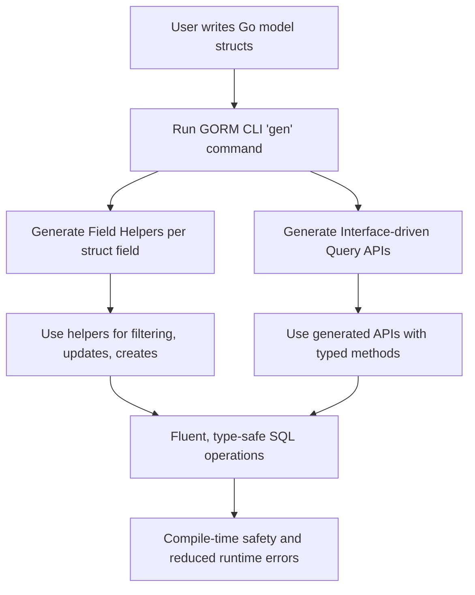

# Field Helpers: Filtering, Updates, and Expressions

Deep dive into using the generated field helpers in GORM CLI to build precise, readable, and type-safe filtering conditions, update assignments, and ordering expressions. This guide empowers you to leverage these helpers effectively in your Go applications for robust database operations.

---

## Workflow Overview

### What You Will Learn

This guide helps you master how to use GORM CLI generated **field helpers** to:

- Build advanced **filter expressions** (WHERE conditions)
- Generate **update and create assignments** with various data types including zero values
- Compose **ordering predicates** and **null checks**
- Work with **association fields** for expressive related data operations


### Prerequisites

- You have generated code using GORM CLI (`gorm gen`) from your Go models, producing field helpers.
- Familiarity with GORM’s core Query API and Go generics.
- Basic understanding of Go syntax and database CRUD operations.


### Expected Outcome

By completing this guide you will confidently use field helpers to:

- Write fluent, type-safe where clauses and filters
- Perform updates and creates including zero and null values safely
- Use field helper expressions like `Eq`, `Incr`, and custom setters
- Leverage association helpers to create, update, unlink and delete related data


### Time Estimate

Approximately 20–30 minutes to read and experiment with sample code.

### Difficulty Level

Intermediate — requires some Go and GORM knowledge but no advanced experience necessary.

---

## Using Field Helpers: Step-by-Step Guide

### 1. Understanding Field Helpers

Field helpers are generated variables representing each field in your model. Each exposes methods to build query/expression objects.

Example snippet from generated code:

```go
var User = struct {
  ID        field.Number[uint]
  Name      field.String
  Age       field.Number[int]
  Role      field.String
  IsAdult   field.Bool
  Score     field.Field[sql.NullInt64]
  // ... associations omitted
}{
  ID:   field.Number[uint]{}.WithColumn("id"),
  Name: field.String{}.WithColumn("name"),
  Age:  field.Number[int]{}.WithColumn("age"),
  // ...
}
```

- Use these fields to create conditions: e.g., `generated.User.Age.Gt(18)` (age > 18).
- Association fields like `User.Pets` expose even richer behaviors (covered separately).


### 2. Building Filtering Conditions

Use predicates provided by fields to express WHERE conditions in a type-safe and readable way.

Common predicate methods:

| Method      | Description                       | Example                                    |
|-------------|---------------------------------|--------------------------------------------|
| `Eq(val)`   | Equal to value                   | `User.Name.Eq("alice")`                    |
| `Neq(val)`  | Not equal                       | `User.Role.Neq("admin")`                   |
| `Gt(val)`   | Greater than                    | `User.Age.Gt(18)`                            |
| `Gte(val)`  | Greater than or equal           | `User.IsAdult.Eq(true)`                       |
| `Lt(val)`   | Less than                      | `User.Age.Lt(65)`                            |
| `Lte(val)`  | Less than or equal             | `User.Score.IsNotNull()`                      |
| `Like(val)` | SQL LIKE pattern matching       | `User.Role.Like("active%")`                |
| `In(vals...)`| IN list                       | `User.ID.In(1, 2, 3)`                        |
| `IsNull()`  | NULL check                      | `User.Score.IsNull()`                         |


#### Example: Filtering users who are adults and active

```go
users, err := gorm.G[models.User](db).
  Where(
    generated.User.IsAdult.Eq(true),
    generated.User.Role.Eq("active"),
  ).
  Find(ctx)
```


### 3. Performing Updates and Creates with Setters

Field helpers provide setters that generate update assignments or create column-value pairs.

Common setter methods:

| Method       | Description                      | Example                                      |
|--------------|---------------------------------|----------------------------------------------|
| `Set(val)`   | Set column to a specific value  | `generated.User.Name.Set("alice")`          |
| `SetExpr(expr)` | Set column from SQL expression | `generated.User.Age.SetExpr(clause.Expr{SQL: "age + ?", Vars: []any{1}})` |
| `Incr(delta)` | Increase numeric by delta       | `generated.User.Age.Incr(1)`                   |


#### Example: Updating a user's name and incrementing age

```go
rows, err := gorm.G[models.User](db).
  Where(generated.User.ID.Eq(1)).
  Set(
    generated.User.Name.Set("alice_updated"),
    generated.User.Age.Incr(1),
  ).
  Update(ctx)
```


### 4. Handling Zero Values and Nullables

A common pitfall is ignoring zero values in updates or inserts. The generated setters explicitly allow setting zero values to ensure data is persisted correctly.

Example zero-value assignments:

- `generated.User.Age.Set(0)` sets age to zero.
- `generated.User.IsAdult.Set(false)` sets bool to false.
- `generated.User.Score.Set(sql.NullInt64{})` sets a nullable int to NULL.

This precision avoids GORM’s default behavior of omitting zero values silently.


### 5. Advanced Expressions and Compositions

Field helpers also support complex expressions and custom clauses:

- `SetExpr(clause.Expr{SQL: ..., Vars: ...})` to embed raw SQL with parameters.
- Chain multiple predicates in `Where` for AND conditions.
- Use `Or` and `Not` by combining GORM clauses with generated expressions.


### 6. Working with Association Fields

Association fields on generated models, e.g., `User.Pets`, expose methods:

- `Create()` — create and link associated record
- `CreateInBatch([]Model)` — batch create/link multiple associated records
- `Update(...)` — update associated records matching conditions
- `Unlink()` — break the association without deleting records
- `Delete()` — delete associated records (e.g., for many2many, delete join rows)

Check the [Managing Associations guide](/guides/advanced-patterns-integration/associations-in-depth) for detailed association operations.


---

## Examples & Code Samples

### Example 1: Find Active Adult Users

```go
// Fetch all adult users with role "active"
users, err := gorm.G[models.User](db).
  Where(
    generated.User.IsAdult.Eq(true),
    generated.User.Role.Eq("active"),
  ).
  Find(ctx)
if err != nil {
  log.Fatal(err)
}
```


### Example 2: Update User Role and Increment Age

```go
// Promote user role and increase age by 1
_, err := gorm.G[models.User](db).
  Where(generated.User.Name.Eq("bob")).
  Set(
    generated.User.Role.Set("active"),
    generated.User.Age.Incr(1),
  ).
  Update(ctx)
if err != nil {
  log.Fatal(err)
}
```


### Example 3: Create User with Zero Values Set

```go
// Insert a new user explicitly setting zero values
err := gorm.G[models.User](db).
  Set(
    generated.User.Name.Set("john"),
    generated.User.Age.Set(0),
    generated.User.IsAdult.Set(false),
    generated.User.Score.Set(sql.NullInt64{}), // sets NULL
  ).
  Create(ctx)
if err != nil {
  log.Fatal(err)
}
```


### Example 4: Filtering for NULL and NOT NULL

```go
// Find users where last_login is null
nullLastLoginCount, err := gorm.G[models.User](db).
  Where(generated.User.LastLogin.IsNull()).
  Count(ctx, "*")
if err != nil {
  log.Fatal(err)
}

// Find users where score is not null
notNullScoreUsers, err := gorm.G[models.User](db).
  Where(generated.User.Score.IsNotNull()).
  Find(ctx)
if err != nil {
  log.Fatal(err)
}
```


### Example 5: Use Custom SQL Expressions

```go
// Use SetExpr to apply a raw SQL expression
err := gorm.G[models.User](db).
  Where(generated.User.Name.Eq("alice")).
  Set(
    generated.User.Age.SetExpr(clause.Expr{SQL: "age + ?", Vars: []any{2}}),
  ).
  Update(ctx)
if err != nil {
  log.Fatal(err)
}
```

---

## Troubleshooting & Best Practices

### Common Issues

- **Predicate methods missing?**
  - Check your model was properly generated by the GORM CLI.
  - Verify your fields are exported and follow Go naming conventions.

- **Zero values not updating as expected?**
  - Always use the generated setter methods `.Set(value)`.
  - Avoid direct struct field assignments for updates to prevent silent skips.

- **Null checks not working?**
  - Use `.IsNull()` or `.IsNotNull()` methods on the appropriate field.
  - For nullable types like `sql.NullInt64`, ensure the correct field helpers are generated/mapped.

- **SQL errors with custom expressions?**
  - Use `clause.Expr` carefully with parameterized variables to avoid injection.
  - Confirm generated SQL syntax matches your database dialect.


### Best Practices

- Use generated field helpers instead of raw strings or plain struct fields for full type safety and clearer intent.
- Chain multiple predicates in `.Where()` for concise and maintainable filters.
- Use `.Set()` with explicit zero values when you want to overwrite existing fields.
- Leverage association helpers to maintain relational integrity automatically.
- Use `.SetExpr()` or `.Incr()` for atomic database side calculations for better concurrency.


---

## Next Steps & Related Content

### Next Steps

- Explore [Managing Associations: Best Practices & Scenarios](/guides/advanced-patterns-integration/associations-in-depth) to use association helpers effectively.
- Learn the [SQL Template DSL](/guides/advanced-patterns-integration/template-sql-dsl) for complex dynamic query generation.
- Review [Your First Code Generation: From Models to APIs](/guides/getting-started-workflows/first-generation) for how to generate these helpers.

### Related Guides

- [Working with Generated APIs in Your Application](/guides/getting-started-workflows/using-generated-apis)
- [Custom Generation Rules & Field Mapping](/guides/advanced-patterns-integration/customization-configs)
- [Quick Validation & Troubleshooting](/getting-started/first-usage/troubleshooting-validation)

### Resources

- GORM CLI GitHub Repository: [go-gorm/cli](https://github.com/go-gorm/cli)
- Official GORM Documentation: [gorm.io](https://gorm.io)

---

This guide equips you with the knowledge to harness the full power of GORM CLI’s generated field helpers, enabling clear, maintainable, and type-safe database interactions in your Go projects.


---

### Exploration Diagram: How Field Helpers Fit in the Generated Code Workflow



