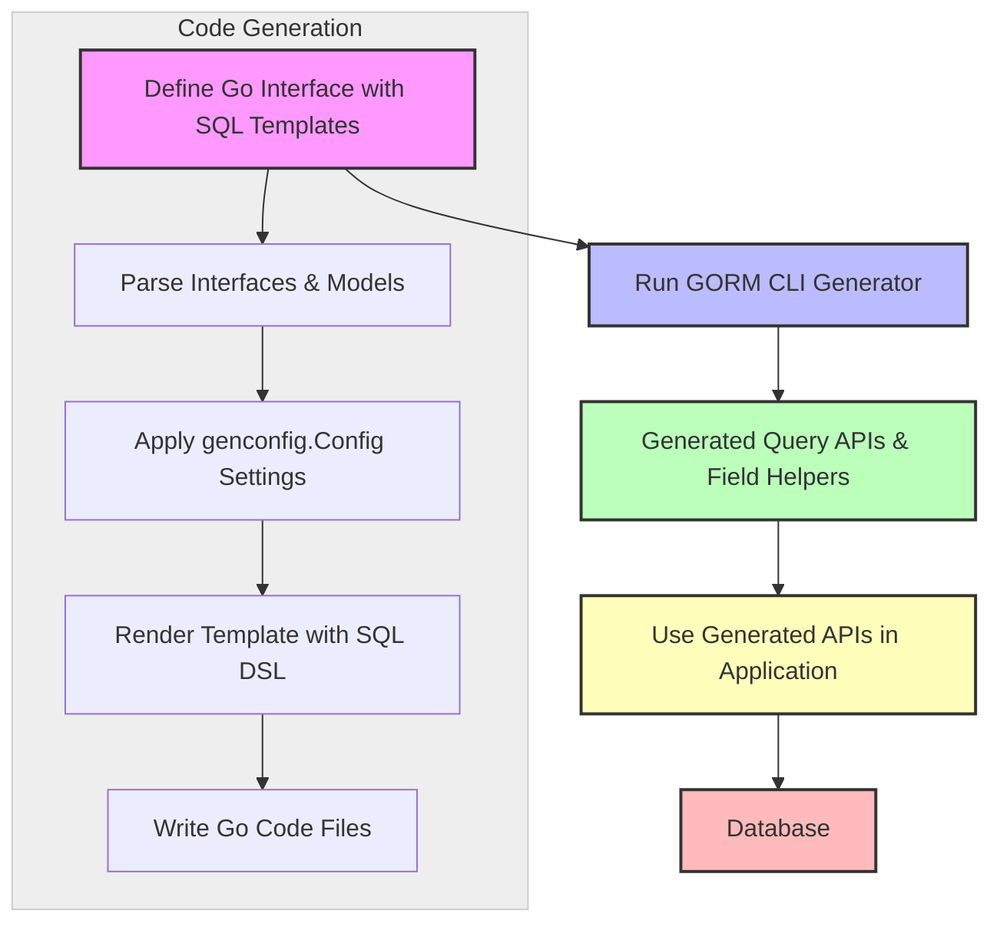

# Your First Code Generation: From Models to APIs

Welcome to a practical, hands-on journey designed to help you unlock GORM CLI's powerful code generation capabilities. This guide walks you through every step to create type-safe query APIs and model-driven field helpers from your Go interfaces and model structs. You'll learn how to define query interfaces with embedded SQL templates, structure your models, run the GORM CLI generator, and immediately take advantage of the generated APIs in your application.

---

## Workflow Overview

### What This Guide Helps You Accomplish
- Generate type-safe query APIs from Go interfaces annotated with SQL templates.
- Produce model-driven field helpers for simple, fluent database operations.
- Integrate generated code seamlessly into your Go projects.

### Prerequisites
- Go 1.18 or higher installed and configured.
- Basic knowledge of Go interfaces and structs.
- Models and interfaces prepared in your project source code.
- GORM CLI installed (`go install gorm.io/cli/gorm@latest`).

### Expected Outcome
By following this guide, you will:
- Have generated code files with query interfaces and field helpers.
- Understand how to invoke the CLI generator effectively.
- Be able to call generated methods like `GetByID` or use field helpers for queries and updates.

### Time Estimate
Approximately 15–30 minutes, depending on familiarity with Go and your project structure.

### Difficulty Level
Beginner to Intermediate — no advanced configuration needed for first run.

---

## Step-by-Step Instructions

<Steps>
<Step title="Step 1: Define Your Query Interface with SQL Templates">
Write a Go interface representing your expected queries on the model. Use Go doc comments to embed SQL templates that specify the query logic. These templates use the GORM CLI DSL with placeholders like `@@table`, `@param`, and control directives such as `{{if}}` and `{{where}}`.

```go
// examples/query.go
package examples

// Query interface with type parameter T for model
// Each method includes SQL template comments
// Example method:
// SELECT * FROM @@table WHERE id=@id
type Query[T any] interface {
  GetByID(id int) (T, error)

  // Other methods
  FilterByNameAndAge(name string, age int)
}
```

**What you achieve:** A clean, declarative interface representing your data access patterns.

**Tips:**
- Annotate each method with clear SQL templates.
- Use interface generics `[T any]` for reusability with different models.
- Leverage placeholders like `@@table` to dynamically reference the model's table.

**Verification:** File parses without errors; comments clearly specify SQL.
</Step>

<Step title="Step 2: Define Your Model Structs">
Create Go structs for your database models in the same or related packages. These models will serve as the basis for both the generated query APIs and field helpers.

```go
// examples/models/user.go
package models

import "gorm.io/gorm"

type User struct {
  gorm.Model
  Name string
  Age  int
}
```

**What you achieve:** A model representing your database table schema.

**Tips:**
- Use `gorm.Model` or your own struct for common fields.
- Use struct tags as necessary for GORM.
- The name and fields directly influence generated code.

**Verification:** Models compile correctly; fields are exported.
</Step>

<Step title="Step 3: Optionally Configure Generation Behavior">
In the package where your interfaces and models reside, you may declare a configuration variable `genconfig.Config` to fine-tune generation options like output paths or include/exclude filters.

```go
package examples

import "gorm.io/cli/gorm/genconfig"

var _ = genconfig.Config{
  OutPath: "examples/output",
  IncludeInterfaces: []any{"Query*"},
  IncludeStructs: []any{"User"},
}
```

**What you achieve:** Control over code generator behavior, enabling custom output directories and selective generation.

**Tips:**
- For your first generation, configuration is optional.
- Use patterns to target interfaces and structs.
- Use field mappings to handle special types (e.g., JSON fields).

**Verification:** Config file is recognized by the generator; generated files appear in `OutPath`.
</Step>

<Step title="Step 4: Run the GORM CLI Code Generator">
Use the CLI tool to generate the query interfaces and field helpers based on your source code and configuration.

```bash
gorm gen -i ./examples -o ./generated
```

- `-i` (input) points to the directory or package containing your interfaces and models.
- `-o` (output) sets the directory where generated files will be placed.

**What you achieve:** Automatic generation of Go code with concrete query implementations and strongly typed field helpers.

**Tips:**
- Ensure your working directory and import paths align.
- Use verbose output to catch parsing or generation issues.

**Verification:** Generated files in `./generated`; files contain methods like `GetByID`, fields like `User.ID`.
</Step>

<Step title="Step 5: Import and Use the Generated APIs in Your Application">
Integrate the generated code into your Go application and start using the type-safe APIs.

Example usages:

```go
// Import your generated package
import "your_project/generated"

// Using the Query interface to get a user by ID
user, err := generated.Query[models.User](db).GetByID(ctx, 123)

// Using field helpers for conditions
users, err := gorm.G[models.User](db).
  Where(generated.User.Age.Gt(18)).
  Find(ctx)
```

**What you achieve:** A fluent, discoverable API that catches errors at compile time and improves productivity.

**Tips:**
- The generator adds context parameters automatically if missing.
- Use field helper expressions (`Eq`, `Like`, `Between`) with gorm queries.

**Verification:** Calls compile and execute without runtime errors; SQL queries match expected results.
</Step>
</Steps>

---

## Practical Examples

### Example Query Interface with SQL Templates

```go
package examples

type Query[T any] interface {
  // Retrieve by ID
  // SELECT * FROM @@table WHERE id=@id
  GetByID(id int) (T, error)

  // Filter by name and age dynamically
  // where("name=@name AND age=@age")
  FilterByNameAndAge(name string, age int)
}
```

### Example Model Struct

```go
package models

import "gorm.io/gorm"

type User struct {
  gorm.Model
  Name string
  Age  int
}
```

### Usage of Generated API

```go
user, err := generated.Query[models.User](db).GetByID(ctx, 123)
if err != nil {
  // handle error
}

users, err := gorm.G[models.User](db).
  Where(generated.User.Name.Like("%jinzhu%"), generated.User.Age.Between(18, 30)).
  Find(ctx)
```

### Sample `genconfig.Config`

```go
package examples

import "gorm.io/cli/gorm/genconfig"

var _ = genconfig.Config{
  OutPath: "examples/generated",
  IncludeInterfaces: []any{"Query*"},
  IncludeStructs: []any{"User"},
}
```

---

## Troubleshooting & Tips

<AccordionGroup title="Common Issues and Solutions">
<Accordion title="CLI Tool Not Found or Installation Failed">
- Ensure Go version 1.18+ is installed.
- Run `go install gorm.io/cli/gorm@latest` and verify `$GOPATH/bin` is in your PATH.
- Use `gorm version` to confirm installation.
</Accordion>

<Accordion title="No Generated Files Created">
- Check your input directory path for interface and model files.
- Confirm `genconfig.Config` settings if present; inclusion/exclusion filters may omit interfaces.
- Ensure interfaces have SQL template comments.
</Accordion>

<Accordion title="Generated Methods Missing or Incorrect">
- Verify SQL template syntax in interface comments.
- Confirm method return types: methods returning data require `(T, error)` or `([]T, error)`.
- Check for parsing errors during generation; enable verbose output.
</Accordion>

<Accordion title="Compilation Errors After Generation">
- Confirm dependencies (`gorm.io/gorm` and related packages) are installed and compatible.
- Review imports in generated code to ensure they align with your project.
- Clean and rebuild your module.
</Accordion>
</AccordionGroup>

<Tip>
For best results, commit your interfaces and models before running generation. Use semantic and consistent SQL template comments to make generated code intuitive and reliable.
</Tip>

---

## Next Steps & Related Content

- After mastering first generation, continue with the [Using the Generated APIs guide](/guides/getting-started-workflows/using-generated-apis) to learn API usage patterns.
- Explore [Field Helpers: Filtering, Updates, and Expressions](/guides/getting-started-workflows/field-helpers-basics) for crafting fluent queries.
- Dive into [SQL Template DSL](/guides/advanced-patterns-integration/template-sql-dsl) for advanced query customization.
- Visit [Managing Associations](/guides/advanced-patterns-integration/associations-in-depth) to handle relational data elegantly.

---

## Summary Diagram: From Query Interface to Generated Code



Use this diagram as a mental map while progressing through code generation steps.

---

# Summary
This guide delivers a clear, pragmatic workflow for generating type-safe query APIs and model-driven field helpers using GORM CLI. You learn how to define query interfaces embedded with SQL templates, create models, optionally configure generation behavior, execute the CLI tool, and start using the generated code in your Go applications immediately. Troubleshooting sections and practical tips ensure smooth onboarding.

Key sections covered:
- Workflow overview, including prerequisites and expected outcomes
- Step-by-step instructions with code examples
- Practical usage samples
- Troubleshooting common issues
- Next-step recommendations

Important links / cross-references:
- [Using the Generated APIs](../getting-started/first-usage/using-generated-apis) for detailed API usage
- [Field Helpers basics](../guides/getting-started-workflows/field-helpers-basics) to learn fluent query expressions
- [SQL Template DSL guide](../guides/advanced-patterns-integration/template-sql-dsl) for advanced query templates
- [Managing Associations](../guides/advanced-patterns-integration/associations-in-depth) for relational data workflows

Next steps:
- Apply this workflow on your real project source code.
- Explore generated code structure for deeper mastery.
- Proceed to advanced customization and integration guides.
