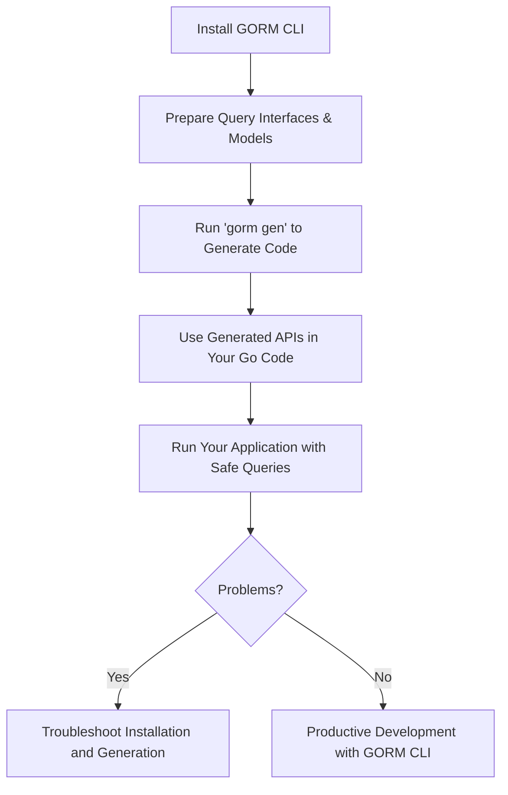

# Installation & Quick Start

Welcome to GORM CLI! This guide helps you install the GORM CLI tool, set up your first Go project using GORM CLI, and generate type-safe query code and field helpers from your models and interfaces. Within minutes, you will have compile-time safe APIs integrated with GORM for safer and more productive database operations.

---

## 1. Workflow Overview

### Task Description
This tutorial walks you through the essential steps to:
- Install GORM CLI on your machine
- Prepare your first Go project with models and interfaces
- Run the `gorm gen` command to generate type-safe query APIs and model-driven field helpers
- Use the generated code in your project with GORM

### Prerequisites
- Go 1.18 or later installed and configured
- A Go workspace set up with your GORM models and query interfaces written
- Basic understanding of Go modules and packages

### Expected Outcome
After completing this guide, you will have:
- GORM CLI installed and available in your PATH
- Your Go project ready with models and query interfaces
- Generated, strongly typed, fluent APIs for querying and updating your database
- Confidence in using the CLI commands and integrating with your code

### Time Estimate
15-30 minutes, depending on environment setup and familiarity with Go

### Difficulty Level
Beginner to Intermediate (assuming basic Go knowledge)

---

## 2. Step-by-Step Instructions

<Steps>
  <Step title="Install GORM CLI">
    Ensure you have Go 1.18+ installed by running:

    ```bash
    go version
    ```

    Then install GORM CLI using the standard Go install command:

    ```bash
    go install gorm.io/cli/gorm@latest
    ```

    This downloads and places the `gorm` binary in your `GOPATH/bin` or Go bin directory.

    <Check>
      Make sure your Go bin directory is in your system `PATH` to use the CLI easily.
    </Check>

    <ExpectedResults>
      - `gorm` command becomes available in your shell
      - You can run `gorm version` to confirm installation
    </ExpectedResults>
  </Step>

  <Step title="Create Your First Query Interface and Models">
    Prepare your Go package with model structs and related query interfaces.

    Example:

    ```go
    // models/user.go
    package models

    import "gorm.io/gorm"

    type User struct {
      gorm.Model
      Name string
      Age  int
    }
    ```

    ```go
    // query.go
    package models

    type Query[T any] interface {
      // SELECT * FROM @@table WHERE id=@id
      GetByID(id int) (T, error)

      // SELECT * FROM @@table WHERE name=@name AND age=@age
      FilterByNameAndAge(name string, age int)
    }
    ```

    <ExpectedResults>
      - Your interfaces contain SQL templates in method comments
      - Your models are defined in the same package or directory as interfaces
    </ExpectedResults>

    <Tip>
      Place interfaces and models together or specify input paths accordingly when generating.
    </Tip>
  </Step>

  <Step title="Run GORM CLI to Generate Code">
    Use the `gorm gen` command to generate code from your interfaces:

    ```bash
    gorm gen -i ./models -o ./generated
    ```

    Flags:
    - `-i`: input directory or file containing your interfaces and models
    - `-o`: output directory for generated code

    <ExpectedResults>
      - Generated Go files appear in `./generated`
      - Code includes type-safe query APIs and field helpers for your models
    </ExpectedResults>

    <Check>
      - Check for no errors after running
      - Confirm generated files exist
    </Check>

    <Tip>
      You can customize output in your project by using a `genconfig.Config` variable in your source (see Advanced Guides).
    </Tip>
  </Step>

  <Step title="Use Generated Code in Your Project">
    Import and call generated query methods in your Go code:

    ```go
    package main

    import (
      "context"
      "gorm.io/gorm"
      "your_project/generated"
      "your_project/models"
    )

    func main() {
      db := initializeGORM() // your GORM DB setup
      ctx := context.Background()

      // Get a user by ID
      user, err := generated.Query[models.User](db).GetByID(ctx, 123)
      if err != nil {
        // handle error
      }

      // Use field helpers in queries
      users, err := gorm.G[models.User](db).
        Where(generated.User.Age.Gt(18)).
        Find(ctx)

      // ...
    }
    ```

    <ExpectedResults>
      - Generated APIs offer strong typing and fluent methods
      - You can chain field helpers for expressive queries
    </ExpectedResults>

    <Tip>
      Review `project-integration` documentation to master how to incorporate generated code efficiently.
    </Tip>
  </Step>
</Steps>

---

## 3. Practical Examples

```go
// models/user.go
package models

type User struct {
  gorm.Model
  Name string
  Age  int
}

// query.go
package models

type Query[T any] interface {
  // SELECT * FROM @@table WHERE id=@id
  GetByID(id int) (T, error)

  // where("name=@name AND age=@age")
  FilterByNameAndAge(name string, age int)
}
```

Run:
```bash
gorm gen -i ./models -o ./generated
```

Using the generated code:

```go
user, err := generated.Query[models.User](db).GetByID(ctx, 1)
if err != nil {
  panic(err)
}

users, err := gorm.G[models.User](db).
  Where(generated.User.Age.Gt(18)).
  Find(ctx)
```

This code runs the SQL using your SQL templates but with compile-time safety and autocomplete in your editor.

---

## 4. Troubleshooting & Tips

<AccordionGroup title="Common Issues and Solutions">
  <Accordion title="'gorm' command not found after installation">

    - Ensure your Go bin directory (e.g., `$GOPATH/bin` or `$HOME/go/bin`) is added to your system `PATH`.
    - On Unix-like systems, add this line to your shell profile:
      ```bash
      export PATH=$PATH:$(go env GOPATH)/bin
      ```
    - Open a new terminal session or source your profile.
    - Confirm with `gorm version`.

  </Accordion>
  <Accordion title="Error: input flag -i not specified">

    - The `-i` or `--input` flag is mandatory for the `gen` command.
    - Provide the path to your interface source code like:
      ```bash
      gorm gen -i ./models -o ./generated
      ```
    - Double-check path correctness.

  </Accordion>
  <Accordion title="Generated files missing or empty">

    - Verify your interfaces contain methods annotated with SQL templates.
    - Ensure correct package and file structure.
    - Check for compilation errors or permission issues in the output directory.

  </Accordion>
  <Accordion title="Tips for best results">

    - Keep interfaces and models in the same package or organize according to your import paths.
    - Use a package-level `genconfig.Config` to customize generation (paths, filtering, type maps).
    - Regularly regenerate code after modifying your interfaces or models.
    - Use the type-safe generated APIs to reduce runtime SQL errors.

  </Accordion>
</AccordionGroup>

---

## 5. Next Steps & Related Documentation

- **Configure Generation**: Learn to customize code generation with `genconfig.Config` in [Initial Configuration](../../getting-started/configure-and-generate/basic-config).
- **Define Interfaces & Models**: Deep dive into writing query interfaces and models in [Defining Query Interfaces & Models](../../guides/getting-started-workflows/defining-interfaces-models).
- **Project Integration**: Understand how to integrate and use generated code in your Go projects in [Integrating Generated Code](../../getting-started/configure-and-generate/project-integration).
- **Troubleshooting**: Explore common setup issues in [Troubleshooting Installation Issues](../../getting-started/troubleshooting-and-faq/troubleshooting-installation).

---

For a deeper understanding of how GORM CLI works and advanced query templating capabilities, consult [Core Concepts & Terminology](../../overview/product-intro-basics/core-concepts-terminology) and [Template-Based Queries & SQL DSL](../../guides/advanced-usage-patterns/template-based-queries).


---

### Summary Diagram of Quick Start Workflow


---

# End of Installation & Quick Start Guide

---